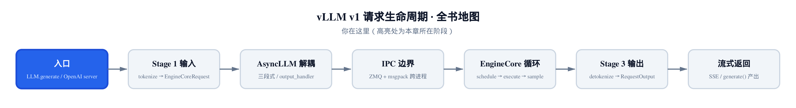
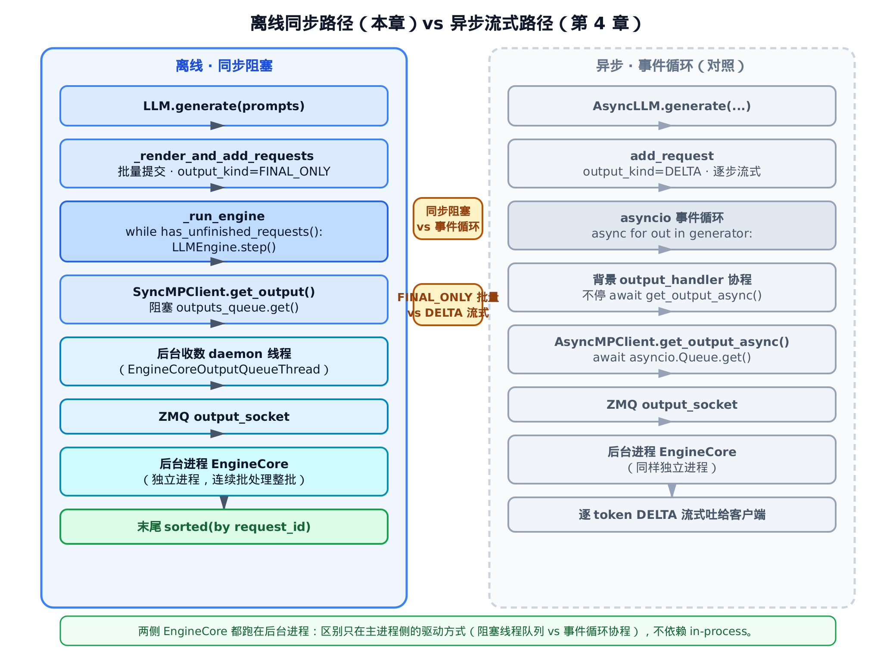
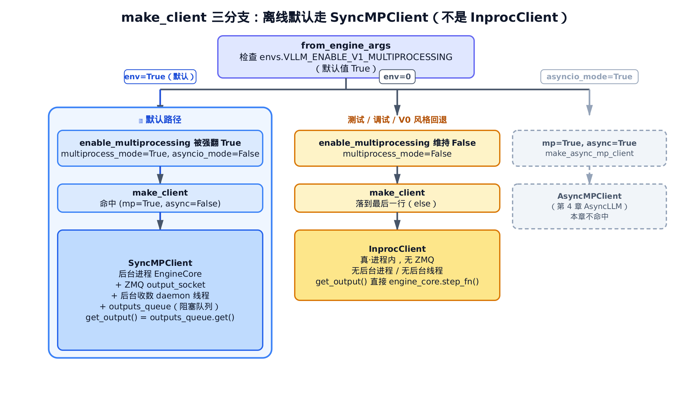
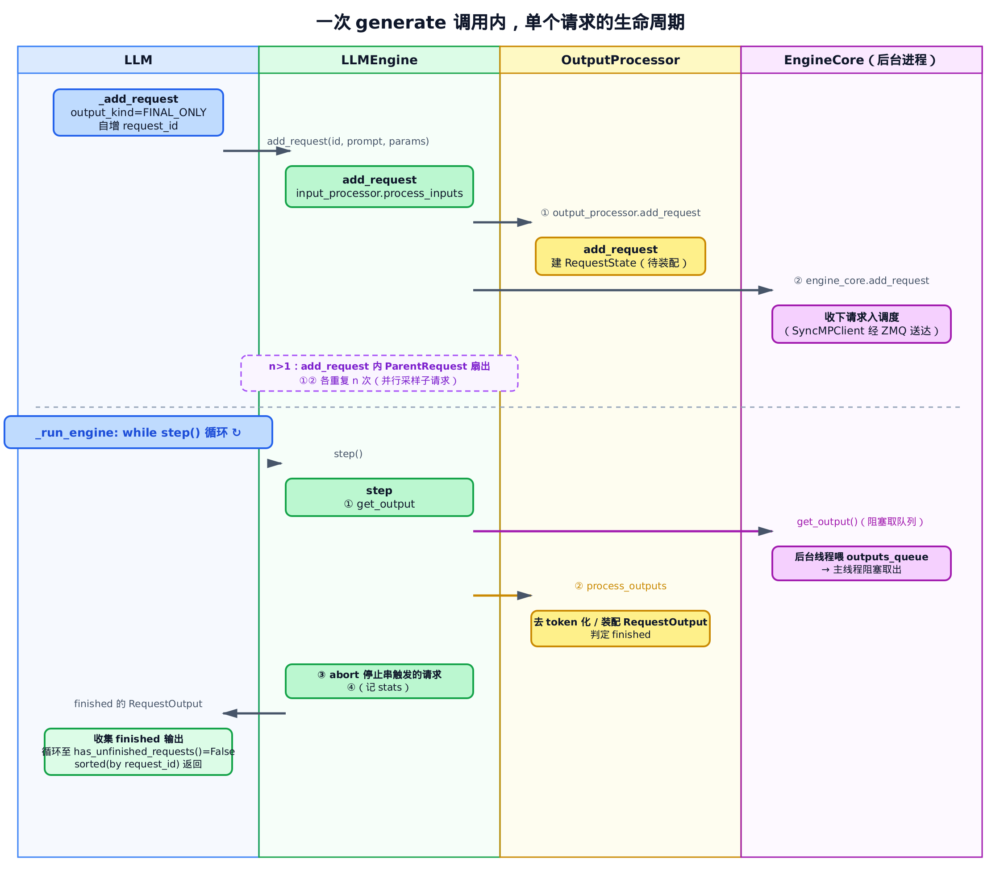

# 第31章　离线 LLM API：从 generate 到同步 step() 驱动

## 你在这里



> *图注：全书地图高亮当前位置。*
> *[第 4 章](../ch04-async-llm/narrative/chapter.md) 讲过在线侧的入口 `AsyncLLM`——异步三段式、背景协程、流式吐 token。*
> *本章换到离线侧：`vllm.LLM` 这个门面，怎么把一批 prompt 同步跑完、一次性收齐。*
> *下一章接着往服务化走，把这条离线脊和在线 OpenAI server 并到一起看。*

写过 vLLM 离线推理的人，第一行代码几乎都长这样：

```python
from vllm import LLM, SamplingParams

llm = LLM(model="meta-llama/Llama-3.1-8B")
outputs = llm.generate(["你好", "今天天气"], SamplingParams(temperature=0.8))
for out in outputs:
    print(out.outputs[0].text)
```

四行。一个 `LLM`、一个 `generate`、拿到一个列表。看着像调一个本地函数那么朴素。

可这朴素是装出来的。`generate` 返回的那一刻，背后已经跑完了一整套：参数被拼成 `EngineArgs` 起了引擎、一个 EngineCore 在**另一个进程**里连续批处理、主进程靠一个同步 `while` 循环一拍一拍把它拉动、乱序完成的结果又被排回了输入顺序。这一章就是把这层"装出来的朴素"全拆开。代码主线集中在三个文件：门面 `vllm/entrypoints/llm.py`、同步引擎 `vllm/v1/engine/llm_engine.py`、以及引擎客户端工厂 `vllm/v1/engine/core_client.py`。

我们会一路追到底，但有**一个反直觉的点**必须先打预防针，因为它最容易讲错：

> 默认离线路径下，EngineCore **不**跑在你的进程里。它跑在一个后台子进程里，主进程通过 ZMQ 跟它通信。

很多人以为"离线 = 同步 = 进程内"，三个词画等号。前两个对，第三个错。`LLM` 确实是同步阻塞的，但它默认用的客户端是 `SyncMPClient`——多进程（MP）客户端，不是进程内的 `InprocClient`。为什么、怎么走到这一步、它跟第 4 章的异步路径到底差在哪，是本章的三条主线。

为了能在本地（无 GPU）把这条同步脊亲手跑一遍、打断点看数值，本章配了一份**只做减法**的精简版：和真实 vLLM 同名、同结构、同控制流，只把与"同步驱动"正交的东西（独立进程 EngineCore、ZMQ 字节协议、去 token 化装配）换成最小替身。它是"跑起来看数值"的交叉验证物——正文主线始终是真实源码。

---

## 31.1 一张总图：同步阻塞这条脊

先看全景，后面所有细节都挂在它上面。把本章和第 4 章并排放：



> *图注：左栏是本章离线路径（高亮），右栏是第 4 章异步路径（灰显对照）。两条脊的形状几乎一样，区别只在两处（中间黄框）：主进程侧是**同步阻塞** vs **事件循环**；输出形态是 **FINAL_ONLY 批量** vs **DELTA 流式**。底注是关键澄清：两侧 EngineCore 都在后台进程，区别不在"进程内 vs 跨进程"。*

`generate`/`chat`/`embed`/`encode` 四个入口，最终都汇流到同一条脊：

1. **渲染**：把 prompt / 对话 / pooling 输入转成引擎能吃的形态；
2. **批量提交**：逐条 `_add_request` 入队，把 `output_kind` 强设为 `FINAL_ONLY`，给每条分配一个自增 `request_id`；
3. **同步驱动**：`_run_engine`（`vllm/entrypoints/llm.py:L1839`）里 `while has_unfinished_requests(): step()`——单线程阻塞循环，一拍一拍拉动后台 EngineCore；
4. **排序还原**：收齐 `finished` 的输出，按 `request_id` 排序，还原成输入顺序返回。

第 3 步那个 `while` 循环就是本章的灵魂。它和第 4 章 `AsyncLLM` 的 `async for` 是同一个目的（把引擎拉动到所有请求完成），但实现哲学截然相反：一个是主线程亲自堵在那儿等，一个是把等待让给事件循环、自己去干别的。我们从构造期开始，一步步走到这个循环。

---

## 31.2 构造期：参数 → EngineArgs → LLMEngine

`LLM.__init__` 的形参表有几十个——`tensor_parallel_size`、`dtype`、`gpu_memory_utilization`、`enable_prefix_caching`……这一长串的命运是一致的：被收拢、归一化，最后拼成一个 `EngineArgs`。这部分纯属参数装配，不是本章主线，我们一句带过。真正的转折点在这里：

```python
# vllm/entrypoints/llm.py:L381
        self.llm_engine = LLMEngine.from_engine_args(
            engine_args=engine_args, usage_context=UsageContext.LLM_CLASS
        )
        self.model_config = self.llm_engine.model_config
        self.engine_class = type(self.llm_engine)

        self.request_counter = Counter()
        self.default_sampling_params: dict[str, Any] | None = None

        supported_tasks = self.llm_engine.get_supported_tasks()
        self.supported_tasks = supported_tasks
        # … 省略：pooling_task / runner_type / renderer / input_processor 缓存 …
```

三件事值得点名：

- **`LLMEngine.from_engine_args`** 是离线侧的引擎入口。注意它叫 `LLMEngine` 而不是 `AsyncLLM`——这是同步引擎，第 4 章那个是异步引擎，两条入口从这里就分岔。
- **`request_counter = Counter()`** 是一个自增计数器。等下你会看到，每条提交的请求都从它这里领一个递增的整数 id。这个 id 后面排序还原时要用，是"输入顺序"的唯一凭据。
- **`usage_context=UsageContext.LLM_CLASS`** 标明这是离线 `LLM` 类发起的，用于上报使用统计——和我们主线无关，但它点明了"我是离线场景"这个身份。

`from_engine_args` 是关键澄清的第一个源码锚点。我们进去看：

```python
# vllm/v1/engine/llm_engine.py:L151
    @classmethod
    def from_engine_args(
        cls,
        engine_args: EngineArgs,
        usage_context: UsageContext = UsageContext.ENGINE_CONTEXT,
        stat_loggers: list[StatLoggerFactory] | None = None,
        enable_multiprocessing: bool = False,
    ) -> "LLMEngine":
        """Creates an LLM engine from the engine arguments."""

        # Create the engine configs.
        vllm_config = engine_args.create_engine_config(usage_context)
        executor_class = Executor.get_class(vllm_config)

        if envs.VLLM_ENABLE_V1_MULTIPROCESSING:
            logger.debug("Enabling multiprocessing for LLMEngine.")
            enable_multiprocessing = True

        # Create the LLMEngine.
        return cls(
            vllm_config=vllm_config,
            executor_class=executor_class,
            log_stats=not engine_args.disable_log_stats,
            usage_context=usage_context,
            stat_loggers=stat_loggers,
            multiprocess_mode=enable_multiprocessing,
        )
```

盯住中间那个 `if`。

形参写着 `enable_multiprocessing: bool = False`——单看这个默认值，你会以为离线引擎不开多进程、EngineCore 就跑在本进程里。**这是个陷阱。** 函数体第一件正经事就是把它推翻：只要环境变量 `envs.VLLM_ENABLE_V1_MULTIPROCESSING` 为真，`enable_multiprocessing` 立刻被强翻成 `True`。

那这个环境变量默认是什么？翻到定义：

```python
# vllm/envs.py:L129
    VLLM_ENABLE_V1_MULTIPROCESSING: bool = True
```

```python
# vllm/envs.py:L1109
    "VLLM_ENABLE_V1_MULTIPROCESSING": lambda: bool(
        int(os.getenv("VLLM_ENABLE_V1_MULTIPROCESSING", "1"))
    ),
```

`getenv(..., "1")`——你不设它，它就是 `1`，就是 `True`。

所以默认情况下，那个 `if` 必然进，`enable_multiprocessing` 必然变 `True`，`multiprocess_mode=True` 必然传给 `LLMEngine.__init__`。形参默认值 `False` 在实践中**从来不会生效**。这就是为什么"离线 = 进程内"是错的：决定权根本不在那个形参手里，而在这个默认开启的环境变量手里。

> 用精简版亲手验证这一点很简单：构造一个 `LLM`，看它内部的引擎客户端是哪个类。默认下你会拿到 `SyncMPClient`；只有把 `VLLM_ENABLE_V1_MULTIPROCESSING=0` 显式关掉，才会回退到 `InprocClient`。

记住这个结论，我们去看 `multiprocess_mode=True` 接下来怎么被消费。

---

## 31.3 LLMEngine 的两个客户端：硬分叉点

`from_engine_args` 把 `multiprocess_mode` 传进 `LLMEngine.__init__`，后者建好渲染器、输入处理器、输出处理器之后，走到这一行——它决定了 EngineCore 究竟在哪儿、怎么通信：

```python
# vllm/v1/engine/llm_engine.py:L103
        # EngineCore (gets EngineCoreRequests and gives EngineCoreOutputs)
        self.engine_core = EngineCoreClient.make_client(
            multiprocess_mode=multiprocess_mode,
            asyncio_mode=False,
            vllm_config=vllm_config,
            executor_class=executor_class,
            log_stats=self.log_stats,
        )
```

两个布尔决定一切：`multiprocess_mode`（上游传来，默认 `True`）和 `asyncio_mode`。

`asyncio_mode=False` 是**写死的**——这就是离线侧与第 4 章的硬分叉点。同步引擎绝不进 asyncio 事件循环；`AsyncLLM` 那边传的是 `True`。同一个工厂函数，靠这一个字面量 `False` 就把两个世界劈开了。

进 `make_client` 看它怎么分流：

```python
# vllm/v1/engine/core_client.py:L80
    @staticmethod
    def make_client(
        multiprocess_mode: bool,
        asyncio_mode: bool,
        # … 省略：vllm_config / executor_class / log_stats …
    ) -> "EngineCoreClient":
        # TODO: support this for debugging purposes.
        if asyncio_mode and not multiprocess_mode:
            raise NotImplementedError(
                "Running EngineCore in asyncio without multiprocessing "
                "is not currently supported."
            )

        if multiprocess_mode and asyncio_mode:
            return EngineCoreClient.make_async_mp_client(  # ← 第 4 章 AsyncLLM 走这里
                vllm_config, executor_class, log_stats
            )

        if multiprocess_mode and not asyncio_mode:
            return SyncMPClient(vllm_config, executor_class, log_stats)  # ← 离线默认命中

        return InprocClient(vllm_config, executor_class, log_stats)     # ← 仅 env=0 回退
```

四个布尔组合，三个有意义的出口。把它画成决策树：



> *图注：根节点查 `VLLM_ENABLE_V1_MULTIPROCESSING`。左路（默认 True，高亮）→ `multiprocess_mode=True, asyncio_mode=False` → 命中倒数第二个分支 → `SyncMPClient`（后台进程 + ZMQ + 后台收数线程 + 阻塞队列）。中路（env=0，测试/调试/V0 回退）→ `multiprocess_mode=False` → 落到最后一行 `InprocClient`（真·进程内、无 ZMQ）。右路（asyncio_mode=True，灰显）→ `AsyncMPClient`，是第 4 章的事，本章不命中。*

离线默认命中的是**倒数第二个** `if`：`(multiprocess_mode=True, asyncio_mode=False)` → `SyncMPClient`。最后一行的 `InprocClient` 只有 `multiprocess_mode=False` 才到得了——也就是你把环境变量显式关成 0 的回退情形。

类的 docstring 把三者的身份写得很清楚，正好对应三条出口：

```python
# vllm/v1/engine/core_client.py:L69
class EngineCoreClient(ABC):
    """
    EngineCoreClient: subclasses handle different methods for pushing
        and pulling from the EngineCore for asyncio / multiprocessing.

    Subclasses:
    * InprocClient: In process EngineCore (for V0-style LLMEngine use)
    * SyncMPClient: ZMQ + background proc EngineCore (for LLM)
    * AsyncMPClient: ZMQ + background proc EngineCore w/ asyncio (for AsyncLLM)
    """
```

注意这行注释——`SyncMPClient: ... (for LLM)`。vLLM 自己的代码注释就直说了：离线 `LLM` 用的是 `SyncMPClient`。而 `InprocClient` 标的是 `(for V0-style LLMEngine use)`——V0 风格的进程内用法。这是源码级的盖章：离线默认不是进程内。

下面分别看这两个客户端长什么样，对照着看最清楚。

### 31.3.1 SyncMPClient：后台线程喂队列，主线程阻塞取

`SyncMPClient` 的"同步"二字，藏在一个生产者-消费者结构里。它的构造函数干两件事：起一个后台线程、备一个队列。

```python
# vllm/v1/engine/core_client.py:L716
class SyncMPClient(MPClient):
    """Synchronous client for multi-proc EngineCore."""

    def __init__(self, vllm_config, executor_class, log_stats):
        super().__init__(asyncio_mode=False, vllm_config=vllm_config,
                         executor_class=executor_class, log_stats=log_stats)
        # 主线程与后台收数线程之间的阻塞队列
        self.outputs_queue = queue.Queue[EngineCoreOutputs | Exception]()
        # … 省略：socket / decoder 绑定 …

        def process_outputs_socket():
            # 后台线程：从 ZMQ output_socket 收一帧、反序列化成 EngineCoreOutputs、塞进队列
            # … 省略：poller / recv_multipart / decoder.decode 细节（第 5、6 章已讲字节协议）…
            while True:
                outputs: EngineCoreOutputs = decoder.decode(frames)
                outputs_queue.put_nowait(outputs)

        # Process outputs from engine in separate thread.
        self.output_queue_thread = Thread(
            target=process_outputs_socket,
            name="EngineCoreOutputQueueThread", daemon=True)
        self.output_queue_thread.start()
```

`super().__init__` 那一行（这里省了细节）做的是重活：启动**独立的 EngineCore 子进程**、建好 ZMQ 的输入/输出 socket、装好 msgpack 编解码器。这套字节标签协议是第 5、6 章的主题，本章不重讲——你只需知道，调用结束后，有一个 EngineCore 正在另一个进程里待命，主进程和它之间架着两条 ZMQ 管道。

然后是本章关心的部分：一个后台 daemon 线程 `EngineCoreOutputQueueThread`，死循环地从 ZMQ output_socket 收数据、反序列化成 `EngineCoreOutputs`、`put_nowait` 进 `outputs_queue`。这条线程是"生产者"。

主线程当"消费者"，靠 `get_output`：

```python
# vllm/v1/engine/core_client.py:L786
    def get_output(self) -> EngineCoreOutputs:
        outputs = self.outputs_queue.get()       # ← 同步阻塞：队列空就堵在这儿
        if isinstance(outputs, Exception):
            raise self._format_exception(outputs) from None
        # … 省略：DP wave 状态更新 …
        return outputs
```

`outputs_queue.get()`——一个线程安全队列的**阻塞**取数。队列里没东西，这一行就一直堵着，直到后台线程喂进来一份输出。这就是整章"同步阻塞"四个字的物理落点：主线程不是在轮询、不是在 `await`，是真的卡在 `queue.get()` 上睡着等。

提交请求走另一条 ZMQ 管道：

```python
# vllm/v1/engine/core_client.py:L823
    def add_request(self, request: EngineCoreRequest) -> None:
        # … 省略：DP engines_running 置位 …
        self._send_input(EngineCoreRequestType.ADD, request)
```

`_send_input` 把请求打上 `ADD` 字节标签、序列化、经 ZMQ 送往后台 EngineCore 进程。它产出的结果，又会从 output_socket 流回后台线程、进 `outputs_queue`、被主线程的 `get_output` 取走。闭环。

把这个结构和第 4 章对照：`AsyncMPClient` 那边，"生产者"不是后台线程而是一个 asyncio 协程 `output_handler`，"消费者"取数不是 `queue.get()` 而是 `await asyncio.Queue.get()`。两者都跨进程（EngineCore 都在后台），区别**只在主进程侧**——一边是阻塞线程队列，一边是事件循环协程。所以"同步 vs 异步"这组对比，跟"进程内 vs 跨进程"完全是两个维度，别混。

### 31.3.2 InprocClient：真·进程内的回退

为了让对照彻底，看一眼 `InprocClient`——它才是"真·进程内、无 ZMQ"的那个，而它**不是**默认：

```python
# vllm/v1/engine/core_client.py:L274
class InprocClient(EngineCoreClient):
    """
    InprocClient: client for in-process EngineCore. Intended
    for use in LLMEngine for V0-style add_request() and step()
        EngineCore setup in this process (no busy loop).
    """

    def __init__(self, *args, **kwargs):
        self.engine_core = EngineCore(*args, **kwargs)   # 进程内直接 new，无 ZMQ

    def get_output(self) -> EngineCoreOutputs:
        outputs, model_executed = self.engine_core.step_fn()   # 直接调一步
        self.engine_core.post_step(model_executed=model_executed)
        return outputs and outputs.get(0) or EngineCoreOutputs()

    def add_request(self, request: EngineCoreRequest) -> None:
        req, request_wave = self.engine_core.preprocess_add_request(request)
        self.engine_core.add_request(req, request_wave)
```

对比一下就能看出"进程内"的本质：

| | `SyncMPClient`（离线默认） | `InprocClient`（env=0 回退） |
| --- | --- | --- |
| EngineCore 在哪 | 独立后台子进程 | 本进程内 |
| 通信方式 | ZMQ + msgpack 序列化 | 直接方法调用 |
| `get_output` 怎么拿数 | 阻塞 `outputs_queue.get()`（后台线程喂） | 直接 `engine_core.step_fn()` 当场跑一步 |
| 何时使用 | 默认 | 仅 `VLLM_ENABLE_V1_MULTIPROCESSING=0`（测试/调试/V0 风格） |

`InprocClient.get_output` 没有队列、没有后台线程、没有序列化——它就在调用栈里直接把 EngineCore 步进一拍，把输出原地返回。这才是"进程内"。它存在的意义是调试/测试时少起一个进程、好打断点；生产离线推理默认不走它。

**所以记牢这条澄清**：离线 `LLM` 同步阻塞没错，但它阻塞在"等后台进程经 ZMQ 喂回来的队列"上，不是阻塞在"本进程的 EngineCore 步进"上。同步 ≠ 进程内。

---

## 31.4 四个入口，一条脊

回到 `LLM` 这一层。用户能调的任务方法有好几个，本章聚焦四个核心入口：`generate`、`chat`、`embed`、`encode`。它们入口形态各异，但很快就汇流到同一条提交+驱动的脊上。先看最常用的 `generate`。

### 31.4.1 generate：守卫 + 默认参数 + 汇流

```python
# vllm/entrypoints/llm.py:L446
    def generate(
        self,
        prompts: PromptType | Sequence[PromptType],
        sampling_params: SamplingParams | Sequence[SamplingParams] | None = None,
        # … 省略：use_tqdm / lora_request / priority / tokenization_kwargs …
    ) -> list[RequestOutput]:
        runner_type = self.model_config.runner_type
        if runner_type != "generate":
            raise ValueError(
                "LLM.generate() is only supported for generative models. "
                "Try passing `--runner generate` to use the model as a "
                "generative model."
            )

        if sampling_params is None:
            sampling_params = self.get_default_sampling_params()

        return self._run_completion(
            prompts=prompts,
            params=sampling_params,
            output_type=RequestOutput,
            # … 省略：use_tqdm / lora_request / 等透传 …
        )
```

三步，每步都有讲究：

- **`runner_type` 守卫**。模型加载时已经定了它是"生成型"还是"pooling 型"。`generate` 只服务生成型；拿一个 embedding 模型来调 `generate`，这里直接 `ValueError`，并提示你 `--runner generate`。这个守卫在 `generate`/`chat`（要 `"generate"`）和 `encode`（要 `"pooling"`）三处同构，是任务方法的统一门禁。
- **默认采样参数**。不传 `sampling_params` 就用默认的——温度、top-p 那套。
- **汇流到 `_run_completion`**，并钉死 `output_type=RequestOutput`。这个 `output_type` 后面在 `_run_engine` 里会被 `assert` 校验，保证收上来的输出类型对得上。

`generate` 走的是 completion 路径。这里要埋一个对照：completion 和 chat 进引擎的内部路径**不一样**，差别就在一条 warning 上，后面 §31.4.3 揭晓。先把 completion 这条走完。

### 31.4.2 批量提交：FINAL_ONLY、自增 id、事务性回滚

`_run_completion` 自己没什么内容——它把活分成两段：先把所有请求加进引擎，再驱动引擎跑：

```python
# vllm/entrypoints/llm.py:L1628
    def _run_completion(self, prompts, params, output_type, *, use_tqdm=True, ...):
        self._add_completion_requests(
            prompts=prompts, params=params, use_tqdm=use_tqdm, ...
        )
        return self._run_engine(use_tqdm=use_tqdm, output_type=output_type)
```

`_add_completion_requests` 把每个 prompt 经一个**生成器**逐条渲染，交给 `_render_and_add_requests` 提交。注意"生成器"这个词，它是 §31.4.3 那条 warning 的关键。真正干提交的是 `_render_and_add_requests`：

```python
# vllm/entrypoints/llm.py:L1789
    def _render_and_add_requests(self, prompts, params, *, lora_requests=None, priorities=None):
        added_request_ids: list[str] = []
        try:
            for i, prompt in enumerate(prompts):
                request_id = self._add_request(
                    prompt, params[i],
                    lora_request=self._resolve_mm_lora(
                        prompt,
                        None if lora_requests is None else lora_requests[i]),
                    priority=0 if priorities is None else priorities[i],
                )
                added_request_ids.append(request_id)
        except Exception as e:
            if added_request_ids:
                self.llm_engine.abort_request(added_request_ids, internal=True)
            raise e
        return added_request_ids
```

这里有一个容易被忽略的设计：**事务性提交**。一批 prompt 是逐个 `_add_request` 进去的。假设你提交 100 条，第 57 条渲染时炸了——前 56 条已经入了引擎调度、正等着跑。如果就这么把异常抛出去、不管它们，这 56 条就会**悬挂**在后台 EngineCore 里，占着 KV cache、永远不被取走。`try/except` 接住异常后先把已加的全部 `abort_request(..., internal=True)` 回滚，再把异常抛出。要么全成功、要么干净回滚，没有半批悬挂的中间态。

每条请求的提交落到 `_add_request`，这里有两个对照点：

```python
# vllm/entrypoints/llm.py:L1818
    def _add_request(self, prompt, params, lora_request=None, priority=0) -> str:
        if isinstance(params, SamplingParams):
            # We only care about the final output
            params.output_kind = RequestOutputKind.FINAL_ONLY
        request_id = str(next(self.request_counter))
        return self.llm_engine.add_request(
            request_id, prompt, params,
            lora_request=lora_request, priority=priority,
        )
```

**第一个对照点：`output_kind = FINAL_ONLY`。** 离线 API 一次性返回完整结果，没人要逐 token 的增量。`FINAL_ONLY` 告诉下游的 OutputProcessor：这个请求只在 `finished` 那一刻产出一次完整 `RequestOutput`，中间步骤不要往外推。这正好是第 4 章流式路径 `DELTA` 的反面——那边每步都推增量、还得维护增量去 token 化的状态。离线选 `FINAL_ONLY`，省掉了逐步装配和传输的全部开销。

**第二个对照点：`str(next(self.request_counter))`。** 还记得构造期那个自增 `Counter` 吗？这里就是它出场的地方。第 0 条请求拿 id `"0"`、第 1 条拿 `"1"`……id 严格按**提交顺序**递增。这个 id 就是"输入顺序"的全部凭据。为什么要凭据？因为接下来这批请求会并发跑、乱序完成——短的先好，长的后好——`generate` 返回的列表却必须和你传进来的 `prompts` 一一对应。靠的就是最后按这个 id 排个序。先记着，§31.5 收尾时回收。

请求进了 `LLMEngine.add_request`，做的是"双注册"，并顺手处理 `n>1` 的并行采样：

```python
# vllm/v1/engine/llm_engine.py:L209
    def add_request(self, request_id, prompt, params, ...) -> str:
        if not isinstance(request_id, str):
            raise TypeError(...)
        # … 省略：EngineCoreRequest 弃用分支 …
        request = self.input_processor.process_inputs(
            request_id, prompt, params,
            supported_tasks=self.get_supported_tasks(), ...,
        )
        # … 省略：assign_request_id / extract_prompt_components …
        n = params.n if isinstance(params, SamplingParams) else 1

        if n == 1:
            self.output_processor.add_request(request, prompt_text, None, 0)   # ① 注册到输出侧
            self.engine_core.add_request(request)                              # ② 送进后台引擎
            return req_id

        # Fan out child requests (for n>1).
        parent_req = ParentRequest(request)
        for idx in range(n):
            request_id, child_params = parent_req.get_child_info(idx)
            child_request = request if idx == n - 1 else copy(request)
            child_request.request_id = request_id
            child_request.sampling_params = child_params
            self.output_processor.add_request(child_request, prompt_text, parent_req, idx)
            self.engine_core.add_request(child_request)
        return req_id
```

**双注册**是核心：每条请求同时注册到两处。`output_processor.add_request` 建一个 `RequestState`，等输出回来时拿它去做去 token 化、装配 `RequestOutput`（第 8、9、10 章的活）。`engine_core.add_request` 才是真把请求送进后台 EngineCore 调度——离线默认下，这一步就是经 `SyncMPClient` 走 ZMQ 送达另一个进程。一个管"出"，一个管"算"，缺一不可。

`n>1`（并行采样，一个 prompt 要 n 个不同续写）走 `ParentRequest` 扇出：一个父请求拆成 n 个子请求，各自双注册。这套并行采样机制第 4、6 章已经细讲，这里只点明它在离线侧的复用位置——扇出发生在 `add_request` 内部，`generate` 入口完全无感。

整个单请求的生命周期，连同后面的驱动循环，画成一张泳道图：



> *图注：四条泳道 LLM / LLMEngine / OutputProcessor / EngineCore。上半是提交期——`_add_request`（FINAL_ONLY + 自增 id）→ `add_request` 双注册（① 输出侧建 RequestState、② 送后台 EngineCore）；`n>1` 时虚线框内 ParentRequest 扇出。下半是驱动期——`_run_engine` 的 `while step()` 循环，每拍 get_output（阻塞取队列）→ process_outputs（去 token 化/装配）→ abort 停止串触发的请求，直到 finished；最后 LLM 收集、`sorted(by request_id)` 返回。*

### 31.4.3 chat 与 completion 的分岔：那条物化 warning

现在回收 §31.4.1 埋的对照。`chat` 入口的守卫和默认参数跟 `generate` 几乎一样，区别在它汇流到 `_run_chat`，而 `_run_chat` 把逐个对话渲染成一个**生成器**，交给 `_render_and_run_requests`——注意是 `_render_and_run_requests`，不是 completion 走的 `_render_and_add_requests`。多出来的这一层，就为了一条 warning：

```python
# vllm/entrypoints/llm.py:L1760
    def _render_and_run_requests(self, prompts, params, output_type, *, ..., use_tqdm=True):
        if isinstance(prompts, (list, tuple)):
            logger.warning_once(
                "Rendering all prompts before adding them to the engine "
                "is less efficient than performing both on the same prompt "
                "before processing the next prompt. You should instead pass "
                "a generator that renders one prompt per iteration, as that allows "
                "engine execution to begin for the first prompt while processing "
                "the next prompt."
            )
        self._render_and_add_requests(prompts=prompts, params=params, ...)
        return self._run_engine(output_type, use_tqdm=use_tqdm)
```

这条 warning 的判据是 `isinstance(prompts, (list, tuple))`——如果传进来的 prompts 已经是一个**物化**的 list/tuple（所有元素都已渲染好、躺在内存里），就警告你：你这样不划算。

为什么不划算？因为渲染（跑 chat template、tokenize）和引擎执行本可以**重叠**。如果传的是生成器，第一个 prompt 一渲染完就能立刻 `add_request` 让后台 EngineCore 开跑，与此同时主线程接着渲染第二个 prompt——流水线起来了。可如果你提前把全部 prompt 渲染成一个 list，等于强行让"渲染完所有"这件事卡在"开始执行任何一个"之前，白白串行掉了首个 prompt 本可以提前启动的那段时间。

关键在于：`_run_chat` 内部传给它的是**生成器**（逐对话 `yield`），所以正常调用 `chat` **不会**触发这条 warning。只有当调用方自己把 prompts 提前物化成 list/tuple 再塞进来，判据才为真、warning 才打。

而 completion 路径（`generate`）压根不走 `_render_and_run_requests`——它从 `_add_completion_requests` 直接到 `_render_and_add_requests`，绕开了这个检查，所以 `generate` **永远不打**这条 warning。这就是两条路径唯一实质的分流点：

| 入口 | 内部路径 | 物化 warning |
| --- | --- | --- |
| `generate`（completion） | `_run_completion → _add_completion_requests → _render_and_add_requests` | 从不打 |
| `chat` | `_run_chat →` **`_render_and_run_requests`** `→ _render_and_add_requests` | 仅当调用方传物化 list/tuple 时打 |

两条路汇到 `_render_and_add_requests` 之后就完全一样了——同样 FINAL_ONLY、同样自增 id、同样双注册。分岔只在那一层 warning。

### 31.4.4 encode / embed：pooling 家族的薄封装

`encode` 是 pooling 任务的入口（拿隐藏态、做检索向量等）。它和 `generate` 的骨架一致，只在两头多了 pooling 专属的预处理/后处理，中间那段提交+驱动完全复用：

- 守卫从 `runner_type == "generate"` 换成要求 pooling；
- 进引擎前调 `io_processor.pre_process_offline` 做 pooling 输入预处理；
- 同样走 `_render_and_add_requests` 提交、`_run_engine` 驱动，只是 `output_type` 换成 `PoolingRequestOutput`；
- 出来后调 `io_processor.post_process_offline` 收尾。

`embed` 更省事，它就是 `encode` 的薄封装：

```python
# 形态等价于：vllm/entrypoints/llm.py:L1223 (embed)
    def embed(self, prompts, *, ...):
        items = self.encode(prompts, ..., pooling_task="embed")
        return [EmbeddingRequestOutput.from_base(item) for item in items]
```

`embed` = `encode(pooling_task="embed")` + 逐个 `EmbeddingRequestOutput.from_base` 包一层。它代表整个 pooling 家族——`classify`、`score` 等也是类似的"换守卫 + 换预/后处理 + 复用中间脊"的套路，本章不逐一展开。要点是：**四个入口的形态差异都在两头，中间那条同步驱动的脊是共享的。**

---

## 31.5 同步驱动的灵魂：_run_engine 与 step()

提交完成，请求都在后台 EngineCore 里排着。现在到了本章最核心的几行——主线程怎么把它们一拍一拍拉到完成：

```python
# vllm/entrypoints/llm.py:L1839
    def _run_engine(self, output_type, *, use_tqdm=True) -> list[_O]:
        if use_tqdm:
            num_requests = self.llm_engine.get_num_unfinished_requests()
            tqdm_func = use_tqdm if callable(use_tqdm) else tqdm
            pbar = tqdm_func(total=num_requests, desc="Processed prompts", ...)

        outputs: list[_O] = []
        total_in_toks = 0
        total_out_toks = 0
        while self.llm_engine.has_unfinished_requests():     # ← 同步驱动主循环
            step_outputs = self.llm_engine.step()
            for output in step_outputs:
                assert isinstance(output, output_type)
                if output.finished:
                    outputs.append(output)
                    if use_tqdm:
                        # … 省略：toks/s 估算与进度条更新 …
                        pbar.update(1)

        if use_tqdm:
            pbar.close()
        # Sort the outputs by request ID.
        # This is necessary because some requests may be finished earlier than
        # its previous requests.
        return sorted(outputs, key=lambda x: int(x.request_id))
```

整个函数的灵魂就一行：

```python
        while self.llm_engine.has_unfinished_requests():
            step_outputs = self.llm_engine.step()
```

**只要还有未完成的请求，就 `step()` 一拍。** 单线程、阻塞、串行。没有事件循环、没有背景协程、没有 `await`。主线程亲自堵在 `step()` 上，一拍一拍把后台 EngineCore 往前推。

每拍 `step()` 返回若干输出。`assert isinstance(output, output_type)` 校验类型（前面 `generate` 钉的 `RequestOutput`、`encode` 钉的 `PoolingRequestOutput` 在这儿兑现）。只收 `output.finished` 的——因为 `FINAL_ONLY`，一个请求只会在完成那一拍 `finished=True`、产出一次。开着 `use_tqdm` 时还顺手更新进度条、估算 toks/s（那段细节与主线无关，省略）。

`step()` 一拍内部干什么，进 `LLMEngine.step` 看：

```python
# vllm/v1/engine/llm_engine.py:L287
    def step(self) -> list[RequestOutput | PoolingRequestOutput]:
        # … 省略：dummy batch 分支（数据并行专用，非 DP 恒不进）…

        # 1) Get EngineCoreOutput from the EngineCore.
        outputs = self.engine_core.get_output()

        # 2) Process EngineCoreOutputs.
        # … 省略：iteration_stats / profiler 包裹 …
        processed_outputs = self.output_processor.process_outputs(
            outputs.outputs,
            engine_core_timestamp=outputs.timestamp,
            iteration_stats=iteration_stats,
        )
        self.output_processor.update_scheduler_stats(outputs.scheduler_stats)

        # 3) Abort any reqs that finished due to stop strings.
        self.engine_core.abort_requests(processed_outputs.reqs_to_abort)

        # 4) Record stats
        # … 省略：logger_manager 记录 …

        return processed_outputs.request_outputs
```

剥掉可观测性和数据并行的旁路，主干就是四步：

1. **`get_output()`**——从 EngineCore 取一批输出。离线默认下，这就是 `SyncMPClient.get_output()` 那个**阻塞 `outputs_queue.get()`**（§31.3.1）。整个 `step()`、乃至整个 `while` 循环，阻塞的真身就在这里：主线程堵在队列上等后台线程从 ZMQ 喂回一份 `EngineCoreOutputs`。
2. **`process_outputs()`**——把引擎吐回的原始输出做去 token 化、装配成 `RequestOutput`，并判定哪些请求 `finished`。这是第 8、9、10 章 OutputProcessor 的活，这里只点它在 step 中的位置。
3. **`abort_requests()`**——有些请求因为命中 stop string 而提前结束，告诉 EngineCore 把它们停掉、别再算。
4. **记 stats**——可观测性，省略。

四步里只有第 2 步把控制权"借"给了 OutputProcessor，其余都是这一拍的编排。返回 `request_outputs` 给 `_run_engine`，循环继续。

### 31.5.1 为什么循环一定会停？

`while self.llm_engine.has_unfinished_requests()` 是个无界 `while`——凭什么保证它不会永远转下去？

终止性来自一个**单调递减的非负量**：未完成请求数。设进入循环时有 `N` 个未完成请求。

- **基例**：初始 `N` 是有限的（就是你提交的那批，外加 `n>1` 扇出的子请求，仍是有限）。
- **归纳步**：每拍 `step()` 后，已 `finished` 的请求被移出未完成集合，故 `N` **单调不增**（某些拍可能 0 个完成、某些拍多个完成，并非每拍恰好减 1）。又因每个请求的生成长度有上界——要么撞上 `max_tokens`、要么生成 EOS、要么命中 stop string——它必在**有限拍**内被移出，故 `N` 不会永远停滞。
- **收敛**：`N` 是单调不增的非负整数，且每个请求最终必减出去，因此有限拍后 `N` 归零，`has_unfinished_requests()` 返回 `False`，循环 break。

换句话说：每个请求的生成长度有上界 → 它必在有限拍内被移出未完成集合 → 非负整数 `N` 单调不增且终将归零 → 循环必然终止。

### 31.5.2 排序还原：回收那个自增 id

循环跑完，`outputs` 列表里躺着所有 `finished` 的结果——但它们是**按完成顺序**进列表的，不是按提交顺序。短 prompt 早早就好了、排在前面，长 prompt 磨蹭到最后才进列表。这跟用户传进来的 `prompts` 顺序毫无关系。

最后一行把账平了：

```python
        return sorted(outputs, key=lambda x: int(x.request_id))
```

回收 §31.4.2 埋的那个自增 `request_id`：每条请求提交时按输入顺序领了个递增整数 id。现在按 `int(request_id)` 排序，就把乱序完成的输出**还原成了输入顺序**。于是 `generate(["A", "B", "C"])` 返回的列表，第 0 个一定对应 `"A"`、第 1 个对应 `"B"`，哪怕实际上 `"C"` 最先跑完。

这趟排序是 `O(n log n)`，`n` 是这批请求数。它是离线 API 顺序保证的代价——完成顺序由各请求的生成长度和调度决定，跟提交序天然无关，要给用户一个"列表一一对应"的承诺，就得花这一趟排序把乱序重新理直。

把 §31.5.1 的终止性和这里的排序还原合到一张表上数着走最直观。设三条请求 `"0"`/`"1"`/`"2"`，生成长度不同，故意让 `"2"` 最先完成、`"1"` 最后完成（这正是精简版测试钉死的乱序场景）。一拍一拍走 `while step()`：

| step 拍次 | 本拍 `finished` 的 request_id | 循环后 `outputs` 列表 | `N`（剩余未完成） |
| --- | --- | --- | --- |
| 进入循环前 | — | `[]` | 3 |
| 第 k 拍 | `"2"` | `["2"]` | 2 |
| 第 k+m 拍 | `"0"` | `["2", "0"]` | 1 |
| 第 k+m+p 拍 | `"1"` | `["2", "0", "1"]` | 0 → `break` |
| 返回前 `sorted` | — | `["0", "1", "2"]` | — |

`N` 沿 `3 → 2 → 1 → 0` 单调不增地走到零（坐实终止性），中间各拍可能隔着若干只推进 token、无人完成的"空收"拍；`outputs` 按**完成序** `["2","0","1"]` 累积；最后一行 `sorted(key=int(request_id))` 把它还原成**提交序** `["0","1","2"]`。一张表同时把"阻塞 `while` 驱动 → 乱序累积 → `O(n log n)` 排序还原"这条算法主线数清楚了。

> 用精简版能直接验证这个还原：故意让 `"2"` 号请求比 `"0"` `"1"` 先完成，`_run_engine` 收集到的中间列表是乱的，但 `sorted` 之后返回的一定是 `[0, 1, 2]` 的提交序。这条行为本章测试显式钉死了。

---

## 31.6 离线吞吐从哪来：一次提交一大批

最后回答一个实践问题：`_run_engine`（`vllm/entrypoints/llm.py:L1839`）是单线程阻塞的 `while`，主线程一直堵在 `step()` 上等——这听起来很慢，离线推理的吞吐到底从哪来？

`generate`（`vllm/entrypoints/llm.py:L446`）的 docstring 自己给了答案：

> *"For the best performance, put all of your prompts into a single list and pass it to this method."*（为获得最佳性能，把你所有的 prompt 放进一个列表，一次传进来。）

吞吐**不是**来自主线程的并发——主线程确实是串行阻塞的。吞吐来自**后台 EngineCore 的连续批处理（continuous batching）**：你一次提交的那一大批请求，全在后台 EngineCore 里被打包成大 batch、一起在 GPU 上前进。主线程阻塞在 `step()` 上的那段时间，GPU 不是闲着——它正满载跑着整批请求的这一拍。

所以离线推理的正确姿势是"**一次性喂一大批**"，而不是循环里一条条调 `generate`。一条条调，每条都要走一遍提交+驱动、batch 始终只有 1，GPU 严重欠载。一次喂一大批，后台 EngineCore 能把 batch 撑满、把 GPU 喂饱，主线程那个看似很笨的阻塞 `while` 循环反而成了最省心的驱动方式——它只管一拍一拍把满载的 GPU 拉动到底就行。

这也正是离线 `LLM` 和第 4 章在线 `AsyncLLM` 的应用分野：在线要的是低延迟、逐 token 流式吐给每个并发用户，所以用事件循环 + DELTA；离线要的是高吞吐、把一大批 prompt 整体跑完一次性收齐，所以用阻塞 `while` + FINAL_ONLY + 末尾排序。同一个后台 EngineCore，两套主进程侧的驱动哲学，各自服务各自的场景。

至此，本章开头那四行朴素代码背后的全部机关——`EngineArgs` 拼装、`SyncMPClient` 的跨进程同步、四入口汇流、`while step()` 驱动、乱序完成的排序还原——都摊开了。下一章我们把这条离线脊和在线 OpenAI server 并到一起，看 vLLM 怎么用同一套引擎同时撑起这两个面向用户的入口。
