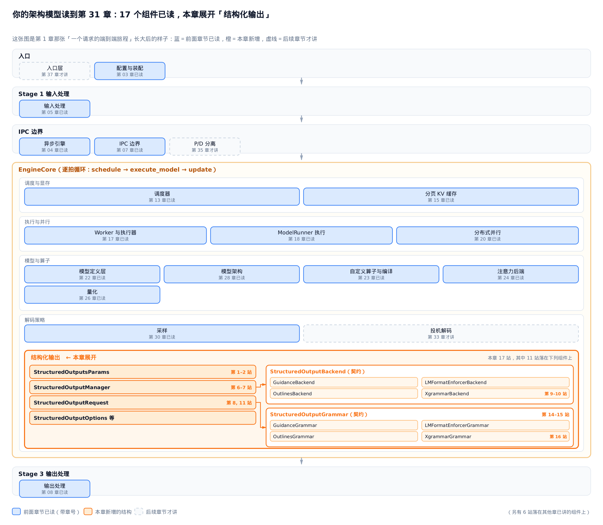
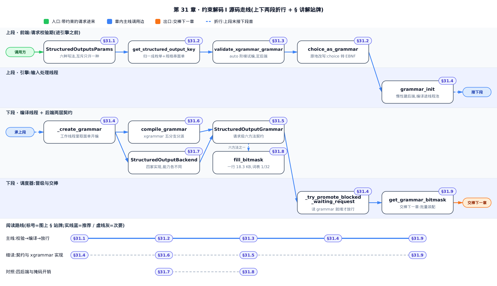
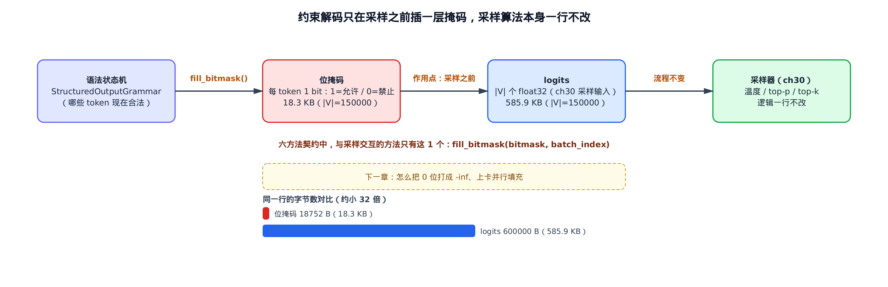
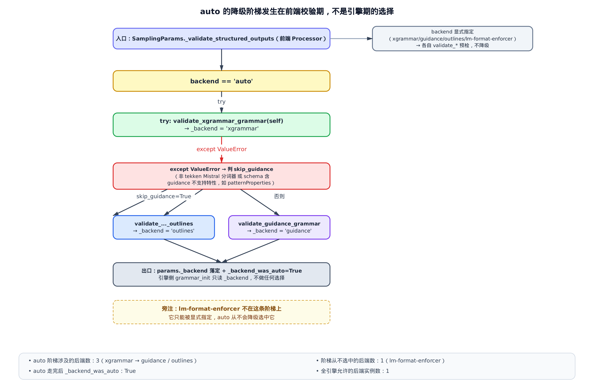
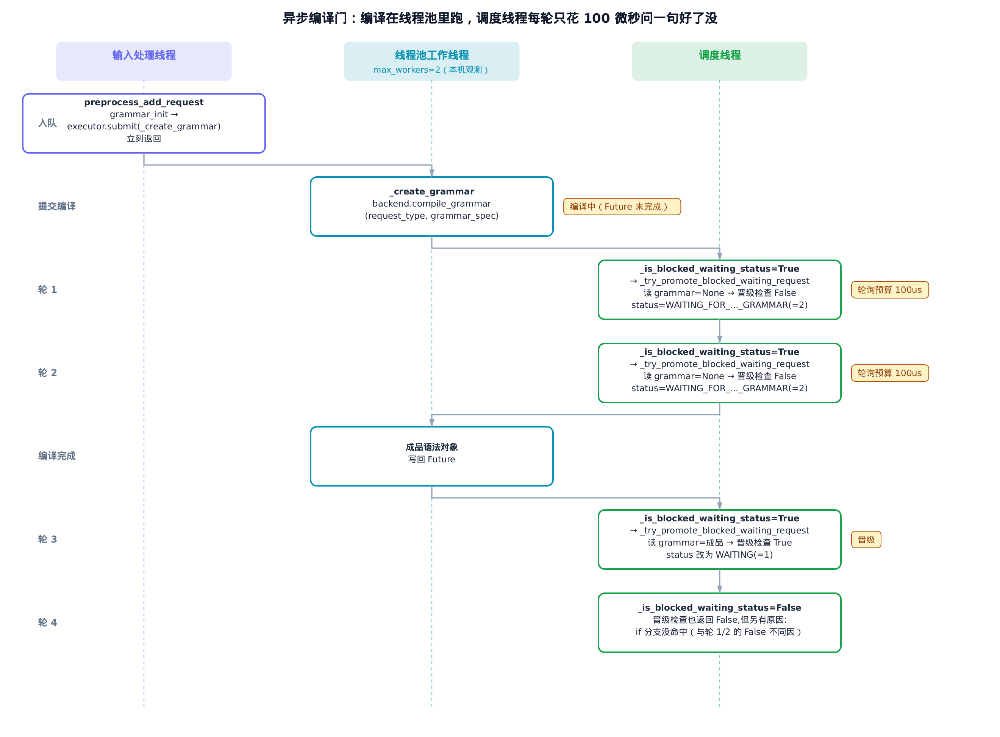
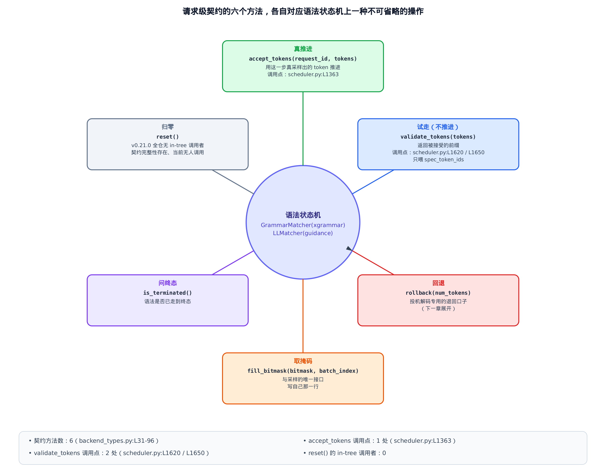
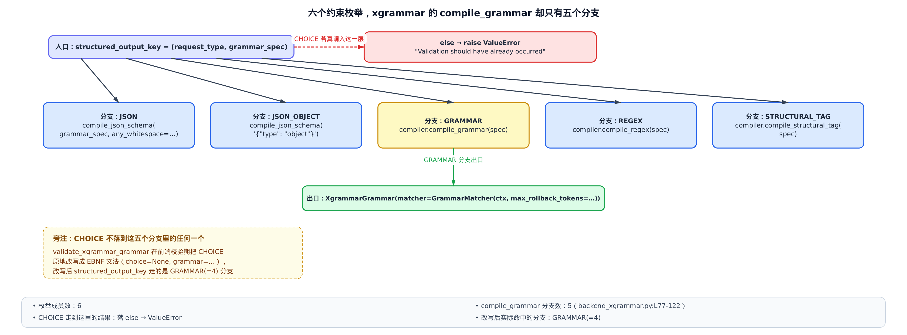
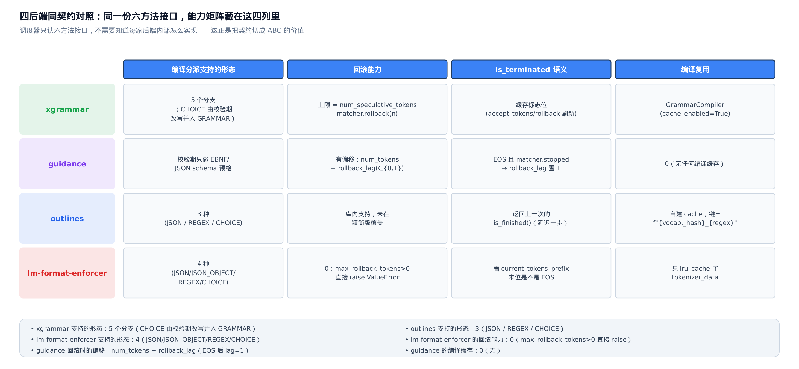
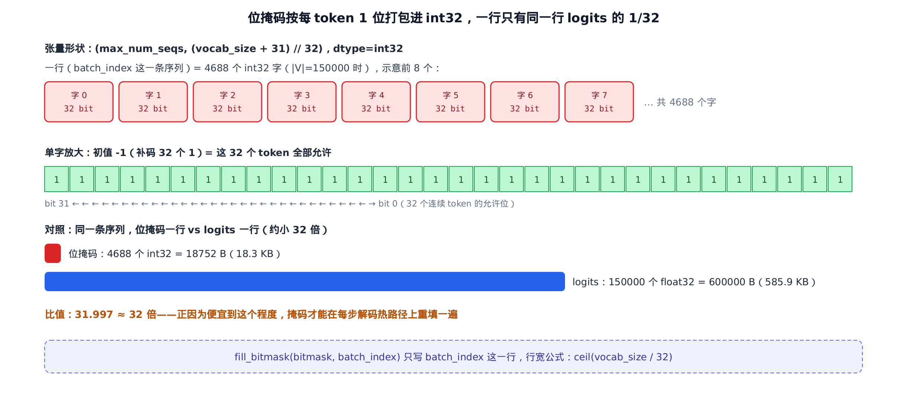
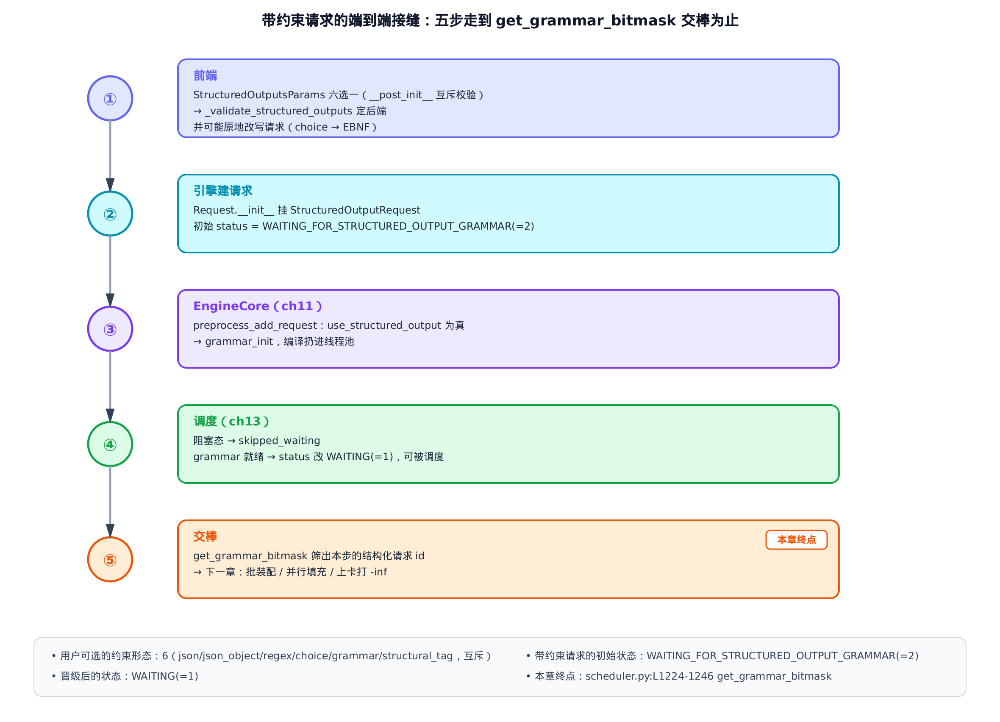

# 第 31 章　约束解码 I：语法编译与后端契约

> 本章解读 `vllm/v1/structured_output/` 这个目录，主线是 `vllm/v1/structured_output/backend_types.py` 里那份被四个语法后端共同实现的契约。

## 你在这里



> *图注：这张架构模型图整本书共用，从开篇起逐章生长——它就是[第 1 章](../../ch01-config-and-wiring/narrative/chapter.md)那张「一个请求的端到端旅程」长大后的样子。主线一眼就能认出来：自上而下依次是入口、输入处理、跨进程的 IPC（进程间通信）边界、装着逐拍循环 `schedule → execute_model → update` 的 `EngineCore` 大框、输出处理，行间箭头还是请求的流向；当年 `EngineCore` 框里只画了调度器与分页 KV 缓存，如今已按「调度与显存／执行与并行／模型与算子／解码策略」四组装满一路读过来的组件。蓝框是前面章节已经读过的（框里带章号），虚线框留给后续章节，橙色是本章新长出的一块。*
> *本章新长的这块在「解码策略」组里就地展开——摊开的不是一列类名，而是源码里真实的组织关系：左列是本章要读的四个类；右列是两份契约，各自嵌着同样四家后端的实现；连接两列的箭头是持有关系——管理器一侧持有后端，请求一侧持有语法对象。这个「两份契约、各带四家实现」的嵌套形状，正是本章的主线「两层契约」——图把它直接画了出来。本章走线共 17 站，11 站落在这些橙色部件上，另有 6 站落在其他章已讲的组件上。站号是请求流经代码的顺序；正文按讲解需要编排，不必照站号顺序读——跨模块的几个大接缝处，正文会随手报一句「现在走到哪一段」。*
> *[第 30 章](../../ch30-sampling/narrative/chapter.md)把一张 logits（模型前向吐出的原始分数，每个 token 一列）变成了下一个 token，就是「解码策略」组里已经读过的那个「采样」蓝框——本章的新块就长在它旁边。*
> *本章往这条路上插一层：让模型只能在「此刻语法允许的 token」里选，而采样算法一行都不用改。下一章把这层掩码真正搬上 GPU、打进 logits。*

用户提交一个 JSON schema（一份描述「合法 JSON 长什么样」的规格），要求模型的输出严格符合它。模型这边呢，它对「合法」一无所知——前向算完只会给你一行分数，`{` 有分数，`爱` 也有分数，`}}}` 同样有分数。中间这道鸿沟，就是 vLLM 里 `vllm/v1/structured_output/` 这个目录要填的坑，入口在 `vllm/v1/structured_output/__init__.py`。

填法比想象中克制：**不改采样，只在采样之前加一层「哪些 token 现在合法」的位掩码**。整个子系统的产物，说到底就是每步给每条序列交出一行二进制位。

难点也不在掩码本身，而在两件容易被低估的事。一是**编译**：把 JSON schema 变成一台能逐 token 回答「下一步允许什么」的状态机，这个编译可能要上百毫秒，而引擎的调度循环是一步都不能停的；vLLM 为此专门给请求发明了一个状态，让它去「等候区」等编译完成。二是**契约**：vLLM 同时支持四个第三方语法后端，它们的能力、语义、缓存策略各不相同，却必须在同一套接口下被调度器一视同仁地使唤。

这两件事就是本章的主线。为了能在本地把这条路径亲手跑一遍、打断点看数值，本章配了一份**只做减法**的精简版：与真实 vLLM 同名、同结构、同控制流，只删掉与主线正交的分支（掩码批装配、推理模型跳过、Mistral 分词器兼容路径等）。正文主线仍是真实源码，精简版只是「跑起来看数值」的交叉验证物。

需要先说清一件取证上的事：本轮成书环境没有可用的 vLLM 容器，因此本章所有耗时类数字都来自 host 上的纯 Python 控制流复现（CPython 3.11 / WSL2），只反映 `Future.result` 这类调用的量级，**不代表真机上的语法编译耗时**；凡涉及真机的地方，正文只讲量级关系，不给具体毫秒数。



> 上面的架构模型图回答「本章位于整棵架构的哪里」，这张地图回答「本章内部怎么读」。三条读法：想跟着一个请求走完全程，按 §31.1 → §31.2 → §31.3 → §31.4 → §31.9 读主线；只关心契约长什么样、xgrammar 怎么实现它，从 §31.4 跳到 §31.6 再回 §31.5，收尾看 §31.9；只想比较四个后端的差异与掩码开销，直接读 §31.7 和 §31.8 两节。

---

## 31.1 约束不改采样，只加一层掩码

先建立最重要的那个直觉：**约束解码是「提前锁死路」，不是「走错了再修」**。

假设词表是 $`V`$，语法走到状态 $`s`$ 时的合法 token 集合是 $`A(s) \subseteq V`$。自由采样从模型给的分布 $`p`$ 里抽，抽到 $`V \setminus A(s)`$ 的概率一般不为零；而一旦抽错一个 token，后面所有 token 都被拴在一条永远回不到合法态的轨迹上。事后修复要解的是「离它最近的合法串是哪个」——既没有唯一解，也不保证语义还在。

掩码法做的是另一件事：把分布换成在合法集上重新归一的条件分布。

```math
p_{\mathrm{masked}}(x \mid s) \;=\; \frac{p(x)\,\mathbb{1}[x \in A(s)]}{\sum_{y \in A(s)} p(y)}, \qquad x \in V
```

这一步只做了一件事：把非法 token 的概率质量抹成 0、再把剩下的重新归一。它等价于对语言模型分布做逐步条件化，因此只要每一步的 $`A(s)`$ 非空，输出串**必然**落在语法定义的语言里。代价也就一次逐元素乘法——所以采样器完全不必知道有约束这回事。



用户能表达的约束一共六种，全在 `StructuredOutputsParams` 这个 dataclass（Python 的数据类，只装字段不装逻辑）里：

```python
# vllm/sampling_params.py:L40-L52
@dataclass
class StructuredOutputsParams:
    # One of these fields will be used to build a logit processor.
    json: str | dict | None = None
    regex: str | None = None
    choice: list[str] | None = None
    grammar: str | None = None
    json_object: bool | None = None
    # These are other options that can be set.
    disable_any_whitespace: bool = False
    disable_additional_properties: bool = False
    whitespace_pattern: str | None = None
    structural_tag: str | None = None
```

六个约束字段各有分工：`json` 给 JSON schema；`regex` 给正则；`choice` 给一组候选字符串，要求输出必须是其中之一；`grammar` 直接给一段 EBNF（扩展巴科斯范式，书写上下文无关文法的标准记法——上下文无关文法就是「每条规则左边一个名字、右边一串名字或字面量，名字可以递归引用自己」的那族文法，递归让它写得出任意深度的嵌套，§31.2 见到实物时再逐符号细读）；`json_object` 只要求「是个 JSON 对象」而不限内部结构；`structural_tag` 则是「只在特定标记之间强制结构」的混合形态。夹在中间的三个 `disable_*` / `whitespace_pattern` 不是约束，是编译开关（比如是否允许任意空白）。

前五种都能一句话说清，`structural_tag` 值得单独看个例子——它是六种里唯一「不整段约束」的形态，为 LLM 工具调用（function calling，让模型按约定格式发起函数调用）量身定制。工具调用的真实输出天然是「自由文本夹结构」：模型先解释一句「我来查下天气」，再按厂商约定的标记格式给出调用参数。对这种输出，全文强制 JSON 会杀掉解释性文本，撒手不管则参数 JSON 会写坏——structural_tag 的答案是 **只强制该强制的那几段**。看 vLLM 官方文档里的示例（说明性示例，展示的是用户要传的约束串，不是引擎源码）：

```json
{
  "type": "structural_tag",
  "structures": [{
    "begin": "<function=get_weather>",
    "schema": {"type": "object", "properties": {"city": {"type": "string"}}},
    "end": "</function>"
  }],
  "triggers": ["<function="]
}
```

四个字段各管一段语义。`triggers`——模型自由输出时，引擎只盯这个前缀，它没出现之前 **什么约束都没有**；`begin`——触发词一出现，接下来必须完整吐出 `<function=get_weather>`；`schema`——begin 与 end 之间那段必须是合法的 `{"city": "..."}` 形状的 JSON；`end`——收尾标签一出，又回到自由文本，直到下一次命中触发词。于是这样一条输出是合法的：

```text
好的，我来查询。<function=get_weather>{"city": "Beijing"}</function>查询已发出。
```

前后的中文完全自由，被语法强制的只有标签之间那一段。还有一条隐含约定值得点破：**trigger 必须是 begin 的前缀**。引擎靠它在模型刚吐出 `<function=` 的一瞬就知道该切进哪一组候选标签；多个工具就在 `structures` 里并列多个三元组、共享这一个 trigger，靠 begin 的剩余部分（函数名）分辨这次调的是谁。vLLM 对这串 JSON 不做任何加工，原样透传给默认后端 xgrammar 编译——§31.6 的编译分派里那个按有没有 `"structures"` 字段区分新旧两代格式的分支，接住的就是它（这里的写法是旧一代格式，已被 xgrammar 标为过时但仍被支持；格式演进见 [xgrammar 的 structural tag 文档](https://xgrammar.mlc.ai/docs/api/python/structural_tag.html)）。

这六个字段是**互斥**的，而且互斥由 `__post_init__` 双向把关——多于一个报错，少于一个也报错：

```python
# vllm/sampling_params.py:L59-L80
    def __post_init__(self):
        """Validate that some fields are mutually exclusive."""
        count = sum(
            [
                self.json is not None,
                self.regex is not None,
                self.choice is not None,
                self.grammar is not None,
                self.json_object is not None,
                self.structural_tag is not None,
            ]
        )
        if count > 1:
            raise ValueError(
                "You can only use one kind of structured outputs constraint "
                f"but multiple are specified: {self.__dict__}"
            )
        if count < 1:
            raise ValueError(
                "You must use one kind of structured outputs constraint "
                f"but none are specified: {self.__dict__}"
            )
```

`count < 1` 这一半值得多看一眼：它意味着「这个对象一旦被构造出来，就一定恰好带一个约束」。下一节那个归一函数末尾的 `raise ValueError` 之所以在正常路径上永远走不到，靠的就是这里。至于「压根没有结构化约束」的请求，走的是另一条路——`SamplingParams.structured_outputs` 整个为空，或者所有字段都是 `None`（`all_constraints_none()`，`vllm/sampling_params.py:L82`），这时候连 `StructuredOutputRequest` 都不会被建出来。

## 31.2 六种写法，一张标准面单

引擎侧不想为六种写法各写一套流程。所以在编译之前，先有一次归一：六种约束统统换成同一张「面单」——一个「枚举 + 规格字符串」的二元组。

面单的定义也把我们第一次带进 `vllm/v1/structured_output/`——开篇架构模型图里在「解码策略」组就地展开的那块橙色结构的本体，本章走线 17 站有 9 站落在这个目录。不过按站号（请求流经代码的顺序），走线要到 `grammar_init`（第 6 站，§31.4 登场）才真正踏进这里；正文提前到访，是因为面单的形状不先立住，后面的编译和契约都无从谈起。

这就是 `StructuredOutputKey`，以及产生它的那个函数：

```python
# vllm/v1/structured_output/backend_types.py:L19-L28
class StructuredOutputOptions(enum.Enum):
    JSON = enum.auto()
    JSON_OBJECT = enum.auto()
    REGEX = enum.auto()
    GRAMMAR = enum.auto()
    CHOICE = enum.auto()
    STRUCTURAL_TAG = enum.auto()


StructuredOutputKey = tuple[StructuredOutputOptions, str]
```

```python
# vllm/v1/structured_output/request.py:L77-L98
def get_structured_output_key(params: StructuredOutputsParams) -> StructuredOutputKey:
    if params.json is not None:
        if not isinstance(params.json, str):
            json_str = json.dumps(params.json)
        else:
            json_str = params.json
        return StructuredOutputOptions.JSON, json_str
    if params.json_object:
        return StructuredOutputOptions.JSON_OBJECT, ""
    if params.regex is not None:
        return StructuredOutputOptions.REGEX, params.regex
    if params.choice is not None:
        if not isinstance(params.choice, str):
            json_str = json.dumps(params.choice)
        else:
            json_str = params.choice
        return StructuredOutputOptions.CHOICE, json_str
    if params.grammar is not None:
        return StructuredOutputOptions.GRAMMAR, params.grammar
    if params.structural_tag is not None:
        return StructuredOutputOptions.STRUCTURAL_TAG, params.structural_tag
    raise ValueError("No valid structured output parameter found")
```

这段代码的全部心思都在**类型封闭**上。用户写 `json` 时可以给 dict（Python 字典）也可以给字符串，写 `choice` 时给的是 list——它们统统被 `json.dumps` 拍成字符串。于是返回值恒为 `(StructuredOutputOptions, str)`：可哈希、可比较、可以直接当字典的键用。

把六种写法逐个喂进去，得到的面单是这样的（`grammar_spec` 就是二元组的第二元，那串规格文本）：

<!-- trace: m08-structured-output-key -->

| 用户写法 | 归一后的枚举 | 枚举值 | grammar_spec 字符串 | 串长 | 是否被 json.dumps 归一 |
| --- | --- | --- | --- | --- | --- |
| json（dict 形态） | JSON | 1 | `'{"type": "object"}'` | 18 | 是（json.dumps） |
| json（str 形态） | JSON | 1 | `'{"type": "object"}'` | 18 | 否 |
| json_object=True | JSON_OBJECT | 2 | `''` | 0 | 否 |
| regex | REGEX | 3 | `'[ab]+'` | 5 | 否 |
| choice（list 形态） | CHOICE | 5 | `'["red", "blue"]'` | 15 | 是（json.dumps） |
| grammar（EBNF） | GRAMMAR | 4 | `'root ::= "ab"'` | 13 | 否 |
| structural_tag | STRUCTURAL_TAG | 6 | `'{"triggers": []}'` | 16 | 否 |

两个细节值得停一下。`json_object` 的规格串是长度 0 的空串——因为它的全部信息都在枚举里，「是个对象」这件事不需要额外参数。而 dict 和 str 两种 `json` 写法归一到了**同一个**面单（都是长度 18 的那串），这是后面讨论编译复用的前提。

这张面单挂在请求上，是个 `functools.cached_property`（首次读时计算、之后直接返回缓存值的属性）：

```python
# vllm/v1/structured_output/request.py:L72-L74
    @functools.cached_property
    def structured_output_key(self) -> StructuredOutputKey:
        return get_structured_output_key(self.params)
```

**这里有个必须当场澄清的误解**：`structured_output_key` 看着像个缓存键，但它**不是跨请求的编译缓存键**。它是每个请求各算一份的属性，vLLM 并不拿它去查「这份 schema 编译过没有」。两个提交了同一份 schema 的请求，键确实相等，但引擎照样各调一次编译。真正的复用发生在后端内部，而且四家的做法完全不同——这笔账留到 §31.6 和 §31.7 算。

### 引擎侧只见五种：一次悄悄的原地改写

上面那张表里有六个枚举。可到了 xgrammar 后端的编译入口，你只会看到五个分支——`CHOICE` 不在其中。

原因是：**校验期不只决定「用哪个后端」，它还会原地改写请求本身**。`choice` 在进引擎之前就被翻译成了 EBNF：

```python
# vllm/v1/structured_output/backend_xgrammar.py:L286-L296
    if so_params.choice:
        choice_grammar = choice_as_grammar(so_params.choice)
        try:
            xgr.Grammar.from_ebnf(choice_grammar)
        except Exception as err:
            raise ValueError(
                f"Failed to transform choices into a grammar: {err}"
            ) from err
        so_params.choice = None
        so_params.grammar = choice_grammar
        return
```

翻译本身只有三行（`choice_as_grammar`，`vllm/v1/structured_output/utils.py:L451`）：转义每个候选串里的引号和反斜杠，再用 `|` 串成一条 EBNF 规则。

```python
# vllm/v1/structured_output/utils.py:L451-L459
def choice_as_grammar(choice: list[str]) -> str:
    def escape_ebnf_string(s: str) -> str:
        """Escape special characters in a EBNF string."""
        # Escape double quotes and backslashes
        return re.sub(r'(["\\])', r"\\\1", s)

    escaped_choices = (escape_ebnf_string(c) for c in choice)
    grammar = "root ::= " + " | ".join(f'"{c}"' for c in escaped_choices)
    return grammar
```

关键是那两行赋值：`so_params.choice = None; so_params.grammar = choice_grammar`。它把用户填的字段**就地**改了。跟着一个 `choice=["red", "blue"]` 的请求走一遍，面单在校验前后完全换了身份：

<!-- trace: m20-validation-rewrites-request -->

| 阶段 | params.choice | params.grammar | 面单枚举 | 面单规格串 | _backend / 分派结果 |
| --- | --- | --- | --- | --- | --- |
| 用户提交（前端校验前） | `['red', 'blue']` | `None` | CHOICE(=5) | `'["red", "blue"]'` | `None` |
| 校验之后（引擎侧看到的就是这份） | `None` | `'root ::= "red" \| "blue"'` | GRAMMAR(=4) | `'root ::= "red" \| "blue"'` | `'xgrammar'` |
| 引擎侧编译时实际分派 | — | — | GRAMMAR(=4) | `'root ::= "red" \| "blue"'` | compiler 分支 = grammar |

这次改写是**单向归一**，而且不破坏 §31.1 那条互斥不变式：一个字段从有值变 `None`、另一个从 `None` 变有值，非 `None` 的字段数恒为 1，所以后续再跑一次 `__post_init__` 也不会报错。同时，`get_structured_output_key` 的分支顺序是 json → json_object → regex → choice → grammar → structural_tag，逐个判「是不是 `None`」；`choice` 被置空之后那条分支再也命中不了，必然落到 `grammar` 分支。**从此引擎侧永远不会再看到 `CHOICE`**。

不讲清这次改写，读者只看引擎侧的编译代码，会得出一个错误结论：「xgrammar 不支持 choice」。恰恰相反——它支持，只是支持的方式是提前把 choice 变成别的东西。

### 读懂这条 EBNF：从记号到表达力

既然 choice 的归宿是一条 EBNF，就顺手把它逐符号读透——这是本章第一条见到实物的文法，这套记法后面还要反复出现：

```text
root ::= "red" | "blue"
```

四个成分。`root` 是 **规则名**（术语叫非终结符）；这里用的方言约定全文法必须有一条名为 `root` 的规则，它就是「整个输出」的定义、语法的起点。`::=` 读作「定义为」。带引号的 `"red"` 是 **终结符**：字面字符串，输出里必须逐字出现。`|` 是「或」，左右任选其一。整条规则连起来读：合法输出恰好是 `red` 或 `blue` 这两个字符串之一，一个字符都不能多——正是 choice 语义的忠实翻译。

记法本身有条承继链：BNF（巴科斯范式）诞生于上世纪五六十年代，为描述 ALGOL（那个年代的一门先驱编程语言）而生，只有「规则定义、竖线选择、递归」三板斧；EBNF 在 1970 年代加入了重复、可选这类正则风格的算子；而默认后端 xgrammar 认的方言叫 **GBNF**（GGML BNF）——llama.cpp 项目 2023 年为约束 LLM 输出定下的 EBNF 变体（规则用 `::=` 定义、以 `root` 为起点），xgrammar 的文法格式明确沿用[这份规范](https://github.com/ggml-org/llama.cpp/blob/master/grammars/README.md)。

文法比正则表达式强在哪，两行就能看清（示意文法，非本章请求实际产生）：

```text
root ::= "[" [item ("," item)*] "]"
item ::= "a" | root
```

`item` 的定义里又引用了 `root`——这种 **自引用（递归）** 正是文法超出正则的地方：它能定义任意深度的嵌套列表（`[a,[a,a],[[a]]]` 都合法），而正则写不出「括号必须配平」。把 root/item 换成 object/value，就是 JSON 文法的骨架。这条表达力分界线值得记住：§31.7 比较四家后端时会看到，有人真支持递归文法，有人把一切化归正则、干脆放弃了递归。

## 31.3 后端在进引擎之前就选好了

vLLM 支持四个语法后端：**xgrammar**（默认，C++ 实现的语法编译器 + 逐 token 匹配器）、**guidance**（llguidance 库，Rust 实现）、**outlines**（把一切先转成正则再编成 DFA——确定有限自动机，一张「当前状态 × 读到的字符 → 唯一下一状态」的查表机，每读一个字符只花常数时间，读完看停在哪个状态）、**lm-format-enforcer**（下文简称 LMFE，按已生成前缀查允许集，不持状态机）。四家各是什么路数、代价何在、什么时候该选谁，留到 §31.7 专门比对；这里先看 vLLM 怎么在它们之间做选择。

选哪一个，**不在引擎里决定**，而在前端的请求校验期就定死了：入口是 `SamplingParams._validate_structured_outputs`（`vllm/sampling_params.py:L773`），由前端的请求处理器调用。`backend='auto'` 落在这个函数末尾的分支上，是一条「先试最优、失败降级」的阶梯：

```python
# vllm/sampling_params.py:L871-L901
            try:
                validate_xgrammar_grammar(self)
                self.structured_outputs._backend = "xgrammar"
            except ValueError:
                # The request either failed validation
                # or includes some jsonschema feature(s) that
                # are not supported in xgrammar.

                skip_guidance = _is_non_tekken_mistral(tokenizer)

                # Check if schema has features unsupported by guidance
                so_params = self.structured_outputs
                if not skip_guidance and so_params.json:
                    if isinstance(so_params.json, str):
                        schema = json_mod.loads(so_params.json)
                    else:
                        schema = so_params.json
                    skip_guidance = has_guidance_unsupported_json_features(schema)

                if skip_guidance:
                    # Fall back to outlines if the tokenizer is non-tekken Mistral or
                    # the schema contains features unsupported by guidance
                    validate_structured_output_request_outlines(self)
                    self.structured_outputs._backend = "outlines"
                else:
                    # Fall back to guidance by default.
                    validate_guidance_grammar(
                        self,
                        tokenizer=_get_llg_tokenizer(tokenizer),
                    )
                    self.structured_outputs._backend = "guidance"
```



读这段代码要抓住三件事。

**第一，`try` 里那句 `validate_xgrammar_grammar(self)` 是真的去试编一遍**，不是查表。上一节讲的 choice→EBNF 改写就藏在这个函数里——也就是说，「选后端」和「改写请求」是同一次调用的两个副作用。它抛 `ValueError` 才意味着 xgrammar 啃不动这份 schema，比如带了 `multipleOf`（要求数值是某个数的倍数）这类约束、或者数组上的 `uniqueItems`（要求元素互不相同）：

```python
# vllm/v1/structured_output/backend_xgrammar.py:L221-L245
def has_xgrammar_unsupported_json_features(schema: dict[str, Any]) -> bool:
    """Check if JSON schema contains features unsupported by xgrammar."""

    def check_object(obj: dict[str, Any]) -> bool:
        if not isinstance(obj, dict):
            return False

        # Check for numeric ranges
        if obj.get("type") in ("integer", "number") and ("multipleOf" in obj):
            return True

        # Check for array unsupported keywords
        if obj.get("type") == "array" and any(
            key in obj
            for key in ("uniqueItems", "contains", "minContains", "maxContains")
        ):
            return True

        # Unsupported keywords for strings
        if (
            obj.get("type") == "string"
            and "format" in obj
            and obj["format"] not in STRING_SUPPORTED_FORMATS
        ):
            return True
        # … 省略：object 的 patternProperties / propertyNames 判断与向下递归，形状同上 …
```

这张黑名单有它的理论出身。JSON schema 里的 **结构** 约束——对象、数组、任意深度的嵌套——都是文法写得出的；而 `multipleOf`、`uniqueItems` 这类关键字要求「记住并比较任意多的历史值」，越出了上下文无关文法（从而也越出了逐 token 状态机）的表达力。被列进黑名单不是实现没写完，是路线使然。

**第二，阶梯只有三家。** 降级的两个落点是 guidance（默认）与 outlines（当分词器是非 tekken 的 Mistral——tekken 是 Mistral 自 2024 年起换用的新一代分词器，基于 OpenAI 的 tiktoken 分词库训练，取代早年基于谷歌 SentencePiece 分词库的老款，「非 tekken」指的就是老款；或 schema 用了 guidance 啃不动的特性，如按键名正则匹配属性的 `patternProperties`）。**LMFE 从不出现在这条路上**——它只能由用户显式指定。所以「auto 会自动帮我挑最合适的四选一」是错的：自动挑的范围是三选一。

**第三，选择的结果只落成一个字段**：`params._backend`（附带一个 `_backend_was_auto` 记账位，用来区分「用户指定的」和「auto 选出来的」，这样复用同一份 params 时不会误报后端冲突）。引擎侧照单全收，不再做任何选择——下一节那段 `grammar_init` 里，`_backend` 只被读、不被写。

把选择放在校验期还有一个连带好处：编译不了的请求在**进引擎之前**就被拒了。所以引擎侧的编译函数才敢写下那句注释——「到这里我们已经知道它是受支持的类型」。

## 31.4 命门：编译扔进线程池，请求进等候区

新员工报到要先办门禁卡。卡在后台制作，可能得等一阵；总不能让人堵在门口、整条队伍跟着停。合理的做法是：请他去等候区坐着，前台每轮点名时顺口问一句「卡好了没」，好了才放进办公区排队。

语法编译就是那张门禁卡。把一份 JSON schema 编成状态机，本质是为每个状态求出词表上的可接受集合，量级是 $`O(|G|\cdot|V|)`$ 的一次性代价（$`|G|`$ 是语法规模），可能要上百毫秒；而 `EngineCore` 的忙循环（[第 11 章](../../ch11-engine-core/narrative/chapter.md)讲的那条「拿请求→调度→执行」的同步主循环）每步预算固定——同步编译会把整批请求一起卡住。

vLLM 的解法就是「等候区」那一套，而且是编译与门控**两半**：编译扔线程池，请求进一个专门的阻塞状态。

### 编译这一半

入口在 `EngineCore` 收请求的地方：

```python
# vllm/v1/engine/core.py:L783-L790
        req = Request.from_engine_core_request(request, self.request_block_hasher)
        if req.use_structured_output:
            # Note on thread safety: no race condition.
            # `grammar_init` is only invoked in input processing thread. For
            # `structured_output_manager`, each request is independent and
            # grammar compilation is async. Scheduler always checks grammar
            # compilation status before scheduling request.
            self.structured_output_manager.grammar_init(req)
```

先把坐标报全：这段代码所在的函数是 `preprocess_add_request`——`EngineCore` 在输入处理线程里给新请求做预处理的入口，也是本章走线里唯一落在 `vllm/v1/engine` 的第 5 站——开篇架构模型图说「另有 6 站落在其他章已讲的组件上」，这就是其中之一；眼前这次移交，正是控制权从 `EngineCore` 大框交进框内那块橙色展开结构的瞬间。而这八行还是全章最密的一次换乘：第一行 `from_engine_core_request` 触发 `Request.__init__`（走线第 3–4 站落在 `vllm/v1`，起点正是它），末行 `grammar_init` 一脚迈进 `vllm/v1/structured_output`（第 6 站）——从第 3 站到第 6 站，走线在这里连过三个目录。

`use_structured_output`（`vllm/v1/request.py:L236`）的定义就一句话：这个请求身上挂没挂 `structured_output_request`。那段注释则把线程安全的理由先摆在了明处，我们在本节末尾回来验它。

`grammar_init` 做的第一件事是惰性建后端——**全引擎只有一个后端实例**，第一个结构化请求把它建出来，之后所有请求共用：

```python
# vllm/v1/structured_output/__init__.py:L114-L138
    def grammar_init(self, request: "Request") -> None:
        if request.structured_output_request is None:
            return

        if TYPE_CHECKING:
            assert (
                request.sampling_params is not None
                and request.sampling_params.structured_outputs is not None
            )

        # Initialize the backend the first time it is needed.
        #
        # NOTE: We only support a single backend. We do NOT support different
        # backends on a per-request basis in V1 (for now, anyway...).
        # _backend is set in Processor._validate_structured_output
        if self.backend is None:
            assert request.sampling_params is not None
            backend = request.sampling_params.structured_outputs._backend
            vocab_size = self.vllm_config.model_config.get_vocab_size()
            if backend == "xgrammar":
                self.backend = XgrammarBackend(
                    self.vllm_config,
                    tokenizer=self.tokenizer,
                    vocab_size=vocab_size,
                )
        # … 省略：guidance / outlines / lm-format-enforcer 三个 elif 分支形状完全相同（只换类名），以及末尾 else 抛 ValueError …
```

单后端不是偷懒：后端实例里装着词表信息和编译器这类重资源（下一节会看到 xgrammar 的编译器还自带缓存），逐请求换后端等于逐请求重建它们。

函数的后半段才是命门：

```python
# vllm/v1/structured_output/__init__.py:L166-L183
        if self._use_async_grammar_compilation:
            grammar = self.executor.submit(self._create_grammar, request)
        else:
            grammar = self._create_grammar(request)  # type: ignore[assignment]
        request.structured_output_request.grammar = grammar  # type: ignore[assignment]

    def _create_grammar(self, request: "Request") -> StructuredOutputGrammar:
        key = request.structured_output_request.structured_output_key  # type: ignore[union-attr]

        # Note that the request was validated in the engine core client,
        # so at this point we know it is a supported type of request.
        #
        # TODO: we still need to handle xgrammar compilation failures,
        # though it should be unlikely as we test that up front as well.
        request_type, grammar_spec = key

        assert self.backend is not None
        return self.backend.compile_grammar(request_type, grammar_spec)
```

`executor.submit` 把 `_create_grammar` 扔进线程池，立刻返回一个 `Future`（「结果还没算出来的占位对象」），**编译一秒钟都没有占用调用者的线程**。而 `_create_grammar` 在工作线程里做的事简单到一览无余：取面单、解包成 `(request_type, grammar_spec)`、调 `backend.compile_grammar`。三步里没有查表、没有「编译过没有」的判断、没有把成品挂到任何跨请求容器上——这就是 §31.2 那句「vLLM 侧不做去重」的全部证据。

线程池本身开在管理器的构造函数里，`max_workers`（池子里的线程数上限）的取法带着一条解释：

```python
# vllm/v1/structured_output/__init__.py:L70-L80
        if not self.vllm_config.model_config.skip_tokenizer_init:
            # The default max_workers if not specified is the number of
            # CPUs * 5, which is way too high since these tasks are CPU-bound,
            # not I/O bound. We also know we would never dominate CPU usage
            # with just grammar compilation, so we set it to half the number
            # of CPUs.
            max_workers = max(1, (multiprocessing.cpu_count() + 1) // 2)
            self.executor = ThreadPoolExecutor(max_workers=max_workers)
            self.tokenizer = cached_tokenizer_from_config(
                model_config=self.vllm_config.model_config
            )
```

`ThreadPoolExecutor`（Python 标准库的线程池）默认的 `max_workers` 是 CPU 数的 5 倍——那是给 IO 密集任务准备的。语法编译是 CPU 密集的，开那么多线程只会互相抢核，所以砍到一半核数。

异步也不是无条件的。`external_launcher` 模式（由外部启动器给每个张量并行 rank 各拉一个进程、各跑一个调度器的部署方式）下，异步编译会直接死锁：

```python
# vllm/v1/structured_output/__init__.py:L46-L58
        # When in external_launcher mode, async grammar compilation causes deadlocks
        # due to external_launcher mode having a scheduler for each TP rank.
        # Async grammar compilation causes the
        # WAITING_FOR_STRUCTURED_OUTPUT_GRAMMAR → WAITING transition to
        # happen at different times on different TP ranks,
        # breaking the determinism assumption that external_launcher relies on.
        self._use_async_grammar_compilation = (
            vllm_config.parallel_config.distributed_executor_backend
            != "external_launcher"
        )

        self._grammar_bitmask: torch.Tensor | None = None
        self._full_mask = torch.tensor(-1, dtype=torch.int32)
```

理由写得很清楚：各 rank 的编译快慢不一，状态跃迁的时刻就会错开，而这个模式赖以工作的前提正是「所有 rank 的调度决策逐步一致」。宁可同步编译卡一下，也不能让 rank 之间走岔。

### 门控这一半

按走线的站号，这一半其实发生得更早：`Request.__init__` 是第 3–4 站——就是上一小节那八行换乘里 `from_engine_core_request` 触发的那步——比提交编译的 `grammar_init`（第 6 站）还靠前，请求一出生就带着「等语法」的状态。正文把它挪到编译之后讲，只因「等候区」的意义要配着线程池那一半才看得清。

请求这边，一旦挂上结构化约束，**初始状态就不是普通的 `WAITING`**：

```python
# vllm/v1/request.py:L107-L112
        elif sampling_params is not None:
            # Generative models.
            assert sampling_params.max_tokens is not None
            self.max_tokens = sampling_params.max_tokens
            if self.structured_output_request is not None:
                self.status = RequestStatus.WAITING_FOR_STRUCTURED_OUTPUT_GRAMMAR
```

```python
# vllm/v1/request.py:L316-L321
class RequestStatus(enum.IntEnum):
    """Status of a request."""

    WAITING = enum.auto()
    WAITING_FOR_STRUCTURED_OUTPUT_GRAMMAR = enum.auto()
    WAITING_FOR_REMOTE_KVS = enum.auto()
    # … 省略：RUNNING / PREEMPTED / FINISHED_* 一族，已在调度章讲过 …
```

调度器（[第 13 章](../../ch13-scheduler/narrative/chapter.md)）认识这个状态，把它和另外两个「在等外部条件」的状态归成一类。走线也在此第一次拐进 `vllm/v1/core/sched`——本章在调度器这一块一共停三站（第 12–13、17 站），前两站就落在眼下这段门控里，最后一站要到章末交棒才见：

```python
# vllm/v1/core/sched/scheduler.py:L1515-L1521
    @staticmethod
    def _is_blocked_waiting_status(status: RequestStatus) -> bool:
        return status in (
            RequestStatus.WAITING_FOR_STRUCTURED_OUTPUT_GRAMMAR,
            RequestStatus.WAITING_FOR_REMOTE_KVS,
            RequestStatus.WAITING_FOR_STREAMING_REQ,
        )
```

处在这类状态的请求会被放进 `skipped_waiting`（本轮跳过、不参与正常调度的暂存队列）。真正的放行发生在晋级检查 `_try_promote_blocked_waiting_request`（`vllm/v1/core/sched/scheduler.py:L1998`）里，属于本章的是这一段：

```python
# vllm/v1/core/sched/scheduler.py:L2015-L2020
        if request.status == RequestStatus.WAITING_FOR_STRUCTURED_OUTPUT_GRAMMAR:
            structured_output_req = request.structured_output_request
            if not (structured_output_req and structured_output_req.grammar):
                return False
            request.status = RequestStatus.WAITING
            return True
        # … 省略：WAITING_FOR_REMOTE_KVS 与 WAITING_FOR_STREAMING_REQ 两个同构分支 …
```

注意调度器读的是 `structured_output_req.grammar`——**一个属性**，不是什么显式的「查询就绪」方法。这个选择很关键，因为它把「Future 还是成品」这件事完全挡在了调度器视野之外。

把两半合起来看一轮一轮的推演（编译耗时用一个人为卡住的开关模拟，好让它跨越好几轮调度）：

<!-- trace: m02-async-grammar-compile-gate -->

| 轮次 | 调度器这一轮看到的局面 | 本轮结束时 request.status | 轮询前算不算阻塞态 | 读到的 grammar | 晋级检查返回 |
| --- | --- | --- | --- | --- | --- |
| 轮 1 | 请求刚入队：grammar_init 尚未调用 | WAITING_FOR_STRUCTURED_OUTPUT_GRAMMAR(=2) | 是 | None(未就绪) | False |
| 轮 2 | grammar_init 已提交编译（Future 未完成） | WAITING_FOR_STRUCTURED_OUTPUT_GRAMMAR(=2) | 是 | None(未就绪) | False |
| 轮 3 | 编译完成后的下一轮调度 | WAITING(=1) | 是 | 成品对象(已就绪) | True |
| 轮 4 | 已晋级，后续轮次不再受门控影响 | WAITING(=1) | 否 | 成品对象(已就绪) | False |



轮 4 那行的两个 `False` 含义不同：`_is_blocked_waiting_status` 返回 `False` 是因为状态已经不是阻塞态了，晋级检查返回 `False` 则是因为那个 `if` 分支根本没命中。**跃迁只发生一次**，这条正是下面要证的不变式。

### 那 100 微秒的抬头一瞥

`grammar` 属性背后是这么一小段代码，本章最精巧的设计就在这里：

```python
# vllm/v1/structured_output/request.py:L42-L74
    def _check_grammar_completion(self) -> bool:
        # NOTE: We have to lazy import to gate circular imports
        from vllm.v1.request import RequestStatus

        if isinstance(self._grammar, Future):
            try:
                # We will check whether the future is ready within 100 us
                self._grammar = self._grammar.result(timeout=0.0001)
                self.status = RequestStatus.WAITING
            except TimeoutError:
                return False
        return True

    @property
    def is_grammar_ready(self) -> bool:
        return self._check_grammar_completion()

    @property
    def grammar(self) -> StructuredOutputGrammar | None:
        completed = self._check_grammar_completion()
        return (
            cast(StructuredOutputGrammar | None, self._grammar) if completed else None
        )

    @grammar.setter
    def grammar(
        self, grammar: StructuredOutputGrammar | Future[StructuredOutputGrammar]
    ) -> None:
        self._grammar = grammar

    @functools.cached_property
    def structured_output_key(self) -> StructuredOutputKey:
        return get_structured_output_key(self.params)
```

等电梯的正确姿势：按一下、抬头看零点几秒，来了就进，没来立刻去干别的。`result(timeout=0.0001)` 就是这「抬头看的一瞬」——100 微秒。为什么不用 `done()`（问一句「完成没」，零等待）？因为 `done()` 在「编译刚好差一点点就完成」时会白白浪费整整一轮调度；给 100 微秒的预算，就能顺手把这种情况接住，而这点时间对一轮调度来说可以忽略。

更妙的是那句赋值 `self._grammar = self._grammar.result(...)`：取到结果的同时，**把 Future 原地换成了成品**。此后 `isinstance(self._grammar, Future)` 恒为假，整个 `try` 块再也不执行，属性读退化成纯字段访问。

跑一遍就是这个形状（耗时来自 host CPython 的纯控制流复现，只反映 `Future.result` 超时实现的量级，与 GPU、与真机编译无关；已预热以排除首次调用的一次性开销）：

<!-- trace: m03-future-poll-100us -->

| 轮次 | 这一次轮询发生了什么 | _grammar 字段类型 | grammar 属性返回 | 本次轮询耗时 |
| --- | --- | --- | --- | --- |
| 轮 1 | Future 未完成：result(timeout=0.0001) 抛 TimeoutError → 返回 False | Future | None | 164 us |
| 轮 2 | 仍未完成：再等一次 100us 预算 | Future | None | 164 us |
| 轮 3 | 编译已完成：result 立即返回，_grammar 被**原地替换**成成品 | Grammar | 成品对象 | 6 us |
| 轮 4 | 再读：isinstance(_grammar, Future) 为假，直接返回，纯属性读 | Grammar | 成品对象 | 1 us |

未就绪时每次轮询的成本上限是 100 微秒（这里实测 164 微秒，多出来的是 CPython 的调用开销）；就绪之后掉到个位数微秒，两个数量级的落差。也就是说，**一个卡在编译中的请求对调度循环的边际成本是每轮 100 微秒量级，而不是编译本身的量级**——这正是「异步 + 门控」这套组合要买的东西。

**不变式：就绪是单调的。** 取布尔量 `ready = (_grammar 不是 Future)`。写 `_grammar` 的地方只有两处：`grammar_init` 在输入处理线程写一次（写进 Future 或成品），`_check_grammar_completion` 在调度线程做 Future→成品的**替换**。替换之后那个 `try` 分支永不执行，`ready` 只能 False→True、不能反向。所以「晋级之后又发现没编译完」这种竞态在结构上就不存在，跃迁至多发生一次。上面两张表正好互相印证：轮 1-2 读到 `None`、不晋级；轮 3 读到成品、状态由 2 改成 1；轮 4 再读只剩一次纯属性访问。这也就是 `EngineCore` 那段注释敢断言「no race condition」的底气。

### 两处诚实的说明

读这几十行代码时会撞见两个「看着有用、其实没人用」的东西，这里如实标出来，免得读者对着源码自行脑补出不存在的机制。

其一，`is_grammar_ready` 这个属性，在 v0.21.0 全仓**没有任何 in-tree 调用者**。门控走的是 `grammar` 属性，两者共用同一个 `_check_grammar_completion`。它是留着的接口，不是当前的调用路径。

其二，`_check_grammar_completion` 里那句 `self.status = RequestStatus.WAITING` 是**残留代码**。`StructuredOutputRequest` 是个 dataclass，字段只有 `params` / `_grammar` / `reasoning_ended` / `reasoning_parser_kwargs` / `reasoner` 五个（见下面这段），压根没有 `status`；这行只是给实例动态挂了个没人读的属性。真正的状态跃迁由调度器在 `vllm/v1/core/sched/scheduler.py:L2015-L2020` 完成。

```python
# vllm/v1/structured_output/request.py:L21-L40
@dataclasses.dataclass
class StructuredOutputRequest:
    params: StructuredOutputsParams
    _grammar: Future[StructuredOutputGrammar] | StructuredOutputGrammar | None = None
    reasoning_ended: bool | None = None
    reasoning_parser_kwargs: dict[str, Any] | None = None
    # Cached per request; do not share reasoning parsers across requests because
    # their behavior can depend on reasoning_parser_kwargs.
    reasoner: "ReasoningParser | None" = None

    @staticmethod
    def from_sampling_params(
        sampling_params: SamplingParams | None,
    ) -> "StructuredOutputRequest | None":
        if sampling_params is None:
            return None
        params = sampling_params.structured_outputs
        if not params or params.all_constraints_none():
            return None
        return StructuredOutputRequest(params=params)
```

后三个 `reasoning_*` / `reasoner` 字段服务的是「推理模型在思考段里不受语法约束」这件事，本章只点名，展开在下一章。

## 31.5 契约：请求级六方法，引擎级三方法

编译完成，我们手里有了一个「语法对象」。它到底是什么？答案是一份抽象基类（ABC，Python 里只定义接口、不给实现的基类）定下的契约——而且是**两层**契约。

请求级这一层管「推进状态、产出掩码」：

```python
# vllm/v1/structured_output/backend_types.py:L31-L96
class StructuredOutputGrammar(ABC):
    """Request-level backend for structured output requests."""

    @abstractmethod
    def accept_tokens(self, request_id: str, tokens: list[int]) -> bool:
        """
        Determines whether the provided tokens are accepted for the
        given request.

        Args:
            request_id (str): The unique identifier for the request.
            tokens (list[int]): A list of token IDs to evaluate.

        Returns:
            bool: True if the tokens are accepted, False otherwise.
        """

    @abstractmethod
    def validate_tokens(self, tokens: list[int]) -> list[int]:
        """
        Validates the provided tokens against the grammar.
        Will not advance the FSM.

        Args:
            tokens (list[int]): A list of token IDs to validate.

        Returns:
            list[int]: A list of accepted token IDs. Will be a prefix
                of the input tokens, and empty if none are accepted.
        """

    @abstractmethod
    def rollback(self, num_tokens: int) -> None:
        """
        Rolls back the state of the grammar by a specified number of tokens.
        Will also revert counters for the number of processed tokens.

        Args:
            num_tokens (int): The number of tokens to roll back.
        """

    @abstractmethod
    def fill_bitmask(self, bitmask: "torch.Tensor", batch_index: int) -> None:
        """
        Fills the bitmask for a specific batch index.

        Args:
            bitmask (torch.Tensor): The bitmask to fill
            batch_index (int): The index in the bitmask to fill
        """

    @abstractmethod
    def is_terminated(self) -> bool:
        """
        Checks whether the structured output process has terminated.

        Returns:
            bool: True if the process is terminated, False otherwise.
        """

    @abstractmethod
    def reset(self):
        """
        Resets the state of the structured output grammar.
        """
```

六个方法，逐个看它们为什么少不了。文档字符串里的 FSM 是 finite state machine（有限状态机）的缩写，指的就是这台逐 token 走的语法机器。

- **`accept_tokens`** —— 真推进。模型这一步真的吐出了 token，状态机必须跟着走一格，否则下一步算不出合法集。
- **`validate_tokens`** —— 试走。docstring 里那句 `Will not advance the FSM` 是它与上一个的全部区别：只回答「这串能不能走通」，走完必须原样恢复。给投机解码的草稿做预检用。
- **`rollback`** —— 退回。既然允许「先推进、后反悔」，就必须能精确地退。
- **`fill_bitmask`** —— 产出。它是这份契约与采样之间的**唯一**接口，签名里的 `batch_index` 指明「写掩码张量的第几行」。
- **`is_terminated`** —— 问终态。语法走完了，就该停止约束（也该允许请求结束）。
- **`reset`** —— 归零。契约完整性所需；不过要如实说明：`reset` 在 v0.21.0 里同样**没有 in-tree 调用者**（全仓搜索只能命中各后端内部对底层匹配器的 `reset` 调用），它是一个存在但当前无人使用的接口。

引擎级那一层管「编译、分配掩码、清理」，还顺手把所有后端的构造签名钉死了：

```python
# vllm/v1/structured_output/backend_types.py:L98-L136
@dataclass
class StructuredOutputBackend(ABC):
    """Engine-level backend for structured output requests."""

    vllm_config: VllmConfig
    tokenizer: TokenizerLike
    vocab_size: int

    @abstractmethod
    def compile_grammar(
        self, request_type: StructuredOutputOptions, grammar_spec: str
    ) -> StructuredOutputGrammar:
        """
        Compiles a grammar specification into a structured output grammar.

        Args:
            request_type (StructuredOutputOptions): The type of structured
                output request.
            grammar_spec (str): The grammar specification to compile.

        Returns:
            StructuredOutputGrammar: The compiled structured output grammar.
        """

    @abstractmethod
    def allocate_token_bitmask(self, max_num_seqs: int) -> "torch.Tensor":
        """
        Allocates a token bitmask for the specified maximum number of sequences.

        Args:
            max_num_seqs (int): The maximum number of sequences for which
                to allocate the bitmask.
        """

    @abstractmethod
    def destroy(self):
        """
        Backend-specific cleanup.
        """
```

两层的切分不是为了整齐，而是**资源归属**的直接映射：编译器和词表信息（`vocab_size` 即词表大小 $`|V|`$）是全引擎共享的重资源，状态机是逐请求的轻对象。切成两层，「共享编译成果、独立推进状态」就从口头约定变成了类型层面的事实。`compile_grammar` 的签名 `(request_type, grammar_spec) -> StructuredOutputGrammar` 更是把 §31.2 那张面单和这一层严丝合缝地接上了。



### 谁在推进这台状态机

契约定义了「怎么推进」，读者必然要问「什么时候推进」。答案不在 `structured_output/` 目录里，而在调度器收模型输出的地方：

```python
# vllm/v1/core/sched/scheduler.py:L1359-L1372
            if new_token_ids and self.structured_output_manager.should_advance(request):
                struct_output_request = request.structured_output_request
                assert struct_output_request is not None
                assert struct_output_request.grammar is not None
                if not struct_output_request.grammar.accept_tokens(  # type: ignore[union-attr]
                    req_id, new_token_ids
                ):
                    logger.error(
                        "Unexpected: grammar rejected tokens %s for request %s. "
                        "Terminating request.",
                        new_token_ids,
                        req_id,
                    )
                    request.status = RequestStatus.FINISHED_ERROR
```

`new_token_ids` 是这一步**真正采样出来的** token——所以 `accept_tokens` 的语义就落到了实处：状态机只被既成事实推着走。推不动就是出了不该出的事（掩码本该保证这不会发生），于是打日志、把请求判为 `FINISHED_ERROR`。守门的 `should_advance` 属于推理模型跳过那条线，归下一章。

`validate_tokens` 的调用点则是另外两处，喂进去的都是 `spec_token_ids`（投机解码的草稿 token）：

```python
# vllm/v1/core/sched/scheduler.py:L1617-L1621
            # Add newly generated spec token ids to the request.
            if self.structured_output_manager.should_advance(request):
                metadata = request.structured_output_request
                spec_token_ids = metadata.grammar.validate_tokens(spec_token_ids)  # type: ignore[union-attr]
            request.spec_token_ids = spec_token_ids
```

另一处在 `vllm/v1/core/sched/scheduler.py:L1650`，做的是同一件事：把不合语法的草稿 token 从尾部截掉。分工至此清楚了——**真 token 走 `accept_tokens`，草稿 token 走 `validate_tokens`**。

## 31.6 xgrammar：契约的参考实现

默认后端 xgrammar 把这份契约实现得最完整，拿它当参考实现读最合适。

后端构造时建的是一个编译器，注意 `cache_enabled=True`：

```python
# vllm/v1/structured_output/backend_xgrammar.py:L59-L75
        else:
            tokenizer_info = xgr.TokenizerInfo.from_huggingface(
                self.tokenizer,
                vocab_size=self.vocab_size,
            )
        self.compiler = xgr.GrammarCompiler(
            tokenizer_info,
            max_threads=8,
            cache_enabled=True,
            cache_limit_bytes=vllm.envs.VLLM_XGRAMMAR_CACHE_MB * 1024 * 1024,
        )

        self.num_speculative_tokens = 0
        if self.vllm_config.speculative_config is not None:
            self.num_speculative_tokens = (
                self.vllm_config.speculative_config.num_speculative_tokens
            )
```

`TokenizerInfo` 是 xgrammar 用来把「token id」和「字节串」对应起来的词表描述（省略掉的前半段是 Mistral 分词器的手工构造分支，只影响这个对象怎么造，不影响主线）。`GrammarCompiler` 就是编译器本体，`cache_enabled=True` 是**编译复用真正发生的地方**——注意它在 xgrammar 库内部，vLLM 只是把开关打开而已。构造函数末尾顺手记下 `num_speculative_tokens`（每步投机解码放出的草稿 token 数），马上就会用到。

### 五个分支，不是六个

编译入口按面单的枚举分派：

```python
# vllm/v1/structured_output/backend_xgrammar.py:L77-L122
    def compile_grammar(
        self, request_type: StructuredOutputOptions, grammar_spec: str
    ) -> StructuredOutputGrammar:
        if request_type == StructuredOutputOptions.JSON:
            ctx = self.compiler.compile_json_schema(
                grammar_spec, any_whitespace=not self.disable_any_whitespace
            )
        elif request_type == StructuredOutputOptions.JSON_OBJECT:
            ctx = self.compiler.compile_json_schema(
                '{"type": "object"}', any_whitespace=not self.disable_any_whitespace
            )
        elif request_type == StructuredOutputOptions.GRAMMAR:
            ctx = self.compiler.compile_grammar(grammar_spec)
        elif request_type == StructuredOutputOptions.REGEX:
            ctx = self.compiler.compile_regex(grammar_spec)
        elif request_type == StructuredOutputOptions.STRUCTURAL_TAG:
            s_tag = json.loads(grammar_spec)
            if "structures" in s_tag:
                # Falling back to deprecated method of compiling structural tag
                tags = [
                    xgr.StructuralTagItem(
                        begin=s["begin"],
                        schema=json.dumps(s["schema"]),
                        end=s["end"],
                    )
                    for s in s_tag["structures"]
                ]
                ctx = self.compiler.compile_structural_tag(tags, s_tag["triggers"])
            else:
                ctx = self.compiler.compile_structural_tag(grammar_spec)
        else:
            logger.error(
                "Validation should have already occurred. Please file an issue."
            )
            raise ValueError(
                f"grammar is not of valid supported types. ({request_type!s})"
            )

        return XgrammarGrammar(
            matcher=xgr.GrammarMatcher(
                ctx,
                max_rollback_tokens=self.num_speculative_tokens,
            ),
            vocab_size=self.vocab_size,
            ctx=ctx,
        )
```

数一数：JSON、JSON_OBJECT、GRAMMAR、REGEX、STRUCTURAL_TAG——**五个分支，枚举却有六个成员**。缺的正是 §31.2 讲过的 `CHOICE`：它在校验期就被改写成 EBNF，到这里时面单已经是 `(GRAMMAR, ebnf 串)`，走的是第三个分支。要是真拿 `CHOICE` 调进来，只会掉进 `else` 里报错——而那句 `Validation should have already occurred` 正是在说「能走到这儿的都该是校验过的类型」。

顺带把 STRUCTURAL_TAG 分支也对上号：那个 `"structures" in s_tag` 判断，认的正是 §31.1 里 get_weather 示例那种旧一代格式——拆出每个 begin/schema/end 三元组、连同 triggers 一起交给编译器；不带 `structures` 字段的新一代格式则整串原样透传。两代格式 vLLM 都认，分辨的代价只是一次 `json.loads`。



出口那句同样关键：编译产物 `ctx`（`CompiledGrammar`，编译好的语法，可共享）被包进一个 `GrammarMatcher`（逐 token 走的匹配器，持有状态，逐请求独立）。**回滚深度 `max_rollback_tokens` 直接等于 `num_speculative_tokens`**——为什么是它，下面就讲。

### 六方法的实现

```python
# vllm/v1/structured_output/backend_xgrammar.py:L131-L199
@dataclass
class XgrammarGrammar(StructuredOutputGrammar):
    # NOTE: This would be a generic-enough class for
    # supporting different backends, in the future.
    # For now, just xgrammar.
    #
    # https://xgrammar.mlc.ai/docs/api/python/index.html#xgrammar.GrammarMatcher.find_jump_forward_string
    # for jump-forward decoding

    vocab_size: int
    matcher: xgr.GrammarMatcher = field(hash=False)
    ctx: xgr.CompiledGrammar = field(hash=False)
    num_processed_tokens: int = field(
        default_factory=lambda: 0, repr=False, hash=False, init=False
    )
    _is_terminated: bool = field(default=False, repr=False, hash=False)

    def accept_tokens(self, request_id: str, tokens: list[int]) -> bool:
        """Accepts a list of tokens and advances the FSM.

        Returns True if the FSM was advanced successfully.
        Returns False if the FSM failed to advance.
        """
        if self._is_terminated:
            return False
        for token in tokens:
            if not self.matcher.accept_token(token):
                logger.error(
                    "Failed to advance FSM for request %s "
                    "for tokens %s. Please file an issue.",
                    request_id,
                    token,
                )
                return False
            self.num_processed_tokens += 1
        self._is_terminated = self.matcher.is_terminated()
        return True

    def validate_tokens(self, tokens: list[int]) -> list[int]:
        """Checks if the list of tokens are accepted by the FSM in sequence.
        Will not advance the FSM.

        Returns the prefix list of tokens that are accepted by the FSM.
        """
        accepted_tokens = []
        for token in tokens:
            if self.matcher.accept_token(token):
                accepted_tokens.append(token)
            else:
                break
        if len(accepted_tokens) > 0:
            # Rollback the FSM to the initial state
            self.matcher.rollback(len(accepted_tokens))
        return accepted_tokens

    def rollback(self, num_tokens: int) -> None:
        self.matcher.rollback(num_tokens)
        self.num_processed_tokens -= num_tokens
        self._is_terminated = self.matcher.is_terminated()

    def fill_bitmask(self, bitmask: torch.Tensor, idx: int) -> None:
        self.matcher.fill_next_token_bitmask(bitmask, idx)

    def is_terminated(self) -> bool:
        return self._is_terminated

    def reset(self):
        self.num_processed_tokens = 0
        self.matcher.reset()
```

`validate_tokens` 的实现相当坦诚：**先真的 accept 一遍，再 rollback 掉**。它没有「只看不走」的能力，就用「走了再退回来」来兑现「不推进」这个语义。末尾那句 `if len(accepted_tokens) > 0` 是为「一个都没接受」准备的——那种情况下不需要也不应该发 rollback。

试穿不算买：`validate_tokens` 是把衣服套上照照镜子（看到从哪一件开始穿不进去），照完必须原样挂回货架；`accept_tokens` 才是刷卡带走。跑一遍两者的对照（词表设成 128 的玩具规模，99 是一个语法不接受的 token）：

<!-- trace: m07-accept-vs-validate -->

| 调用点 | 动作 | 返回 | num_processed_tokens | matcher 已接受 token 数 | 累计 rollback 调用次数 |
| --- | --- | --- | --- | --- | --- |
| scheduler.py:L1617-1621 | validate_tokens([31, 32, 99]) 试走草稿 | `[31, 32]` | 0 | 0 | 1 |
| scheduler.py:L1359-L1372 | accept_tokens([31, 32]) 真推进（验收通过的 token） | None(未抛错) | 2 | 2 | 1 |
| scheduler.py:L1617-1621 | validate_tokens([99, 31]) 首个就被拒 | `[]` | 2 | 2 | 1 |
| XgrammarGrammar | accept_tokens([99]) 推进失败（真的走不通） | False | 2 | 2 | 1 |

**不变式：试走前后状态严格不变。** 第一行试走了两个 token 又退回来，`num_processed_tokens` 仍是 0，只是累计 rollback 次数 +1；第三行首个 token 就被拒，一次 accept 都没成功，于是那个 `if` 不成立、rollback 计数停在 1 不动。真正改变状态的只有第二行的 `accept_tokens`。代价上，一次 $`k`$ 长前缀的试走 = $`k`$ 次 accept 加恰好 1 次 rollback；被拒就提前 break，所以三个草稿 token 那次只做了 2 次 accept。

### rollback 是给投机解码留的口子

为什么契约里要有一个「退回去」的方法？因为投机解码（[第 34 章](../../ch34-spec-decode/narrative/chapter.md)）会先斩后奏：草稿 token 先推进状态机，等验收结果出来，被拒的那几个必须精确退回。

导航让你把最可能的三条路各预演一遍，里程表也跟着往前跳；一旦发现走错，就得把里程表**准确地**退回去。只预演三步，所以最多也只需要退三步——这就是 `max_rollback_tokens = num_speculative_tokens` 的全部道理。

拿 `num_speculative_tokens=3` 跑一遍：

<!-- trace: m06-rollback-for-spec-decode -->

| 动作 | 返回 | num_processed_tokens | matcher 已接受 token 数 | max_rollback_tokens |
| --- | --- | --- | --- | --- |
| 建好 grammar（尚未喂任何 token） | None | 0 | 0 | 3 |
| accept_tokens([11, 12])：已确认的真 token 推进状态机 | True | 2 | 2 | 3 |
| accept_tokens([21, 22, 23])：3 个投机草稿 token 也先推进 | True | 5 | 5 | 3 |
| 验收拒掉后 2 个草稿 → rollback(2) | None | 3 | 3 | 3 |
| 再 rollback(3)：正好触到 max_rollback_tokens 上限 | None | 0 | 0 | 3 |

**不变式：计数与底层状态成对维护。** 取差值

```math
d \;=\; n_{\mathrm{processed}} - n_{\mathrm{accepted}}
```

式中前一项就是 `num_processed_tokens`，后一项是底层匹配器已接受序列的长度。新建时二者都是 0，$`d=0`$；`accept_tokens` 每成功一个，两边各加一；`rollback(n)` 那两行代码一行退匹配器、一行减计数，两边各减 $`n`$。所以 $`d`$ 恒为 0，回滚是精确逆操作。上表五步全程如此。

但这条精确性**只在 `max_rollback_tokens` 深度以内成立**——超出上限，底层库不再保证能退回去。这也顺带给上一小节那个「试走等价性」划了边界：`validate_tokens` 靠 rollback 兑现「不推进」，因此它的等价性同样只在投机 token 数以内有效。反面证据是 LMFE 的态度——它干脆不接这活：

```python
# vllm/v1/structured_output/backend_lm_format_enforcer.py:L120-L135
        max_rollback_tokens = (
            self.vllm_config.speculative_config.num_speculative_tokens
            if self.vllm_config.speculative_config is not None
            else 0
        )

        if max_rollback_tokens > 0:
            raise ValueError(
                "LM Format Enforcer backend does not support speculative tokens"
            )

        token_enforcer = lmformatenforcer.TokenEnforcer(
            tokenizer_data=self.tokenizer_data,
            parser=character_level_parser,
        )
        return LMFormatEnforcerGrammar(token_enforcer)
```

用契约层面的一次拒绝，换掉实现层面的全部复杂度。

### 编译复用发生在哪里

回到 §31.2 埋下的那个问题：两个请求提交同一份 schema，会编译两次吗？

vLLM 这一层的答案是**会**——`_create_grammar` 无条件调用 `backend.compile_grammar`。省不省，全看后端自己：

<!-- trace: m09-compile-cache-reuse -->

| 后端 | 轮次 | vLLM 侧 compile_grammar 累计调用 | 后端内部真正编译次数 | 后端内部缓存命中 | 复用机制 |
| --- | --- | --- | --- | --- | --- |
| xgrammar | 第 1 个同 schema 请求 | 1 | 1 | 0 | GrammarCompiler(cache_enabled=True) |
| xgrammar | 第 2 个同 schema 请求 | 2 | 1 | 1 | GrammarCompiler(cache_enabled=True) |
| guidance | 第 1 个同 schema 请求 | 1 | 1 | 0 | 无任何编译缓存 |
| guidance | 第 2 个同 schema 请求 | 2 | 2 | 0 | 无任何编译缓存 |

（这张表的取证方式需要交代：host 上装不了 xgrammar 库，它那两行的「内部编译 / 命中」是按 `cache_enabled=True` 的可观察行为用替身复刻的；guidance 两行是精简版真代码跑出来的真实计数。两边的 vLLM 侧调用计数则都是真实的。）

两个同事拿着同一份表格去复印，公司层面并没有「这份印过了」的登记本；省不省纸完全取决于各自那台复印机有没有「上一份」的记忆。**不变式：vLLM 侧的 `compile_grammar` 调用次数恒等于结构化请求数**——引擎层没有任何去重路径，差别只出现在「后端内部真正编译次数」这一列。

另外注意：即便命中缓存，每次也仍会新建一个 `GrammarMatcher`——被复用的是编译产物 `ctx`，状态机必须逐请求独立，这是 §31.5 那个两层切分的直接后果。

## 31.7 同一份契约，四种活法

契约的价值要靠「换一个实现、上层一行不改」来兑现。四个后端就是四份答卷。落到 vLLM 的代码里，差异集中在四个地方：支持哪些约束形态、能不能回滚、终态怎么算、编译在哪里复用。但在逐个读代码之前，值得先认清四位答卷人——它们的分歧不是实现细节，而是四条对着同一道题的技术路线。

### 四条路线：把计算搬到哪里

这道题是：每生成一个 token，都要对整个词表（十万量级）回答一次「哪些下一 token 合法」——也就是 §31.1 那个 $`A(s)`$ 怎么算得快。四家的答案，本质是 **把这笔计算搬到哪里** 的四种选择：搬去编译期一次算完，还是留在每步运行期现算，以及用哪种机器去算。

**xgrammar：赌「文法会被复用、序列会很长」，把大头搬进编译期。** 它（MLC 团队 2024 年的工作，C++ 实现）把文法编成 **字节级下推自动机**——DFA 加一个栈，栈记得「还欠几个未闭合的括号」，所以递归嵌套不在话下。真正的招数在编译期对词表做的二分：大多数 token 仅凭语法的局部位置就能判定合法与否（论文称之为上下文无关 token），它们被预先算好、存进掩码缓存；剩下少数要看整个栈状态的，才留到运行期用持久化执行栈快速判定。于是每步运行期只剩查表加少量栈操作。代价是编译成了一次性重开销（竞品 llguidance 的博客称这类预计算「有时要数秒甚至数分钟」——留意这是竞争对手的口径），必须靠缓存摊薄——§31.6 那个 `cache_enabled=True` 正为此而设；schema 各不相同的流量则吃不到这份便宜。**同一份 schema 反复来、生成又长的场景选它**；它也是四家里唯一把六种约束形态全接下来的后端。深入读：[xgrammar 论文](https://arxiv.org/abs/2411.15100)。

**guidance：鲜明的反题——不做预计算，每步现算，但算得极快。** vLLM 里实际干活的是 llguidance：微软研究院把 guidance 的引擎用 Rust 重写的产物。路线是编译器教科书里的经典两层——词法在前、句法在后：一个基于正则导数（对正则做「读掉一个字符后还剩什么可匹配」的代数运算，状态用到才构造、从不预先展开全表）的 **惰性词法器** 包办绝大多数判定，Earley 分析器（一种能处理任意上下文无关文法的经典句法解析算法）只在真正需要递归能力的少数场合介入。掩码则是每步现算：沿分词器的字节前缀树（把全部 token 按字节逐层排成一棵树）走一遍，某个字节非法，以它开头的整棵 token 子树一次剪光。官方给的量级是启动平均 2 毫秒、算一个掩码约 50 微秒（128k 词表）——用「每步都真算」换来任意上下文无关文法的表达力加近零启动。反面同样直接：没有编译产物，也就没有可缓存的东西——§31.6 那张复用对照表里它同 schema 次次重编，不是疏忽，是路线的必然。**schema 千变万化、在乎首 token 延迟的流量选它**；2025 年起 OpenAI 的 Structured Outputs 底层用的也是它（据 [llguidance 官方博客](https://guidance-ai.github.io/llguidance/llg-go-brrr)，那也是理解这条路线最好的一手材料）。

**outlines：一切化归正则，正则编成 DFA，每步只剩查表。** 最早把这个问题形式化的就是这条路线（2023 年的 [outlines 论文](https://arxiv.org/abs/2307.09702)）：核心洞见是「文本生成可以重写为有限状态机上的状态转移」。JSON schema 先翻译成正则、choice 拼成交替正则（形如 `(red|blue)`，下面那段源码里就有这一步），正则编成 DFA，再预先为 **每个 DFA 状态** 算出「词表里哪些 token 从这里走得通」、存成索引；生成时带着一个状态号走图，每步查一次表，开销恒定、与词表大小无关。代价落在 §31.2 那条分界线上：化归正则等于放弃真正的递归——DFA 没有栈，数不了「还欠几个未闭合的括号」，任意深度嵌套的 schema 它写不出。**约束本身就是正则或枚举、且会复用的场景是它的主场。**

**LMFE：不编任何自动机，用性能换灵活性。** 它只维护一个字符级解析器（记着已生成前缀走到了哪）加一棵分词器前缀树，每步把「解析器还能接受的字符」与「各 token 的下一个字符」做交集遍历，遍历完即得允许集。没有状态机，每步都是真遍历，性能在四家里垫底；也没有可回滚的状态——上一节它对投机解码直接抛错，根源就在这。换来的是独一份的哲学：**不逼模型走唯一格式**，JSON 的字段顺序、空白、换行都留给模型自己定（[官方 README](https://github.com/noamgat/lm-format-enforcer) 的核心卖点，并称这样更贴近模型的自然分布、有助减少幻觉），还能逐 token 对比「被约束选中的」与「模型本想选的」，帮你诊断约束是否下手过狠。**在乎输出自然度、或需要这份诊断能力时，显式指定它。**

把四家放上时间线，正好是约束解码生态三波演进的缩影：2023 年第一波（guidance、outlines、LMFE，加上 llama.cpp 的文法支持）确立了「逐 token 掩码」这个四家至今共用的原语；2024 年第二波以 xgrammar 为代表，把大头搬进编译期、把每步开销压到近零；2024 到 2025 年第三波又摆了回来——llguidance 以「不做预计算」为反题登场，进入 OpenAI、llama.cpp、vLLM 等一众引擎。vLLM v0.21.0 的 auto 阶梯（§31.3）先试 xgrammar，就是对这张路线图的一次编码：它能力最全、缓存命中后每 token 最省，先试它；啃不动再按条件降级到 guidance 或 outlines；LMFE 永远留给显式指定。

### 回到代码



**能力矩阵不是一张声明式的表，而是写死在各家的编译分派里**。outlines 只认三种：

```python
# vllm/v1/structured_output/backend_outlines.py:L69-L83
    def compile_grammar(
        self, request_type: StructuredOutputOptions, grammar_spec: str
    ) -> StructuredOutputGrammar:
        if request_type == StructuredOutputOptions.JSON:
            regex = json_schema.build_regex_from_schema(grammar_spec)
        elif request_type == StructuredOutputOptions.REGEX:
            regex = grammar_spec
        elif request_type == StructuredOutputOptions.CHOICE:
            choices = ast.literal_eval(grammar_spec)
            choices = [regex_escape(c) for c in choices]
            regex = "(" + "|".join(choices) + ")"
        else:
            raise ValueError(
                f"Invalid request type for Outlines backend ({request_type!s})"
            )
```

JSON / REGEX / CHOICE 三条路殊途同归——**全都先变成正则**，再编成 DFA。LMFE 认四种（多一个 JSON_OBJECT），其余当场 `ValueError`。差异因此暴露在编译那一刻，而不是生成到一半才翻车。顺带一提，outlines 保留了 `CHOICE` 分支：改写只发生在 xgrammar 的校验函数里，走到 outlines 的请求，`choice` 原样还在。

outlines 的编译复用则是自建的一张字典，键是「词表哈希 + 正则串」：

```python
# vllm/v1/structured_output/backend_outlines.py:L57-L67
    def _compile_index(
        self, regex_string: str, vocabulary: OutlinesVocabulary
    ) -> oc.Index:
        cache_key = f"{vocabulary._hash}_{regex_string}"
        if cache_key in self.cache:
            return self.cache[cache_key]

        index = oc.Index(regex_string, vocabulary.inner)
        self.cache[cache_key] = index

        return index
```

四家四套：xgrammar 用库内缓存、outlines 自建、guidance 一点没有、LMFE 只 `lru_cache`（Python 标准库的「最近使用」缓存装饰器）住了分词器数据。所以「vLLM 会对同 schema 去重」这句话，无论怎么理解都不成立。

### 终态：同一个布尔值，四种算法

最能说明「契约相同、实现各异」的是 `is_terminated`。四个裁判判「比赛结束」：一个照着记分牌上写好的结论念，一个听到终场哨才记下、且之后倒带要少倒一格，一个明明看到结束了也要等下一拍才承认（好让终场哨声先播出去），最后一个压根不看场上，只翻记录册的最后一笔是不是终场那一条。下面按这个顺序逐个对源码。

xgrammar 是第一种：`_is_terminated` 是个缓存标志位，只在 `accept_tokens` 末尾和 `rollback` 里刷新；而 `accept_tokens` 开头那句 `if self._is_terminated: return False` 让终态之后的推进被直接短路。

guidance 是第二种，它多了一个 `rollback_lag`（回滚偏移）：

```python
# vllm/v1/structured_output/backend_guidance.py:L153-L179
    def accept_tokens(self, request_id: str, tokens: list[int]) -> bool:
        """Accepts a list of tokens and advances the parser.

        Returns True if the parser was advanced successfully.
        Returns False if the parser failed to advance.
        """

        if self.ll_tokenizer.eos_token in tokens:
            if self.ll_matcher.is_stopped() and not self.terminated:
                self.rollback_lag = 1
            self.terminated = True

        if self.ll_matcher.is_stopped():
            return True

        # TODO - Add jump decoding support in the future:
        # self.ll_matcher.compute_ff_bytes() - this should always work
        # self.ll_matcher.compute_ff_tokens() - this only works for
        #   "canonical" tokenizers
        # For conversion between the two, see
        # https://github.com/guidance-ai/llguidance/blob/main/docs/fast_forward.md

        r = self.ll_matcher.consume_tokens(tokens)

        self.check_error()

        return r
```

```python
# vllm/v1/structured_output/backend_guidance.py:L198-L212
    def rollback(self, num_tokens: int) -> None:
        if num_tokens > 0:
            self.ll_matcher.rollback(num_tokens - self.rollback_lag)
            self.terminated = False
            self.rollback_lag = 0
            self.check_error()

    def fill_bitmask(self, bitmask: torch.Tensor, idx: int) -> None:
        # this will automatically return [EOS] mask if the matcher is stopped
        # or otherwise in an error state
        llguidance_torch.fill_next_token_bitmask(self.ll_matcher, bitmask, idx)
        self.check_error()

    def is_terminated(self) -> bool:
        return self.terminated
```

`ll_matcher` 是 llguidance 的匹配器（对应 xgrammar 那边的 `GrammarMatcher`），`ll_tokenizer` 是它自己那套分词器包装。`rollback_lag` 的来历是这样的：EOS（end-of-sequence，序列结束符）到达时，底层匹配器已经 stopped，那个 EOS **根本没有被 `consume_tokens` 消费过**。上层却把它记成了「推进了一格」。所以回滚时必须少退一格，否则就退过头了——`rollback(num_tokens - self.rollback_lag)` 就是这笔账。

把两家放一起跑（EOS 的 token id 取 2）：

<!-- trace: m14-terminated-semantics-divergence -->

| 后端 | 动作 | 返回 | 底层库的终止判定 | is_terminated() | 附加状态 |
| --- | --- | --- | --- | --- | --- |
| xgrammar | accept_tokens([31]) | True | False | False | 1 |
| xgrammar | accept_tokens([2])  # 2 = EOS，底层 matcher 进终态 | True | True | True | 2 |
| xgrammar | accept_tokens([32]) # 终态短路，连 matcher 都不碰 | False | True | True | 2 |
| xgrammar | rollback(1) # 标志位随之刷新 | None | False | False | 1 |
| guidance | accept_tokens([41, 42]) | True | False | False | rollback_lag=0 |
| guidance | accept_tokens([2])  # EOS 且 matcher 已 stopped → rollback_lag 置 1 | True | True | True | rollback_lag=1 |
| guidance | rollback(2) # 实际只退 2-1=1 格 | None | False | False | rollback_lag=0 |

（xgrammar 那四行的「附加状态」列是 `num_processed_tokens`；第三行它停在 2 不再增长，正是终态短路的证据。）

**这两条路线满足的是同一条约束**：终态之后不能再错误地推进状态机，同时不能挡住 EOS 本身的发出；而且回滚之后 `is_terminated()` 必须重新为假，否则请求就再也生不出下一个 token 了。

另外两家的花样还不止：outlines 返回的是**上一次**的 `is_finished()`，故意延迟一步——为的正是让 EOS 那一步还能正常发出（`vllm/v1/structured_output/backend_outlines.py:L155-L160`）；LMFE 干脆去看已接受前缀的末位是不是 EOS（`vllm/v1/structured_output/backend_lm_format_enforcer.py:L81-L88`）。outlines 那一段还顺带展示了另一种 `validate_tokens` 实现——它的底层 guide（outlines 的状态导航对象，走在编好的 DFA 上）能直接回答「这串接不接受」，于是连「试走再回退」都省了：

```python
# vllm/v1/structured_output/backend_outlines.py:L142-L165
    def validate_tokens(self, tokens: list[int]) -> list[int]:
        accepted: list[int] = []
        for tok in tokens:
            accepted.append(tok)
            if not self.guide.accepts_tokens(accepted):
                accepted.pop()
                break
        return accepted

    def fill_bitmask(self, bitmask: torch.Tensor, idx: int) -> None:
        mask = bitmask[idx]
        self.guide.write_mask_into(mask.data_ptr(), mask.numel(), mask.element_size())

    def is_terminated(self) -> bool:
        curr = self.guide.is_finished()
        prev = self._prev_finished
        self._prev_finished = curr
        return prev

    def reset(self):
        self.num_processed_tokens = 0
        self._prev_finished = False
        self.guide.reset()
```

同一个方法名，一个「走了再退」、一个「问一句就行」、还有一个直接把掩码写进裸指针（`write_mask_into` 拿的是张量的 `data_ptr`，即那一行掩码在内存里的首地址）。调度器对这些一无所知，也不需要知道——这就是把契约切成 ABC 换来的东西。

## 31.8 位掩码：便宜到能进热路径

最后看这份契约的产物：掩码张量长什么样、多大。

分配由引擎级契约的 `allocate_token_bitmask` 负责，outlines 和 LMFE 的写法一模一样，直白到可以当规格读：

```python
# vllm/v1/structured_output/backend_outlines.py:L95-L101
    def allocate_token_bitmask(self, max_num_seqs: int) -> torch.Tensor:
        return torch.full(
            (max_num_seqs, (self.vocab_size + 31) // 32),
            -1,
            dtype=torch.int32,
            pin_memory=is_pin_memory_available(),
        )
```

xgrammar 则把这活交给库函数，形状是同构的：

```python
# vllm/v1/structured_output/backend_xgrammar.py:L124-L128
    def allocate_token_bitmask(self, max_num_seqs: int):
        return xgr.allocate_token_bitmask(max_num_seqs, self.vocab_size)

    def destroy(self):
        del self.compiler
```

三个要点。**形状**：`(max_num_seqs, ceil(|V|/32))`，`max_num_seqs` 是引擎允许的并发序列数上限，一行对应一条序列，一个 `int32`（32 位有符号整数）字装 32 个连续 token 的允许位。**初值 -1**：补码表示下就是 32 个 1，即「全部允许」——所以没被任何语法碰过的行天然是放行的。**`pin_memory`**（锁页内存，让 CPU 到 GPU 的拷贝更快）：暗示这块张量注定要搬上卡，怎么搬是下一章的事。

行宽和字节数：

```math
W \;=\; \left\lceil \frac{|V|}{32} \right\rceil, \qquad
\mathrm{bytes}_{\mathrm{mask}} \;=\; 4W, \qquad
\mathrm{bytes}_{\mathrm{logits}} \;=\; 4|V|
```

代进一个现代词表的规模 $`|V| = 150000`$：行宽 4688 个字，一行掩码 4688 × 4 = 18752 字节，约 18.3 KB；同一条序列的 logits 是 15 万个 float32，600000 字节，约 585.9 KB。比值 31.997，**恰好小约 32 倍**——因为掩码用 1 位表达的信息，logits 用了 32 位。



这个数量级就是约束解码敢在每步解码的热路径上重填一遍掩码的原因。把代价摊开看：编译是 $`O(|G|\cdot|V|)`$ 的一次性开销，被异步化移出了关键路径；`fill_bitmask` 是每步 $`O(W)`$ 的常数级写入，一行十几 KB。一次性的贵事扔后台，每步的事便宜到可以忽略——这套「编译期与运行期的代价分离」，正是本章所有设计的共同底色。

## 31.9 交棒

把整条路径连起来，一个带约束的请求要过五道接缝：前端六选一并做互斥校验、校验期定后端并可能原地改写请求、引擎建请求时直接置成等待语法的阻塞态、编译完成后晋级为可调度、最后进入掩码装配。



第五道接缝就是本章的终点——本章走线的第 17 站，终点站，也是走线在 `vllm/v1/core/sched` 停的最后一站（前两站在 §31.4 的门控里）：

```python
# vllm/v1/core/sched/scheduler.py:L1224-L1246
    def get_grammar_bitmask(
        self, scheduler_output: SchedulerOutput
    ) -> GrammarOutput | None:
        # Collect list of scheduled request ids that use structured output.
        # The corresponding rows of the bitmask will be in this order.
        if not scheduler_output.has_structured_output_requests:
            return None

        structured_output_request_ids = [
            req_id
            for req_id in scheduler_output.num_scheduled_tokens
            if (req := self.requests.get(req_id))
            and (req.use_structured_output and not req.is_prefill_chunk)
        ]
        if not structured_output_request_ids:
            return None

        bitmask = self.structured_output_manager.grammar_bitmask(
            self.requests,
            structured_output_request_ids,
            scheduler_output.scheduled_spec_decode_tokens,
        )
        return GrammarOutput(structured_output_request_ids, bitmask)
```

这段代码只做一件事：从本步调度到的请求里筛出用了结构化输出的那些，按固定顺序排好（`is_prefill_chunk` 为真的分块预填充请求不在其列——它这一步还不产出 token，没有掩码可言），然后把这份 id 列表连同掩码打包成 `GrammarOutput`（装着「哪些请求」和「它们的掩码」的输出对象）交出去。列表的顺序就是掩码行的顺序，这是与下游的隐式约定。

到这里，本章的任务完成了：语法对象造好了，能 `fill_bitmask` 了，调度器也知道该给谁填。**掩码怎么批量装配、怎么并行填、怎么搬上 GPU、怎么用一个 Triton kernel 把非法 token 的 logits 打成负无穷，以及它与投机解码回滚、推理模型「思考段不受约束」这两件事怎么耦合——全部是下一章的内容。**

## 小结

本章讲的是约束解码的前半程：从一份 JSON schema 到一台能回答「下一步哪些 token 合法」的状态机。

- **约束不改采样。** 语法系统与采样器之间只有一个接口 `fill_bitmask`（`vllm/v1/structured_output/backend_types.py:L73-L80`），做的是把分布在合法集上重新归一，采样算法一行不动。
- **六种写法归一成一张面单。** 「枚举 + 规格字符串」的二元组是编译的唯一输入；但它是每请求算一份的属性，**不是**跨请求的编译缓存键。
- **校验期做了两件事，不是一件。** 除了在 xgrammar → guidance / outlines 三家间选后端（LMFE 从不在这条阶梯上），它还会原地改写请求——`choice` 被翻译成 EBNF，所以引擎侧的编译分派只有五个分支而非六个。
- **命门是异步编译加一道状态门。** 编译扔进半核数的线程池，请求进 `WAITING_FOR_STRUCTURED_OUTPUT_GRAMMAR` 阻塞态；调度器每轮只花 100 微秒的预算读一次 `grammar` 属性，就绪则晋级为 `WAITING`。就绪是单调的，因此不存在竞态。
- **契约切成两层。** 引擎级三方法管编译与掩码分配（重资源共享），请求级六方法管推进与产出（轻状态独立）。真正推进状态机的是调度器用采样出的真 token 调 `accept_tokens`；草稿 token 只配走「不留痕迹」的 `validate_tokens`；`rollback` 是给投机解码留的口子，深度上限就等于每步的草稿数。
- **四个后端，四种活法。** 分歧的根子是「把『哪些 token 合法』这笔计算搬到哪里」：xgrammar 搬进编译期（下推自动机 + 预算掩码），guidance 留在运行期每步现算（惰性词法 + Earley），outlines 化归正则预建索引，LMFE 干脆不编自动机、逐步试探。落到代码上：能力矩阵写死在各自的编译分派里，回滚能力从「上限等于草稿数」到「干脆拒绝」，终态语义四家四说，编译复用各搞各的——而调度器一行都不用改。
- **掩码便宜。** 每 token 一位打进 `int32`，15 万词表下一行约 18.3 KB，是同一行 logits 的三十二分之一。贵的编译扔后台，便宜的填充留热路径。
