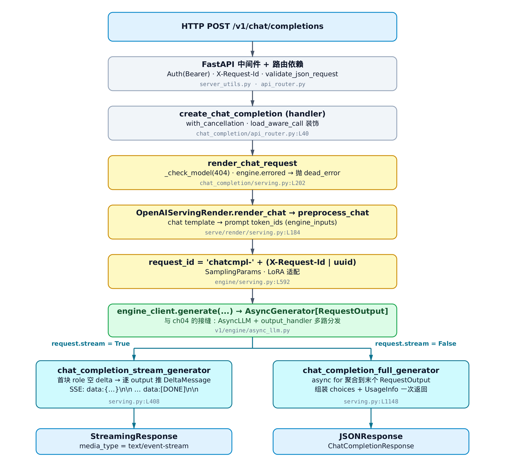
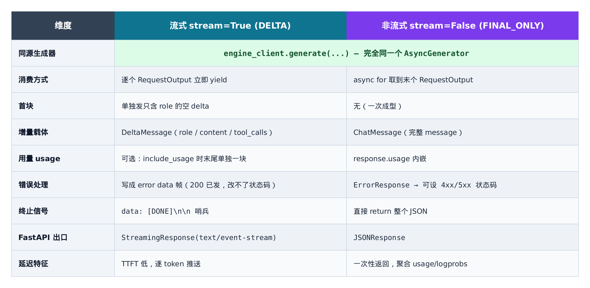
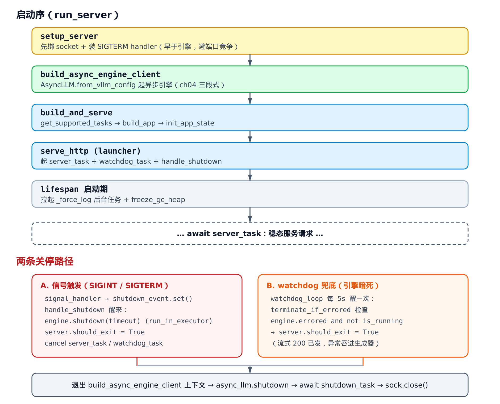

# 第32章　OpenAI 兼容服务器：从 HTTP 请求到 AsyncLLM 的异步桥

## 32.1 你在这里


> 上一章我们用离线的 `LLM` 把一批 prompt 喂进引擎、同步拿回全部结果。
> 这一章把同一台引擎搬到网线另一头：一条 HTTP 请求怎么变成 `AsyncLLM.generate` 的异步流。
> 下一章起进入更底层的执行细节，本章是 entrypoints 子系统的收尾。

第 31 章的离线 `LLM` 很省心：你给它一个列表，它阻塞着算完，一次性还给你。但生产环境不长这样。生产环境是一台常驻服务器，前面挂着负载均衡，后面是一颗滚烫的 GPU，成百上千条请求同时涌进来，每条都想要"打字机"式的逐字回显。

这正是 vLLM 的 OpenAI 兼容服务器要解决的事，代码集中在 `vllm/entrypoints/openai/api_server.py` 与 `vllm/entrypoints/launcher.py` 这两处。它对外说的是 OpenAI 的方言——`POST /v1/chat/completions`、`data: {...}\n\n` 的 SSE 流、`[DONE]` 哨兵；对内接的是第 4 章那台异步三段式引擎 `AsyncLLM`。本章就站在这两者之间，看一条请求如何穿过 FastAPI、被校验、被渲染成 token，再分流成"逐 token 推"或"攒齐了一次还"两种姿态，最后被一个优雅关停的 uvicorn 收尾。

我们先把请求的一生看完整（这是主线），再回头补上"服务器怎么起来、怎么倒下"这层地基。主线代码落在 `vllm/entrypoints/openai/chat_completion/serving.py`，地基在 `vllm/entrypoints/openai/api_server.py`。



> *图注：竖着读就是一条请求的一生。黄色是渲染/校验，绿色是与第 4 章引擎的接缝，蓝色是 HTTP 出入口。到 `engine_client.generate` 处分叉：左边走 SSE 流式，右边走 JSON 非流式。*

---

## 32.2 顶层编排：一个 `async with` 框住引擎的一生

进程的入口在 `vllm/entrypoints/openai/api_server.py`。剥掉日志装饰后，启动逻辑只有两层薄薄的协程：

```python
# vllm/entrypoints/openai/api_server.py:L671-L703
async def run_server(args, **uvicorn_kwargs) -> None:
    """Run a single-worker API server."""

    # Add process-specific prefix to stdout and stderr.
    decorate_logs("APIServer")

    listen_address, sock = setup_server(args)
    await run_server_worker(listen_address, sock, args, **uvicorn_kwargs)


async def run_server_worker(
    listen_address, sock, args, client_config=None, **uvicorn_kwargs
) -> None:
    """Run a single API server worker."""

    # … 省略：tool / reasoning parser 插件的可选导入 …

    async with build_async_engine_client(
        args,
        client_config=client_config,
    ) as engine_client:
        shutdown_task = await build_and_serve(
            engine_client, listen_address, sock, args, **uvicorn_kwargs
        )
    # NB: Await server shutdown only after the backend context is exited
    try:
        await shutdown_task
    finally:
        sock.close()
```

这十几行里藏着两个值得停下来想的设计。

**第一，`setup_server` 在引擎启动之前就把 socket 绑好了。** 注意顺序：`run_server` 先调 `setup_server(args)` 拿到 `sock`，再进 `run_server_worker` 去起引擎。为什么不等引擎起来再绑端口？因为引擎初始化又慢又重——它要拉起子进程、可能还要走 ray 的分布式编排，这期间 ray 自己也会去抢端口。提前把端口攥在手里，就避开了和 ray 的竞态：

```python
# vllm/entrypoints/openai/api_server.py:L533-L575
@instrument(span_name="API server setup")
def setup_server(args):
    """Validate API server args, set up signal handler, create socket
    ready to serve."""
    # … 省略：版本/参数日志、parser 插件导入 …

    validate_api_server_args(args)

    # workaround to make sure that we bind the port before the engine is set up.
    # This avoids race conditions with ray.
    # see https://github.com/vllm-project/vllm/issues/8204
    # … 省略：uds / ipv6 分支 …
    sock_addr = (args.host or "", args.port)
    sock = create_server_socket(sock_addr)

    # workaround to avoid footguns where uvicorn drops requests with too
    # many concurrent requests active
    set_ulimit()

    def signal_handler(*_) -> None:
        # Interrupt server on sigterm while initializing
        raise KeyboardInterrupt("terminated")

    signal.signal(signal.SIGTERM, signal_handler)
    # … 省略：拼 listen_address 字符串 …
    return listen_address, sock
```

那两条 `# workaround` 注释不是随口写的——它们各自指向一次踩过的坑。绑端口的注释挂着 issue 链接；`set_ulimit()` 则是为了防止 uvicorn 在并发请求过多时直接丢请求。源码里这种"伤疤注释"很值钱，它告诉你哪一行不能随手删。

这里还顺手装了个 `SIGTERM` handler：初始化阶段收到 SIGTERM，就抛 `KeyboardInterrupt` 把启动打断。注意这只是**初始化期**的兜底；等服务器真正跑起来，关停信号会被 launcher 里另一套机制接管（见 [§32.7](#327-优雅关停信号watchdog与那个晚-await-的-shutdown_task)）。

**第二，`async with build_async_engine_client(...)` 把引擎的整个生命周期框成了一个上下文。** 这是本章和第 4 章的接缝。进入这个 `with`，`AsyncLLM` 就起来了；离开它（无论正常退出还是抛异常），引擎一定被 shutdown。我们来看框子里装的是什么：

```python
# vllm/entrypoints/openai/api_server.py:L77-L106
@asynccontextmanager
async def build_async_engine_client(
    args: Namespace,
    *,
    usage_context: UsageContext = UsageContext.OPENAI_API_SERVER,
    client_config: dict[str, Any] | None = None,
) -> AsyncIterator[EngineClient]:
    # … 省略：forkserver 预导入分支 …

    # Context manager to handle engine_client lifecycle
    # Ensures everything is shutdown and cleaned up on error/exit
    engine_args = AsyncEngineArgs.from_cli_args(args)
    # … 省略：多 API 进程时拆 client_count / client_index …

    async with build_async_engine_client_from_engine_args(
        engine_args,
        usage_context=usage_context,
        client_config=client_config,
    ) as engine:
        yield engine
```

它只做两件事：把 CLI 参数翻译成 `AsyncEngineArgs`，然后委托给下一层。真正起引擎、也真正负责善后的，是 `build_async_engine_client_from_engine_args`：

```python
# vllm/entrypoints/openai/api_server.py:L108-L155
@asynccontextmanager
async def build_async_engine_client_from_engine_args(
    engine_args: AsyncEngineArgs,
    *,
    usage_context: UsageContext = UsageContext.OPENAI_API_SERVER,
    client_config: dict[str, Any] | None = None,
) -> AsyncIterator[EngineClient]:
    # Create the EngineConfig (determines if we can use V1).
    vllm_config = engine_args.create_engine_config(usage_context=usage_context)

    from vllm.v1.engine.async_llm import AsyncLLM

    async_llm: AsyncLLM | None = None
    # … 省略：拷贝 client_config、取 client_count / client_index …

    try:
        async_llm = AsyncLLM.from_vllm_config(
            vllm_config=vllm_config,
            usage_context=usage_context,
            # … 省略：日志/统计开关、client 地址等透传 …
        )

        # Don't keep the dummy data in memory
        assert async_llm is not None
        await async_llm.reset_mm_cache()

        yield async_llm
    finally:
        if async_llm:
            async_llm.shutdown()
```

`AsyncLLM.from_vllm_config` 就是第 4 章那台异步三段式引擎的诞生点——`AsyncMPClient`、后台 `output_handler`、per-request 队列，全在这一行背后立起来。本章是它的**消费侧**，我们不重讲引擎内部，只认准一件事：拿到的 `engine_client` 是一个 `EngineClient`，它的 `generate(...)` 会还给我们一个异步生成器。

`try/finally` 是这套设计的灵魂。`yield async_llm` 之后控制权交回 `run_server_worker` 里的 `async with`，服务器跑它的；等那个 `with` 块退出，无论是正常关停还是某处炸了，`finally` 里的 `async_llm.shutdown()` 都会被执行。引擎的子进程不会变成孤儿。

最后回头看 `run_server_worker` 末尾那个被注释特意标注的细节：

```python
    # NB: Await server shutdown only after the backend context is exited
    try:
        await shutdown_task
```

`build_and_serve` 返回的 `shutdown_task` 没有在 `async with` 内部 await，而是**等退出引擎上下文之后**才 await。为什么？因为关停的正确次序是"先停后端引擎、再等 HTTP 服务器收尾"。先退出 `with`（触发 `async_llm.shutdown()`），再去等 server 把最后的连接处理完。次序反了，就可能在引擎还活着时把 server 拆了，或者在引擎死后还傻等 server。

---

## 32.3 装配现场：FastAPI app、中间件与那一票 handler

`async with` 拿到 `engine_client` 后，`build_and_serve` 负责把这台引擎"接线"到一个 FastAPI 应用上：

```python
# vllm/entrypoints/openai/api_server.py:L578-L623
async def build_and_serve(
    engine_client: EngineClient,
    listen_address: str,
    sock: socket.socket,
    args: Namespace,
    **uvicorn_kwargs,
) -> asyncio.Task:
    """Build FastAPI app, initialize state, and start serving.

    Returns the shutdown task for the caller to await.
    """
    # … 省略：log_config 组装 …

    supported_tasks = await engine_client.get_supported_tasks()
    model_config = engine_client.model_config

    logger.info("Supported tasks: %s", supported_tasks)
    app = build_app(args, supported_tasks, model_config)
    await init_app_state(engine_client, app.state, args, supported_tasks)

    logger.info("Starting vLLM server on %s", listen_address)

    return await serve_http(
        app,
        sock=sock,
        host=args.host,
        port=args.port,
        # … 省略：uvicorn 日志/超时/SSL/h11 等一票 kwargs …
        **uvicorn_kwargs,
    )
```

四步连读：先问引擎"你支持哪些任务"（`get_supported_tasks`），据此 `build_app` 造 FastAPI 应用、`init_app_state` 把各路 handler 挂上去，最后 `serve_http` 把它交给 uvicorn 跑起来。

`build_app` 是装配中心。它做的事很多——按 `supported_tasks` 条件注册一大票路由、挂 CORS、挂中间件、挂异常处理器。我们只看主干：

```python
# vllm/entrypoints/openai/api_server.py:L157-L184, L264-L280
def build_app(
    args: Namespace,
    supported_tasks: tuple["SupportedTask", ...] | None = None,
    model_config: ModelConfig | None = None,
) -> FastAPI:
    # … 省略：disable_fastapi_docs / offline_docs 分支 …
    app = FastAPI(lifespan=lifespan)
    app.state.args = args

    # … 省略：models / sagemaker / 各任务子路由的条件注册 …
    if "generate" in supported_tasks:
        from vllm.entrypoints.openai.generate.api_router import (
            register_generate_api_routers,
        )
        register_generate_api_routers(app)
        # … 省略：pooling / transcription / realtime 等其它任务的路由 …

    app.root_path = args.root_path
    app.add_middleware(CORSMiddleware, allow_origins=args.allowed_origins, ...)

    app.exception_handler(HTTPException)(http_exception_handler)
    app.exception_handler(RequestValidationError)(validation_exception_handler)
    app.exception_handler(EngineGenerateError)(engine_error_handler)
    app.exception_handler(EngineDeadError)(engine_error_handler)
    app.exception_handler(GenerationError)(generation_error_handler)
    app.exception_handler(Exception)(exception_handler)
    # … 省略：Authentication / XRequestId / Scaling 中间件 …
    return app
```

三处看点。**一是 `FastAPI(lifespan=lifespan)`**——把生命周期钩子交给 `lifespan`，[§32.6](#326-lifespan-与启动序) 细看。**二是路由按 `supported_tasks` 条件注册**：我们关心的 `/v1/chat/completions` 在 `"generate"` 这一支里；`pooling`/`transcription` 那些是平行的其它 API 面，与 chat 请求的控制流互不相干。**三是那一排 `exception_handler`**：从最具体的 `HTTPException`、`EngineDeadError`，到兜底的 `Exception`，每种异常都有归宿，绝不让一个未捕获的异常裸奔到客户端。后面会看到 `EngineDeadError` 和 `GenerationError` 是怎么被一路抛上来、又在这里被翻译成体面错误响应的。

`build_app` 造的是个"空壳应用"——路由注册了，但路由背后的 handler 对象还没造。这件事交给 `init_app_state`：

```python
# vllm/entrypoints/openai/api_server.py:L317-L401
async def init_app_state(
    engine_client: EngineClient,
    state: State,
    args: Namespace,
    supported_tasks: tuple["SupportedTask", ...] | None = None,
) -> None:
    vllm_config = engine_client.vllm_config
    # … 省略：served_model_names / request_logger / base_model_paths 准备 …

    state.engine_client = engine_client
    state.log_stats = not args.disable_log_stats
    state.vllm_config = vllm_config
    state.args = args
    resolved_chat_template = load_chat_template(args.chat_template)

    state.openai_serving_models = OpenAIServingModels(
        engine_client=engine_client,
        base_model_paths=base_model_paths,
        lora_modules=lora_modules,
    )
    await state.openai_serving_models.init_static_loras()

    state.openai_serving_render = OpenAIServingRender(
        model_config=engine_client.model_config,
        renderer=engine_client.renderer,
        model_registry=state.openai_serving_models.registry,
        request_logger=request_logger,
        chat_template=resolved_chat_template,
        chat_template_content_format=args.chat_template_content_format,
        # … 省略：tool / reasoning parser 名称与开关 …
    )

    # … 省略：OpenAIServingTokenization 等其它服务对象 …

    if "generate" in supported_tasks:
        from vllm.entrypoints.openai.generate.api_router import init_generate_state
        await init_generate_state(
            engine_client, state, args, request_logger, supported_tasks
        )
    # … 省略：transcription / realtime / pooling 分支 …
```

这里把一组 `OpenAIServing*` 对象造出来、塞进 `app.state`。路由函数运行时会从 `app.state` 里取出对应的 handler。`init_generate_state` 进一步造出 `OpenAIServingChat`（chat handler 主体）和 completion handler。

注意 `OpenAIServingRender` 拿的是 `engine_client.renderer`——渲染器本身来自引擎，但 `OpenAIServingRender` 把渲染逻辑独立成一个对象。这不是随意的拆分：它让渲染能脱离引擎单独运行（比如一台没有 GPU 的纯渲染服务器），而 `OpenAIServingChat` 只在渲染之上叠加"引擎相关"的校验（LoRA、引擎是否还活着）。渲染逻辑有唯一真相源，引擎相关校验是另一层薄壳。这个分层马上就会在请求路径里现形。

---

## 32.4 请求的一生（上）：从 HTTP 到 token

地基铺完，看一条真请求怎么走。入口是 chat 路由的 handler，在 `vllm/entrypoints/openai/chat_completion/api_router.py`：

```python
# vllm/entrypoints/openai/chat_completion/api_router.py:L40-L74
@router.post(
    "/v1/chat/completions",
    dependencies=[Depends(validate_json_request)],
    responses={
        HTTPStatus.OK.value: {"content": {"text/event-stream": {}}},
        HTTPStatus.BAD_REQUEST.value: {"model": ErrorResponse},
        HTTPStatus.NOT_FOUND.value: {"model": ErrorResponse},
        # … 省略：500 / 501 的 response 声明 …
    },
)
@with_cancellation
@load_aware_call
async def create_chat_completion(request: ChatCompletionRequest, raw_request: Request):
    # … 省略：metrics_header_format 读取 …
    handler = chat(raw_request)
    if handler is None:
        raise NotImplementedError("The model does not support Chat Completions API")

    generator = await handler.create_chat_completion(request, raw_request)

    if isinstance(generator, ErrorResponse):
        return JSONResponse(
            content=generator.model_dump(), status_code=generator.error.code
        )

    elif isinstance(generator, ChatCompletionResponse):
        return JSONResponse(
            content=generator.model_dump(),
            headers=metrics_header(metrics_header_format),
        )

    return StreamingResponse(content=generator, media_type="text/event-stream")
```

这个 handler 短得有点出乎意料，但它定义了**分流的最终落点**。`handler.create_chat_completion(...)` 返回三种东西之一，函数尾部用 `isinstance` 三岔判断：

- 返回 `ErrorResponse` → 包成 `JSONResponse`，状态码取错误自带的 code（4xx/5xx）；
- 返回 `ChatCompletionResponse`（一个完整的 JSON 对象）→ 非流式，包成 `JSONResponse`；
- 否则（返回的是异步生成器）→ 流式，包成 `StreamingResponse(media_type="text/event-stream")`。

记住这个分岔点——它是流式与非流式的物理出口。决定走哪条岔路的，是 `request.stream` 字段，而真正的分流发生在 handler 内部。

handler 上叠了两层装饰器。`@load_aware_call` 是负载追踪，本章不深入。`@with_cancellation` 值得停一下——它解决的是"客户端中途断线了，服务器还在傻算"的浪费：

```python
# vllm/entrypoints/utils.py:L56-L98
def with_cancellation(handler_func):
    """Decorator that allows a route handler to be cancelled by client
    disconnections. … (沿用 starlette.StreamingResponse 的套路：让
    handler 任务与 disconnect-listener 任务赛跑) …"""

    @functools.wraps(handler_func)
    async def wrapper(*args, **kwargs):
        # The request is either the second positional arg or `raw_request`
        request = args[1] if len(args) > 1 else kwargs["raw_request"]

        handler_task = asyncio.create_task(handler_func(*args, **kwargs))
        cancellation_task = asyncio.create_task(listen_for_disconnect(request))

        done, pending = await asyncio.wait(
            [handler_task, cancellation_task], return_when=asyncio.FIRST_COMPLETED
        )
        for task in pending:
            task.cancel()

        if handler_task in done:
            return handler_task.result()
        return None

    return wrapper
```

思路很干净：同时起两个 task，一个跑真正的 handler，一个专门盯着"客户端断没断"。`asyncio.wait(..., FIRST_COMPLETED)` 让它俩赛跑，谁先完成就取消另一个。客户端先断线，`cancellation_task` 先返回，`handler_task` 被 cancel——算了一半的请求当场刹车，不再白烧 GPU。这是异步服务器里很典型的"竞速取消"模式。

现在进 handler 内部。`OpenAIServingChat.create_chat_completion` 是 chat 请求的主方法，骨架如下：

```python
# vllm/entrypoints/openai/chat_completion/serving.py:L229-L373
async def create_chat_completion(
    self,
    request: ChatCompletionRequest,
    raw_request: Request | None = None,
) -> AsyncGenerator[str, None] | ChatCompletionResponse | ErrorResponse:
    tokenizer = self.renderer.tokenizer
    assert tokenizer is not None
    # … 省略：chat_template_kwargs、reasoning_parser 装配 …

    result = await self.render_chat_request(request)
    if isinstance(result, ErrorResponse):
        return result

    conversation, engine_inputs = result

    request_id = (
        f"chatcmpl-{self._base_request_id(raw_request, request.request_id)}"
    )

    # … 省略：request_metadata、LoRA 适配、model_name、data_parallel_rank …

    generators: list[AsyncGenerator[RequestOutput, None]] = []
    for i, engine_input in enumerate(engine_inputs):
        # … 省略：sub_request_id、max_tokens、_log_inputs、trace_headers …
        sampling_params = request.to_sampling_params(
            max_tokens, self.default_sampling_params,
        )
        # … 省略：reasoning_ended 预判 …
        generator = self.engine_client.generate(
            engine_input,
            sampling_params,
            sub_request_id,
            # … 省略：lora_request / trace_headers / priority / 等透传 …
        )
        generators.append(generator)

    assert len(generators) == 1
    (result_generator,) = generators

    if request.stream:
        return self.chat_completion_stream_generator(
            request, result_generator, request_id, model_name,
            conversation, tokenizer, request_metadata, reasoning_parser,
            # … 省略：chat_template_kwargs …
        )

    return await self.chat_completion_full_generator(
        request, result_generator, request_id, model_name,
        conversation, tokenizer, request_metadata, reasoning_parser,
    )
```

把这段读成一条流水线：**渲染 → 取 request_id → 算 SamplingParams → 调引擎拿生成器 → 按 `request.stream` 分流**。每一步都值得拆开看。

**渲染：`render_chat_request`。** 它是 [§32.3](#323-装配现场fastapi-app中间件与那一票-handler) 提到的"两层分层"的现形处：

```python
# vllm/entrypoints/openai/chat_completion/serving.py:L202-L227
async def render_chat_request(
    self,
    request: ChatCompletionRequest,
) -> tuple[list[ConversationMessage], list[EngineInput]] | ErrorResponse:
    error_check_ret = await self._check_model(request)
    if error_check_ret is not None:
        logger.error("Error with model %s", error_check_ret)
        return error_check_ret

    # If the engine is dead, raise the engine's DEAD_ERROR.
    # This is required for the streaming case, where we return a
    # success status before we actually start generating text :).
    if self.engine_client.errored:
        raise self.engine_client.dead_error

    return await self.openai_serving_render.render_chat(request)
```

它先做两件"引擎相关"的事，再把渲染本身委托出去。第一件是 `_check_model`——校验请求里的模型名存不存在；第二件是那条带笑脸注释的引擎存活检查，下一节专门讲。最后 `self.openai_serving_render.render_chat(request)` 才是真正把 chat messages 渲染成 prompt 的地方，它在 `vllm/entrypoints/serve/render/serving.py`：

```python
# vllm/entrypoints/serve/render/serving.py:L551-L570
tok_params = request.build_tok_params(self.model_config)
chat_params = request.build_chat_params(
    default_template, default_template_content_format
).with_defaults(
    default_template_kwargs,
    # … 省略：media_io / mm_processor 默认值合并 …
)

(conversation,), (engine_input,) = await renderer.render_chat_async(
    [messages],
    chat_params,
    tok_params,
    # … 省略：prompt_extras（mm_processor_kwargs / cache_salt）、skip_mm_cache …
)
```

`renderer.render_chat_async` 把 `messages`（OpenAI 那种 `[{"role": ..., "content": ...}, ...]`）套上模型的 chat template，再 tokenize 成 `engine_input`——也就是引擎认得的 prompt token_ids。一句话：**HTTP 世界的 JSON 消息，到这里被翻译成了引擎世界的 token**。渲染回来一个二元组 `(conversation, engine_inputs)`，`conversation` 留着给响应里回显角色用，`engine_inputs` 是真正喂引擎的料。

**取 request_id。** 这一步看着不起眼，却是分布式追踪的命脉：

```python
# vllm/entrypoints/openai/engine/serving.py:L592-L602
@staticmethod
def _base_request_id(
    raw_request: Request | None, default: str | None = None
) -> str | None:
    """Pulls the request id to use from a header, if provided"""
    if raw_request is not None and (
        (req_id := raw_request.headers.get("X-Request-Id")) is not None
    ):
        return req_id

    return random_uuid() if default is None else default
```

优先用客户端/网关传来的 `X-Request-Id` 头，没有才退回 `random_uuid()`。这样一来，从网关到 vLLM 到日志，同一条请求可以用同一个 id 串起来追踪。chat 路径会给它套个 `chatcmpl-` 前缀（对齐 OpenAI 的 id 格式）。

**算 SamplingParams、调引擎。** `request.to_sampling_params(...)` 把 OpenAI 风格的 `temperature`/`top_p`/`max_tokens` 翻成引擎的 `SamplingParams`，然后：

```python
        generator = self.engine_client.generate(
            engine_input, sampling_params, sub_request_id, ...
        )
```

**这就是第 4 章的接缝。** `engine_client.generate(...)` 不阻塞、不立刻返回结果——它返回一个 `AsyncGenerator[RequestOutput]`。每当引擎那边算出新 token、`output_handler` 通过 per-request 队列把 `RequestOutput` 推过来，这个生成器就 yield 一次。`EngineClient` 协议把这个契约写得很明白：

```python
# vllm/engine/protocol.py:L44-L84
    model_config: ModelConfig
    renderer: BaseRenderer
    input_processor: InputProcessor

    @property
    @abstractmethod
    def errored(self) -> bool: ...

    @property
    @abstractmethod
    def dead_error(self) -> BaseException: ...

    @abstractmethod
    def generate(
        self,
        prompt: ...,
        sampling_params: SamplingParams,
        request_id: str,
        # … 省略：lora_request / trace_headers / priority / 等关键字参数 …
    ) -> AsyncGenerator[RequestOutput, None]:
        """Generate outputs for a request."""
        ...
```

handler 只认这个协议——它不知道、也不需要知道背后是 `AsyncLLM`、是几个子进程、output_handler 怎么多路分发。它要的就是一个会持续吐 `RequestOutput` 的异步生成器。`errored` / `dead_error` 这两个属性也在协议里，下一节就要用到。

主线里那句 `assert len(generators) == 1` 值得解释。当 `n > 1`（要多个候选回答）或一次塞多段 prompt 时，代码会派生出多个 `sub_request_id = f"{request_id}_{i}"` 并起多个生成器；但最常见的单回答单 prompt 场景就是一个。本章盯着这条主线走。

最后，`if request.stream:` 决定返回哪个生成器：流式返回 `chat_completion_stream_generator`，非流式 `await chat_completion_full_generator`。两个分支吃的是**同一个 `result_generator`**——这是下一节的关键。

---

## 32.5 请求的一生（下）：同一个生成器，两种姿态

这里是本章的概念核心，所以慢一点。

流式和非流式，听起来像两套不同的机制，其实它们消费的是**同一个 `engine_client.generate` 异步生成器**。差别只在于：拿到每个 `RequestOutput` 之后，是立刻往外推，还是攒到最后再一次性还。



> *图注：左右两列共享最顶上那个生成器。流式逐个 yield 成 SSE 帧，非流式 async for 攒到末个 RequestOutput 再聚合。下面每一行都是这个根本差异的具体后果。*

### 32.5.1 流式：逐 token 推成 SSE

先看流式。`chat_completion_stream_generator` 是个 async 生成器，它 `async for` 地消费 `result_generator`，每来一个 `RequestOutput` 就吐若干 SSE 帧。开头第一拍很特别：

```python
# vllm/entrypoints/openai/chat_completion/serving.py:L517-L569, L606-L671
try:
    async for res in result_generator:
        if res.prompt_token_ids is not None:
            num_prompt_tokens = len(res.prompt_token_ids)
            # … 省略：encoder prompt token 计数 …

        # We need to do it here, because if there are exceptions in
        # the result_generator, it needs to be sent as the FIRST
        # response (by the try...catch).
        if first_iteration:
            num_cached_tokens = res.num_cached_tokens
            role = self.get_chat_request_role(request)
            for i in range(num_choices):
                choice_data = ChatCompletionResponseStreamChoice(
                    index=i,
                    delta=DeltaMessage(role=role, content=""),
                    logprobs=None,
                    finish_reason=None,
                )
                chunk = ChatCompletionStreamResponse(
                    id=request_id,
                    object=chunk_object_type,
                    created=created_time,
                    choices=[choice_data],
                    model=model_name,
                    # … 省略：prompt_token_ids 回显 …
                )
                data = chunk.model_dump_json(exclude_unset=True)
                yield f"data: {data}\n\n"
            # … 省略：echo 分支 …
            first_iteration = False

        for output in res.outputs:
            i = output.index
            # … 省略：tool / reasoning parser、logprobs、harmony 分支 …
            delta_text = output.text

            if (
                not delta_text
                and not output.token_ids
                and not previous_num_tokens[i]
            ):
                # Chunked prefill case, don't return empty chunks
                continue
            # … 省略：用 tool / reasoning parser 组装 delta_message …
```

**第一块单独发一个只含 `role` 的空 delta**：`DeltaMessage(role=role, content="")`。这是对齐 OpenAI 协议——流的开头先声明"接下来说话的是 assistant"，后续每一块只追加内容增量。客户端据此知道角色，再把后面的 `content` 增量一段段拼起来。

那段 `# We need to do it here` 注释点破了一个时序陷阱：`first_iteration` 的处理必须放在 `async for` **内部**。因为如果 `result_generator` 一上来就抛异常，这个异常得作为**第一个**响应（被外层 `try...except` 接住）发给客户端。要是首块在循环外提前发了，异常就没法当首响应了。

接着每个 `output` 取 `delta_text = output.text` 作为本次增量。这里有个工程细节：chunked prefill 阶段可能产生空块（没有新 token），代码用那个 `if not delta_text and ...: continue` 把空块跳过——不给客户端推没意义的空帧。

收尾部分管两件事：可选的用量统计，和那个雷打不动的终止哨兵：

```python
# vllm/entrypoints/openai/chat_completion/serving.py:L1054-L1083, L1085-L1146
                # … 省略：组装 choice_data、盖 system_fingerprint …
                data = chunk.model_dump_json(exclude_unset=True)
                yield f"data: {data}\n\n"

    # once the final token is handled, if stream_options.include_usage
    # is sent, send the usage
    if include_usage:
        completion_tokens = sum(previous_num_tokens)
        final_usage = UsageInfo(
            prompt_tokens=num_prompt_tokens,
            completion_tokens=completion_tokens,
            total_tokens=num_prompt_tokens + completion_tokens,
        )
        # … 省略：prompt_tokens_details …
        final_usage_chunk = ChatCompletionStreamResponse(
            id=request_id, object=chunk_object_type, created=created_time,
            choices=[], model=model_name, usage=final_usage,
            system_fingerprint=self.system_fingerprint,
        )
        final_usage_data = final_usage_chunk.model_dump_json(
            exclude_unset=True, exclude_none=True
        )
        yield f"data: {final_usage_data}\n\n"

    # … 省略：request_metadata 聚合用量、enable_log_outputs …

except GenerationError as e:
    yield f"data: {self._convert_generation_error_to_streaming_response(e)}\n\n"
except Exception as e:
    logger.exception("Error in chat completion stream generator.")
    data = self.create_streaming_error_response(e)
    yield f"data: {data}\n\n"
# Send the final done message after all response.n are finished
yield "data: [DONE]\n\n"
```

用量是**可选的、并且单独一块**：只有客户端在 `stream_options` 里要了 `include_usage`，才在所有内容块之后补一个 `choices=[]` 只带 `usage` 的块。最后无论如何都 `yield "data: [DONE]\n\n"`——SSE 流的终止哨兵，告诉客户端"说完了"。

这里有个一眼容易滑过、却是整章关停设计的命门的细节：看那两个 `except`。**流里出了异常，不是抛出去，而是 `yield` 成一个 error data 帧。** 为什么不抛？因为流式响应一旦开始，HTTP 200 状态码**早就发出去了**——回想 [§32.4](#324-请求的一生上从-http-到-token) 那个 `StreamingResponse`，它在第一个字节落地时状态行就定了。状态码改不了，错误就只能作为流里的下一帧推给客户端。

这个"200 已发、改不了状态码"的约束会留下一个尾巴：如果引擎在流式生成途中**彻底死了**，异常被吞进了 error 帧，服务器进程本身怎么知道该退出？这个问题留到 [§32.7](#327-优雅关停信号watchdog与那个晚-await-的-shutdown_task)，那里有个 watchdog 专门兜底。

把上面这些规则落到一个具体的两 token 回答 `"Hi there"`（`include_usage=False`，单 choice）上，整个流逐帧长这样：

| 帧 | 触发分支 | `delta` | `finish_reason` | yield 出去的内容 |
|---|---|---|---|---|
| 1 | `first_iteration` 首块 | `{role:"assistant", content:""}` | `null` | `data: {…delta 只有 role…}\n\n` |
| 2 | `output.text="Hi"` | `{content:"Hi"}` | `null` | `data: {…content 增量…}\n\n` |
| 3 | `output.text=" there"` | `{content:" there"}` | `null` | `data: {…content 增量…}\n\n` |
| 4 | 末块带 finish | `{}` | `"stop"` | `data: {…只剩 finish_reason…}\n\n` |
| 5 | 终止哨兵 | — | — | `data: [DONE]\n\n` |

读这张表只盯一件事：`role` 只在第 1 帧出现一次，之后每帧只追加 `content` 增量，`finish_reason` 直到末块才从 `null` 翻成 `"stop"`。客户端把第 2、3 帧的 `content` 顺序拼接，就还原出完整答案——这就是"打字机"效果的物理来源。

### 32.5.2 非流式：攒到末个再聚合

非流式简单得多，因为它不在乎中间过程，只要最终结果：

```python
# vllm/entrypoints/openai/chat_completion/serving.py:L1148-L1201, L1457-L1521
async def chat_completion_full_generator(
    self,
    request: ChatCompletionRequest,
    result_generator: AsyncIterator[RequestOutput],
    request_id: str,
    model_name: str,
    conversation: list[ConversationMessage],
    tokenizer: TokenizerLike,
    request_metadata: RequestResponseMetadata,
    reasoning_parser: ReasoningParser | None = None,
) -> ErrorResponse | ChatCompletionResponse:
    created_time = int(time.time())
    final_res: RequestOutput | None = None

    try:
        async for res in result_generator:
            final_res = res
    except asyncio.CancelledError:
        return self.create_error_response("Client disconnected")

    if final_res is None:
        return self.create_error_response(
            "No output received from the engine.",
            err_type="InternalServerError",
            status_code=HTTPStatus.INTERNAL_SERVER_ERROR,
        )

    choices: list[ChatCompletionResponseChoice] = []
    role = self.get_chat_request_role(request)
    for output in final_res.outputs:
        self._raise_if_error(output.finish_reason, request_id)
        # … 省略：logprobs + reasoning/tool 解析组装 message 的长 if 链 …
        choice_data = ChatCompletionResponseChoice(
            index=output.index,
            message=message,
            logprobs=logprobs,
            finish_reason="tool_calls" if is_finish_reason_tool_calls
            else output.finish_reason if output.finish_reason else "stop",
            stop_reason=output.stop_reason,
            # … 省略：token_ids 回显 …
        )
        choices.append(choice_data)

    num_prompt_tokens = len(final_res.prompt_token_ids)
    num_generated_tokens = sum(len(o.token_ids) for o in final_res.outputs)
    usage = UsageInfo(
        prompt_tokens=num_prompt_tokens,
        completion_tokens=num_generated_tokens,
        total_tokens=num_prompt_tokens + num_generated_tokens,
    )
    request_metadata.final_usage_info = usage

    response = ChatCompletionResponse(
        id=request_id, created=created_time, model=model_name,
        choices=choices, usage=usage,
        # … 省略：system_fingerprint / prompt_logprobs / kv_transfer_params …
    )
    return response
```

看那个聚合循环：

```python
    async for res in result_generator:
        final_res = res
```

它把每个 `RequestOutput` 赋给 `final_res`，循环结束后 `final_res` 就是**最后一个**。为什么只留最后一个就够？答案不在这个循环里，而在 [§32.4](#324-请求的一生上从-http-到-token) 那一步算 `SamplingParams` 时——`request.to_sampling_params` 会按 `request.stream` 给引擎设一个开关：

```python
# vllm/entrypoints/openai/chat_completion/protocol.py:L586-L588
output_kind=RequestOutputKind.DELTA
if self.stream
else RequestOutputKind.FINAL_ONLY,
```

这一行才是流式/非流式真正分家的地方。流式设 `DELTA`，引擎每拍只回一个**只含本拍增量**的 `RequestOutput`——所以 [§32.5.1](#3251-流式逐-token-推成-sse) 里 `delta_text = output.text` 直接当增量推是对的。非流式设 `FINAL_ONLY`，引擎干脆**只在终止那一拍回唯一一个 `RequestOutput`**，且它携带全文。

把"只留最后一个就够"说成一句归纳：在 `FINAL_ONLY` 下，`async for` 循环体只会执行**恰好一次**（生成器只 yield 一个元素），所以"循环结束后 `final_res` 等于最后一个"与"`final_res` 等于那唯一一个全文 `RequestOutput`"是同一件事——不存在被丢弃的中间帧。换句话说，所谓"同一个生成器"，准确说是同一个 `generate` API 被 `output_kind` 配置成了两种产出语义，而不是非流式自己手动丢掉中间结果。这正是图里标的 `FINAL_ONLY`。

非流式因为还没发任何字节，错误处理就比流式体面得多：

- `async for` 中途被 `asyncio.CancelledError` 打断（客户端断线，配合 `with_cancellation`）→ 返回 `"Client disconnected"` 错误；
- 一个 `RequestOutput` 都没收到 → 返回 `500`；
- 每个 output 的 `finish_reason` 若是 `"error"`，`_raise_if_error` 抛 `GenerationError`。

这些错误回到 [§32.4](#324-请求的一生上从-http-到-token) 的路由 handler 后，能被包成带正确状态码的 `JSONResponse`——因为状态行还没发出去，想设几就设几。这是非流式相对流式的奢侈。

聚合完毕，把 `choices` 和 `UsageInfo` 装进一个 `ChatCompletionResponse` 整个返回。路由那边 `isinstance(generator, ChatCompletionResponse)` 命中，包成 `JSONResponse`。一锤子买卖，干净利落。

### 32.5.3 错误处理的真相源：基类 `OpenAIServing`

上面两个分支用到的 `create_error_response`、`create_streaming_error_response`、`_raise_if_error`，都不在 chat handler 里，而在它的基类 `OpenAIServing`（`vllm/entrypoints/openai/engine/serving.py`）。这个基类是所有 OpenAI handler 的共同地基——request_id 解析、模型校验、错误工厂，都在这儿统一：

```python
# vllm/entrypoints/openai/engine/serving.py:L372-L405
@staticmethod
def create_error_response(
    message: str | Exception,
    err_type: str = "BadRequestError",
    status_code: HTTPStatus = HTTPStatus.BAD_REQUEST,
    param: str | None = None,
) -> ErrorResponse:
    return create_error_response(message, err_type, status_code, param)

def create_streaming_error_response(
    self,
    message: str | Exception,
    err_type: str = "BadRequestError",
    status_code: HTTPStatus = HTTPStatus.BAD_REQUEST,
    param: str | None = None,
) -> str:
    json_str = json.dumps(
        self.create_error_response(
            message=message, err_type=err_type,
            status_code=status_code, param=param,
        ).model_dump()
    )
    return json_str

def _raise_if_error(self, finish_reason: str | None, request_id: str) -> None:
    """Raise GenerationError if finish_reason indicates an error."""
    if finish_reason == "error":
        logger.error(
            "Request %s failed with an internal error during generation",
            request_id,
        )
        raise GenerationError("Internal server error")
```

两个错误工厂的形态差异，正好对应流式/非流式的约束：`create_error_response` 还回结构化的 `ErrorResponse` 对象（路由能据此设状态码），是非流式用的；`create_streaming_error_response` 直接 `json.dumps` 成字符串（塞进 `data:` 帧），是流式用的——因为流式没有状态码可设，只能把错误当数据推。同一份错误信息，两种封装，根源还是那条"200 是否已发"的红线。

模型校验也在基类：

```python
# vllm/entrypoints/openai/engine/serving.py:L417-L445
async def _check_model(
    self,
    request: AnyRequest,
) -> ErrorResponse | None:
    error_response = None

    if self._is_model_supported(request.model):
        return None
    if request.model in self.models.lora_requests:
        return None
    # … 省略：运行时 LoRA 加载分支 …

    return error_response or self.create_error_response(
        message=f"The model `{request.model}` does not exist.",
        err_type="NotFoundError",
        status_code=HTTPStatus.NOT_FOUND,
        param="model",
    )
```

请求里点名的模型若既不是本服务加载的模型、也不是已注册的 LoRA，就回一个 `404 NotFoundError`。这就是 [§32.4](#324-请求的一生上从-http-到-token) 里 `render_chat_request` 开头那次校验的落点。

---

## 32.6 lifespan 与启动序

请求的一生讲完了。回头补地基：FastAPI app 是怎么"活过来"、又怎么收尾的。



> *图注：上半是启动链，绑 socket → 起引擎 → 装配 app → serve_http。下半是两条关停路径，最后都汇到同一处善后。*

`build_app` 里那句 `FastAPI(lifespan=lifespan)`，把启动/关停钩子交给了 `lifespan`（`vllm/entrypoints/openai/server_utils.py`）。它是个异步上下文管理器，`yield` 之前是启动期、之后是关停期：

```python
# vllm/entrypoints/openai/server_utils.py:L446-L472
@asynccontextmanager
async def lifespan(app: FastAPI):
    try:
        if app.state.log_stats:
            engine_client: EngineClient = app.state.engine_client

            async def _force_log():
                while True:
                    await asyncio.sleep(envs.VLLM_LOG_STATS_INTERVAL)
                    await engine_client.do_log_stats()

            task = asyncio.create_task(_force_log())
            _running_tasks.add(task)
            task.add_done_callback(_running_tasks.remove)
        else:
            task = None

        # Mark the startup heap as static so that it's ignored by GC.
        # Reduces pause times of oldest generation collections.
        freeze_gc_heap()
        try:
            yield
        finally:
            if task is not None:
                task.cancel()
    finally:
        # Ensure app state including engine ref is gc'd
        ...
```

启动期做两件事。**一是拉起一个 `_force_log` 后台任务**：每隔 `VLLM_LOG_STATS_INTERVAL` 秒调一次 `engine_client.do_log_stats()`，定期打印吞吐/排队等指标。注意 `task.add_done_callback(_running_tasks.remove)` 这个细节——把 task 存进集合并在完成时自动移除，是防止 task 被 GC 提前回收的标准写法（asyncio 只持弱引用）。

**二是 `freeze_gc_heap()`**。那句注释说得明白：把启动期堆上那一大坨常驻对象标记成"静态"，让垃圾回收器以后别再扫它们。模型权重、引擎对象这些东西活得和进程一样长，每次 GC 都去扫一遍纯属浪费，还会拉长最老一代回收的停顿。启动时冻一次，后续 GC 停顿更短。这是个不起眼但很实在的延迟优化。

关停期就一件事：`task.cancel()` 把那个 `_force_log` 后台循环停掉。再加最外层 `finally` 确保 app.state（含引擎引用）被 GC 掉。

至此启动链完整了：`setup_server` 绑 socket → `build_async_engine_client` 起 `AsyncLLM` → `build_and_serve` 造 app、`init_app_state` 挂 handler → `serve_http` 起 uvicorn，期间 `lifespan` 拉起后台日志任务并冻结堆。下一节看最后一环——`serve_http` 和它的优雅关停。

---

## 32.7 优雅关停：信号、watchdog，与那个晚 await 的 `shutdown_task`

`serve_http`（`vllm/entrypoints/launcher.py`）是启动的最后一环，也是关停的中枢。它把 app 交给 uvicorn，同时布下两套关停机制：

```python
# vllm/entrypoints/launcher.py:L71-L142
    config = uvicorn.Config(app, **uvicorn_kwargs)
    # … 省略：h11 header 限制设置 …
    config.load()
    server = uvicorn.Server(config)
    app.state.server = server

    loop = asyncio.get_running_loop()

    watchdog_task = loop.create_task(watchdog_loop(server, app.state.engine_client))
    server_task = loop.create_task(server.serve(sockets=[sock] if sock else None))
    # … 省略：SSL cert refresher 分支 …

    shutdown_event = asyncio.Event()

    def signal_handler() -> None:
        shutdown_event.set()

    async def dummy_shutdown() -> None:
        pass

    loop.add_signal_handler(signal.SIGINT, signal_handler)
    loop.add_signal_handler(signal.SIGTERM, signal_handler)

    async def handle_shutdown() -> None:
        await shutdown_event.wait()

        engine_client = app.state.engine_client
        timeout = engine_client.vllm_config.shutdown_timeout

        await loop.run_in_executor(
            None, partial(engine_client.shutdown, timeout=timeout)
        )

        server.should_exit = True
        server_task.cancel()
        watchdog_task.cancel()
        # … 省略：ssl_cert_refresher.stop() …

    shutdown_task = loop.create_task(handle_shutdown())

    try:
        await server_task
        return dummy_shutdown()
    except asyncio.CancelledError:
        # … 省略：诊断占用端口的进程日志 …
        logger.info("Shutting down FastAPI HTTP server.")
        return server.shutdown()
    finally:
        shutdown_task.cancel()
        watchdog_task.cancel()
```

它一口气起了三个 task：`server_task`（uvicorn 主体）、`watchdog_task`（引擎健康哨兵）、`shutdown_task`（关停协调者）。

**关停路径 A：信号触发。** `SIGINT`/`SIGTERM` 被注册到 `signal_handler`，它只做一件事——`shutdown_event.set()`。守在 `await shutdown_event.wait()` 上的 `handle_shutdown` 随即醒来，按次序善后：先关引擎，再让 server 退。

关引擎那行有讲究：

```python
        await loop.run_in_executor(
            None, partial(engine_client.shutdown, timeout=timeout)
        )
```

`engine_client.shutdown` 是个**同步阻塞**调用（要等子进程收摊）。直接在事件循环里 await 它会把整个循环卡死，所有别的协程都得跟着停摆。所以丢进 `run_in_executor`——扔到线程池里阻塞，事件循环继续转。引擎关停后才设 `server.should_exit = True`、cancel 掉另外两个 task。这是异步代码里处理阻塞调用的标准手法。

**关停路径 B：watchdog 兜底。** 还记得 [§32.5.1](#3251-流式逐-token-推成-sse) 留下的尾巴吗——流式生成器把引擎死亡的异常吞成了 error 帧，进程本身不知道该退。`watchdog_loop` 就是来填这个坑的：

```python
# vllm/entrypoints/launcher.py:L144-L167
async def watchdog_loop(server: uvicorn.Server, engine: EngineClient):
    """
    # Watchdog task that runs in the background, checking
    # for error state in the engine. Needed to trigger shutdown
    # if an exception arises is StreamingResponse() generator.
    """
    VLLM_WATCHDOG_TIME_S = 5.0
    while True:
        await asyncio.sleep(VLLM_WATCHDOG_TIME_S)
        terminate_if_errored(server, engine)


def terminate_if_errored(server: uvicorn.Server, engine: EngineClient):
    """
    See discussions here on shutting down a uvicorn server
    https://github.com/encode/uvicorn/discussions/1103
    In this case we cannot await the server shutdown here
    because handler must first return to close the connection
    for this request.
    """
    engine_errored = engine.errored and not engine.is_running
    if not envs.VLLM_KEEP_ALIVE_ON_ENGINE_DEATH and engine_errored:
        server.should_exit = True
```

它每 5 秒醒一次，查一下 `engine.errored and not engine.is_running`。一旦引擎确实暗死了，就设 `server.should_exit = True`，让 uvicorn 自己优雅收摊（除非你显式设了 `VLLM_KEEP_ALIVE_ON_ENGINE_DEATH` 想让服务苟着）。注释把道理讲透了：在这里不能 `await` server 的关停，因为当前 handler 必须先返回、关掉这条连接，server 才退得了——所以 watchdog 只是**置位**，把真正的退出交给 uvicorn 的主循环。

这两条路径，连同 [§32.2](#322-顶层编排一个-async-with-框住引擎的一生) 那个被特意晚 await 的 `shutdown_task`，拼成了完整的优雅关停。回看 `serve_http` 返回的 `shutdown_task`，一路传回 `run_server_worker`，在退出 `build_async_engine_client` 上下文（触发 `async_llm.shutdown()`）**之后**才被 await。次序是定死的：

1. 信号或 watchdog 触发 → `handle_shutdown` 关引擎、置 `server.should_exit`；
2. `run_server_worker` 的 `async with` 退出 → `async_llm.shutdown()` 兜底再清一次；
3. 退出之后才 `await shutdown_task`，等 server 彻底收尾；
4. `finally: sock.close()` 释放端口。

从绑端口到关端口，引擎和 HTTP 服务器的生命周期被这套上下文 + 信号 + watchdog 死死框住，任何一条退出路径都不会留下孤儿子进程或泄漏的端口。

---

## 32.8 中间件这道门：鉴权与 X-Request-Id

最后补一块请求进门前的关卡。[§32.3](#323-装配现场fastapi-app中间件与那一票-handler) 里 `build_app` 挂了几个中间件，vLLM 没用 FastAPI 的依赖注入，而是写成更底层的**纯 ASGI 中间件**。鉴权这个最典型：

```python
# vllm/entrypoints/openai/server_utils.py:L38-L86
class AuthenticationMiddleware:
    """
    Pure ASGI middleware that authenticates each request by checking
    if the Authorization Bearer token exists and equals anyof "{api_key}".
    """

    def __init__(self, app: ASGIApp, tokens: list[str]) -> None:
        self.app = app
        self.api_tokens = [hashlib.sha256(t.encode("utf-8")).digest() for t in tokens]

    def verify_token(self, headers: Headers) -> bool:
        authorization_header_value = headers.get("Authorization")
        if not authorization_header_value:
            return False
        scheme, _, param = authorization_header_value.partition(" ")
        if scheme.lower() != "bearer":
            return False
        param_hash = hashlib.sha256(param.encode("utf-8")).digest()
        token_match = False
        for token_hash in self.api_tokens:
            token_match |= secrets.compare_digest(param_hash, token_hash)
        return token_match

    def __call__(self, scope: Scope, receive: Receive, send: Send) -> Awaitable[None]:
        if (
            scope["type"] not in ("http", "websocket")
            or scope.get("method") == "OPTIONS"
        ):
            return self.app(scope, receive, send)
        root_path = scope.get("root_path", "")
        url_path = URL(scope=scope).path.removeprefix(root_path)
        headers = Headers(scope=scope)
        if url_path.startswith("/v1") and not self.verify_token(headers):
            response = JSONResponse(content={"error": "Unauthorized"}, status_code=401)
            return response(scope, receive, send)
        return self.app(scope, receive, send)
```

为什么用纯 ASGI 而不是 FastAPI 依赖？因为它在更低的一层拦截——还没进路由系统就能放行或拒绝。两个细节体现了它的克制：

**只管 `/v1` 路径，且跳过 `OPTIONS`。** 健康检查、文档页这些非 `/v1` 路由不需要 token；`OPTIONS` 是 CORS 预检请求，按规范不能要鉴权，否则浏览器跨域全挂。所以 `scope.get("method") == "OPTIONS"` 和 `url_path.startswith("/v1")` 这两道判断把鉴权精确收窄到该管的范围。

**token 比对走 `sha256` + `secrets.compare_digest`。** 不直接比字符串，而是先各自 `sha256` 成定长摘要，再用 `compare_digest` 做**恒定时间**比较。这是防时序侧信道攻击——普通的字符串相等会在第一个不同字符处提前返回，攻击者能靠响应时间一点点猜出 token；恒定时间比较把这条路堵死。一个生产级服务器该有的安全意识，都浓缩在这两行里。

同文件里的 `XRequestIdMiddleware` 是它的姊妹——把 [§32.4](#324-请求的一生上从-http-到-token) 里解析出的 request_id 回写进响应头，让客户端也能拿到这条贯穿全链路的追踪 id。

---

## 32.9 小结：一条请求，两套生命周期

把这一章拢成一张图景。

**请求的生命周期**是横向的，从左到右：HTTP `POST` → 中间件鉴权 → handler → 渲染成 token → 取 request_id → 算 SamplingParams → `engine_client.generate` 拿到异步生成器 → 按 `request.stream` 分流。流式逐个 `RequestOutput` 推成 SSE 帧（首块发 role、末尾可选 usage、`[DONE]` 收尾），非流式 `async for` 攒到末个再聚合成一个 JSON。两条岔路吃的是**同一个生成器**，差别只在消费姿态。

**服务器的生命周期**是纵向的，从启动到关停：先绑 socket（避端口竞争）→ `build_async_engine_client` 起 `AsyncLLM`（第 4 章）→ 装配 FastAPI app、挂 handler → `serve_http` 起 uvicorn + watchdog → `lifespan` 拉后台日志、冻结 GC 堆。关停有两条路：信号触发的 `handle_shutdown`、watchdog 兜底的暗死检测，最后都汇到"先关引擎、再退 server、再关 socket"的固定次序。

这两套生命周期的接缝，始终是 `vllm/entrypoints/openai/chat_completion/serving.py` 里那一行 `engine_client.generate(...)`——它把 HTTP 世界的请求，接到了第 4 章那台异步引擎的输出流上。OpenAI 兼容这层皮之下，跳动的还是同一颗 `AsyncLLM` 的心脏。
