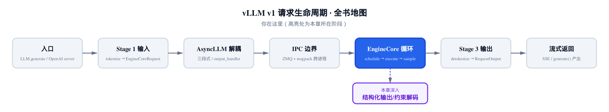
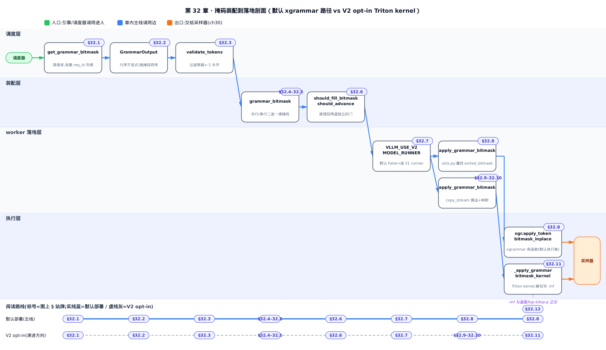
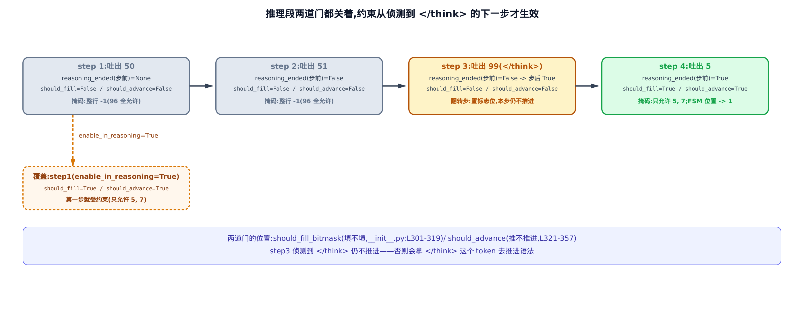
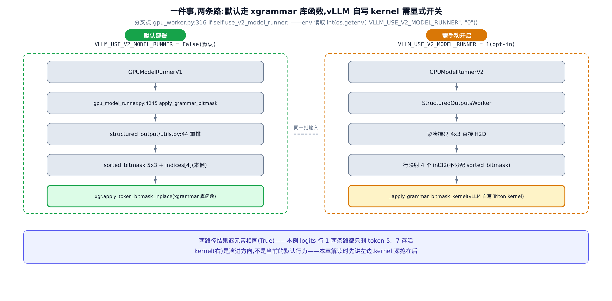
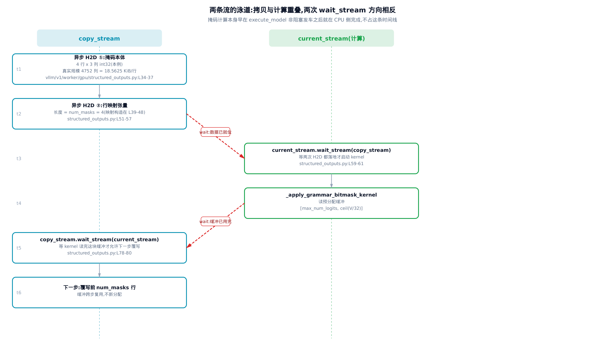
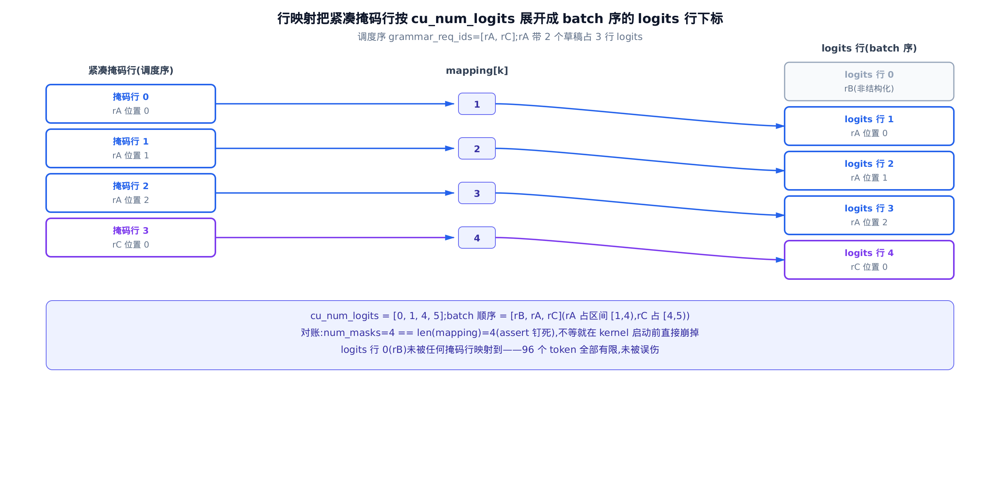
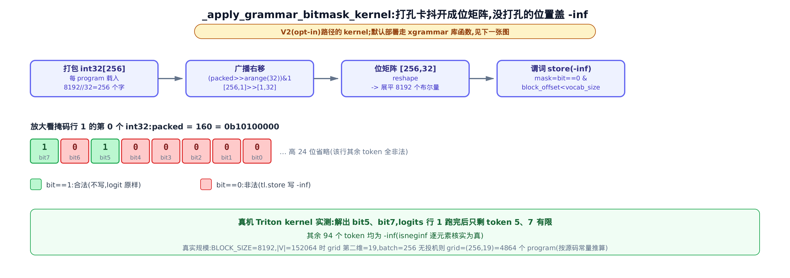

# 第 32 章　约束解码 II：bitmask 如何落到 logits

> 本章解读掩码从调度器到 GPU 的下半程：`vllm/v1/structured_output/__init__.py` 里的批量装配、`vllm/v1/core/sched/scheduler.py` 里的门控与投机耦合，以及 worker 侧那两条并存的落地路径。

## 你在这里



> *图注：全书地图高亮当前位置。*
> *[第 31 章](../../ch31-structured-output/narrative/chapter.md)把一份 JSON schema 编译成了语法对象，并交出了六方法契约（`fill_bitmask` / `accept_tokens` / `rollback` / `validate_tokens` / `is_terminated` / `find_token_divergence`）。*
> *本章接着讲：这些语法对象每一步怎么被批量榨出一张位掩码表，这张表又怎么走完跨进程、跨设备的路，最后把非法 token 的分数打成负无穷。*
> *[第 34 章](../../ch34-spec-decode/narrative/chapter.md)会从投机解码那一侧重看本章埋下的草稿耦合。*

上一章的结尾停在 `vllm/v1/core/sched/scheduler.py:L1224` 的 `get_grammar_bitmask`：调度器筛出本步该受约束的请求，让语法后端各交一行位掩码（bitmask，每个 token 占一个二进制位、1 表示允许的紧凑表），打包成 `GrammarOutput` 交出去。剩下的路全在本章。

这条路比它看上去长。掩码要在调度进程里被填出来，跨进程序列化到 worker 进程，跨设备搬上 GPU，再和一张形状完全不同的 logits（模型前向吐出的原始分数表，每个 token 一列，见[第 30 章](../../ch30-sampling/narrative/chapter.md)）对上号。中间任何一步对错了行，结果都不是崩溃，而是**某个请求悄悄套上了另一个请求的语法** ——生成出来的 JSON 是坏的，日志里一个字都没有。所以本章真正的主题不是「怎么算掩码」，而是**一连串行数对账的不变式** 。

还有一件必须先说清的事，否则后面会误导你。

**vLLM 在 worker 侧有两条并存的落地路径，默认走的不是本章最花哨的那一条。** 环境变量 `VLLM_USE_V2_MODEL_RUNNER`（选择新旧两代模型执行器的开关，env 是 environment variable 的简称）在 pin 版本上默认为假，默认部署走的是「先把掩码重排成与 logits 同形，再调 xgrammar 库自带的函数」；只有显式打开这个开关，才会走到 vLLM 自己写的那个 Triton kernel（Triton 是 OpenAI 的 GPU 内核编写语言，kernel 指一次在 GPU 上并行执行的函数体，见[第 18 章](../../ch18-model-runner/narrative/chapter.md)）。两条路的结果逐元素相同，差别只在中间物料。本章按「默认路径为主线、V2 路径为演进方向」的顺序讲，到 §32.7 把这道开关摊开。

取证口径也先交代：本章凡涉及真实词表规模的数字（一行掩码 18.5625 KiB、grid 第二维 19 之类）都是**按源码常量推算** 的，不是实测耗时或实测显存；玩具例子里的数值轨迹则来自一台真实的 NVIDIA RTX PRO 6000 Blackwell 上跑出来的复现，Triton kernel 是真的被编译执行了。为了让位掩码能逐位心算，这些例子把词表缩到 96 个 token——真实的 $`|V|`$ 会在每处对照给出。



> 只想弄清默认部署到底怎么把掩码打进 logits，可以从 §32.7 直接切入，只读默认路径 §32.8；想顺带看清 V2 那条自写 kernel 的岔路，接着读 §32.9 到 §32.11。想跟装配全程——门控怎么选人、行序为什么不能乱、投机草稿怎么先过安检——按 §32.1 到 §32.6 顺序读，再回到 §32.7 接上。

---

## 32.1 门控：这一步谁需要一行掩码

先给直觉：**点名之后才发卷子** 。一整批被调度的请求里，只有「这一步真的要吐出下一个 token」的那些人需要一张答题限制单；还在分段抄题干的人这一步根本不作答，发给他既浪费，又会把「几张单子对几张答卷」的账算乱。

「还在分段抄题干」说的是分块预填充（chunked prefill，把一个长 prompt 拆成几步喂进模型，见[第 13 章](../../ch13-scheduler/narrative/chapter.md)）。判据就写在调度收尾处：

```python
# vllm/v1/core/sched/scheduler.py:L942-L951
        num_scheduled_tokens = scheduler_output.num_scheduled_tokens
        for req_id, num_scheduled_token in num_scheduled_tokens.items():
            request = self.requests[req_id]
            request.num_computed_tokens += num_scheduled_token
            request.is_prefill_chunk = request.num_computed_tokens < (
                request.num_tokens + request.num_output_placeholders
            )
            scheduler_output.has_structured_output_requests |= (
                request.use_structured_output and not request.is_prefill_chunk
            )
```

`_update_after_schedule` 在推进每个请求的 `num_computed_tokens`（已算过的 token 数）时顺手做两件事。先算 `is_prefill_chunk` ——已算的还没追上总长度，说明这一步只是把 prompt 又啃掉一段，本步不产出 token。判据右边那个 `num_output_placeholders`（本请求已经发车、结果还没回来的 token 数——只有异步调度下才会非零，§32.3 详解）此刻可以先当作 0 读。再用 `|=` 把 `has_structured_output_requests`（本步是否有请求需要语法约束的批级布尔量）或起来：只要有一个请求既用了结构化输出、又不是 prefill 中段，这个标志就为真。

`|=` 意味着它只会从假变真、永不回落。这是个刻意的设计：它是整条链路的第一道早退开关，宁可多算一次也不能漏。真正决定「谁贡献掩码行」的，是下游那句判据逐字相同的列表推导：

```python
# vllm/v1/core/sched/scheduler.py:L1224-L1246
    def get_grammar_bitmask(
        self, scheduler_output: SchedulerOutput
    ) -> GrammarOutput | None:
        # Collect list of scheduled request ids that use structured output.
        # The corresponding rows of the bitmask will be in this order.
        if not scheduler_output.has_structured_output_requests:
            return None

        structured_output_request_ids = [
            req_id
            for req_id in scheduler_output.num_scheduled_tokens
            if (req := self.requests.get(req_id))
            and (req.use_structured_output and not req.is_prefill_chunk)
        ]
        if not structured_output_request_ids:
            return None

        bitmask = self.structured_output_manager.grammar_bitmask(
            self.requests,
            structured_output_request_ids,
            scheduler_output.scheduled_spec_decode_tokens,
        )
        return GrammarOutput(structured_output_request_ids, bitmask)
```

两处判据一模一样，这不是巧合而是不变式的来源：**掩码行数恒等于「本步会产出 logits 的结构化请求数」** 。置位处（`_update_after_schedule`）和收集处（`get_grammar_bitmask`）用同一个谓词，所以「标志为真」等价于「至少一个请求通过该谓词」，通过者的集合两处必然相同——不是两套独立条件碰巧一致。

拿四个请求走一遍。词表取 96，`max_num_seqs`（一步内最多调度多少条序列）取 4，暂不开投机解码。`rA` 和 `rD` 是普通的结构化 decode 请求，`rB` 没用结构化输出，`rC` 用了结构化输出但本步只被调度了 8 个 prompt token 中的 4 个：

<!-- trace: m01-schedule-gate -->

| 请求 | 本步调度 token 数 | num_computed / num_tokens | is_prefill_chunk | use_structured_output | 本步是否贡献掩码行 | has_structured_output_requests（累积或） |
|---|---|---|---|---|---|---|
| rA | 3 | 3 / 3 | False | True | 是 | True |
| rB | 3 | 3 / 3 | False | False | 否 | True |
| rC | 4 | 4 / 8 | True | True | 否（prefill chunk 被排除） | True |
| rD | 3 | 3 / 3 | False | True | 是 | True |

`rC` 因为 4 小于 8 被判成 prefill chunk，两处判据都把它挡在外面；`rB` 因为没用结构化输出出局。最终 `structured_output_request_ids` 恰好是 `[rA, rD]` 两项，掩码也恰好两行。

省下的是什么？一行掩码是 $`\lceil |V|/32 \rceil`$ 个 int32。真实词表 $`|V|=152064`$（Qwen 系）时是 4752 个 int32，也就是 18.5625 KiB（按源码常量推算）。每挡掉一个 prefill chunk 请求，就省一次 4752 次位写加一次 18.5625 KiB 的主机到设备搬运——而分块预填充是常态，一批里被挡掉的往往是多数。

---

## 32.2 行序不变式与形状预算

上一节交出了一份 id 列表和一张掩码表。现在问一个看着无聊、答错就要命的问题：**worker 那头怎么知道第 0 行掩码是谁的** ？

直觉先行：**托运行李不靠「第几个上传送带」认领，靠贴在箱子上的行李条** 。掩码行就是箱子，随行同传的 req_id 列表就是行李条。worker 那头不数行号，只扫条码。

很多人第一反应是「按顺序对齐就行」——调度器按 batch 顺序填，worker 按 batch 顺序读。但调度侧的行序来自 `scheduler_output.num_scheduled_tokens` 这个字典的迭代顺序，worker 侧的行序来自 `InputBatch.req_ids`（worker 端这一批请求的排列，见[第 19 章](../../ch19-model-runner/narrative/chapter.md)）。两者在语言层面没有任何保证相等。vLLM 的选择是**不赌** ：把顺序本身做成数据，随掩码一起传下去。

```python
# vllm/v1/core/sched/output.py:L258-L263
@dataclass
class GrammarOutput:
    # ids of structured output requests.
    structured_output_request_ids: list[str]
    # Bitmask ordered as structured_output_request_ids.
    grammar_bitmask: "npt.NDArray[np.int32]"
```

于是不变式的正确说法是：**第 $`k`$ 行掩码属于 `structured_output_request_ids[k]` 这个请求** ——而不是「掩码行序等于 batch 行序」。正因为 id 列表随行同传，两侧的顺序才**被允许** 不一致。

代价是两个字符串（本例）；买到的是一整类不会报错的静默错配被堵死。这类 bug 的可怕之处在于：把 `rA` 的语法约束加到 `rD` 的 logits 上，程序照跑，两份 JSON 都坏，没有任何异常。

下面这张图里会提前用到一个量：`cu_num_logits` ——它是「每个请求在本步产出多少行 logits」的前缀和，第 $`i`$ 个请求占的 logits 行区间就是从 `cu_num_logits[i]` 到 `cu_num_logits[i+1]` （左闭右开）。不开投机时每个请求只产出一行，这串前缀和就退化成 0, 1, 2, 3…

![图 1：掩码行的归属由 req_id 列表钉死，不由行号。本例调度顺序 [rA, rD] 与 batch 顺序 [rD, rB, rA, rC] 故意不同，worker 用 req_id 到 batch 下标的字典加 cu_num_logits 区间，把第 0 行送到 logits 行 2、第 1 行送到 logits 行 0；若按行号硬对齐，两个请求的语法约束会互换且不报任何错。](../diagrams/fig-ch32-row-order-and-budget.png)

把上一节那批请求接着往下走，故意让两侧顺序不同：

<!-- trace: m02-row-order-invariant -->

| 掩码行 k | structured_output_request_ids[k] | worker 端 req_id 到 batch 下标 | cu_num_logits 区间 | 落到 logits 行 | 该行存活 token 数 | 存活 token |
|---|---|---|---|---|---|---|
| 0 | rA | 2 | [2, 3) | 2 | 2 | 5, 7 |
| 1 | rD | 0 | [0, 1) | 0 | 3 | 40, 41, 42 |
| 无（rB 不在列表） | — | 1 | [1, 2) | 未被改写 | 96 | 全部 96 个 |

真机上 kernel 跑完的结果正是：logits 行 2 只剩 token 5 和 7 有限，行 0 只剩 40、41、42，行 1 一个字节没动。若按行号硬对齐，第 0 行掩码会落到 logits 行 0（也就是 `rD`）上——`rA` 的许可发给了 `rD`。

图注和表里那个 `cu_num_logits`，定义在 worker 的输入批里：

```python
# vllm/v1/worker/gpu/input_batch.py:L78-L85
    # [total_num_logits]
    logits_indices: torch.Tensor
    # [num_reqs + 1]
    cu_num_logits: torch.Tensor
    cu_num_logits_np: np.ndarray

    # Whether any requests in batch use structured output.
    has_structured_output_reqs: bool
```

`cu` 是 cumulative（累积）的缩写，`_np` 后缀那份是 CPU 上的 numpy 副本，专门给 §32.10 的行映射用。同一个结构体里还挂着 `has_structured_output_reqs` ——上一节那个批级门控在 worker 侧的副本，§32.3 会用到它。

### 掩码缓冲开多大

行序讲完，讲形状。掩码张量是**跨步复用** 的：第一次调用时按上界一次开好，以后每步覆写前几行。上界怎么定，写在 `grammar_bitmask` 的开头：

```python
# vllm/v1/structured_output/__init__.py:L203-L234
    def grammar_bitmask(
        self,
        requests: dict[str, "Request"],
        structured_output_request_ids: list[str],
        scheduled_spec_decode_tokens: dict[str, list[int]],
    ) -> "npt.NDArray[np.int32] | None":
        # Prepare the structured output bitmask for this batch.
        if not structured_output_request_ids:
            return None

        max_num_spec_tokens = 0
        if self.vllm_config.speculative_config is not None:
            max_num_spec_tokens = (
                self.vllm_config.speculative_config.num_speculative_tokens
            )

        if self._grammar_bitmask is None:
            assert self.backend is not None
            max_batch_size = self.vllm_config.scheduler_config.max_num_seqs

            # Allocate a bitmask for each token needing to be checked:
            # one for each speculative position, and one more for the
            # bonus token / non-speculative token.
            self._grammar_bitmask = self.backend.allocate_token_bitmask(
                max_batch_size * (1 + max_num_spec_tokens)
            )

        # Generate a batched bitmask for all structured output requests.
        # When speculative decoding is enabled, we need to include multiple
        # masks for each request, one for each possible bonus token position.
        # These are stored inline in the tensor and unpacked by the gpu runner.
        cumulative_index = 0
```

行数上界 = `max_num_seqs × (1 + num_speculative_tokens)` 。为什么是 `1 + k` 而不是 1？因为开了投机解码之后，一个请求本步会在 `k` 个草稿位置**加上** 一个 bonus 位置（草稿全中时白送的那一个）各产出一行 logits，每个位置都要一行自己的掩码。列数由后端的 `allocate_token_bitmask` 定，就是 $`\lceil |V|/32 \rceil`$ 。

`cumulative_index` 是贯穿整个装配过程的行游标：填一行加一，最后它既是实际行数，也是裁剪的依据。

放到真实规模上看这块预算：$`|V|=152064`$ 、`max_num_seqs=256`、无投机时是 256 行 × 4752 int32 ≈ 4.6406 MiB，每一步都要 CPU 填一遍、搬一遍（按源码常量推算）。开了 `k` 步投机，行数直接乘 `1 + k` 。这就是为什么装配这一段值得较真。

---

## 32.3 装配之前：草稿先过一道安检

投机解码（speculative decoding，先用小模型猜几个 token 再一次性验证，见[第 34 章](../../ch34-spec-decode/narrative/chapter.md)）和语法约束撞在一起时，有个顺序问题绕不开：**掩码算不出来，除非先知道上一步猜了什么** 。

直觉：草稿先过安检。不合语法的从第一个违规处起全部作废，但队形不能乱——作废的位子用 `-1` 占着，这样「几个草稿位」始终等于调度时说好的数。作废了几个另记一笔，免得把接受率算冤枉了。

先看安检本身。`update_draft_token_ids_in_output` 拿到 worker 回传的草稿之后：

```python
# vllm/v1/core/sched/scheduler.py:L1642-L1657
            orig_num_spec_tokens = len(placeholder_spec_tokens)
            # Trim drafts to scheduled number of spec tokens
            # (needed for chunked prefill case for example).
            del spec_token_ids[orig_num_spec_tokens:]
            # Filter out spec tokens which do not adhere to the grammar.
            if self.structured_output_manager.should_advance(request):
                metadata = request.structured_output_request
                assert metadata is not None and metadata.grammar is not None
                spec_token_ids = metadata.grammar.validate_tokens(spec_token_ids)
            # Pad to original number of spec tokens.
            num_invalid_tokens = orig_num_spec_tokens - len(spec_token_ids)
            if num_invalid_tokens:
                spec_token_ids.extend([-1] * num_invalid_tokens)
                num_invalid_spec_tokens[req_id] = num_invalid_tokens

            sched_spec_tokens[req_id] = spec_token_ids
```

先交代这段代码的守门人 `should_advance` ——它的完整定义要到 §32.6 才拆（那一节讲推理模型时会逐行读），此刻只需知道它在测「这个请求现在该不该让语法状态机往前走」：没用结构化输出的请求、以及推理模型仍在思考阶段尚未结束的请求，它返回假，于是整段草稿校验被跳过、草稿原样放行。

`validate_tokens` 是上一章那份契约里的「不留痕迹的试走」——它返回从头起连续合法的最长前缀，不改变语法状态（[第 31 章](../../ch31-structured-output/narrative/chapter.md)展示过它的两处调用点）。这里关键的是它前后那两行**夹逼** ：

- 上界：`del spec_token_ids[orig_num_spec_tokens:]` 裁掉草稿器可能多产的部分；
- 下界：`extend([-1] * num_invalid_tokens)` 把被语法否掉的位子用 `-1` 补回来。

两步之后，`scheduled_spec_decode_tokens[req_id]` 的长度**恒等于** 调度时定下的 `orig_num_spec_tokens` 。这条不变式撑起了后面所有的行数对账：掩码行数恒为 `1 + orig`，而 worker 侧该请求的 logits 行数同样来自这份调度记录，两者必然相等。

`-1` 是个哨兵值，不是真 token；§32.5 会看到装配循环怎么用它做「停止推进」的信号。

被作废掉的位子还有第二笔账要记：`num_invalid_spec_tokens` 。它一路传到统计口径处：

```python
# vllm/v1/core/sched/scheduler.py:L1901-L1918
    def make_spec_decoding_stats(
        self,
        spec_decoding_stats: SpecDecodingStats | None,
        num_draft_tokens: int,
        num_accepted_tokens: int,
        num_invalid_spec_tokens: dict[str, int] | None,
        request_id: str,
    ) -> SpecDecodingStats | None:
        if not self.log_stats or not num_draft_tokens:
            return None
        if spec_decoding_stats is None:
            spec_decoding_stats = SpecDecodingStats.new(self.num_spec_tokens)
        if num_invalid_spec_tokens:
            num_draft_tokens -= num_invalid_spec_tokens.get(request_id, 0)
        spec_decoding_stats.observe_draft(
            num_draft_tokens=num_draft_tokens, num_accepted_tokens=num_accepted_tokens
        )
        return spec_decoding_stats
```

`num_draft_tokens -= num_invalid_spec_tokens.get(request_id, 0)` 这一句是全部要点：被语法否决的草稿位**既不算命中，也不进分母** 。接受率（acceptance rate，被接受的草稿数除以草稿总数）衡量的是草稿器质量；语法否决与草稿器好坏无关，混进去只会让指标失真。

拿两个请求看这笔账。语法规定位置 0 只许 `{5, 7}` 、位置 1 只许 `{9}` ，两个请求各猜 2 个：

<!-- trace: m12-spec-prefilter -->

| 请求 | 原草稿 | validate_tokens 保留 | -1 补齐后 | num_invalid_spec_tokens | 本请求掩码行数 | 统计里计入的草稿数 | 累计接受率 |
|---|---|---|---|---|---|---|---|
| rA | 5, 9 | 5, 9 | 5, 9 | 未记录（0） | 3 | 2 | 2 / 2 = 1.0 |
| rB | 5, 8 | 5 | 5, -1 | 1 | 3 | 1 | 3 / 3 = 1.0 |
| 对照：若不扣减 | — | — | — | — | — | 2 + 2 = 4 | 3 / 4 = 0.75 |

`rB` 猜的 8 在位置 1 非法，被 `validate_tokens` 截断，补一个 `-1` 。注意它的掩码行数仍是 3（也就是 `1 + orig`），不因作废而缩水——**行数只由调度决定，不由内容决定** 。而统计那边，若不扣减，接受率会从 1.0 掉到 0.75，掉的那部分与草稿器毫无关系。

### 这道安检为什么必须排在掩码之前

顺序不是随手排的。异步调度（async scheduling，让 CPU 提前一步准备下一轮，见[第 14 章](../../ch14-scheduler/narrative/chapter.md)）打开后，草稿是在 worker 上生成的，得先回传调度器才能校验。engine core 的延后采样链把这个因果关系写得很直白：

```python
# vllm/v1/engine/core.py:L542-L561
        if deferred_scheduler_output:
            # If we are doing speculative decoding with structured output,
            # we need to get the draft token ids from the prior step before
            # we can compute the grammar bitmask for the deferred request.
            if self.use_spec_decode:
                draft_token_ids = self.model_executor.take_draft_token_ids()
                assert draft_token_ids is not None
                # Update the draft token ids in the scheduler output to
                # filter out the invalid spec tokens, which will be padded
                # with -1 and skipped by the grammar bitmask computation.
                self.scheduler.update_draft_token_ids_in_output(
                    draft_token_ids, deferred_scheduler_output
                )
            # We now have the tokens needed to compute the bitmask for the
            # deferred request. Get the bitmask and call sample tokens.
            grammar_output = self.scheduler.get_grammar_bitmask(
                deferred_scheduler_output
            )
            future = self.model_executor.sample_tokens(grammar_output, non_block=True)
            batch_queue.appendleft((future, deferred_scheduler_output, exec_future))
```

源码注释把话说尽了：`we need to get the draft token ids from the prior step before we can compute the grammar bitmask` 。四步链条 `take_draft_token_ids` → `update_draft_token_ids_in_output` → `get_grammar_bitmask` → `sample_tokens` 就是投机耦合的因果骨架，一步都不能换位。

谁来决定「本步要不要走延后这条路」？异步调度器在调度收尾时置一个标志：

```python
# vllm/v1/core/sched/async_scheduler.py:L18-L35
    def _update_after_schedule(self, scheduler_output: SchedulerOutput) -> None:
        super()._update_after_schedule(scheduler_output)
        spec_decode_tokens = scheduler_output.scheduled_spec_decode_tokens
        for req_id in scheduler_output.num_scheduled_tokens:
            request = self.requests[req_id]
            if request.is_prefill_chunk:
                continue

            scheduler_output.pending_structured_output_tokens |= (
                request.use_structured_output and request.num_output_placeholders > 0
            )
            # The request will generate a new token plus num_spec_tokens
            # in this scheduling step.
            cur_num_spec_tokens = len(spec_decode_tokens.get(req_id, ()))
            request.num_output_placeholders += 1 + cur_num_spec_tokens
            # Add placeholders for the new draft/spec tokens.
            # We will update the actual spec token ids in the worker process.
            request.spec_token_ids = self._spec_token_placeholders
```

`num_output_placeholders`（已经发车、但结果还没回来的 token 数）大于 0，说明这个结构化请求还欠着上一步的输出，此刻算掩码是算不准的——`pending_structured_output_tokens` 置真，engine core 就把采样推迟到下一轮。

草稿从 GPU 回到调度器这段路，走的是一条条件通道：

```python
# vllm/v1/worker/gpu/spec_decode/utils.py:L21-L38
    def set_draft_tokens(
        self, input_batch: InputBatch, draft_tokens: torch.Tensor
    ) -> None:
        self.req_ids = input_batch.req_ids
        self.num_draft_tokens = draft_tokens.shape[1]
        if not input_batch.has_structured_output_reqs:
            # No draft token validation needs to be performed by
            # the scheduler for this batch.
            self.draft_tokens_np = None
            return

        # For spec decoding + structured outputs, we must transfer the
        # draft tokens back to the scheduler for grammar validation.
        current_stream = torch.cuda.current_stream(self.device)
        self.copy_stream.wait_stream(current_stream)
        with torch.cuda.stream(self.copy_stream):
            self.draft_tokens_np = async_copy_to_np(draft_tokens)
            self.copy_event.record()
```

`has_structured_output_reqs` 为假就直接返回——**没有语法要校验，就别把草稿从显存搬回主机** 。这一次设备到主机的搬运只为语法而存在，纯投机场景一次都不做。

---

## 32.4 并行填充：三道门，第一道就可能封死

装配的入口分成两条填充路径，先看并行那条。

直觉：**每个人填自己那张快递单，互不干扰，所以人多时开几个窗口分着填是安全的** 。但窗口是开门时就按「这家店最多同时接多少单」决定要不要建的——店面上限只有 128 单的门店，压根不会建这些窗口。

这句话是本节最重要的一句，因为它决定了并行分支在**你的** 部署里到底跑不跑得到。看构造期：

```python
# vllm/v1/structured_output/__init__.py:L60-L68
        max_batch_size = self.vllm_config.scheduler_config.max_num_seqs
        self.fill_bitmask_parallel_threshold = 128
        if self.fill_bitmask_parallel_threshold < max_batch_size:
            self.fill_bitmask_parallel_batch_size = 16
            # Use:
            # - at least 1 CPU
            # - at most half the number of CPUs or 8, whichever is less
            max_workers = max(1, min(multiprocessing.cpu_count() // 2, 8))
            self.executor_for_fillmask = ThreadPoolExecutor(max_workers=max_workers)
```

`executor_for_fillmask`（专门用来并行填掩码的线程池，注意它和上一章那个编译线程池是两个池，别混）只有在 `128 < max_num_seqs` 时才被创建。运行期还有第二道门：

```python
# vllm/v1/structured_output/__init__.py:L236-L264
        # Optimized parallel filling of bitmasks for
        # non-spec, large-batch-size cases
        if (
            len(structured_output_request_ids) > self.fill_bitmask_parallel_threshold
            and max_num_spec_tokens == 0
        ):
            promises = []
            batch = []
            for req_id in structured_output_request_ids:
                request = requests[req_id]
                structured_output_request = request.structured_output_request
                if TYPE_CHECKING:
                    assert structured_output_request is not None
                    assert structured_output_request.grammar is not None
                grammar = structured_output_request.grammar

                apply_bitmask = self.should_fill_bitmask(request)
                batch.append((grammar, cumulative_index, apply_bitmask))
                if len(batch) == self.fill_bitmask_parallel_batch_size:
                    promises.append(self._async_submit_fill_bitmask(batch))
                    batch = []

                cumulative_index += 1
            if batch:
                promises.append(self._async_submit_fill_bitmask(batch))

            # Wait for all bitmask filling tasks to complete.
            for promise in promises:
                promise.result()
```

循环体里那个 `apply_bitmask = self.should_fill_bitmask(request)` 先记下不表：它决定这一行到底填「此刻允许什么」还是整行放行，判据是推理模型专属的，留到 §32.6 拆——这里先把它当作一个布尔量用。

把三道门并排看，推论就出来了：

1. 构造期 `128 < max_num_seqs` ——不成立则线程池根本不存在；
2. 运行期 `len(ids) > 128` ——本步的结构化请求得真的够多；
3. `max_num_spec_tokens == 0` ——不能开投机。

第一道和第二道由**同一个常量** 128 把关，一个在构造期一个在运行期。而 `len(ids)` 的上界恰好是 `max_num_seqs`（一步内被调度的请求数不会超过它）。于是 `len(ids) > 128` 一旦成立就必然蕴含 `max_num_seqs > 128` ——两道门要么同真、要么同假。**推论：`max_num_seqs` 不超过 128 的部署里，这条并行分支是结构性死代码。** 唯一的中间态是「池建了，但这一步人不够多」，此时回落串行。

第三道门性质不同：它是**正确性要求，不是性能取舍** 。并行安全的前提是每个任务只写自己那一行、行间无共享可变状态；而投机场景下同一个语法对象要按草稿序被推进和回滚，跨行有严格的顺序依赖（下一节就是它）。


四组配置把这三道门的组合走完：

<!-- trace: m04-parallel-fill -->

| 配置 | max_num_seqs | executor_for_fillmask 是否被构造 | 本步结构化请求数 | max_num_spec_tokens | 走哪一支 | 提交的线程池任务数 | 每任务请求数 |
|---|---|---|---|---|---|---|---|
| cfg1 | 128 | 否（128 < 128 为假） | 128 | 0 | 串行 | 0 | — |
| cfg2 | 256 | 是 | 128 | 0 | 串行（128 > 128 为假） | 0 | — |
| cfg3 | 256 | 是 | 256 | 0 | 并行 | 16 | 16 |
| cfg4 | 256 | 是 | 256 | 2 | 串行（投机被排除） | 0 | — |

cfg1 里 `executor_for_fillmask` 这个属性根本不存在——不是「有池不用」，是压根没建。

真正干活的是这一对函数：

```python
# vllm/v1/structured_output/__init__.py:L185-L201
    def _fill_bitmasks(
        self, batch: Iterable[tuple[StructuredOutputGrammar, int, bool]]
    ) -> None:
        assert self._grammar_bitmask is not None
        for grammar, index, apply_bitmask in batch:
            if apply_bitmask and not grammar.is_terminated():
                grammar.fill_bitmask(self._grammar_bitmask, index)
            else:
                # Note that for thinking support, we will need to
                # reset the relevant part of the bitmask for consequent
                # requests here.
                self._grammar_bitmask[index].fill_(self._full_mask)

    def _async_submit_fill_bitmask(
        self, batch: list[tuple[StructuredOutputGrammar, int, bool]]
    ) -> Future:
        return self.executor_for_fillmask.submit(self._fill_bitmasks, batch)
```

一个三元组「语法对象、行号、要不要约束」就是一行的全部输入，`_fill_bitmasks` 二选一：要么让后端把这一行填成「此刻允许什么」，要么整行填 `_full_mask` 。

`_full_mask` 是什么？

```python
# vllm/v1/structured_output/__init__.py:L57-L58
        self._grammar_bitmask: torch.Tensor | None = None
        self._full_mask = torch.tensor(-1, dtype=torch.int32)
```

int32 的 `-1` 补码全是 1 位，也就是**每个 token 都允许** ，等价于不设限。这里有个容易被忽略的必要性：掩码张量是跨步复用的缓冲，如果「本步不受约束」的行干脆跳过不写，上一步残留的位就会当场生效，把本该合法的 token 误杀。所以「不设限」必须被显式地写出来，而不是靠留空表达。填 `-1` 还有个附带好处：worker 侧的行数对账保持简单，每一行都在，不用记哪几行是空的。

回到规模：`B=256`、$`|V|=152064`$ 、无投机时，整批填充是 256 × 4752 ≈ 1.22M 次 int32 位写、掩码本体 4.6406 MiB（按源码常量推算），被切成 `ceil(256/16) = 16` 个任务。并行度受 `max(1, min(cpu_count // 2, 8))` 限制——生产机（`cpu_count` 不小于 16）是 8 个线程，而本章取证用的这台机器 `cpu_count = 4`，只有 2 个线程。上面表里那个「16 个任务」与词表和 CPU 数都无关，不受此影响。

---

## 32.5 串行填充：为投机位置逐行推进，再整体倒带

串行分支才是绝大多数部署实际走的那条，也是投机耦合真正落地的地方。

直觉：**为第 $`j`$ 个草稿位置取「哪些词合法」，必须先假装前 $`j-1`$ 个草稿都已被采纳** ，把语法状态机真的往前推 $`j-1`$ 步；填完这一批行立刻倒带回原位——草稿最终认不认，要等验收那一步说了算。

```python
# vllm/v1/structured_output/__init__.py:L265-L299
        else:
            # Fallback to serial filling of bitmasks for small-batch-size cases
            for req_id in structured_output_request_ids:
                request = requests[req_id]
                structured_output_request = request.structured_output_request

                if TYPE_CHECKING:
                    assert structured_output_request is not None
                    assert structured_output_request.grammar is not None
                grammar = structured_output_request.grammar
                apply_bitmask = self.should_fill_bitmask(request)

                state_advancements = 0
                req_tokens = scheduled_spec_decode_tokens.get(req_id, ())
                for token in itertools.chain(req_tokens, (-1,)):
                    self._fill_bitmasks(((grammar, cumulative_index, apply_bitmask),))
                    if token == -1:
                        # Stop advancing the grammar once we hit a padding token.
                        apply_bitmask = False
                    if apply_bitmask and not grammar.is_terminated():
                        accepted = grammar.accept_tokens(req_id, [token])
                        assert accepted, (token, req_id, scheduled_spec_decode_tokens)
                        state_advancements += 1
                    cumulative_index += 1
                if state_advancements > 0:
                    grammar.rollback(state_advancements)

        bitmask_tensor = self._grammar_bitmask
        if cumulative_index < bitmask_tensor.shape[0]:
            bitmask_tensor = bitmask_tensor[:cumulative_index]

        # After finishing with the xgrammar operations, we convert to
        # np.ndarray, because that is much more efficient for serialization
        # and deserialization when sending this to the GPU workers.
        return bitmask_tensor.numpy()
```

逐句拆。

`itertools.chain(req_tokens, (-1,))` 是行数的来源：`k` 个草稿位再接一个 `-1` 哨兵，正好 `1 + k` 次循环、`1 + k` 行。没开投机时 `req_tokens` 为空，只剩一次循环、一行——和 §32.2 的预算完全对上。

循环体的顺序很讲究，**先填行、再判 `-1`、最后推进** 。这意味着遇到 `-1` 的那一行**已经用推进到此刻的状态填过了** ，`apply_bitmask = False` 只影响它**之后** 的行。这不是笔误：`-1` 位置本身仍是一个真实的 logits 行（bonus 位置或被作废的草稿位），它需要一张基于当前语法状态的、正确的掩码；再往后就没有依据了，只能整行放行。

`accept_tokens` 是**试探性** 推进。第 $`j`$ 行掩码要回答的是「在已接受 $`d_1 \dots d_{j-1}`$ 的前提下第 $`j`$ 个位置哪些 token 合法」，不真把状态机推过去就取不到正确答案。那个 `assert accepted` 也不多余：草稿已经在 §32.3 被 `validate_tokens` 筛过一遍了，此刻还被拒说明两处判据不一致，属于必须当场暴露的 bug。

`rollback(state_advancements)` 是收尾。这些草稿最终可能被拒，所以填完立刻还原到本步开始处。**注意这里的 rollback 和「草稿被拒所以回滚」不是同一处代码** ——这里是无条件的、试探完就撤；真正按接受结果推进语法的，是下一步 `update_from_output` 里只对被接受的 token 调 `accept_tokens`（[第 31 章](../../ch31-structured-output/narrative/chapter.md)已经讲过那一处）。回滚步数的上界等于 `num_speculative_tokens`，在构造语法对象时就配好了，同样是上一章的内容——但这道「上界」要锚定版本读。本章 pin 的 vLLM 确实把这个值传给了 xgrammar 的 `max_rollback_tokens` 构造参数；而据 [xgrammar 官方文档](https://xgrammar.mlc.ai/docs/api/python/grammar_matcher.html)，这个参数在较新版本里已被标为弃用，内部改为总是允许无限回滚——新的 Earley 解析器（一种增量记录所有可能推导路径的上下文无关文法解析算法）让要保存的历史状态大减，上界失去了存在的必要。所以「回滚上界 = 投机步数」只是 pin 版本的接口现状，vLLM 照旧传值更多是历史沿革，别把它读成任何 xgrammar 版本下都生效的硬约束。顺带一提，回滚的形态本来就**不能跨后端概括** ：lm-format-enforcer 干脆拒绝投机解码，guidance 连这个参数都没有、用的是另一套 `rollback_lag` 。

由此得到本节的不变式：**串行分支对每个请求是语法状态的恒等变换** 。取 `state_advancements` 作单调量，它初值为 0、循环内只增不减，循环末尾恰好调一次同额的 `rollback`，净位移为零；`state_advancements` 为 0 时连 `rollback` 都不调，净位移同样为零。

最后两句是收口：`bitmask_tensor[:cumulative_index]` 把预分配的缓冲裁到本步实际用了的行数，`.numpy()` 转成 numpy 数组——因为它马上要跨进程序列化到每个 worker，numpy 的序列化效率比张量高得多。


跟着两个请求逐行走一遍。语法规定位置 0 允许 `{5, 7}` 、位置 1 允许 `{9}` 、位置 2 允许 `{11, 13}` ；`rA` 的草稿 `[5, 9]` 全合法，`rB` 的第二个草稿在 §32.3 被过滤成了 `-1` ：

<!-- trace: m05-serial-fill-spec -->

| 请求 | 掩码行 | 本位置 token | 填行前状态机位置 | apply_bitmask | 写入该行的内容 | accept_tokens 被调用 | 填行后位置 | state_advancements |
|---|---|---|---|---|---|---|---|---|
| rA | 0 | 5 | 0 | True | 允许 5, 7 | 是 | 1 | 1 |
| rA | 1 | 9 | 1 | True | 允许 9 | 是 | 2 | 2 |
| rA | 2 | -1（补齐位） | 2 | True | 允许 11, 13 | 否（遇到 -1 停止推进） | 2 | 2 |
| rA | — | 循环结束 | 2 | — | rollback(2) | 否 | 0 | 2 |
| rB | 3 | 5 | 0 | True | 允许 5, 7 | 是 | 1 | 1 |
| rB | 4 | -1（补齐位） | 1 | True | 允许 9 | 否 | 1 | 1 |
| rB | 5 | -1 | 1 | False | 整行 -1（全允许） | 否 | 1 | 1 |
| rB | — | 循环结束 | 1 | — | rollback(1) | 否 | 0 | 1 |

看 `rB` 那三行就懂了 `-1` 的两段式效果：掩码行 4（第一个 `-1`）**仍然** 填了正确内容「允许 9」，掩码行 5 才退化成整行 `-1` 。两个请求最后都精确回到位置 0。

行数账：每请求恒占 `1 + k = 3` 行，两个请求共 6 行；缓冲按 `max_num_seqs × (1 + k) = 4 × 3 = 12` 行预分配，末尾裁到 6 行返回。真实规模下这 6 行约 111.4 KiB（按源码常量推算）——投机把掩码的填充与搬运成本按 `1 + k` 倍放大，这正是预算里那个 `(1 + num_spec)` 的由来。

---

## 32.6 两道推理门：思考的时候不受约束

装配这一侧还剩最后一件事：推理模型（reasoning model，先输出一段思考再给答案的模型）怎么和语法约束共处。

直觉：**先在草稿纸上想，想完才誊到答题卡上** 。誊写要按格式，打草稿不用——所以推理段里掩码整行放行、语法状态机原地不动；直到侦测到思考结束，才把闸门打开。

道理是实际的：如果从第一个 token 就逼着模型输出合法 JSON，它根本没有思考的空间，结构化输出会把推理模型的能力废掉一半。

vLLM 用**两道独立的门** 管两件事。第一道管「这一步填不填掩码」：

```python
# vllm/v1/structured_output/__init__.py:L301-L319
    def should_fill_bitmask(self, request: "Request") -> bool:
        # NOTE (Hanchen) if enable_in_reasoning is True, it means that
        # the model needs to be constrained in reasoning. So we should always
        # enable the bitmask filling.
        reasoner = self._get_reasoner(request)
        if reasoner is not None:
            if self.enable_in_reasoning:
                return True
            assert request.structured_output_request is not None
            if request.structured_output_request.reasoning_ended is None:
                # This should be removed here, but since `openai_gptoss`
                # is an independent code path, it is kept for now.
                # After unifying the `openai_gptoss` and non-`openai_gptoss` styles,
                # it can be removed.
                request.structured_output_request.reasoning_ended = (
                    reasoner.is_reasoning_end(request.prompt_token_ids or [])
                )
            return request.structured_output_request.reasoning_ended
        return True
```

`_get_reasoner` 返回这个请求的推理解析器（reasoner，负责判断思考结束标记的组件，按请求惰性构造），没有推理解析器就一路放行、返回真。`enable_in_reasoning` 是配置开关（把约束也加到推理段），打开则无条件返回真。默认路径上，判据落在 `reasoning_ended` 这个状态位上。

第二道门管「这一步推不推进状态机」：

```python
# vllm/v1/structured_output/__init__.py:L321-L357
    def should_advance(self, request: "Request") -> bool:
        if not request.use_structured_output:
            return False

        # To determine whether we can advance the FSM.
        # Supports thinking usage where we skip the reasoning components.
        if TYPE_CHECKING:
            assert request.structured_output_request is not None
            assert request.structured_output_request.grammar is not None
        # by default, we should always advance
        # for cases that don't use thinking mode.
        reasoner = self._get_reasoner(request)
        if reasoner is None:
            return True

        # if the model needs structured in reasoning, we should advance
        if self.enable_in_reasoning:
            return True

        structured_req = request.structured_output_request
        if structured_req.reasoning_ended:
            return True

        # Check if reasoning ends in *this* step
        delta_from = request.num_computed_tokens - request.num_output_placeholders
        all_token_ids = request.all_token_ids
        start = (
            delta_from if delta_from >= 0 else max(len(all_token_ids) + delta_from, 0)
        )
        if reasoner.is_reasoning_end_streaming(
            all_token_ids, itertools.islice(all_token_ids, start, None)
        ):
            # Reasoning just ended, so we shouldn't advance til
            # next pass
            structured_req.reasoning_ended = True

        return False
```

关键在最后那几行：侦测到思考结束的**那一步仍然返回 False** 。注释说得很清楚——`Reasoning just ended, so we shouldn't advance til next pass` 。为什么？因为这一步产出的 token 正是思考结束标记本身，它不属于目标 JSON，拿它去推进语法状态机是错的。所以这一步只把 `reasoning_ended` 置真，约束从**下一步** 开始。



四步加一个对照，把两道门的联动看完。例子里用 token 99 代表思考结束标记，语法位置 0 只允许 `{5, 7}` ：

<!-- trace: m16-reasoning-gate -->

| step | 本步吐出 | reasoning_ended（步前） | should_fill_bitmask | 掩码行内容 | should_advance | reasoning_ended（步后） | 状态机位置 |
|---|---|---|---|---|---|---|---|
| 1 | 50 | None（首次惰性判定） | False | 整行 -1（全允许，96 个） | False | False | 0 |
| 2 | 51 | False | False | 整行 -1（全允许，96 个） | False | False | 0 |
| 3 | 99（思考结束标记） | False | False | 整行 -1（全允许，96 个） | False | True（本步侦测到） | 0 |
| 4 | 5 | True | True | 只允许 5, 7 | True | True | 1 |
| 对照：enable_in_reasoning=True 的 step 1 | 50 | None | True | 只允许 5, 7 | True | None（判据被短路，从不写） | 0 |

不变式有两条。其一：推理段内掩码等价于「不设限」且状态机位置严格不变——填掩码这条腿走 `_full_mask` 分支，推进这条腿压根不调 `accept_tokens` 。其二：`reasoning_ended` 单调不回退（代码里没有把它改回假的路径），所以推理段是一段前缀、只结束一次。

顺带回答一个常见误解：推理段省掉的是「填内容」的那次 $`O(|V|/32)`$ 位写（$`|V|=152064`$ 时每行 4752 次，按源码常量推算），但**整行 `-1` 的写入省不掉** ——缓冲跨步复用，不清就会带上一步的残留位。

---

## 32.7 掩码上路：先搭前向的车，再面对两条岔路

装配到此结束，`GrammarOutput` 已经在手。接下来看它怎么被用掉。

第一件值得注意的事是**调用时机** 。engine core 的一步是这样排的：

```python
# vllm/v1/engine/core.py:L417-L426
        scheduler_output = self.scheduler.schedule()
        future = self.model_executor.execute_model(scheduler_output, non_block=True)
        grammar_output = self.scheduler.get_grammar_bitmask(scheduler_output)
        with (
            self.log_error_detail(scheduler_output),
            self.log_iteration_details(scheduler_output),
        ):
            model_output = future.result()
            if model_output is None:
                model_output = self.model_executor.sample_tokens(grammar_output)
```

`execute_model(..., non_block=True)` 是非阻塞发车：前向 kernel 已经在 GPU 上跑起来了，这行立刻返回一个 future（尚未完成的结果句柄）。**然后才** 算掩码。填掩码是纯 CPU 工作（$`O(B \cdot |V|/32)`$ 次位写），把它塞在前向的影子里做，这几毫秒基本是白赚的。等到 `future.result()` 时前向已经算完，`sample_tokens(grammar_output)` 才把掩码交给 worker。

到了 worker 侧，落地点在 `sample` 里，位置卡得很死：

```python
# vllm/v1/worker/gpu/model_runner.py:L906-L922
    def sample(
        self,
        hidden_states: torch.Tensor,
        input_batch: InputBatch,
        grammar_output: GrammarOutput | None,
    ) -> tuple[SamplerOutput, torch.Tensor, torch.Tensor]:
        sample_hidden_states = hidden_states[input_batch.logits_indices]
        logits = self.model.compute_logits(sample_hidden_states)
        if grammar_output is not None:
            # Apply grammar bitmask to the logits in-place.
            assert self.structured_outputs_worker is not None
            self.structured_outputs_worker.apply_grammar_bitmask(
                logits,
                input_batch,
                grammar_output.structured_output_request_ids,
                grammar_output.grammar_bitmask,
            )
```

`compute_logits` 之后、采样器之前，**原地** 改写 logits。这个夹缝位置两头都有硬理由，得分开说。往前看，它必须晚于 `compute_logits` ——掩码要原地改写的正是这张刚吐出来的分数表，再早一步这张表压根不存在：`hidden_states` 那一侧只有每个位置的隐藏向量，没有「每个 token 一个分数」的格子可打，无处落笔。往后看，它必须早于采样器——这是上一章那句「约束不改采样」的物理兑现：采样器拿到的还是一张普通的 logits，只是有些格子已经是负无穷了，[第 30 章](../../ch30-sampling/narrative/chapter.md)的温度、top-k、top-p 一行都不用改。

### 两条路的岔口

现在把开头那个提醒摊开。上面这段 `sample` 属于 **V2 模型执行器** ，而它默认不生效。开关定义在环境变量表里：

```python
# vllm/envs.py:L251
    VLLM_USE_V2_MODEL_RUNNER: bool = False
```

```python
# vllm/envs.py:L1711-L1713
    "VLLM_USE_V2_MODEL_RUNNER": lambda: bool(
        int(os.getenv("VLLM_USE_V2_MODEL_RUNNER", "0"))
    ),
```

默认值是 `False`，环境变量缺省读 `"0"` 。worker 据此二选一：

```python
# vllm/v1/worker/gpu_worker.py:L316-L330
        if self.use_v2_model_runner:
            from vllm.v1.worker.gpu.model_runner import (
                GPUModelRunner as GPUModelRunnerV2,
            )

            # HACK(woosuk): This is a temporary fix to avoid type errors.
            self.model_runner: GPUModelRunner = GPUModelRunnerV2(  # type: ignore
                self.vllm_config, self.device
            )
        else:
            from vllm.v1.worker.gpu_model_runner import (
                GPUModelRunner as GPUModelRunnerV1,
            )

            self.model_runner = GPUModelRunnerV1(self.vllm_config, self.device)
```

也就是说：**默认部署构造的是 `GPUModelRunnerV1`** ，它的掩码落地点在另一个文件里：

```python
# vllm/v1/worker/gpu_model_runner.py:L4243-L4247
        # Apply structured output bitmasks if present.
        if grammar_output is not None:
            apply_grammar_bitmask(
                scheduler_output, grammar_output, self.input_batch, logits
            )
```

这个 `apply_grammar_bitmask` 来自 `vllm/v1/structured_output/utils.py`，最终调的是 xgrammar 库自带的函数，**没有 vLLM 自写的 Triton kernel** 。



所以本章接下来的顺序是：§32.8 讲默认路径，§32.9 到 §32.11 讲 V2 路径。两者的语义完全相同，值得对照着读——同一个问题的两种解法，能把「哪些是本质、哪些是工程选择」分得很清楚。

---

## 32.8 默认路径：先摊平，再交给库函数

直觉：**老师傅的做法是把紧凑的掩码先摊平成跟 logits 一样大的一张表** ，空位填「全允许」，再整张交给库函数。摊平这一步花的是 CPU 时间和内存，换来的是调用界面极简。

`vllm/v1/structured_output/utils.py:L44` 的 `apply_grammar_bitmask` 先建 req_id 到 logits 行的映射，然后重排：

```python
# vllm/v1/structured_output/utils.py:L71-L97
    struct_out_req_batch_indices: dict[str, int] = {}
    cumulative_offset = 0
    spec_tokens = scheduler_output.scheduled_spec_decode_tokens
    struct_out_req_ids = set(grammar_output.structured_output_request_ids)
    for batch_index, req_id in enumerate(input_batch.req_ids):
        logit_index = batch_index + cumulative_offset
        cumulative_offset += len(spec_tokens.get(req_id, ()))
        if req_id in struct_out_req_ids:
            struct_out_req_batch_indices[req_id] = logit_index

    out_indices = []

    # Reorder the bitmask to match the order of the requests in the batch.
    sorted_bitmask = np.full(
        shape=(logits.shape[0], grammar_bitmask.shape[1]),
        fill_value=-1,
        dtype=grammar_bitmask.dtype,
    )
    cumulative_index = 0
    for req_id in grammar_output.structured_output_request_ids:
        num_spec_tokens = len(spec_tokens.get(req_id, ()))
        if (logit_idx := struct_out_req_batch_indices.get(req_id)) is not None:
            for i in range(1 + num_spec_tokens):
                bitmask_index = logit_idx + i
                sorted_bitmask[bitmask_index] = grammar_bitmask[cumulative_index + i]
                out_indices.append(bitmask_index)
        cumulative_index += 1 + num_spec_tokens
```

三个要点。

第一，`sorted_bitmask` 的形状是「logits 行数 × $`\lceil |V|/32 \rceil`$ 」——**和 logits 一样高** ，不是和掩码一样高。`fill_value=-1` 就是上一节那个「全允许」，非结构化请求的行天然落在这个默认值上。

第二，行号是自己累出来的：`logit_index = batch_index + cumulative_offset`，`cumulative_offset` 累加每个请求的草稿数。这是 §32.2 那个 `cu_num_logits` 前缀和的手工版本——同一件事，两种记法。

第三，`out_indices` 记下了哪些行真的被覆盖了。它的用处在最后：

```python
# vllm/v1/structured_output/utils.py:L100-L122
    grammar_bitmask = torch.from_numpy(sorted_bitmask).to(
        logits.device, non_blocking=True
    )

    # If the length of out indices and the logits have the same shape
    # we don't need to pass indices to the kernel,
    # since the bitmask is already aligned with the logits.
    skip_out_indices = len(out_indices) == logits.shape[0]

    if not logits.is_cpu:
        index_tensor = None
        if not skip_out_indices:
            # xgrammar expects a python list of indices but it will actually work with
            # a tensor. If we copy the tensor ourselves here we can do it in a
            # non_blocking manner and there should be no cpu sync within xgrammar.
            pin_memory = is_pin_memory_available()
            index_tensor = torch.tensor(
                out_indices, dtype=torch.int32, device="cpu", pin_memory=pin_memory
            )
            index_tensor = index_tensor.to(logits.device, non_blocking=True)

        xgr.apply_token_bitmask_inplace(logits, grammar_bitmask, indices=index_tensor)
        return
```

摊平后的整张表异步搬上卡，索引也搬上卡（`pin_memory` 是页锁定内存，让主机到设备的拷贝能真正异步），然后一次 `xgr.apply_token_bitmask_inplace` 收工。如果**所有** logits 行都被覆盖了，连索引都省掉。函数在这里 `return` ——后面还有一段 CPU 后端的兜底分支（老版本 xgrammar 的 CPU kernel 要求 float32），与 GPU 主路径无关。

括号里那句「真正异步」值得刨一下根：为什么钉住内存，拷贝才能异步？操作系统的虚拟内存会把普通（pageable）内存页按需换出，而 GPU 的 DMA（直接内存访问）引擎不能对着一块搬运途中可能被挪走的内存直接取数。所以 CUDA 驱动搬普通内存时，会先把数据拷进自己内部的一块页锁定（page-locked，即 pinned，操作系统保证不换出）暂存区，再从暂存区上卡——凭空多一次隐藏拷贝，主线程还得陪着等。数据一开始就放在页锁定内存里，这道暗手续就免了，`non_blocking=True` 才名副其实：CPU 发完搬运指令立刻返回，拷贝在后台走（[NVIDIA 官方讲解](https://developer.nvidia.com/blog/how-optimize-data-transfers-cuda-cc/)）。不过这枚硬币还有反面——「钉住」这个动作本身并不免费，§32.9 会撞见。

再交代 `xgr.apply_token_bitmask_inplace` 的身份：它是 [xgrammar 官方自带](https://xgrammar.mlc.ai/docs/api/python/bitmask_ops.html)的掩码落地函数——几乎每个接入 xgrammar 的推理引擎都要把「位掩码打进 logits」这段位运算重写一遍，库索性统一提供，内置 cpu、cuda、triton 等多种后端按张量设备自动选；`indices` 参数正是上面 `out_indices` 的去处。「32 个 token 挤一个 int32、位为 0 即屏蔽」的打包格式也是它官方钉死的口径。§32.11 那条 vLLM 自写的 Triton kernel，正是对着这个库函数的语义改编的——只是把行映射做成了自己可控的预分配缓冲。两条路不是平行发明，是同宗。

对照着跑一遍两条路。同一批输入：batch 顺序 `[rB, rA, rC]`，`cu_num_logits` 为 `[0, 1, 4, 5]`（`rA` 带 2 个草稿，占 3 行）：

<!-- trace: m11-legacy-path -->

| 路径 | 触发条件 | 中间物料 | 最终执行者 | 本例 logits 行 1 的存活 token |
|---|---|---|---|---|
| 默认（GPUModelRunnerV1） | VLLM_USE_V2_MODEL_RUNNER = 0（默认） | sorted_bitmask 5 × 3（其中 1 行整行 -1）+ indices [1, 2, 3, 4] | xgr.apply_token_bitmask_inplace（xgrammar 库函数） | 5, 7 |
| opt-in（GPUModelRunnerV2） | VLLM_USE_V2_MODEL_RUNNER = 1 | 紧凑掩码 4 × 3 直接搬上卡 + 行映射 4 个 int32（不分配 sorted_bitmask） | _apply_grammar_bitmask_kernel（vLLM 自写 Triton kernel） | 5, 7 |

结果逐元素相同。两条路对每个「logits 行乘 token」格子的判据本来就是同一个：**该请求该位置的掩码位是不是 0** ；差别只在寻址方式——一个先重排再整表调用，一个不重排、用索引张量点名。

差在哪里？本例默认路径要在 CPU 侧新建并填一张 5 × 3 的表（比紧凑表多 1 行，那一行纯属占位），V2 路径只搬 4 × 3 加一个长度 4 的索引。放大到 `batch=256`、$`|V|=152064`$ 、无投机：`sorted_bitmask` 是 256 × 4752 int32 = 4.6406 MiB 的 CPU 侧新分配加填充（按源码常量推算），而如果结构化请求只占这批里的一小部分，多出来的行全是「填 -1 的占位」。**这就是 V2 路径想省掉的东西** ——但请记住，它现在还不是默认剧情。

---

## 32.9 V2 路径之一：掩码怎么搬上卡

从这里开始的三节讲 opt-in 那条路。它把「重排」换成了「索引」，代价是要自己管搬运和同步。

先看这个 worker 的家底：

```python
# vllm/v1/worker/gpu/structured_outputs.py:L12-L21
class StructuredOutputsWorker:
    def __init__(self, max_num_logits: int, vocab_size: int, device: torch.device):
        self.logits_indices = torch.zeros(
            max_num_logits, dtype=torch.int32, device=device
        )
        self.grammar_bitmask = torch.zeros(
            (max_num_logits, cdiv(vocab_size, 32)), dtype=torch.int32, device=device
        )
        self.device = device
        self.copy_stream = torch.cuda.Stream()
```

两块预分配的卡上缓冲（掩码本体和行映射），外加一条**独立的 CUDA 流** 。流（stream）是 GPU 上的一条串行执行队列，不同流之间可以并发；`copy_stream` 的意思是「这些拷贝不排在计算队列后面，可以和计算重叠」。

第一块缓冲的名字要单独提醒一句：这里的 `self.logits_indices` 是 `StructuredOutputsWorker` 自己的行映射表（记「第几行掩码该落到第几行 logits」，§32.10 会填它），跟 §32.2 里 `InputBatch.logits_indices`（记「从 hidden_states 的哪些位置取出样本行去算 logits」的那个）不是同一块缓冲。两个类里语义完全不同，只是巧合重名，读代码时别把它们串起来。

搬运和同步都在同一个函数里：

```python
# vllm/v1/worker/gpu/structured_outputs.py:L23-L61
    def apply_grammar_bitmask(
        self,
        logits: torch.Tensor,
        input_batch: InputBatch,
        grammar_req_ids: list[str],
        grammar_bitmask: np.ndarray,
    ) -> None:
        if not grammar_req_ids:
            return

        # Asynchronously copy the bitmask to GPU.
        with torch.cuda.stream(self.copy_stream):
            bitmask = async_copy_to_gpu(
                grammar_bitmask, out=self.grammar_bitmask[: grammar_bitmask.shape[0]]
            )

        # Construct bitmask -> logits mapping
        mapping: list[int] = []
        req_ids = input_batch.req_ids
        cu_num_logits = input_batch.cu_num_logits_np.tolist()
        req_id_to_idx = {req_id: i for i, req_id in enumerate(req_ids)}
        for grammar_req_id in grammar_req_ids:
            req_idx = req_id_to_idx[grammar_req_id]
            logits_start_idx = cu_num_logits[req_idx]
            logits_end_idx = cu_num_logits[req_idx + 1]
            mapping.extend(range(logits_start_idx, logits_end_idx))

        # Asynchronously copy the mapping to GPU.
        with torch.cuda.stream(self.copy_stream):
            logits_indices = torch.tensor(
                mapping, dtype=torch.int32, device="cpu", pin_memory=True
            )
            logits_indices = self.logits_indices[: len(mapping)].copy_(
                logits_indices, non_blocking=True
            )

        # Ensure all async copies are complete before launching the kernel.
        current_stream = torch.cuda.current_stream()
        current_stream.wait_stream(self.copy_stream)
```

本节只看首尾的搬运与同步，中间那段行映射留到下一节。

掩码搬运走的是一个薄封装：

```python
# vllm/v1/worker/gpu/buffer_utils.py:L17-L33
def async_copy_to_gpu(
    x: torch.Tensor | np.ndarray,
    out: torch.Tensor | None = None,
    device: torch.device | None = None,
) -> torch.Tensor:
    if isinstance(x, np.ndarray):
        x = torch.from_numpy(x)
    assert x.is_cpu

    if out is None:
        assert device is not None
        out = torch.empty_like(x, device=device)

    # Copy directly to GPU — explicit pin_memory() causes sporadic stalls
    # under high concurrency due to CUDA driver contention. The driver
    # handles the transfer efficiently without manual pinning.
    return out.copy_(x, non_blocking=True)
```

注释里那句经验值得记：**高并发下显式 `pin_memory()` 反而会因 CUDA 驱动争用偶发卡顿** ，交给驱动自己处理更稳。这就是 §32.8 预告的硬币反面：[PyTorch 官方教程](https://docs.pytorch.org/tutorials/intermediate/pinmem_nonblock.html)实测过方向一致的现象——对一块本来 pageable 的张量先手动 `.pin_memory()` 再搬，可能比直接 `.to(device, non_blocking=True)` 慢约两倍，因为「钉住」这个操作本身在主线程上是同步阻塞的，而驱动反正会在内部做暂存，手动做等于把暗手续搬到明面上多等一次。当然，外部文献佐证的只是「手动 pin 往往不划算」这个方向；「高并发下驱动争用」这个具体归因，是 vLLM 自己的工程观察。注意搬运的目标是 `self.grammar_bitmask` 的前几行——**写进预分配缓冲，不新分配显存** 。

真正精妙的是那两次方向相反的 `wait_stream` 。kernel 启动之前是 `current_stream.wait_stream(self.copy_stream)` ：计算流等拷贝流，保证 kernel 读到的掩码已经就位。kernel 发射之后是 `self.copy_stream.wait_stream(current_stream)`（在下一节那段启动代码的末尾）：拷贝流等计算流，保证这块预分配缓冲**被用完** 之后，下一步才允许覆写或释放它。少了前一次，kernel 读到半旧半新的掩码；少了后一次，下一步的拷贝可能在 kernel 还在读时就把缓冲改了。两次都是必需的，方向相反。

那么这条流值不值得单开？把它要驮的东西按量级摆出来就清楚了。真实词表 $`|V|=152064`$ 下，两次主机到设备的搬运——掩码本体加行映射——单请求单步是 18.5625 KiB 加 4 字节，合计约 18.6 KiB；`B=256` 、无投机的满批则是 4.6406 MiB 加 1 KiB，合计约 4.6 MiB（均按源码常量推算，不是实测带宽）。18.6 KiB 摆在哪条流上都无所谓，4.6 MiB 就不是了：它挤在默认流里就是一段谁也盖不住的串行等待，卡在前向与 kernel 之间。挪到独立流上，它和计算流上已经排着的活重叠——和 §32.7 那句「填掩码塞在前向的影子里做」是同一笔账，只不过那次藏起来的是 CPU 的位写，这次藏起来的是 PCIe 的传输。



---

## 32.10 V2 路径之二：紧凑掩码怎么找到自己的 logits 行

上一节跳过的中间那段，就是本章开头那个「行李条」的实现。

直觉：**一张车票可能对应连着的好几个座位** 。投机时一个请求本步产出 `1 + k` 行 logits，`cu_num_logits` 是座位表的前缀和，告诉你这位旅客坐第几到第几号；掩码行按同样的次序一个个填进这段区间。行数对不上，当场拦下，而不是让人坐错车厢。

代码就三步（都在上一节那段 `apply_grammar_bitmask` 里）：

- `req_id_to_idx = {req_id: i for i, req_id in enumerate(req_ids)}` ——建 req_id 到 batch 下标的字典，这是跨侧顺序解耦的关键；
- `logits_start_idx = cu_num_logits[req_idx]` 与 `logits_end_idx = cu_num_logits[req_idx + 1]` ——取出这个请求占的 logits 行区间；
- `mapping.extend(range(logits_start_idx, logits_end_idx))` ——把区间里的行下标依次摊进 `mapping` 。

于是 `mapping[k]` 就是「第 $`k`$ 行掩码该落到哪一行 logits」。它随后被搬成 int32 张量 `logits_indices`，作为 kernel 的一个参数。



把 §32.8 那批输入的映射逐行摊开：

<!-- trace: m09-row-mapping -->

| 掩码行 | 所属请求（调度序） | batch 下标 | cu_num_logits 区间 | mapping 值 | 落到 logits 行 | 存活 token |
|---|---|---|---|---|---|---|
| 0 | rA 位置 0 | 1 | [1, 4) | 1 | 1 | 5, 7 |
| 1 | rA 位置 1 | 1 | [1, 4) | 2 | 2 | 9 |
| 2 | rA 位置 2 | 1 | [1, 4) | 3 | 3 | 11, 13 |
| 3 | rC 位置 0 | 2 | [4, 5) | 4 | 4 | 40, 41, 42 |
| 无（rB 非结构化） | — | 0 | [0, 1) | — | 0（未被改写） | 全部 96 个 |

不变式：**`len(mapping)` 恒等于掩码行数** 。证明是「逐请求相等则求和相等」：装配侧给第 $`i`$ 个结构化请求写 $`1 + k_i`$ 行（$`k_i`$ 是该请求本步的草稿位数，含 `-1` 补齐位，见 §32.3）；落地侧对同一请求展开 `cu_num_logits[idx+1] - cu_num_logits[idx]` 个下标，而这个差值正是该请求本步产出的 logits 行数，同样是 $`1 + k_i`$ 。两侧的 $`k_i`$ 来自同一份调度记录，所以逐项相等。

源码不满足于「应该相等」，直接把它钉成运行期哨兵——就在启动 kernel 那几行的开头：

```python
# vllm/v1/worker/gpu/structured_outputs.py:L63-L80
        num_masks = bitmask.shape[0]
        assert num_masks == len(mapping)
        vocab_size = logits.shape[-1]
        BLOCK_SIZE = 8192
        grid = (num_masks, triton.cdiv(vocab_size, BLOCK_SIZE))
        _apply_grammar_bitmask_kernel[grid](
            logits,
            logits.stride(0),
            logits_indices,
            bitmask,
            bitmask.stride(0),
            vocab_size,
            BLOCK_SIZE=BLOCK_SIZE,
        )

        # Ensure the copy stream waits for the device tensors to finish being used
        # before it re-uses or deallocates them
        self.copy_stream.wait_stream(current_stream)
```

`assert num_masks == len(mapping)` 不等就崩——因为这里不等意味着某一侧的草稿位数算错了，而**静默错位比崩溃可怕得多** 。

映射本身几乎不花钱：`batch=256`、`k=3` 时掩码最多 256 × 4 = 1024 行 × 4752 int32 ≈ 18.5625 MiB，而 mapping 是 1024 个 int32 = 4 KiB（按源码常量推算）。它买到的是两侧顺序彻底解耦。

`grid` 是 kernel 的并行几何：第一维一行掩码一个 program（Triton 里一个 program 就是一个并行实例），第二维把词表按 `BLOCK_SIZE = 8192` 切块。下一节就进这个 kernel。

---

## 32.11 V2 路径之三：语法在这里变成一次位运算

直觉：**掩码是一张打孔卡** 。每 32 个 token 挤进一个 int32，打了孔（bit 为 1）的才准通过。kernel 做的事就是把打孔卡抖开成一排 0 和 1，凡是没打孔的位置，往对应的 logit 上盖一个负无穷的戳。

进 kernel 之前补一笔这门语言本身的来历——它在[第 18 章](../../ch18-model-runner/narrative/chapter.md)算 slot_mapping 时已经露过面，这里正好把账补上。Triton 起于 Philippe Tillet 在哈佛读博期间的编译器研究，2019 年以论文《Triton: An Intermediate Language and Compiler for Tiled Neural Network Computations》发表；OpenAI 在其基础上重写，2021 年以 MIT 协议开源。它选的位置在「手写 CUDA」与「只用现成库」之间：前者要自己安排成千上万个线程怎么分组、怎么把数据搬进片上内存、线程间何时同步，能榨出极限性能但门槛高；后者遇到「按位掩码原地改 logits」这种库里没有的算子就没辙。Triton 的交换条件是：你按「每个并行实例处理一块固定大小的数据」来写，线程组织、内存合并这些底层细节全交给编译器，换来接近专家手写的性能，让出的是逐指令的控制权——vLLM 的大量自定义 kernel 选它，赌的就是这笔交换划算。想系统入门可从[官方教程](https://triton-lang.org/main/getting-started/tutorials/01-vector-add.html)的向量加法起步，它用到的 API 与下面这段一一对应。

```python
# vllm/v1/worker/gpu/structured_outputs.py:L85-L115
@triton.jit
def _apply_grammar_bitmask_kernel(
    logits_ptr,
    logits_stride,
    logits_indices_ptr,
    bitmask_ptr,
    bitmask_stride,
    vocab_size,
    BLOCK_SIZE: tl.constexpr,
):
    bitmask_idx = tl.program_id(0)
    logits_idx = tl.load(logits_indices_ptr + bitmask_idx)

    # Load the bitmask.
    block_id = tl.program_id(1)
    bitmask_offset = (block_id * BLOCK_SIZE) // 32 + tl.arange(0, BLOCK_SIZE // 32)
    packed_bitmask = tl.load(
        bitmask_ptr + bitmask_idx * bitmask_stride + bitmask_offset,
        mask=bitmask_offset < bitmask_stride,
    )
    # Unpack the bitmask.
    bitmask = ((packed_bitmask[:, None] >> (tl.arange(0, 32)[None, :])) & 1) == 0
    bitmask = bitmask.reshape(BLOCK_SIZE)

    # Apply the bitmask to the logits.
    block_offset = block_id * BLOCK_SIZE + tl.arange(0, BLOCK_SIZE)
    tl.store(
        logits_ptr + logits_idx * logits_stride + block_offset,
        -float("inf"),
        mask=bitmask & (block_offset < vocab_size),
    )
```

逐段读。

**第一段：认领工作。** `tl.program_id(0)` 是掩码行号，`tl.load(logits_indices_ptr + bitmask_idx)` 就是上一节那张映射表——这一行掩码该改哪一行 logits，在这里被查出来。`tl.program_id(1)` 是词表方向的块号。

**第二段：载入。** 每个 program 负责 `BLOCK_SIZE = 8192` 个 token，对应 `8192 / 32 = 256` 个打包 int32。`mask=bitmask_offset < bitmask_stride` 挡住列方向的越界读——`bitmask_stride` 就是行跨度 $`\lceil |V|/32 \rceil`$ ，它在这里兼任边界谓词。

**第三段：解包。** 这一行是全章最密的一行。形状 `[256, 1]` 的打包值右移形状 `[1, 32]` 的位移量，广播成 `[256, 32]` ——第 $`(i, b)`$ 项就是第 $`i`$ 个 int32 的第 $`b`$ 位。`& 1` 取出该位，`== 0` 反过来：**得到的布尔矩阵里为真的位置是「非法」** 。`reshape(BLOCK_SIZE)` 摊平成 8192 个布尔量，顺序恰好就是 token 顺序。

**第四段：写回。** 一次带谓词的 `tl.store`，值是 `-float("inf")`，谓词是 `bitmask & (block_offset < vocab_size)` 两项合取。第一项管语义：bit 为 1 的合法 token 谓词为假——注意是**根本不写** ，不是「写回原值」。第二项管边界：最后一个块尾部超出词表的地址一个都不碰。

两个方向的越界都用谓词而不是分支处理，所以每个 program 的形状是编译期常量，这是 Triton 惯用的写法。



把几何摊开，本例和真实词表并排看：

<!-- trace: m10-triton-kernel -->

| 量 | 本例（词表 96） | Qwen 词表（152064，按源码常量推算） |
|---|---|---|
| BLOCK_SIZE（每个 program 负责的 token 数） | 8192 | 8192 |
| 每个 program 载入的 int32 数（BLOCK_SIZE 除以 32） | 256 | 256 |
| grid 第 0 维，等于 num_masks | 4 | 4（与词表无关，等于掩码行数） |
| grid 第 1 维，等于「词表大小 ÷ BLOCK_SIZE」上取整 | 1 | 19 |
| bitmask_stride，等于 ceil(词表大小 / 32) | 3 | 4752 |
| 一行掩码字节数 | 12 | 19008 字节 = 18.5625 KiB |
| 第 0 行第 0 列的打包值 | 160 | — |
| 解包后该列 bit == 1 的 token | 5, 7 | — |
| kernel 跑完 logits 行 1 的存活 token | 5, 7 | — |

`160 = 0b10100000` ，第 5 位和第 7 位是 1，于是这一行只放行 token 5 和 7 ——kernel 跑完，对应的 logits 行确实只剩这两个有限值，其余 94 个逐元素检查都是负无穷。没被映射到的 `rB` 那一行 96 个 token 全部有限，一个字节都没被误伤。

真实规模下 `grid` 是 256 乘 19、共 4864 个 program，读入的掩码总量 4.6406 MiB（按源码常量推算，不是实测耗时）。再提醒一次：**这条 kernel 属于 opt-in 路径，默认部署并不执行它** ；默认走的是 §32.8 那条 xgrammar 库函数的路。

---

## 32.12 为什么必须是负无穷

最后补一个看似小、其实决定了整个设计能不能成立的选择：屏蔽值为什么写 `-inf`，而不是一个「很小的负数」。上一节那句 `tl.store`（`vllm/v1/worker/gpu/structured_outputs.py:L110-L115`）写下的就是它，默认路径最终落到的 xgrammar 库函数写的也是它。

直觉：**把非法选项「划掉」和「写一个很低的分数」是两回事** 。划掉之后无论怎么改判分规则都拿不到一分；写一个很低的分数，只要合法选项的分更低，它照样能赢——而这种情况恰恰在「模型不想遵守格式」时最容易发生。

不变式是精确的：**写 `-inf` 使非法 token 的概率精确为 0（不是「很小」），且与温度、top-k、top-p 的任意组合无关。** 论证也短：采样链上的变换都是「先对 logits 做保序变换、再做 softmax」（把分数归一成概率的指数变换）。$`-\infty`$ 除以任何正温度仍是 $`-\infty`$ ；在 top-k 或 top-p 的排序里它恒排最后，要么被裁掉，要么留下来但 $`e^{-\infty} = 0`$ 。两种情况下它对归一化分母的贡献都是精确的 0。

拿一组极端 logits 试。词表 96，合法 token 只有 42 且它的 logit 低到 `-25.0`，其余 95 个非法 token 的 logit 都是 `5.0` ：

<!-- trace: m17-inf-vs-large-negative -->

| 屏蔽值 | 温度 | top_k | 合法 token 42 的概率 | 非法 token 总概率 |
|---|---|---|---|---|
| -inf（kernel 实际写入） | 1.0 | 无 | 1.000000 | 0.000000 |
| -inf（kernel 实际写入） | 0.1 | 无 | 1.000000 | 0.000000 |
| -inf（kernel 实际写入） | 1.0 | 4 | 1.000000 | 0.000000 |
| 有限常数 C = -20 | 1.0 | 无 | 0.000071 | 0.999929 |
| 有限常数 C = -20 | 0.1 | 无 | 0.000000 | 1.000000 |
| 有限常数 C = -20 | 1.0 | 4 | 0.000000 | 1.000000（合法 token 直接落榜） |
| 有限常数 C = -10000 | 1.0 | 无 | 1.000000 | 0.000000 |
| 有限常数 C = -10000，但合法 logit = -10001 | 1.0 | 无 | 0.003857 | 0.996143 |

三个观察。

其一，`C = -20` 这组说明「差得不够多」有多致命：温度为 1 时非法总概率已经是 0.999929，叠加 `top_k = 4` 后合法 token 干脆进不了候选集——**约束彻底失效，而且不报错** 。

其二，`C = -10000` 在这个例子里「碰巧」有效。但把合法 token 的 logit 压到 `-10001`，非法概率立刻回到 0.996143。**有效性依赖数据，不依赖设计** ——这正是工程上最不能接受的那种正确。

其三，也是最重要的：`-inf` 让掩码与采样器**正交** 。上一章说「约束不改采样」，兑现它的不是什么协议，就是这一个值的选择。

---

## 小结

本章走完了掩码的下半程：从调度器筛人，到 GPU 上一次带谓词的写回。

- **门控用同一个谓词写两遍。** `has_structured_output_requests` 在 `vllm/v1/core/sched/scheduler.py:L942-L951` 置位、在 `L1224-L1246` 收集，判据逐字相同，于是「掩码行数等于本步产出 logits 的结构化请求数」是构造性成立的，不是碰巧一致。prefill 中段的请求本步不采样，一行都不占。
- **行序做成数据，不做成约定。** `GrammarOutput` 把 req_id 列表随掩码同传，worker 用字典重建映射。不变式是「第 k 行属于 ids[k]」，**不是** 「掩码序等于 batch 序」——正因为如此，两侧顺序才被允许不同。这一类错位不会报错，只会静默生成坏 JSON。
- **形状预算按最坏情况开一次。** `max_num_seqs × (1 + num_spec)` 行、$`\lceil |V|/32 \rceil`$ 列，跨步复用；所以「不受约束」必须显式写成整行 `-1`，靠留空表达会吃到上一步的残留位。
- **并行填充有三道门，第一道可能直接封死。** 阈值 128 同时把守构造期与运行期，而一步内的请求数不会超过 `max_num_seqs` ——`max_num_seqs` 不超过 128 的部署里，并行分支是结构性死代码。第三道门排除投机，是正确性要求：投机行共享同一个语法对象的推进顺序。
- **投机把一行掩码变成 1+k 行。** 装配前 `validate_tokens` 过滤加 `-1` 补齐，把长度夹逼回调度时定下的数；装配中逐位置试探性 `accept_tokens`，末尾一次 `rollback` 让本步净位移为零。被语法作废的位子由 `num_invalid_spec_tokens` 从接受率的分母里扣掉。
- **推理段有两道独立的门。** `should_fill_bitmask` 管填不填、`should_advance` 管推不推进；侦测到思考结束的那一步只置标志、明确不推进，约束从下一步生效——否则会拿结束标记本身去喂语法。
- **worker 侧两条路并存，默认不是 kernel 那条。** `VLLM_USE_V2_MODEL_RUNNER` 默认为假，默认部署把紧凑掩码重排成与 logits 同形的表再调 xgrammar 库函数；打开开关才走 vLLM 自写的 Triton kernel。两者结果逐元素相同，差别只在中间物料的形状与搬运量。
- **最后一步是一次位运算。** `vllm/v1/worker/gpu/structured_outputs.py:L85-L115` 把打包 int32 广播移位抖成位矩阵，对 bit 为 0 的位置写 `-inf` ；写 `-inf` 而不是很小的负数，才让约束与温度、top-k、top-p 的任意组合正交——这是「约束不改采样」这句话的最终兑现处。
