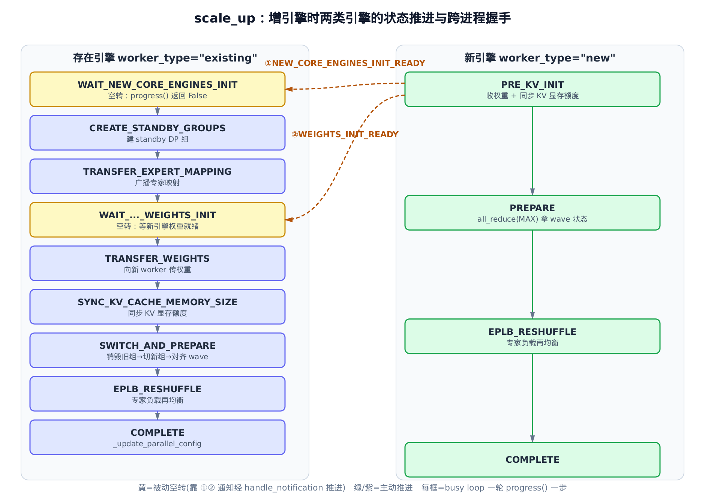
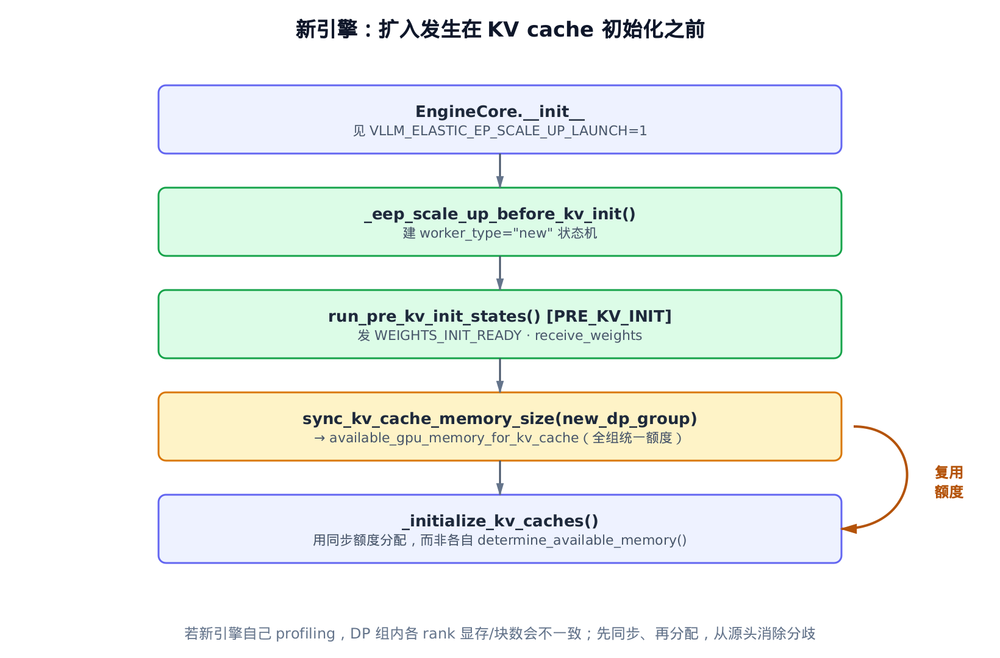
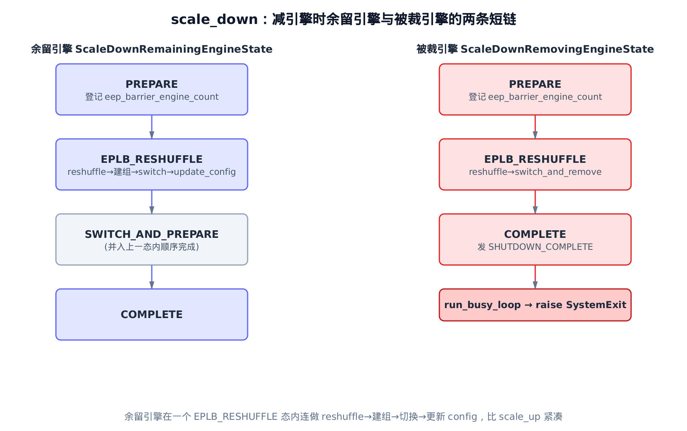
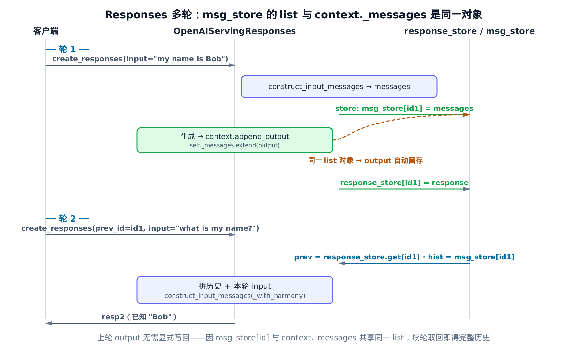

# 第33章　高级引擎运维：不停机扩缩与有状态多轮

## 33.1 你在这里


> 上一章我们把 OpenAI 兼容服务器接到了异步引擎上，请求的一生就此走通。
> 这一章给那台已经在跑的引擎装上两件"运维级"能力：不停机增删 DP 引擎，以及跨轮记住对话。
> 这是全书最后一个直接读代码的章节，给 EngineCore 这条主线收尾。

前面三十二章，我们默认引擎的"形状"是固定的：启动时声明几台数据并行（DP）引擎，就一直是几台；每条请求也都是无状态的——你给什么 prompt，它就照着算，不记得上一句。

生产环境会立刻撞上这两个假设的墙。

第一，**负载是潮汐式的**。白天峰值要 16 台 DP 引擎，凌晨两台就够。如果扩缩容必须"整个集群停下来重启"，那每次伸缩都是一次服务中断——这在 SLA 面前不可接受。我们想要的是：在引擎继续吐 token 的同时，悄悄把第 9 台引擎接进来，或者把第 16 台请下去。

第二，**对话是有状态的**。Responses API 不像 chat completions 那样要求客户端每轮自己把全部历史回传；它给你一个 `previous_response_id`，下一轮只发新的一句话，服务器负责把前文接上。这意味着引擎前面那层得有个"会话记忆"。

这两件事看起来八竿子打不着，却都属于同一个主题——**让一台已经在运行的引擎，在不重启的前提下改变自己的行为**。一个改的是分布式拓扑，一个改的是会话状态。本章就拆开看它们各自怎么做到"原地变身"。前者的代码集中在 `vllm/distributed/elastic_ep/elastic_state.py` 与 `vllm/v1/engine/core.py`，后者在 `vllm/entrypoints/openai/responses/serving.py` 一带。

我们先啃硬骨头：弹性专家并行（Elastic EP）的扩缩状态机。它深度依赖[第 21 章的 DP wave 协议](../ch21-async-engine/narrative/chapter.md)和[第 7 章的 EngineCore busy loop](../ch07-engine-core/narrative/chapter.md)，建议手边备着那两章。然后再看相对轻巧的 Responses 多轮。

---

## 33.2 难题：busy loop 里塞不下一个阻塞的"重建"

先把问题摆正。

一台 DP EngineCore 进程的核心是 `vllm/v1/engine/core.py` 里的 `run_busy_loop`：一个 `while` 循环，每轮 poll 输入队列、跑一步模型 forward、和组里其它 rank 用集合通信对齐 DP wave 状态。这个循环不能停——更准确地说，**组里的 rank 必须步调一致地进出集合通信**。第 7 台引擎如果卡在某个 `all_reduce` 上，其余引擎就全被它拖死。

现在你要往这个组里加一台引擎。"加一台"意味着什么？

- 要新建一个包含 9 台引擎的 DP 进程组（旧的只有 8 台）；
- 要把模型权重和专家（expert）映射传给新引擎；
- 要让新引擎拿到和全组一致的 KV cache 显存额度；
- 要把所有引擎从"用旧组通信"切到"用新组通信"；
- 全程**不能让正在服务的请求停下来**。

天真的做法是写一个 `reconfigure()` 函数，里面顺序地建组、传权重、切换、销毁旧组。问题是这个函数会**阻塞**——它一执行就是几秒，而这几秒里 busy loop 停转，正在 decode 的请求全部僵住。更糟的是，DP 各 rank 收到"该重配了"这条通知的时刻**有先后**：rank 0 可能已经进了 `reconfigure()` 在等 barrier，rank 3 还蒙在鼓里继续 forward——经典的分布式竞态。

vLLM 的答案是把"重建"拆成一台**确定性状态机**，每轮 busy loop 只推进**一步**，绝不阻塞。落后的 rank 多 forward 一步追上来即可。这就是 `ElasticEPScalingState`。

---

## 33.3 状态机的骨架：四种角色，各一串状态

一次扩缩里，不同引擎扮演不同角色，要走的流程也不同。vLLM 用四个 `IntEnum` 把这四条流程钉死：

```python
# vllm/distributed/elastic_ep/elastic_state.py:L33-L62
class ScaleUpExistingEngineState(enum.IntEnum):
    WAIT_NEW_CORE_ENGINES_INIT = 0
    CREATE_STANDBY_GROUPS = 1
    TRANSFER_EXPERT_MAPPING = 2
    WAIT_NEW_CORE_ENGINES_WEIGHTS_INIT = 3
    TRANSFER_WEIGHTS = 4
    SYNC_KV_CACHE_MEMORY_SIZE = 5
    SWITCH_AND_PREPARE = 6
    EPLB_RESHUFFLE = 7
    COMPLETE = 8


class ScaleUpNewEngineState(enum.IntEnum):
    PRE_KV_INIT = 0
    PREPARE = 1
    EPLB_RESHUFFLE = 2
    COMPLETE = 3


class ScaleDownRemainingEngineState(enum.IntEnum):
    PREPARE = 0
    EPLB_RESHUFFLE = 1
    SWITCH_AND_PREPARE = 2
    COMPLETE = 3


class ScaleDownRemovingEngineState(enum.IntEnum):
    PREPARE = 0
    EPLB_RESHUFFLE = 1
    COMPLETE = 2
```

读这四个枚举就读懂了全章的一半。两个维度交叉出四种角色：

|  | **scale_up（增引擎）** | **scale_down（减引擎）** |
|---|---|---|
| **本来就在的引擎** | `ScaleUpExistingEngineState`（9 态） | `ScaleDownRemainingEngineState`（余留，4 态） |
| **本次变动的引擎** | `ScaleUpNewEngineState`（新引擎，4 态） | `ScaleDownRemovingEngineState`（被裁，3 态） |

为什么扩入的存在引擎要 9 个状态，减引擎的余留引擎只要 4 个？因为**扩入要和一台正在初始化的新引擎跨进程握手**——存在引擎得停下来等新引擎"我权重收好了"，握手点多，状态自然多。而减引擎的余留引擎不用等任何外部的人，一气呵成就行。后面 §33.7 会看到这种"紧凑"。

状态用 `IntEnum`（带数值序）不是随意的——它天然表达"单调推进"：状态值只增不减，到 `COMPLETE` 为止。这正是我们证明状态机会终止的抓手（§33.6）。

---

## 33.4 progress()：每轮只走一步的引擎

状态机的心脏是 `progress()`——它是 busy loop 每轮调一次的入口，根据角色分派到四个 `_progress_*` 之一：

```python
# vllm/distributed/elastic_ep/elastic_state.py:L133-L145
def progress(self) -> bool:
    if self.scale_type == "scale_up":
        return (
            self._progress_new_engine()
            if self.worker_type == "new"
            else self._progress_existing_engine()
        )
    return (
        self._progress_removing_engine()
        if self.worker_type == "removing"
        else self._progress_remaining_engine()
    )
```

返回值是个 `bool`，含义很关键：**`True` 表示"这一轮我推进了一步"，`False` 表示"我这轮空转，状态没动"**。空转不是 bug，而是在等别人——后面 `WAIT_*` 状态会专门返回 `False`。

这台状态机怎么挂进 busy loop 的？看 `run_busy_loop` 里那一小段钩子：

```python
# vllm/v1/engine/core.py:L1790-L1804
def run_busy_loop(self):
    """Core busy loop of the EngineCore for data parallel case."""
    # Loop until process is sent a SIGINT or SIGTERM
    while self._handle_shutdown():
        # 1) Poll the input queue until there is work to do.
        self._process_input_queue()

        if self.eep_scaling_state is not None:
            _ = self.eep_scaling_state.progress()
            if self.eep_scaling_state.is_complete():
                if self.eep_scaling_state.worker_type == "removing":
                    raise SystemExit
                self.process_input_queue_block = True
                self.eep_scaling_state = None

        # … 省略：此后是第 21 章已讲的 DP wave 逻辑——
        #            _process_engine_step / wave++ / 全局是否还有未完成请求 …
```

一句话读懂这个钩子的精妙：**`progress()` 只是这轮 busy loop 里的一个"小动作"，做完它，循环照样往下走 `_process_engine_step()` 跑模型 forward**。也就是说，扩缩的每一步都和正常的推理步**交织**在一起——这就是"不停机"四个字的全部秘密。没有哪一刻引擎是"专门停下来做重配"的。

钩子还藏了两个收尾细节：

- `is_complete()` 为真且角色是 `"removing"`（被裁引擎）→ 直接 `raise SystemExit`，进程干净退出。
- 否则（存在/新/余留引擎）→ 把 `process_input_queue_block` 设回 `True`、清空 `eep_scaling_state`。注意这个标志：扩缩期间它是 `False`，意思是"输入队列别阻塞地等，poll 一下就走"，好让 busy loop 能高频转起来推进状态机；扩缩结束又调回 `True`，恢复平时"没活就阻塞着省 CPU"的常态。

那 `eep_scaling_state` 是谁挂上去的？两条触发路径，下面分别看。

---

## 33.5 触发扩缩：reinitialize_distributed 与"转非阻塞"

对**已经在跑**的引擎，扩缩由一条 `ReconfigureDistributedRequest` 触发。外部的扩缩工具经 `EngineCoreClient` 把这条指令下发给每台存在引擎，引擎在 `reinitialize_distributed` 里接住它：

```python
# vllm/v1/engine/core.py:L1865-L1911
def reinitialize_distributed(
    self, reconfig_request: ReconfigureDistributedRequest
) -> None:
    from copy import deepcopy
    from vllm.distributed.elastic_ep.elastic_state import ElasticEPScalingState

    new_parallel_config = deepcopy(self.vllm_config.parallel_config)
    old_dp_size = new_parallel_config.data_parallel_size
    new_parallel_config.data_parallel_size = reconfig_request.new_data_parallel_size
    if (
        reconfig_request.new_data_parallel_rank
        != ReconfigureRankType.KEEP_CURRENT_RANK
    ):
        new_parallel_config.data_parallel_rank = (
            reconfig_request.new_data_parallel_rank
        )
    # … 省略：master_ip / master_port / port_list / coord_store_port
    #          同样从 reconfig_request 逐字段拷入 new_parallel_config …

    is_scale_down = reconfig_request.new_data_parallel_size < old_dp_size
    is_shutdown = (
        reconfig_request.new_data_parallel_rank
        == ReconfigureRankType.SHUTDOWN_CURRENT_RANK
    )

    self.eep_scaling_state = ElasticEPScalingState(
        model_executor=self.model_executor,
        engine_core=self,
        vllm_config=self.vllm_config,
        new_parallel_config=new_parallel_config,
        worker_type="removing" if is_shutdown else "existing",
        scale_type="scale_down" if is_scale_down else "scale_up",
        reconfig_request=reconfig_request,
    )
    self.process_input_queue_block = False
    logger.info(
        "[Elastic EP] Received reconfiguration request and starting scaling up/down"
    )
```

这个函数做的事，本质上是**填两张表**再**挂一台状态机**：

1. **深拷贝出一份新的 `parallel_config`**，把新的 DP 维度（`new_data_parallel_size`）和新的 master ip/port 填进去。注意是 `deepcopy`——旧 config 还在用着（busy loop 此刻仍按旧拓扑通信），不能就地改。
2. **从两个标量推出本引擎的角色**：`new_dp_size < old` 就是 scale_down；`new_data_parallel_rank == SHUTDOWN_CURRENT_RANK` 这个哨兵值则意味着"你就是要被裁掉的那台"，角色定为 `"removing"`。
3. 把推出的 `worker_type` / `scale_type` 喂进 `ElasticEPScalingState` 构造函数，挂到 `self.eep_scaling_state`。
4. **`self.process_input_queue_block = False`**——这一行就是"切到非阻塞 busy loop"的开关，从此每轮快速回到 `progress()`。

状态机构造时怎么知道自己起始状态是哪个、该握着哪个 DP 组？看构造函数：

```python
# vllm/distributed/elastic_ep/elastic_state.py:L93-L117
self.model_executor_ref = weakref.ref(model_executor)
self.engine_core_ref = weakref.ref(engine_core)
# …
self.old_dp_group = self.engine_core.dp_group if worker_type != "new" else None
self.old_dp_store = self.engine_core.dp_store if worker_type != "new" else None
self.new_dp_group = self.engine_core.dp_group if worker_type == "new" else None
self.new_dp_store = self.engine_core.dp_store if worker_type == "new" else None
# …
self.state: EngineState
if scale_type == "scale_up":
    self.state = (
        ScaleUpNewEngineState.PRE_KV_INIT
        if worker_type == "new"
        else ScaleUpExistingEngineState.WAIT_NEW_CORE_ENGINES_INIT
    )
else:
    self.state = (
        ScaleDownRemovingEngineState.PREPARE
        if worker_type == "removing"
        else ScaleDownRemainingEngineState.PREPARE
    )
```

两个细节值得点出来。

一是 **`weakref.ref`**：状态机持有 `model_executor` 和 `engine_core` 的弱引用。为什么不是强引用？因为 `engine_core` 反过来也持有 `eep_scaling_state`——强引用会成环，扩缩结束清空 `eep_scaling_state` 时对象未必能立刻回收。弱引用切断了这个环。

二是 **`old_dp_group` 与 `new_dp_group` 按角色取值**：对存在引擎，`dp_group` 现在指向的是旧组，所以塞进 `old_dp_group`；对新引擎，它手里的 `dp_group` 一开始就是为新组建的，塞进 `new_dp_group`。这个"old/new 各指一边"的设计，后面切换时（§33.6 的 `_switch_and_prepare`）会让"销毁旧的、切到新的"读起来格外顺。

---

## 33.6 scale_up 全程：存在引擎的 9 步与跨进程握手

现在把 scale_up 的完整流程铺开。下面这张图是本章的主干——两条泳道，左边是存在引擎的 9 态，右边是新引擎的 4 态，中间的虚线箭头是跨进程通知：



> *图注：每个框 = busy loop 一轮里 `progress()` 推进的一步。*
> *黄框是被动空转：`progress()` 返回 False，靠 ①② 两条跨进程通知把它"叫醒"。*
> *绿/紫框是主动推进。新旧引擎靠 ①② 握手，确保存在引擎不会跑在新引擎前头。*

我们顺着存在引擎这条泳道读 `_progress_existing_engine`：

```python
# vllm/distributed/elastic_ep/elastic_state.py:L227-L307
def _progress_existing_engine(self) -> bool:
    state = self.state
    assert self.old_dp_group is not None and self.old_dp_store is not None

    if state == ScaleUpExistingEngineState.WAIT_NEW_CORE_ENGINES_INIT:
        return False

    elif state == ScaleUpExistingEngineState.CREATE_STANDBY_GROUPS:
        # NOTE: wait for all existing workers to receive the request
        if (int(self.old_dp_store.get("eep_barrier_engine_count"))
                < self.old_dp_group.size()):
            return False
        if not self._staged_barrier(use_new_group=False,
                                    barrier_name="create_standby_groups"):
            return False
        if self.old_dp_group.rank() == 0:
            self.old_dp_store.delete_key("eep_barrier_engine_count")
        self._create_standby_groups()
        self.state = ScaleUpExistingEngineState.TRANSFER_EXPERT_MAPPING
        return True

    elif state == ScaleUpExistingEngineState.TRANSFER_EXPERT_MAPPING:
        self._transfer_expert_mapping()
        self.state = ScaleUpExistingEngineState.WAIT_NEW_CORE_ENGINES_WEIGHTS_INIT
        return True

    elif state == ScaleUpExistingEngineState.WAIT_NEW_CORE_ENGINES_WEIGHTS_INIT:
        return False

    elif state == ScaleUpExistingEngineState.TRANSFER_WEIGHTS:
        # …（同 CREATE_STANDBY_GROUPS：先等 engine_count 齐、再 staged_barrier）
        self._transfer_weights()
        self.state = ScaleUpExistingEngineState.SYNC_KV_CACHE_MEMORY_SIZE
        return True

    elif state == ScaleUpExistingEngineState.SYNC_KV_CACHE_MEMORY_SIZE:
        self._sync_kv_cache_memory_size()
        self.state = ScaleUpExistingEngineState.SWITCH_AND_PREPARE
        return True

    elif state == ScaleUpExistingEngineState.SWITCH_AND_PREPARE:
        self._switch_and_prepare()
        self.state = ScaleUpExistingEngineState.EPLB_RESHUFFLE
        assert self.new_dp_store is not None
        self.new_dp_store.add("eep_barrier_engine_count", 1)
        return True

    elif state == ScaleUpExistingEngineState.EPLB_RESHUFFLE:
        # …（等 new 组 engine_count 齐、staged_barrier(use_new_group=True)）
        self._eplb_reshuffle()
        self.state = ScaleUpExistingEngineState.COMPLETE
        self._update_parallel_config()
        return True

    else:
        assert self.state == ScaleUpExistingEngineState.COMPLETE
        return True
```

这是个大 `if-elif` 链，但读法很简单：**每个分支处理一个状态，做点事、把 `self.state` 推到下一个、`return True`；空转态直接 `return False`**。串起来就是九步：

1. **`WAIT_NEW_CORE_ENGINES_INIT`** — 纯空转。存在引擎在这干等新引擎进程起来。怎么被叫醒？看 §33.6 末尾的通知机制。
2. **`CREATE_STANDBY_GROUPS`** — 建一个"备用"的新 DP 进程组（此刻还不切过去，旧组照样在用）。
3. **`TRANSFER_EXPERT_MAPPING`** — 把专家映射广播给新引擎，让它知道哪些 expert 归它管。
4. **`WAIT_NEW_CORE_ENGINES_WEIGHTS_INIT`** — 又一次空转，等新引擎喊"我权重收好了"。
5. **`TRANSFER_WEIGHTS`** — 把模型权重传给新 worker。
6. **`SYNC_KV_CACHE_MEMORY_SIZE`** — 把自己的 KV 显存额度同步给新引擎（为什么是存在引擎给新引擎，§33.8 揭晓）。
7. **`SWITCH_AND_PREPARE`** — 真正的切换：销毁旧组、所有引擎改用新组。这是全程最关键的一步，下面单独看。
8. **`EPLB_RESHUFFLE`** — Elastic Expert Parallel Load Balancing（弹性专家并行负载均衡）的缩写；专家负载再均衡，把 expert 在新的引擎集合上重新摊匀。
9. **`COMPLETE`** — `_update_parallel_config` 把新配置正式生效。

**第 7 步 `_switch_and_prepare` 是"不停机切换"的核心**，值得逐行看：

```python
# vllm/distributed/elastic_ep/elastic_state.py:L505-L535
def _switch_and_prepare(self):
    self.model_executor.collective_rpc(
        "elastic_ep_execute", args=("switch_and_prepare",)
    )
    old_dp_group = self.old_dp_group
    stateless_destroy_torch_distributed_process_group(old_dp_group)
    assert self.new_dp_group is not None
    new_dp_group = self.new_dp_group
    self.engine_core.dp_group = new_dp_group
    self.engine_core.dp_rank = new_dp_group.rank()
    self.engine_core.dp_store = self.new_dp_store
    engines_running = int(self.engine_core.engines_running)
    current_wave = self.engine_core.current_wave
    step_counter = self.engine_core.step_counter
    tensor = torch.tensor(
        [engines_running, current_wave, step_counter],
        dtype=torch.int32, device="cpu",
    )
    torch.distributed.all_reduce(
        tensor, op=torch.distributed.ReduceOp.MAX, group=new_dp_group
    )
    # … data[0/1/2] 回写 engine_core.engines_running/current_wave/step_counter …
    if new_dp_group.rank() == 0:
        self.engine_core._eep_send_engine_core_notification(
            EEPNotificationType.RECONFIGURE_FINISHED
        )
```

三件事，环环相扣：

- **销毁旧组、把 `engine_core` 的 `dp_group`/`dp_rank`/`dp_store` 整体切到新组。** 切换完成后，busy loop 里那些"和组里对齐 wave"的集合通信，自动就走新组了——`engine_core` 根本不知道脚下换了组，它只认 `self.dp_group` 这个引用。
- **跨新组 `all_reduce(MAX)` 对齐 DP wave 三元组 `[engines_running, current_wave, step_counter]`。** 这是和[第 21 章 DP wave 协议](../ch21-async-engine/narrative/chapter.md)的接缝。新组里既有老引擎（带着自己的 `current_wave`）也有新引擎（wave 还是 0），取 MAX 就让全组采纳"跑得最远的那个 wave"——避免有谁重放旧 wave 或拖慢全组。这个不变量，§33.8 还会再遇到。

把"跑得最远的 wave"从口号落成一次可手算的逐分量取最大。假设切换时新组里两台老引擎与一台刚入组的新引擎各持这样三个三元组：

| 引擎 | `engines_running` | `current_wave` | `step_counter` |
|---|---|---|---|
| 老引擎 rank0 | 1 | 7 | 142 |
| 老引擎 rank1 | 1 | 7 | 141 |
| 新引擎 rank2 | 0 | 0 | 0 |
| **`all_reduce(MAX)` 结果** | **1** | **7** | **142** |

逐分量取 MAX：`engines_running` 只要有一台在跑就是 1；`current_wave` 锁定到 7（没人落在更旧的 wave）；`step_counter` 取 142（跑得最远的那一步）。回写后三台一律是 `[1, 7, 142]`，新引擎就此并入同一拍 wave，rank1 那个慢一步的 141 也被抹平。这正是 §33.8 新引擎 `PREPARE` 那一步会再做一次的同一个收敛动作——两端都靠 MAX 收敛到唯一的 wave，是这个不变量成立的全部依据。
- **rank 0 发 `RECONFIGURE_FINISHED`** 通知，告诉 `EngineCoreClient`"切换完成了"。

### 跨进程握手：那两个 WAIT 状态怎么被叫醒

回到那两个返回 `False` 的空转态。它们不会自己推进——靠新引擎隔着进程发来的通知推。新引擎一侧调 `_eep_send_engine_core_notification`，消息经 `EngineCoreClient` 转发，落到存在引擎的 `handle_notification`：

```python
# vllm/distributed/elastic_ep/elastic_state.py:L435-L450
def handle_notification(self, notification_type: EEPNotificationType):
    assert self.worker_type != "new"
    assert self.old_dp_store is not None
    if (notification_type == EEPNotificationType.NEW_CORE_ENGINES_INIT_READY
            and self.state == ScaleUpExistingEngineState.WAIT_NEW_CORE_ENGINES_INIT):
        self.old_dp_store.add("eep_barrier_engine_count", 1)
        self.state = ScaleUpExistingEngineState.CREATE_STANDBY_GROUPS
    elif (notification_type == EEPNotificationType.NEW_CORE_ENGINES_WEIGHTS_INIT_READY
            and self.state
            == ScaleUpExistingEngineState.WAIT_NEW_CORE_ENGINES_WEIGHTS_INIT):
        self.old_dp_store.add("eep_barrier_engine_count", 1)
        self.state = ScaleUpExistingEngineState.TRANSFER_WEIGHTS
```

这就解了开头的谜：**那两个 `WAIT_*` 态是"被动"的，`progress()` 在它们身上永远返回 `False` 空转，真正把状态往前推的是从隔壁进程飞来的通知。** 通知一到，`handle_notification` 把 `eep_barrier_engine_count` 加一（给后面的 barrier 计数用）、状态推进一格，下一轮 `progress()` 就脱离空转、开始干活。

这是新旧引擎之间唯一的"对暗号"机制——`NEW_CORE_ENGINES_INIT_READY`（新引擎进程起来了）和 `NEW_CORE_ENGINES_WEIGHTS_INIT_READY`（新引擎权重收好了）。两次握手，正好对应存在引擎的两个 WAIT 态。

### 为什么这个状态机一定会跑完

每个关键不变量都该有个"为什么它成立"的骨架，别只停在断言。这里两条：

**终止性。** 看 `_progress_existing_engine`：除了 `COMPLETE` 这个吸收态，每个 `return True` 的分支都把 `self.state` 严格推到更大的枚举值（`IntEnum` 有序）。空转态 `return False` 不改状态，但它们等的是外部通知/计数，而通知**必定到达**（新引擎一定会发）。于是状态值构成一个**有上界（=COMPLETE）的单调不减整数序列**——只要通知不丢，有限步内必达 `COMPLETE`。`run_pre_kv_init_states` 里那串 `assert`（§33.8）正是在用这个性质做断言。

**不停机。** 每轮 busy loop 里 `progress()` 至多推进一步就返回，控制权立刻还给循环去跑 `_process_engine_step()`。所以"重配进行中"的每一个瞬间，引擎都还在正常服务请求——没有任何一段时间窗口是"专门停下来重配"的。

---

## 33.7 两阶段 barrier：化解"通知到得有先有后"

上面 `CREATE_STANDBY_GROUPS` 分支里有一行扎眼的判断：

```python
if (int(self.old_dp_store.get("eep_barrier_engine_count"))
        < self.old_dp_group.size()):
    return False
```

它在等什么？等组里**所有**引擎都收到了 reconfig 请求（每收到一个，`handle_notification` 就把这个计数加一）。没齐就空转。这是第一道关：先确保大家都知道"要重配了"。

但光是"都知道"还不够。各 rank 知道的**时刻**不同——有的已经进了 `CREATE_STANDBY_GROUPS`，有的还在上一轮 forward。如果直接上一个普通 barrier，先到的 rank 会干等死等，而落后的 rank 此刻并没在等 barrier，于是**死锁**。`_staged_barrier` 就是来拆这颗雷的：

```python
# vllm/distributed/elastic_ep/elastic_state.py:L182-L225
def _staged_barrier(self, use_new_group: bool, barrier_name: str) -> bool:
    """Execute a two-staged barrier to synchronize all engines in the DP group.

    Some DP EngineCores may receive the reconfiguration notifications
    later than others, and already proceed to engine step (model forward).
    In this case, EngineCores that already proceeded to reconfiguration
    should skip reconfiguration and execute model forward for one more
    step, so in the next step, all EngineCores will be synchronized.
    ...
    """
    dp_group = self.new_dp_group if use_new_group else self.old_dp_group
    dp_store = self.new_dp_store if use_new_group else self.old_dp_store
    assert dp_group is not None and dp_store is not None

    group_rank = dp_group.rank()
    group_size = dp_group.size()
    barrier_id = f"eep_barrier_{barrier_name}"
    sync_key = f"{barrier_id}_sync"

    # TODO: figure out appropriate timeout for the barrier
    timeout = None if dp_store.check([sync_key]) else timedelta(seconds=5)

    try:
        self._execute_tcp_store_barrier(
            dp_store, group_rank, group_size, barrier_id, timeout=timeout
        )
        torch.distributed.barrier(dp_group)
        if group_rank == 0:
            dp_store.delete_key(sync_key)
            for i in range(group_size):
                dp_store.delete_key(f"arrival_{barrier_id}_{i}")
        return True
    except _BarrierTimeoutError as e:
        if timeout is None:
            raise RuntimeError("Unexpected timeout encountered") from e
        dp_store.compare_set(sync_key, "", b"1")
        return False
```

"两阶段"的精髓在 `timeout` 那行和 `except` 块的配合：

- **第一阶段（带 5 秒超时）**：`sync_key` 还没设，`timeout = 5s`。如果某个 rank 在 5 秒内没等到所有人到齐——说明有落后者还在 forward——它**不死等**，而是抛 `_BarrierTimeoutError`，被 `except` 接住后做一件事：`compare_set(sync_key, ...)` 把 `sync_key` 设上（相当于在 TCPStore 上插旗"这次 barrier 超时了，下次别再设超时"），然后 `return False`。
- **`return False` 的后果**：`_progress_existing_engine` 里 `if not self._staged_barrier(...): return False`——这一轮 `progress()` 整体空转返回，状态不动。于是这个 rank 回到 busy loop，**多跑一步模型 forward**，让正在服务的请求继续往前。
- **第二阶段（无超时）**：下一轮再进 `_staged_barrier`，这次 `dp_store.check([sync_key])` 为真，`timeout = None`。所有 rank 这次都在无超时 barrier 上汇合——落后者也追上了。无超时还超时？那就是真出事了，直接 `raise RuntimeError`。

把"通知到达的偏序"这个分布式难题，化成了**最多一次额外 forward step 的代价**。落后者不会拖死先到者，先到者也不会空转浪费——它去多服务了一步请求，反而是赚的。这是整套弹性扩缩里我最喜欢的一笔设计。

把"最多一次额外 forward step"坐实成一条跨 rank、跨拍的时间线就一目了然。设 rank0 先收到 reconfig、rank3 慢半拍，看它们各自 busy loop 第几轮在做什么：

| busy loop 轮次 | rank0 | rank3 | barrier 结果 |
|---|---|---|---|
| 第 4 轮 | 已进 `CREATE_STANDBY_GROUPS`，调 `_staged_barrier`（`timeout=5s`） | 还在上一拍 `_process_engine_step` forward | rank0 等不到 rank3，5s 超时 → 插 `sync_key` 旗、`return False` |
| 第 5 轮 | `progress()` 整体空转，回 busy loop 多 forward 一步 | 收到通知，进 `CREATE_STANDBY_GROUPS` | rank3 追上 |
| 第 6 轮 | 再进 `_staged_barrier`，这次 `check(sync_key)` 为真 → `timeout=None` | 同上，`timeout=None` | 两者在无超时 barrier 上汇合，`return True` |

整条偏序就被压成 rank0 在第 5 轮多跑的那**一步** forward——这一步它没闲着，是在继续服务正在 decode 的请求。落后者一旦追上，第二阶段的无超时 barrier 一次成功，绝不会再超时（真超时就是 `raise RuntimeError` 的真故障了）。

---

## 33.8 新引擎的 4 步：把"扩入"提前到 KV cache 初始化之前

到此都是站在存在引擎的视角。新引擎这边走的是 `_progress_new_engine`，只有 4 态，但藏着一个非走不可的因果：**新引擎必须在初始化自己的 KV cache 之前就完成扩入。**

为什么？想想 KV cache 的显存额度怎么定的——靠 profiling：跑一遍前向，看峰值显存占了多少，剩下的全划给 KV cache。但 DP 组里每台引擎独立 profiling，结果会有微小出入。出入在单机无所谓，在 DP 组里却是灾难：**组内各 rank 的 KV 块数必须一致**，否则 wave 对齐时算出来的"全局还能塞多少请求"就错位了。

vLLM 的解法：新引擎不自己 profiling，而是**从全 DP 组同步拿一个统一的额度**。而这必须发生在 `_initialize_kv_caches` 之前。来看 `EngineCore.__init__` 里那个分叉：

```python
# vllm/v1/engine/core.py:L124-L126, L240-L251
        # EngineCore.__init__ 中，KV cache 初始化之前：
        if envs.VLLM_ELASTIC_EP_SCALE_UP_LAUNCH:
            self._eep_scale_up_before_kv_init()
        # 随后 _initialize_kv_caches(vllm_config) 中：
        if envs.VLLM_ELASTIC_EP_SCALE_UP_LAUNCH:
            # NOTE: should already be set during _eep_scale_up_before_kv_init
            assert self.available_gpu_memory_for_kv_cache > 0
            available_gpu_memory = [self.available_gpu_memory_for_kv_cache] * len(
                kv_cache_specs
            )
        else:
            available_gpu_memory = self.model_executor.determine_available_memory()
            self.available_gpu_memory_for_kv_cache = available_gpu_memory[0]
```

读这段的关键是看 `available_gpu_memory_for_kv_cache` 这个字段的两条命运：

- **普通启动**（`else` 分支）：`determine_available_memory()` 自己 profiling，把结果存进该字段。
- **作为弹性新引擎启动**（环境变量 `VLLM_ELASTIC_EP_SCALE_UP_LAUNCH=1`）：`__init__` 先调 `_eep_scale_up_before_kv_init()`，等 `_initialize_kv_caches` 跑到这里时，该字段**已经被同步好了**（`assert > 0` 就是在断言这点），于是跳过 profiling，直接拿它当额度。

下面这张时序图把"扩在 KV init 之前"的因果钉死：



> *图注：竖着读是新引擎进程的启动顺序。*
> *关键是橙色那条"复用额度"的回边：`sync_kv_cache_memory_size` 拿到全组统一额度，`_initialize_kv_caches` 直接拿来用。*
> *先同步、再分配——从源头消除 DP 组内显存不一致。*

`_eep_scale_up_before_kv_init` 本身很短，就是手动挂一台 `worker_type="new"` 的状态机、然后把它的"KV init 前那几步"预跑掉：

```python
# vllm/v1/engine/core.py:L1965-L1978
def _eep_scale_up_before_kv_init(self):
    from vllm.distributed.elastic_ep.elastic_state import ElasticEPScalingState

    self.eep_scaling_state = ElasticEPScalingState(
        model_executor=self.model_executor,
        engine_core=self,
        vllm_config=self.vllm_config,
        new_parallel_config=self.vllm_config.parallel_config,
        worker_type="new",
        scale_type="scale_up",
        reconfig_request=None,
    )
    self.eep_scaling_state.run_pre_kv_init_states()
    self.process_input_queue_block = False
```

`run_pre_kv_init_states` 是 `progress()` 的一个"非阻塞外壳"的特例——它**同步**地把状态从 `PRE_KV_INIT` 推到 `PREPARE` 就停，用一串 `assert` 确认推进发生了：

```python
# vllm/distributed/elastic_ep/elastic_state.py:L146-L150
def run_pre_kv_init_states(self) -> None:
    assert self.scale_type == "scale_up" and self.worker_type == "new"
    assert self.state == ScaleUpNewEngineState.PRE_KV_INIT
    assert self.progress()
    assert self.state == ScaleUpNewEngineState.PREPARE
```

`PRE_KV_INIT` 这一步具体做了什么？看 `_progress_new_engine` 的头一个分支：

```python
# vllm/distributed/elastic_ep/elastic_state.py:L309-L361
def _progress_new_engine(self) -> bool:
    state = self.state
    assert self.new_dp_group is not None and self.new_dp_store is not None

    if state == ScaleUpNewEngineState.PRE_KV_INIT:
        self.engine_core._eep_send_engine_core_notification(
            EEPNotificationType.NEW_CORE_ENGINES_WEIGHTS_INIT_READY
        )
        self.model_executor.collective_rpc(
            "elastic_ep_execute", args=("receive_weights",)
        )
        self.engine_core.available_gpu_memory_for_kv_cache = (
            ParallelConfig.sync_kv_cache_memory_size(self.new_dp_group, -1)
        )
        self.model_executor.collective_rpc(
            "elastic_ep_execute", args=("prepare_new_worker",)
        )
        self.state = ScaleUpNewEngineState.PREPARE
        return True

    elif state == ScaleUpNewEngineState.PREPARE:
        tensor = torch.tensor([0, 0, 0], dtype=torch.int32, device="cpu")
        torch.distributed.all_reduce(
            tensor, op=torch.distributed.ReduceOp.MAX, group=self.new_dp_group,
        )
        data = tensor.tolist()
        self.engine_core.engines_running = bool(data[0])
        self.engine_core.current_wave = int(data[1])
        self.engine_core.step_counter = int(data[2])
        self.state = ScaleUpNewEngineState.EPLB_RESHUFFLE
        self.new_dp_store.add("eep_barrier_engine_count", 1)
        return True

    elif state == ScaleUpNewEngineState.EPLB_RESHUFFLE:
        # …（等 engine_count 齐 + staged_barrier(use_new_group=True)）
        assert self.new_dp_group.rank() > 0
        self._eplb_reshuffle()
        self.state = ScaleUpNewEngineState.COMPLETE
        return True

    else:
        assert self.state == ScaleUpNewEngineState.COMPLETE
        return True
```

`PRE_KV_INIT` 这一步串起三件事：发 `WEIGHTS_INIT_READY` 通知（叫醒存在引擎的第二个 WAIT 态）→ 收权重 → **`sync_kv_cache_memory_size` 从全组拿统一额度写进 `available_gpu_memory_for_kv_cache`**。最后这步正是上面那个 `assert > 0` 所依赖的源头。

`PREPARE` 那一步则是另一个和 DP wave 的接缝：用 `all_reduce(MAX)` 从全 DP 组拉来 `[engines_running, current_wave, step_counter]`，新引擎采纳全组最大的 wave 状态，无缝并入第 21 章的 wave 节律。和 §33.6 的 `_switch_and_prepare` 是同一个 MAX 不变量，只是一个发生在新引擎入组前的对齐，一个发生在存在引擎切组时的对齐——两端都用 MAX 收敛到同一个 wave，是把 wave 协议延展到"成员数会变"的关键。

---

## 33.9 scale_down：余留与被裁，一减一退

减引擎比加引擎清爽得多。原因前面提过：**没有"正在初始化的新引擎"要等**，所以不需要那些 WAIT 握手态。



> *图注：左边余留引擎 4 态，右边被裁引擎 3 态。*
> *余留引擎在一个 `EPLB_RESHUFFLE` 态里连做"reshuffle→建组→切换→更新 config"，比 scale_up 紧凑。*
> *被裁引擎做完 reshuffle 把 expert 交还后，发 SHUTDOWN_COMPLETE，busy loop 见状 raise SystemExit。*

余留引擎走 `_progress_remaining_engine`：

```python
# vllm/distributed/elastic_ep/elastic_state.py:L363-L401
def _progress_remaining_engine(self) -> bool:
    state = self.state
    assert self.old_dp_group is not None and self.old_dp_store is not None

    if state == ScaleDownRemainingEngineState.PREPARE:
        self.state = ScaleDownRemainingEngineState.EPLB_RESHUFFLE
        self.old_dp_store.add("eep_barrier_engine_count", 1)
        return True

    elif state == ScaleDownRemainingEngineState.EPLB_RESHUFFLE:
        # …（等 engine_count 齐 + staged_barrier(use_new_group=False)）
        self._eplb_reshuffle_before_scale_down()
        self.state = ScaleDownRemainingEngineState.SWITCH_AND_PREPARE
        # NOTE: EPLB reshuffle 把 experts 重分配到余留 worker 后，
        # 待移除 worker 立即开始 shutdown；余留 worker 不能再用旧 setup forward
        self._create_standby_groups()
        self._switch_and_prepare()
        self._update_parallel_config()
        self.state = ScaleDownRemainingEngineState.COMPLETE
        return True

    else:
        assert self.state == ScaleDownRemainingEngineState.COMPLETE
        return True
```

注意 `EPLB_RESHUFFLE` 这一个分支里，一口气做了 `_eplb_reshuffle_before_scale_down` → `_create_standby_groups` → `_switch_and_prepare` → `_update_parallel_config` 四步，最后直接落到 `COMPLETE`——状态枚举里那个 `SWITCH_AND_PREPARE` 态其实被"内联"进来了，没单独占一轮。

为什么这么急？源码注释说得明白：reshuffle 一把 expert 收回余留引擎，**被裁引擎就立刻开始 shutdown 了**。余留引擎不能在这个空档里还用旧拓扑去 forward——旧组里有正在退场的成员。所以它必须在同一步里把"切到新组"一气做完，不留时间窗。这就是它比 scale_up 紧凑的根本原因：scale_up 要迁就一个慢慢初始化的新成员，scale_down 要抢在退场成员消失前完成切换。

被裁引擎走 `_progress_removing_engine`，更短，结局是退出进程：

```python
# vllm/distributed/elastic_ep/elastic_state.py:L403-L433
def _progress_removing_engine(self) -> bool:
    state = self.state
    assert self.old_dp_group is not None and self.old_dp_store is not None

    if state == ScaleDownRemovingEngineState.PREPARE:
        self.state = ScaleDownRemovingEngineState.EPLB_RESHUFFLE
        self.old_dp_store.add("eep_barrier_engine_count", 1)
        return True

    if state == ScaleDownRemovingEngineState.EPLB_RESHUFFLE:
        # …（等 engine_count 齐 + staged_barrier(use_new_group=False)）
        assert self.old_dp_group.rank() > 0
        self._eplb_reshuffle_before_scale_down()
        self._switch_and_remove()
        self.state = ScaleDownRemovingEngineState.COMPLETE
        self.engine_core._eep_send_engine_core_notification(
            EEPNotificationType.SHUTDOWN_COMPLETE
        )
        return True

    else:
        assert self.state == ScaleDownRemovingEngineState.COMPLETE
        return True
```

它和余留引擎的差别在动词：余留引擎调 `_switch_and_prepare`（切到新组**准备继续干活**），被裁引擎调 `_switch_and_remove`（切完就**准备退场**），并在 `COMPLETE` 前发出 `SHUTDOWN_COMPLETE` 通知——让 `EngineCoreClient` 知道这台可以释放它的 ray placement group 了。然后呢？回到 §33.4 那段 busy loop 钩子：`is_complete()` 为真 + `worker_type == "removing"` → `raise SystemExit`，进程干净下线。

至此，弹性 EP 的四种角色全部走完。一句话总结：**把"重建分布式组"这件本质阻塞的事，拆成一台每轮只走一步的状态机，让它和正常推理交织进行；用 TCPStore 计数 + 两阶段 barrier 容忍各 rank 的时间偏序；用 all_reduce(MAX) 把变动后的成员收敛回同一条 DP wave。** 不停机，靠的就是这三招。

---

## 33.10 换个战场：Responses API 的有状态多轮

放下分布式，来看本章第二条线——它清爽得像换了本书。

Responses API 的卖点是**有状态会话**：客户端第一轮发"我叫 Bob"，拿到一个 `response.id`；第二轮只发"我叫什么？"外加 `previous_response_id` 指向上一轮，服务器就能答出"Bob"。客户端不必自己背着全部历史。这意味着服务器侧得替它记住前文。

入口是 `OpenAIServingResponses.create_responses`。多轮的故事从取回上一轮开始：

```python
# vllm/entrypoints/openai/responses/serving.py:L350-L368
        # Handle the previous response ID.
        prev_response_id = request.previous_response_id
        if prev_response_id is not None:
            async with self.response_store_lock:
                prev_response = self.response_store.get(prev_response_id)
            if prev_response is None:
                return self._make_not_found_error(prev_response_id)
        else:
            prev_response = None

        lora_request = self._maybe_get_adapters(request)
        model_name = self.models.model_name(lora_request)

        if self.use_harmony:
            messages, engine_inputs = self._make_request_with_harmony(
                request, prev_response
            )
        else:
            messages, engine_inputs = await self._make_request(request, prev_response)
```

逻辑直白：有 `previous_response_id` 就去 `response_store` 把上一轮的 `ResponsesResponse` 捞出来（捞不到就 404）；没有就是新会话。然后按 `use_harmony` 分两条拼接路径——普通路径和 harmony 路径。Harmony 是 vLLM 内部的一种增强消息格式，在标准 `role/content` 之外还带 `channel` 字段（如 `"final"` / `"analysis"`），用于区分思维链与正式输出，§33.12 会细看。

这里出现了两个"店"：`response_store` 和（下面会见到的）`msg_store`。它们是什么来头？看构造：

```python
# vllm/entrypoints/openai/responses/serving.py:L235-L241
        # HACK(woosuk): This is a hack. We should use a better store.
        # FIXME: If enable_store=True, this may cause a memory leak since we
        # never remove responses from the store.
        self.response_store: dict[str, ResponsesResponse] = {}
        self.response_store_lock = asyncio.Lock()

        # HACK(woosuk): This is a hack. We should use a better store.
```

就是两个**进程内的普通字典**：`response_store` 是 `id → ResponsesResponse`，`msg_store` 是 `id → 消息序列`。源码自己挂了 `HACK` 和 `FIXME`——它从不清理，长跑会内存泄漏。这是务实的折中：实现"有状态会话"的最小代价，先用字典顶着。读源码时把这种自承认的临时方案如实看待，比脑补一个"优雅的会话存储"更接近真相。

---

## 33.11 非 harmony 拼接：把上一轮织进这一轮

普通路径的拼接在 `construct_input_messages`，一个纯函数，把"上轮历史 + 上轮输出 + 本轮输入"织成一串 chat 消息：

```python
# vllm/entrypoints/openai/responses/utils.py:L79-L121
def construct_input_messages(
    *,
    request_instructions: str | None = None,
    request_input: str | list[ResponseInputOutputItem],
    prev_msg: list[ChatCompletionMessageParam] | None = None,
    prev_response_output: list[ResponseOutputItem] | None = None,
):
    messages: list[ChatCompletionMessageParam] = []
    if request_instructions:
        messages.append({"role": "system", "content": request_instructions})

    # Prepend the conversation history.
    if prev_msg is not None:
        # Filter out system messages from previous conversation -- per the
        # OpenAI spec, instructions should NOT carry over across responses.
        messages.extend(m for m in prev_msg if m.get("role") != "system")
    if prev_response_output is not None:
        # Add the previous output.
        for output_item in prev_response_output:
            # NOTE: We skip the reasoning output.
            if isinstance(output_item, ResponseOutputMessage):
                for content in output_item.content:
                    messages.append({"role": "assistant", "content": content.text})

    # Append the new input.
    if isinstance(request_input, str):
        messages.append({"role": "user", "content": request_input})
    else:
        input_messages = construct_chat_messages_with_tool_call(request_input)
        messages.extend(input_messages)
    return messages
```

按顺序读，消息列表是这样长出来的：

1. **本轮的 `instructions`** 作为 `system` 消息打头（如果有）。
2. **上一轮的历史消息**前置进来——但**滤掉其中的 `system` 消息**。这条注释点出 OpenAI 规范的一个讲究：instructions（系统提示）**不跨轮携带**，每轮的 system 由当轮请求决定。所以上轮的 system 要扔掉，只留对话本身。
3. **上一轮的输出**转成 `assistant` 消息接上——但只取 `ResponseOutputMessage`，**跳过 reasoning**（思维链不回灌）。
4. **本轮的新输入**作为 `user` 消息收尾。

织完这一串，喂给引擎，模型就"看见"了完整上下文。下一轮再来，这一轮的输出又会变成它的 `prev_response_output`，循环往复。

这里有个量化值得点明：**有状态会话每轮都把全部历史重新喂进去，prompt 长度随轮数线性累积**。第 N 轮的输入约等于前 N-1 轮的全部消息加起来。听起来浪费，但这恰恰是[前缀缓存（prefix caching）](../ch15-kv-cache/narrative/chapter.md)价值最大的场景——历史前缀完全相同，KV 几乎全部命中缓存，真正要算的只有新增的那一句。多轮越深，缓存省得越多。

---

## 33.12 harmony 路径与那个共享的 list

harmony 是另一种消息格式，拼接走 `_construct_input_messages_with_harmony`。新会话和续轮分两支：

```python
# vllm/entrypoints/openai/responses/serving.py:L1133-L1160
    def _construct_input_messages_with_harmony(
        self, request, prev_response,
    ) -> list[OpenAIHarmonyMessage]:
        messages: list[OpenAIHarmonyMessage] = []
        if prev_response is None:
            # New conversation.
            tool_types = extract_tool_types(request.tools)
            with_custom_tools = has_custom_tools(tool_types)
            sys_msg = self._construct_harmony_system_input_message(
                request, with_custom_tools, tool_types
            )
            messages.append(sys_msg)
            if with_custom_tools:
                dev_msg = get_developer_message(
                    instructions=request.instructions, tools=request.tools
                )
                messages.append(dev_msg)
            messages += construct_harmony_previous_input_messages(request)
        else:
            # Continue the previous conversation.
            # FIXME: Currently, request params like reasoning and
            # instructions are ignored.
            prev_msgs = self.msg_store[prev_response.id]
            # …（见下：源码自承认是 no-op 的 slice-delete-reappend）
            messages.extend(prev_msgs)
        # 之后 append 本轮 input（str 或 list）
```

新会话造 system（必要时加 developer）消息；续轮则直接 `self.msg_store[prev_response.id]`——一把取出上一轮的完整 harmony 消息序列，`extend` 进来。这就是 `msg_store` 的用处：它存的是上一轮拼好并生成完的**整串消息**。

续轮那个分支里有段 `slice-delete-reappend`，我把它单独拎出来，因为源码对它的注释很有意思：

```python
# vllm/entrypoints/openai/responses/serving.py:L1161-L1185
            # FIXME(woosuk): The slice-delete-reappend cycle below is
            # currently a no-op --- it removes messages then puts them all
            # back unfiltered. ...
            if len(prev_msgs) > 0:
                last_msg = prev_msgs[-1]
                assert isinstance(last_msg, OpenAIHarmonyMessage)
                if last_msg.channel == "final":
                    prev_final_msg_idx = -1
                    for i in range(len(prev_msgs) - 2, -1, -1):
                        prev_msg_i = prev_msgs[i]
                        if prev_msg_i.channel == "final":
                            prev_final_msg_idx = i
                            break
                    recent_turn_msgs = prev_msgs[prev_final_msg_idx + 1 :]
                    del prev_msgs[prev_final_msg_idx + 1 :]
                    for msg in recent_turn_msgs:
                        prev_msgs.append(msg)
            messages.extend(prev_msgs)
```

我得如实告诉你：**这段当前是个空操作。** 源码自己挂的 `FIXME` 写得明明白白——它把"最近一轮"的消息切出来、删掉、再原样不加过滤地塞回去，集合不变，等于什么都没做。本意大概是想定位"上一条 final 之后的消息"做点过滤（比如剥掉 analysis 通道），但缺了过滤条件，于是沦为 no-op。别被它的形状唬住以为在"清洗消息"——它现在不做任何事。读真实代码就得接受这种半成品，源码作者自己也标了。

### 那个让"本轮输出自动留存"的隐式接缝

现在到了 Responses 多轮最精巧的一处——也是最容易看漏的。`create_responses` 在调度生成前，把拼好的 `messages` 落进 `msg_store`：

```python
# vllm/entrypoints/openai/responses/serving.py:L497-L499
        # Store the input messages.
        if request.store:
            self.msg_store[request.request_id] = messages
```

平平无奇一行赋值。玄机在于：**这个 `messages` list，同时也被传进了生成时用的 `HarmonyContext`，成为它的 `_messages`——两者是同一个 list 对象。** 于是生成过程中，`HarmonyContext.append_output` 一旦把模型输出追加进 `_messages`，`msg_store` 里这条 list 就**自动**含上了本轮输出，无需任何显式写回：

```python
# vllm/entrypoints/openai/responses/context.py:L559-L583
    def append_output(self, output: RequestOutput) -> None:
        output_token_ids = output.outputs[0].token_ids
        self.parser = get_streamable_parser_for_assistant()
        for token_id in output_token_ids:
            self.parser.process(token_id)
            self._update_num_reasoning_tokens()
        # … 省略：prefill/decode 的 token 计数与 TurnMetrics 统计（旁路） …
        # append_output is called only once before tool calling
        # in non-streaming case so we can append all parser messages
        output_msgs = self.parser.messages
        self.finish_reason = output.outputs[0].finish_reason
        self._messages.extend(output_msgs)
```

末行 `self._messages.extend(output_msgs)` 就是整个有状态会话的"自动留存"机制：harmony parser 把输出 token 解析成消息，`extend` 进 `_messages`——而 `_messages` 就是 `msg_store` 里那条 list。**写一处，两处都有。**

最后生成收尾时，`response_store` 也落库本轮 response：

```python
# vllm/entrypoints/openai/responses/serving.py:L878-L893
        if request.store:
            async with self.response_store_lock:
                stored_response = self.response_store.get(response.id)
                # If the response is already cancelled, don't update it.
                if stored_response is None or stored_response.status != "cancelled":
                    self.response_store[response.id] = response
        return response
```

这下两个店都齐了：`response_store[id]` 存 response（它的 `output` 是非 harmony 路径下一轮的 `prev_response_output`），`msg_store[id]` 存完整消息序列（harmony 路径下一轮直接 `extend`）。下一轮的 `previous_response_id` 一命中，历史就接上了。

把两轮串起来看这张时序图，那条橙色虚线就是"同一个 list 对象"这个隐式接缝：



> *图注：轮 1 生成时 `append_output` 把输出 extend 进 `_messages`；因它与 `msg_store[id1]` 是同一 list，输出自动留存。*
> *轮 2 携 `previous_response_id` 取回 `prev_response` 和 `msg_store[id1]`，拼上历史再生成。*
> *上轮 output 无需显式写回——靠共享 list 这一笔。*

**这设计简洁，但也隐式得危险。** "本轮输出自动出现在 msg_store"这件事，没有任何一行代码显式表达，全靠"两个名字指向同一个 list"这个事实撑着。读代码时若没意识到 `msg_store[id]` 和 `context._messages` 是同一对象，会彻底看不懂下一轮的历史是从哪冒出来的。这是 vLLM 里"用别名共享省一次拷贝"的典型笔法——省了拷贝，代价是把因果藏进了对象身份里。

---

## 33.13 跑起来看一眼：状态推进与会话接续

前面全是读源码。配套的精简版把这两条线都剥成了可单测的最小骨架——状态机经注入的 `dp_group`/`dp_store`/`model_executor` 替身驱动，多轮拼接经替身 parser 驱动，都不碰 CUDA、不 import vllm。挑两个最能验证"控制流对不对"的来看。

**被裁引擎退出。** 验证"`_progress_removing_engine` 发 `SHUTDOWN_COMPLETE`、busy loop 见状 `raise SystemExit`"这条收尾链：

```python
# test_engine_core_eep.py::test_busy_loop_removing_engine_raises_systemexit
# 余留引擎走完 removing 状态机后，is_complete() 为真且 worker_type=="removing"
with pytest.raises(SystemExit):
    proc.run_busy_loop()  # 钩子段：progress → is_complete → raise SystemExit
```

**两轮会话接历史。** 验证那个共享 list 的隐式留存——轮 2 拼出的消息里，应当看得到轮 1 的 user 和 assistant：

```python
# test_responses_multiturn.py::test_two_turn_conversation_threads_history
resp1 = server.create_responses(Req(input="my name is Bob"))
resp2 = server.create_responses(
    Req(input="what is my name?", previous_response_id=resp1.id)
)
msgs2 = server.msg_store[resp2_request_id]
contents = [m.get("content") for m in msgs2 if isinstance(m, dict)]
assert "my name is Bob" in contents          # 轮1 user
assert "answer-to:my name is Bob" in contents  # 轮1 assistant（自动留存）
assert "what is my name?" in contents          # 轮2 user
```

那行 `"answer-to:my name is Bob" in contents` 就是 §33.12 那个共享 list 的活证据——轮 1 的输出从没被显式写回 `msg_store`，却出现在了轮 2 的历史里。需要点明：这条两轮验证走的是注入了 `HarmonyContext` 的生成路径，演示的正是 §33.12 讲的 harmony 共享 list 留存机制；而非 harmony 路径下，上轮 output 改经 `response_store` 的 `prev_response_output` 回灌（§33.11 已讲），二者殊途同归，都能让轮 2 看到轮 1 的回答。整套精简版连同四种角色的状态推进、barrier 超时回退、KV-init 前同步显存，一共 36 个测试用例全绿。代码层面的行为，和我们逐段读下来的设计，对得上。

---

## 33.14 收尾：两种"原地变身"，与全书代码之旅的终点

本章是全书最后一段直接读源码的旅程，回头看这两条线，会发现它们共享同一种气质。

弹性 EP 扩缩，是让一台**分布式引擎**原地改变拓扑：靠 `vllm/distributed/elastic_ep/elastic_state.py` 里一台每轮只走一步的状态机，把"重建进程组"这件阻塞的事拆碎了塞进 busy loop 的缝隙里，用两阶段 barrier 容忍各 rank 的时间差，用 all_reduce(MAX) 把变动后的成员收敛回同一条 DP wave。它把[第 7 章的 EngineCore 循环](../ch07-engine-core/narrative/chapter.md)和[第 21 章的 DP wave](../ch21-async-engine/narrative/chapter.md)往前推到了"成员数会动态变化"的极限场景。

Responses 多轮，是让一台**会话服务**原地积累状态：靠两个进程内字典，外加一个"输入 list 与生成 context 共享同一对象"的隐式接缝，让本轮输出无需显式写回就出现在下一轮历史里。它简洁、务实，也坦诚地挂着自己的 `HACK` 和 no-op `FIXME`。

它们都在回答开篇那个问题——**让一台已经在跑的引擎，不重启就改变行为**。一个改拓扑，一个改记忆。读到这里，从一条 token 的诞生到整台引擎的弹性运维，这趟源码之旅就走完了。
