# 第 33 章　EAGLE：特征级自回归与树验证

## 你在这里

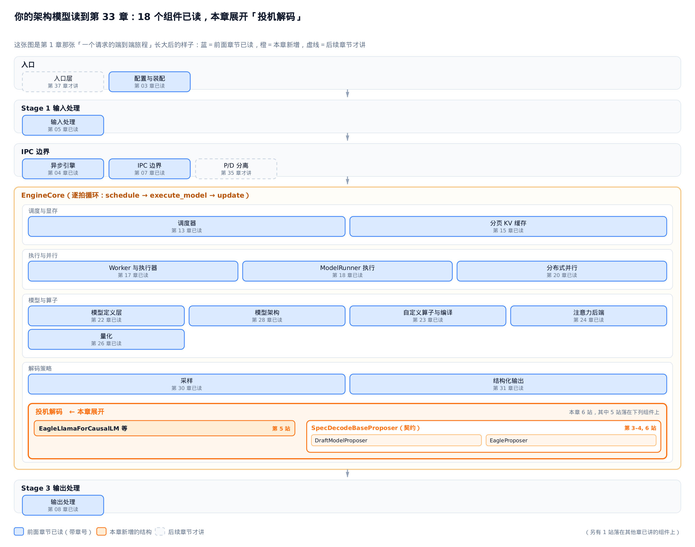

> *图注：这张架构模型图整本书共用，从开篇起逐章生长——它就是[第 1 章](../../ch01-config-and-wiring/narrative/chapter.md)那张「一个请求的端到端旅程」长大后的样子。主线一眼就能认出来：自上而下依次是入口、输入处理、跨进程的 IPC（进程间通信）边界、装着逐拍循环 `schedule → execute_model → update` 的 `EngineCore` 大框、输出处理，行间箭头还是请求的流向；当年 `EngineCore` 框里只画了调度器与分页 KV 缓存，如今已按「调度与显存／执行与并行／模型与算子／解码策略」四组装满一路读过来的组件。蓝框是前面章节已经读过的（框里带章号），虚线框留给后续章节，橙色是本章新长出的一块。*
> *本章新长的这块在「解码策略」组里就地展开——摊开的不是一列类名，而是源码里真实的组织关系：SpecDecodeBaseProposer（抽象基类，定义草稿契约）是容器，EagleProposer 与 DraftModelProposer 各自实现它，EagleLlamaForCausalLM 在模型层顶着 LlamaForCausalLM 的继承链；这个「契约容器 ⊃ 实现」的嵌套形状直接从图上读得出来。本章共 6 站，5 站落在这些橙色部件上，另有 1 站落在[第 18 章](../../ch18-model-runner/narrative/chapter.md)已讲的 ModelRunner 执行组件上。站号是请求流经代码的顺序；正文按讲解需要编排，不必照站号顺序读——跨模块的几个大接缝处，正文会随手报一句「现在走到哪一段」。*
> *本章这块新结构接在「解码策略」组里已经读过的两块组件旁边——[第 30 章](../../ch30-sampling/narrative/chapter.md)的采样（一张 logits 变一个 token）和[第 31 章](../../ch31-structured-output/narrative/chapter.md)的约束解码（语法掩码在采样前锁路）。投机解码比它们多一步：先猜后验，猜错了红线兜底。从执行面看，草稿头的特征原料是目标模型前向白送的，草稿器本身跑在[第 18 章](../../ch18-model-runner/narrative/chapter.md)铺好的 ModelRunner 里。[下一章](../../ch34-spec-decode/narrative/chapter.md)把这层算法装进执行面、把草稿器从入参到返回走通——EAGLE 在那里只是统一草稿契约下的一个实现。*

投机解码（speculative decoding，用一个便宜的草稿器猜出未来若干 token、再由大模型一次前向批量验证的加速技术）的骨架是这样：草稿器（proposer，负责一次性猜出未来若干个 token 的模块）先提出 γ 个草稿 token（γ 即投机步长），目标模型（target LLM，我们真正想加速的那个大模型）用一次前向验证它们，再由 rejection sampling（拒绝采样）挑出能接受的前缀，最后补一个 bonus token（验证通过时白送的一个额外 token）。这套机器有一条红线和一本账，本章全部内容都挂在它们上面。

**红线是保分布定理**：rejection sampling 保证最终输出分布严格等于目标模型逐 token 采样——无论草稿多糙。完整证明在[下一章](../../ch34-spec-decode/narrative/chapter.md) §34.5，本章只用结论。红线把「对不对」锁死之后，草稿分布 $`\hat p`$ 就成了一个纯粹的性能自由度：它只决定快不快，碰不到对不对。

**账只有一行**。记第 $`i`$ 个草稿 token 被目标模型接受的概率为 $`\alpha_i`$（接受率，acceptance rate），链式草稿在第 $`i`$ 位仍存活当且仅当前 $`i`$ 位全部通过，于是一次目标前向期望接受的草稿数（论文记 $`\tau`$ ）等于接受率的前缀积之和 $`\mathbb{E}[\tau]=\sum_{i=1}^{\gamma}\prod_{j\le i}\alpha_j`$ 。连乘意味着链越深存活越难——想让一次前向多吐几个 token，办法只有两个：把每一项 $`\alpha`$ 抬高，或在同一份预算里多铺几条路径、让求和的范围变大。

EAGLE 论文（arXiv:2401.15077）与 EAGLE-2（arXiv:2406.16858）在这本账上做了三次抬升，本章依次推明白：在 **特征**（feature，目标模型 LM Head 之前那一层的隐状态，论文称第二顶层特征）上自回归、而非在 token 上接龙（§33.2）；把「超前一步的 token」剧透给草稿头，将采样的随机分岔钉成确定函数（§33.3）；从链长成树，一次前向核一棵连通子树（§33.7）。训练目标（§33.5）与验收准则（§33.6）会在账上合流——分类损失最小化的 KL 散度，正是接受率的下界杠杆。最后回到现实：vLLM v1 落地的是这一切的最简退化，一条链（§33.8）。

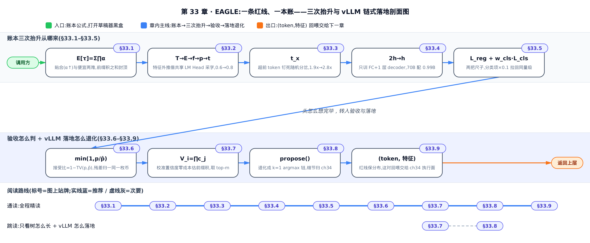

只关心 EAGLE-2 的动态树怎么长，直接跳 §33.7；只想知道 vLLM 真的跑的是哪种形态，§33.8 一节说清；想看这本账怎么一级级立起来，按序通读。

全章记号一张速查表（正文首现处仍有一句人话解释，忘了回来查即可）：

| 记号 | 含义 | 首次出现 |
|---|---|---|
| $`\gamma`$ | 每轮草稿 token 数（投机步长） | 开篇 |
| $`\alpha_i`$ | 第 $`i`$ 个草稿 token 被目标模型接受的概率 | 开篇 |
| $`f_j`$ | 目标模型第 $`j`$ 个位置的特征——LM Head 之前那层隐状态 | §33.2 |
| $`p`$ / $`\hat p`$ | 目标模型 / 草稿头给出的下一 token 分布 | §33.2 |
| $`c_j`$ | 草稿头对第 $`j`$ 步草稿 token 的置信度 | §33.2 |
| $`V_i`$ | EAGLE-2 的节点价值：根到该节点路径上置信度之积 | §33.7 |
| $`T_{2:i+1}`$ | 喂给草稿头的「超前一位」token 序列，从第 2 位到第 i+1 位——是 §33.2 记号 $`T_{1:j}`$ 整体下标后移一位，对应「左移一位」后塞进草稿头的那份超前 token 序列 | §33.5 |
| $`F_{1:i}`$ | 从第 1 步到第 i 步的历史特征序列，草稿头据此外推第 i+1 个特征 $`f_{i+1}`$ ——是单个特征记号 $`f_j`$ 的序列形式 | §33.5 |

---

## 33.1 动机：草稿的两个成本，和 token 层的天花板

开篇那本账拆开就是草稿模型的两个互相拉扯的成本：

```math
\mathbb{E}[\tau] = \sum_{i=1}^{\gamma} \prod_{j\le i} \alpha_j
```

1. **贴合**——草稿分布 $`\hat p`$ 要像目标分布 $`p`$ ，每一项 $`\alpha`$ 才高（§33.6 会证明 $`\alpha`$ 恰好等于 1 减去两分布的总变差距离）；
2. **便宜**——草稿每步前向要远比目标前向快，不然抬 $`\alpha`$ 省下的验证时间又被草稿自身吃回去。

历史上有两条路，各占一头。第一条：拿同系列的小模型当草稿，比如用 LLaMA2-7B 给 70B 当草稿（arXiv:2401.15077 §1）。贴合度不错，但 7B 本身不便宜——它自己也是个要占显存、要跑前向的完整 LLM，还得单独训练或挑选、单独部署维护，端到端加速有限。第二条：[Medusa](https://arxiv.org/abs/2401.10774)（与 EAGLE 几乎同期、2024 年初发布）那样，完全不另养草稿模型，直接在目标模型顶层特征上并行挂几个轻量解码头——每个头是一层 MLP（多层感知机），专职预测「未来第 $`k`$ 个位置」的 token（arXiv:2401.15077 §1）。便宜得很、部署也最省心，但准确率只有约 0.6——病根在「并行」二字：每个头看到的都是同一份特征、彼此独立各猜各的，猜第 2 个位置的头拿不到第 1 个位置的猜测结果，误差没法像自回归那样一步步消化，草稿分布和目标差得远，$`\alpha`$ 掉得厉害。

两条路之外还有一条更极端的「零训练」路线，下图里会露脸：[Lookahead Decoding](https://arxiv.org/abs/2402.02057)（前瞻解码，ICML 2024）。它连训练都省了——把逐 token 的自回归生成重新表述成一个方程组，用 Jacobi 不动点迭代（一种「所有未知数各自按上一轮的值并行更新、反复迭代直到收敛」的经典数值解法）同时刷新未来多个位置的猜测，再把迭代轨迹里反复冒出来的 n-gram（连续几个 token 的片段）攒进池子当候选草稿。零训练、零额外模型是它的卖点，代价是加速比温和（约 1.5x–2.3x 量级），而且和标准投机采样一样只在 token 层打转。

这几种方法结构上到底差在哪，摆在一起看最直接：


*四种方法起草第 4、5 个 token，结构差在哪：标准投机采样与 Lookahead 只吃 token 接龙；Medusa 独立用某一层特征并行猜；EAGLE 把 token 与特征一起逐步回喂，链式外推。*

选型的直觉一句话：手边有现成的同系列小模型、想零改造直接上，走小模型草稿；追求部署最简、能忍准确率打折，选 Medusa；连一次训练都不想跑，选 Lookahead；愿意付一次轻量草稿头的训练成本、换最高的贴合度——就是接下来的 EAGLE。

EAGLE 把前两条路各自占住的那一头都拿到了手：**既借目标模型的特征（便宜），又保持自回归（贴合）**，把草稿准确率拉到约 0.8——注意这个 0.8 是 §33.2、§33.3 两个观察**叠加后**完整 EAGLE 的端点读数，不是第一个观察独享的。支点是一个反直觉的观察——

**在特征层接龙，比在 token 层接龙更容易。**

token 是特征经采样塌缩后的有损投影：离散、跳变，把「模型本来在想什么」的大部分信息扔掉了；特征是连续向量，序列规整得多。所以「自回归地预测下一个特征、再用目标模型的 LM Head（语言模型头，把特征映射成词表分布的那层线性变换）把特征翻成 token」，比「直接自回归地预测下一个 token」要准（arXiv:2401.15077 §1，Fig.4）。便宜这一头则是白送的：目标模型每验证一轮，前向本身就把各位置的特征算了出来——草稿头的原料零成本，它只需在特征空间续一步。

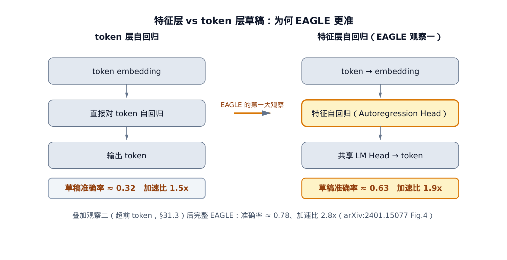

*左：token 直接接龙，准确率约 0.32、加速 1.5x。右：特征层自回归再过共享 LM Head，约 0.63、1.9x（论文 Fig.4 训练收敛后的读数）。特征更规整，是 EAGLE 第一大观察；上一段那个约 0.8 还要叠上 §33.3 的超前 token 才到手。*

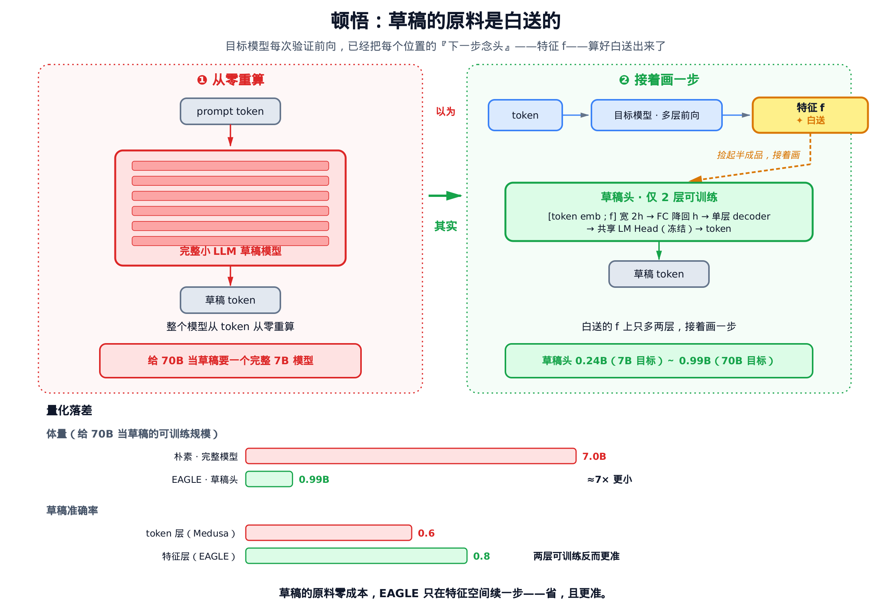

*全章一图：以为草稿要一个完整小 LLM 从 token 从零重算（给 70B 当草稿就得再养一个 7B）；其实目标模型每次验证前向已经把每个位置的「下一步念头」——特征——白送了出来，EAGLE 捡起这个半成品只接两层可训练结构（0.99B，约 7 倍更小），草稿准确率反而从 Medusa 量级的约 0.6 抬到完整 EAGLE 的约 0.8——省，且更准。*

这就是 EAGLE 名字里 Extrapolation（外推）的由来：它在特征空间里外推下一个特征。下一节把这个观察落成记号。

---

## 33.2 特征级自回归：在半成品语义上接着画

洞见一行：**草稿头不猜字，猜的是目标模型的「念头」——在特征上外推一步，再借目标模型自己的 LM Head 把念头翻译成字。** 打个比方：接着一幅铅笔草图往下画，比接着一段誊清的钢笔字往下写顺手得多。

先立记号（arXiv:2401.15077 §2）。目标模型的一次标准自回归是：

```math
T_{1:j} \rightarrow E_{1:j} \rightarrow f_j \rightarrow p_{j+1} \rightarrow t_{j+1}
```

token 序列 $`T_{1:j}`$ 过 Embedding（词嵌入层，把离散 token 查成向量）得到 $`E_{1:j}`$ ，再过整个网络得到特征 $`f_j`$ ，LM Head 把 $`f_j`$ 映射成分布 $`p_{j+1}`$ ，采样得到下一个 token $`t_{j+1}`$ 。这里 $`f_j`$ 就是「第二顶层特征」——LM Head 前的那个隐状态。

EAGLE 的草稿头不重跑整个网络，而是直接在 $`f`$ 这一层外推。它每步吃两样东西——一个 token 的词向量、一段特征——拼起来过一次降维、一层解码：

```math
\hat f_{j+1} = \mathrm{Decoder}\big(W_{\mathrm{fc}}\,[\,e_{j+1};\ f_j\,]\big),\qquad
\hat p_{j+2} = \mathrm{Softmax}\big(W_{\mathrm{LM}}\,\hat f_{j+1}\big)
```

逐个认符号：$`e_{j+1}`$ 是 token $`t_{j+1}`$ 查 Embedding 得到的词向量；$`[\,\cdot\,;\,\cdot\,]`$ 是沿最后一维拼接，宽度变成 $`2h`$ （ $`h`$ 为隐层宽度）；$`W_{\mathrm{fc}}\in\mathbb R^{h\times 2h}`$ 把拼接压回 $`h`$ 宽；$`\mathrm{Decoder}`$ 是一层标准 Transformer 解码层；$`W_{\mathrm{LM}}`$ 是 **目标模型自己的** LM Head——直接借用、不训练，所以草稿分布 $`\hat p`$ 与目标分布 $`p`$ 定义在同一套词表语言上。还要留意下标是故意错着位的：配 $`f_j`$ 的是 $`e_{j+1}`$ ——token 为什么必须比特征超前一位，是 §33.3 的主角，这里先照抄。

真实运行长什么样？用一个 6 词表、4 维特征的玩具目标模型跑一条 γ=4 的草稿链：

<!-- trace: feature-level-autoregression -->

| step 草稿步 | input token 输入 token | draft token 采出 token | confidence $`c_j`$ |
|---|---|---|---|
| 1 | 4 | 3 | 0.354 |
| 2 | 3 | 1 | 0.304 |
| 3 | 1 | 3 | 0.592 |
| 4 | 3 | 0 | 0.259 |

读表看两件事。其一，链式回喂肉眼可见：第 1 步 argmax（取概率最大的那个 token）采出 token 3，它正是第 2 步的输入；第 2 步采出 1，又成了第 3 步的输入——input 列恰是 draft 列整体下移一格。其二，产出 3→1→3→0 各不相同，没有退化成重复同一个 token。最后一列 confidence（置信度 $`c_j`$ ，草稿头给自己所出 token 的概率）先记下——§33.7 EAGLE-2 算路径价值时要复用它。

这条链有个干净的不变量：**恰好产出 γ 个草稿 token 就停**。第一遍前向采出第 1 个，随后再跑 γ−1 步、每步产 1 个，有限步必停，总数 1+(γ−1)=γ。而且每步只依赖上一步的 (token, feature)，不回看更早状态——严格的 **链式**（chain），不是树。这一点在 §33.7 会变成论文原理与 vLLM 落地的分水岭。

收益记回账上：本例 γ=4，只花 4 次轻量草稿头前向 + 1 次目标模型验证前向，就提出 4 个草稿 token；vanilla 解码要 4 次目标前向才出 4 个。论文 Fig.4（Vicuna 7B，MT-bench，温度 0）给出第一次抬升的读数：草稿准确率从 token 层约 0.32 提到特征层约 0.63，加速比从 1.5x 提到 1.9x（arXiv:2401.15077 §1，Fig.4）。§33.1 那个「约 0.6 → 约 0.8」是论文引言里 Medusa 与完整 EAGLE 的另一套整体读数，别拿它对 Fig.4 的三条消融曲线——约 0.8 要等 §33.3 把超前 token 叠上去（2.8x 那一档）才兑现。工程上，上面那条公式就是草稿模型前向的全部——拼接、降维、单层解码与式中三个算子逐项对应，落地代码见[下一章](../../ch34-spec-decode/narrative/chapter.md)。

不过光有特征还不够。公式里那个错位的 $`e_{j+1}`$ ，藏着 EAGLE 的第二个观察。

---

## 33.3 特征不确定性：为什么非要「剧透」超前一步的 token

洞见一行：**采样的随机性让同一个特征后面长出两条分支；把目标实际抽到的 token 剧透给草稿头，分岔就被钉成确定函数。** 这是论文标题里 feature uncertainty（特征不确定性）的确切含义。

只看「我」这个字的特征 $`f_I`$ ，你猜不出下一个词——可能是「我**总是**（always）」，也可能是「我**马上**（am）」。走哪条，取决于目标模型这一步实际抽到了谁。草稿头要是只吃 $`f_I`$ ，面对两条分支却只有一份输入，无从区分，只能预测一个两边都不像的「平均」特征。EAGLE 的破解办法简单得近乎作弊：知道抽到的是「总是」还是「马上」，下一个特征就唯一确定了。

形式化地说（arXiv:2401.15077 §1，Fig.3）：给定 $`f_I`$ ，下一特征 $`f_{\mathrm{next}}`$ 是随机的，因为它依赖尚未抽出的 token。但一旦把「超前一步的 token」 $`t_x`$ 也作为输入：

```math
f_{\mathrm{always}} \leftarrow (f_I,\ t_{\mathrm{always}}), \qquad f_{\mathrm{am}} \leftarrow (f_I,\ t_{\mathrm{am}})
```

这里的 $`\leftarrow`$ 读作「由……决定/预测得出」——和上面 §33.2 T→E→f→p→t 那条从左往右「变换成」的箭头方向相反，别混着读：那里是「输入变换成输出」，这里是「输出由哪些输入决定」。

每条分支就各自成了**确定的函数值**。不确定性没有消失，而是被 $`t_x`$ 这个「随机分支的选择结果」显式吸收掉了。这也正是 §33.2 公式里配 $`f_j`$ 的是 $`e_{j+1}`$ 的原因：喂给草稿头的 token 序列相对特征序列整体超前一位——token 剧透未来，特征提供语义底座，两者按位对齐。工程上这只是一手「把目标 token 序列整体左移一位、末位塞上一轮刚接受的 token」的输入构造，不改任何张量形状，代码见[下一章](../../ch34-spec-decode/narrative/chapter.md)。

用玩具模型复现这个分岔：固定同一个 $`f_I`$ （其 ‖f_I‖=0.659），只改喂进去的超前 token（0 与 2），看草稿头产出的下一特征：

<!-- trace: feature-uncertainty-shifted-token -->

| branch 分支 | t_I | shifted 末位 token | pred feature ‖f‖ | pred f[0] | top token | top conf |
|---|---|---|---|---|---|---|
| branch_A | 1 | 0 | 1.137 | 0.587 | 1 | 0.222 |
| branch_B | 1 | 2 | 0.85 | -0.38 | 4 | 0.213 |

两条分支共用同一个 $`f_I`$ ，只有超前 token 不同（0 vs 2）。草稿头产出的下一特征立刻分岔：范数 1.137 vs 0.85，第一维 f[0] 0.587 vs −0.38，符号都反了；LM Head 采出的 token 也随之不同（1 vs 4）。如果草稿头只吃 $`f_I`$ （feature-only 方案），两条分支的输入一模一样，输出必然相同——那就永远只能猜中一条。超前 token 正是把这份随机性钉死成确定映射的钉子。

不变量：草稿头的前向是纯函数（ $`W_{\mathrm{fc}}`$ 加一层 decoder，前向里没有任何随机源），固定 $`(t_x`$ 的 embedding $`,\ f_I)`$ 则输出唯一。分岔完全来自 $`t_x`$ 的取值；提供 $`t_x`$ ，不确定性即消除。

论文 Fig.4 量化了这一步的威力：在 feature-only（仅特征，准确率约 0.63、1.9x）的基础上，加入超前一步 token 把草稿准确率抬到约 0.78、加速比推到 2.8x——§33.1 说的「约 0.8」到这一档才真正兑现（arXiv:2401.15077 §1，Fig.4）。§4.3.2 的输入消融进一步排出座次：feature&shifted-token（EAGLE）> feature&unshifted-token > feature/token,差距主要落在「输入含一个错误特征时的接受率 1-α」上。

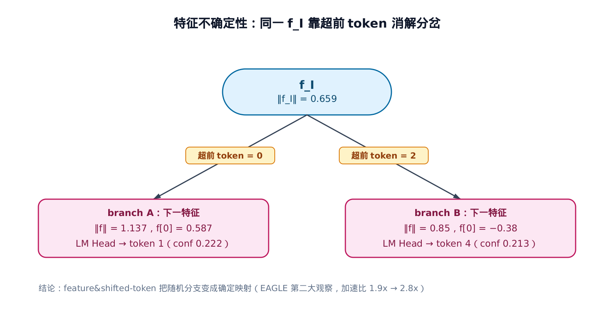

*同一个 f_I 无法定下一特征。标注在边上的超前 token 唯一决定走哪条分支。这是 EAGLE 第二大观察，1.9x→2.8x。*

论文原始实测长什么样？把两大观察的三级跳一次性画全：


*三种草稿输入（token 层、特征层、特征层+超前 token）在 Vicuna 7B / MT-bench（温度=0）上的准确率与加速比对比。本节讲的两级跳——准确率 0.32→0.63→0.78、加速比 1.5x→1.9x→2.8x——到此收束成一张图。*

---

## 33.4 Autoregression Head：一层 FC 加一层 decoder，其余全借

前两节的草稿头，结构上到底是个什么东西？EAGLE 给的答案朴素得惊人：**三个模块里只有两层需要训练，其余全部冻结借自目标模型**。

草稿模型三个模块（arXiv:2401.15077 §3.1，Fig.6）：Embedding、LM Head、Autoregression Head（自回归头）。前两个直接用目标模型的参数、**不训练**——Embedding 保证草稿和目标查的是同一套词向量，LM Head 保证 $`\hat p`$ 与 $`p`$ 说同一套词表语言；没有这两处「借」，让 $`\hat p`$ 贴近 $`p`$ 的一切努力都得先跨一道词表错位的坎。唯一要训练的 Autoregression Head 恰是 §33.2 公式里的那两个算子：FC 层（fully-connected，全连接线性层）$`W_{\mathrm{fc}}\in\mathbb R^{h\times 2h}`$ 把拼接后的 2h 宽向量降回 h 宽，一个 decoder 层预测下一特征。

输入输出的形状流转是这样：token 序列 (bs, seq) 过共享 Embedding 成 (bs, seq, h)，与目标特征 (bs, seq, h) 拼成 (bs, seq, 2h)；FC 降回 (bs, seq, h)；decoder 层产出下一特征。「2」这个拼接倍数是整个结构的枢纽——它就是「token 剧透 ⊕ 特征底座」两路输入的字面宽度。


*雪花标记的 Embedding/LM Head 用目标参数、不训练。只有 FC 和单层 decoder 需训练。*

草稿头轻到什么程度？可训练参数随目标模型规模走：7B 目标对应 0.24B、13B 对应 0.37B、33B 对应 0.56B、70B 也只有 0.99B（arXiv:2401.15077 §4，Training）。给 70B 的大象配一只不到 1B 的草稿头——账本的「便宜」一半就这样拿到了：抬 $`\alpha`$ 的机构本身几乎不占前向预算。这三个模块在 vLLM 里怎么装配、目标特征怎么接进草稿前向，拆解见[下一章](../../ch34-spec-decode/narrative/chapter.md)。

---

## 33.5 草稿头怎么训出来：两把尺子，与 0.1 的权重

这一节是纯原理背景。训练不在推理路径里——推理框架只加载已经训好的草稿头。但不讲训练目标，就说不清草稿头为什么「校准得好」（§33.7 动态树的地基），也说不清训练到底在账本上压的是哪个量（§33.6 揭晓）。所以把两把尺子的数字算实。

草稿头有两个目标，用两个损失盯着（arXiv:2401.15077 §3.2）。第一把尺子量「特征画得像不像」，用 Smooth-L1（平滑 L1 损失）做特征回归。这个损失就是统计学家 Peter Huber 1964 年在稳健回归（robust regression，研究「估计量如何不被离群数据带偏」的统计分支）中提出的 [Huber 损失](https://en.wikipedia.org/wiki/Huber_loss)：小误差段取平方——零点附近梯度平滑、收敛稳；大误差段改取线性——个别预测严重跑偏的样本不会像纯平方损失那样贡献爆炸梯度、把训练带偏。两段拼起来，正适合「大体要拟合得准、又难免偶尔外推翻车」的特征回归：

```math
L_{\mathrm{reg}} = \mathrm{SmoothL1}\big(f_{i+1},\ \mathrm{DraftModel}(T_{2:i+1},\ F_{1:i})\big)
```

这里 $`T_{2:i+1}`$ 就是 §33.3 那份左移一位的超前 token 序列， $`F_{1:i}`$ 是过去 i 步的历史特征序列——记号和 §33.2 的 $`T_{1:j}`$ 、 $`f_j`$ 是同一套，只是下标整体往后挪了一位（见前面的速查表）。

第二把尺子量「最终吐字对不对」。预测特征只是中间目标，终点是吐对 token,所以再加一个分类损失——把目标特征和预测特征各自过 LM Head、softmax 成分布，取交叉熵（arXiv:2401.15077 §3.2）：

```math
L_{\mathrm{cls}} = \mathrm{CrossEntropy}(p_{i+2},\ \hat p_{i+2})
```

两把尺子读数不在一个量级——分类损失天生比回归损失大一个数量级。所以合起来时给分类项乘 0.1 拉回同一量级（arXiv:2401.15077 §3.2）：

```math
L = L_{\mathrm{reg}} + w_{\mathrm{cls}}\, L_{\mathrm{cls}}, \qquad w_{\mathrm{cls}} = 0.1
```

手算两种情形——特征预测准、特征预测偏——看两把尺子各读多少：

<!-- trace: draft-training-objective -->

| scenario 情形 | L_reg (Smooth-L1) | L_cls (CE) | w_cls | w_cls·L_cls | L = L_reg + w_cls·L_cls |
|---|---|---|---|---|---|
| accurate 特征准 | 0.001 | 1.496 | 0.1 | 0.15 | 0.151 |
| inaccurate 特征偏 | 0.417 | 1.518 | 0.1 | 0.152 | 0.569 |

读表：特征预测越准，回归项 L_reg 越小（0.001 vs 0.417）。分类项 L_cls 始终在 1.5 附近——因为交叉熵的下界是目标分布的熵 $`H(p)>0`$ （信息熵，衡量目标分布 p 自身不确定性的量，只要 p 不是退化的 one-hot 分布就恒为正），不是 0，跟特征准不准关系不大。两情形对比正好印证 §3.2 那句「分类损失比回归损失大一个数量级」：准情形 1.496/0.001 差了约 1500 倍，偏情形 1.518/0.417 也差约 3.6 倍。分类项乘上 0.1 后约 0.15，和偏情形的 L_reg=0.417 同量级——这就是权重取 0.1 的定量动机。

不变量：组合损失恒非负，且分类项有正的熵下界。这一步「交叉熵 = 熵 + KL 散度」不是凭空甩出来的等式，而是信息论里的标准分解，任何信息论教材都能查到——这里把它展开一遍，看清「凭什么」成立：

```math
\mathrm{CrossEntropy}(p, \hat p) = -\sum_x p(x)\log \hat p(x) = -\sum_x p(x)\log p(x) + \sum_x p(x)\log\frac{p(x)}{\hat p(x)} = H(p) + \mathrm{KL}(p\,\|\,\hat p)
```

第一步只是交叉熵的定义；第二步是在被求和的每一项上同时加、减同一项再重新分组（恒等变形，不改变式子的值），逐元素地看就是

```math
-\log \hat p(x) = -\log p(x) + \log\frac{p(x)}{\hat p(x)}
```

拆出来的两块，第一块正是信息熵 H(p) 的定义，第二块正是 KL 散度的定义。于是

```math
L_{\mathrm{cls}} = \mathrm{CrossEntropy}(p, \hat p) = H(p) + \mathrm{KL}(p\,\|\,\hat p) \ge H(p) > 0
```

其中 KL（Kullback-Leibler 散度，衡量两分布差距的非负量）当且仅当 $`\hat p = p`$ 时取零（arXiv:2401.15077 §3.2）。下降只能靠 L_reg→0（特征拟合）和 KL→0（分布对齐），所以最小化确实同时逼近「特征像」与「吐字对」。论文另外加了一手数据增强：训练时给目标特征加 $`\mathcal U(-0.1, 0.1)`$ 的均匀噪声，抑制自回归推理时的误差累积。

这些机制不进推理路径，但它训出的草稿头有一个宝贵性质——**置信度校准得好**，§33.7 会靠它做零成本的动态树排序。

---

## 33.6 验收准则：接受、拒绝与残差分布

草稿提出来了，怎么验收？这一节把接受准则的数字算实，并兑现开篇的承诺：**接受率 $`\alpha`$ 恰好等于 1 减去 $`p`$ 与 $`\hat p`$ 的总变差距离**——账本与训练目标在这里合流。保分布定理的完整证明留给下一章 §34.5，这里只借结论。

验收员按「目标想要的概率 / 草稿给出的概率」掷骰子决定收不收：比值 ≥1 必收，<1 就以该比值为概率收。一旦退货，后面的草稿 token 全作废，并从「目标想要、但草稿没给够」的余量分布里补抽一个。

投机采样对草稿 token $`\hat t`$ 的接受概率（arXiv:2401.15077 §2）：

```math
\min\!\left(1,\ \frac{p_{j+i}(\hat t_{j+i})}{\hat p_{j+i}(\hat t_{j+i})}\right)
```

一旦拒绝，后续 token 全部丢弃，该位从残差分布重采（arXiv:2401.15077 §2）：

```math
\mathrm{norm}\big(\max(0,\ p_{j+i} - \hat p_{j+i})\big)
```

手算一条 γ=3 的链，逐位判接受：

<!-- trace: speculative-sampling-acceptance -->

| position 位 | draft token t̂ | p̂(t̂) 草稿概率 | p(t̂) 目标概率 | ratio min(1,p/p̂) | u | verdict |
|---|---|---|---|---|---|---|
| 1 | 1 | 0.7 | 0.6 | 0.857 | 0.3 | accept 收 |
| 2 | 0 | 0.55 | 0.5 | 0.909 | 0.5 | accept 收 |
| 3 | 3 | 0.75 | 0.5 | 0.667 | 0.9 | reject 退，从残差重采 token 0 |

读表：位 1、2 的随机数 u（0.3、0.5）小于接受比（0.857、0.909），收；位 3 的 u=0.9 超过接受比 0.667,退货，后续全弃。残差分布归一后是 [0.4, 0.4, 0.2, 0.0]:被拒的 token 3 残差质量被清零（max(0, 0.5−0.75)=0），从余量里补抽 token 0。

这个 [0.4, 0.4, 0.2, 0.0] 怎么来的？位 3 处目标分布 $`p`$ 和草稿分布 $`\hat p`$ 在整个 4 词词表上的取值都摆出来，逐元素算一遍就能亲手验证：

| token | p（目标分布） | p̂（草稿分布） | max(0, p−p̂) | 归一化残差 |
|---|---|---|---|---|
| 0 | 0.20 | 0.10 | 0.10 | 0.4 |
| 1 | 0.20 | 0.10 | 0.10 | 0.4 |
| 2 | 0.10 | 0.05 | 0.05 | 0.2 |
| 3（被拒 t̂） | 0.50 | 0.75 | 0.00 | 0.0 |

`max(0, p−p̂)` 那一列加总是 0.10+0.10+0.05+0.00=0.25；每个元素除以 0.25 归一化，正好得到 [0.4, 0.4, 0.2, 0.0]。

这张残差表还藏着本章账本的钥匙。草稿 token 是从 $`\hat p`$ 里抽出来的，所以一个位置整体的接受概率是对所有可能 token 的加权平均：

```math
\alpha \;=\; \sum_{t} \hat p(t)\,\min\!\left(1,\ \frac{p(t)}{\hat p(t)}\right)
\;=\; \sum_{t} \min\big(p(t),\ \hat p(t)\big)
\;=\; 1-\sum_{t}\max\big(0,\ p(t)-\hat p(t)\big)
```

第二个等号是逐项化简（ $`\hat p\cdot\min(1,p/\hat p)=\min(\hat p,p)`$ ）；第三个等号用恒等式 $`\min(a,b)=a-\max(0,a-b)`$ ，再用 $`\sum_t p(t)=1`$ 收拢。末项 $`\sum_t\max(0,p-\hat p)`$ 就是总变差距离（total variation distance，两分布逐点差的正部之和，度量它们最多在多少概率质量上不重合）——也正是上表 `max(0, p−p̂)` 一列的总和 0.25。代入：$`\alpha = 1-0.25 = 0.75`$ 。**残差分布归一化时除掉的那个常数，与这个位置的接受率，是同一个数的两面**：两分布逐点重叠多少就能接受多少，溢出多少就得拒绝多少。

> **严谨（训练损失如何压住接受率）**：$`\alpha = 1-\mathrm{TV}(p,\hat p)`$ ，而 Pinsker 不等式给出 $`\mathrm{TV}(p,\hat p)\le\sqrt{\mathrm{KL}(p\,\|\,\hat p)/2}`$ ——以苏联信息论学家 Mark Pinsker 命名的标准结论。直觉是：KL 是比总变差「更敏感」的差异度量，两分布只要在某处几乎不重叠它就会读出很大的值，所以 KL 一旦很小，总变差就被强行压小；注意反过来不成立——TV 很小时 KL 仍可任意大（支撑集稍有错位就能让 KL 发散）。此处不重证，精确表述与最紧常数的来历见 [Pinsker's inequality](https://en.wikipedia.org/wiki/Pinsker%27s_inequality)。于是 $`\alpha \ge 1-\sqrt{\mathrm{KL}(p\,\|\,\hat p)/2}`$ 。§33.5 分类损失里那个 KL 项在此显出工程真义：**训练最小化 KL，就是在直接抬高每个位置接受率的下界**——两把尺子里的分类尺，量的就是未来的 $`\alpha`$ 。代上表分布验证：$`\mathrm{KL}(p\,\|\,\hat p)\approx 0.144`$ ，下界 $`1-\sqrt{0.144/2}\approx 0.732`$ ，实际 $`\alpha=0.75`$ ，界成立且相当紧。

不变量：接受比落在 $`[0,1]`$;残差逐元素非负、归一后是合法分布；被拒 token 处 $`p-\hat p<0`$ 被截为 0,所以永远不会重抽到刚被拒的那个 token。链式验证遇首个拒绝即停。**输出分布严格等于目标模型采样**——这条保分布定理的完整证明（残差分布 + Gumbel-max 免归一化采样）在 [第 34 章：投机解码](../../ch34-spec-decode/narrative/chapter.md) §34.5,本章不重复。

为什么期望能这样按前缀积求和？链在位置 i 被接受，当且仅当前 i 位全部通过，其概率正是前 i 个接受比的连乘（前缀积）；对每个位置「是否被接受」这个 0/1 变量取期望、再对所有位置求和（期望的线性性——多个随机变量之和的期望，等于各自期望之和，不要求它们相互独立），就得到 E=Σ前缀积。

开篇那本账在本例的读数：逐位接受比 α=[0.857, 0.909, 0.667],前缀积 [0.857, 0.779, 0.519],期望被接受草稿数 $`\mathbb{E}[\tau]`$ =Σ前缀积=2.156,加 1 个 bonus token,平均每次目标前向产出 3.156 个 token。这落在论文实测平均接受长度 τ（average acceptance length,每次目标前向平均接受的 token 数）约 3.2–4.5 的量级内（arXiv:2401.15077 Table 1/2）——一次前向多吐三四个 token,加速就是这么来的。

链式验证还有优化空间：同一位置只有一个候选，第一个被拒就散场。下节的树验证给同一位置多备几个兄弟候选，拒了还能再试。

---

## 33.7 从链到树：树验证与 EAGLE-2 的动态草稿树

链式草稿一次目标前向只核一条路径。EAGLE 论文（§3.1、§3.3）和 EAGLE-2（arXiv:2406.16858）把它升级成**树**:一次前向核多条分支，期望接受长度更长。这里牵出两个机制——树验证的多轮投机采样，和 EAGLE-2 决定「长哪棵树」的 value 排序。

### 树验证：多轮投机采样

论文里的「树」到底长什么样？先看一眼真实规模，再讲验证规则：

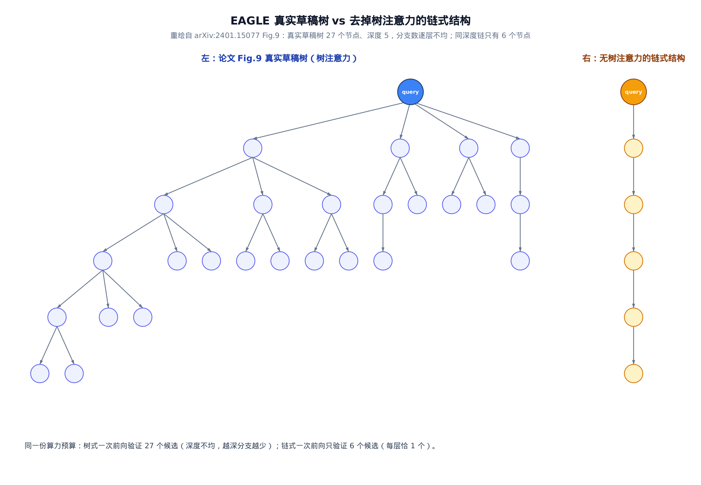

*左：论文 Fig.9 里 EAGLE 真实使用的草稿树（树注意力）。右：去掉树注意力后对应的链式结构。同一份算力预算，树式一次前向验证 27 个候选，链式只验证 6 个。*

链式：同一位置一个候选，拒了就停。树式：同一位置有 k 个兄弟候选，第一个被拒，把它的「概率余量」传给第二个候选再试一次——多一次机会，多接受一截。这就是多轮投机采样（multi-round speculative sampling,SpecInfer 同款),保证树草稿下输出分布仍等于目标模型。

> 直觉：这套「拒绝后转而尝试兄弟候选」的树验证并非 EAGLE 首创——SpecInfer（Miao et al., 2023，arXiv:2305.09781）更早把它系统化：让一组可并行、可异构的小模型生成一棵候选 token 树（而不是一条链），目标 LLM 把自己当「树验证器」，用树注意力一次前向核完整棵树上的所有候选路径，并严格证明验证结果的输出分布与目标模型独立采样完全一致。这里点名只为溯源；本章借 EAGLE 论文自己的 Appendix A.2 Algorithm 1 把多轮采样算法和终止性论证讲全，不读那篇论文也能照样往下走。

树的每个节点上，k 个兄弟候选依次判接受(arXiv:2401.15077 Appendix A.2, Algorithm 1)。和链式的区别就一处：某候选被拒时，**不**立刻从残差分布采，而是把目标分布调成残差分布，再拿下一个兄弟候选来试。全被拒才从最终残差分布采一个 fresh token。

手算一个节点、3 个兄弟候选(此处只展示前两轮就分出胜负):

<!-- trace: tree-draft-verification -->

| round 轮 | candidate token | p(t) 目标(当前) | p̂(t) 草稿 | ratio min(1,p/p̂) | u | verdict |
|---|---|---|---|---|---|---|
| 1 | 2 | 0.15 | 0.7 | 0.214 | 0.9 | reject 退，p ← norm(max(0,p-p̂)) |
| 2 | 0 | 0.545 | 0.55 | 0.992 | 0.2 | accept 收 |

读表：轮 1 候选 token 2,目标只给 0.15、草稿却给 0.7,接受比仅 0.214,u=0.9,拒；关键是不重采，而是把目标分布调成残差再试。轮 2 候选 token 0,在被抬高的残差分布下目标概率升到 0.545,接受比 0.992,u=0.2,收。**链式在轮 1 就会停在 0 个接受，树式却接住了 token 0**——这一截就是树验证的净赚。

不变量：多轮采样在 ≤k 个兄弟内终止(循环变量每轮 +1、上界 k);每轮拒绝后把目标分布调成残差分布，仍合法，下一轮判据良定义；树的各节点独立套用同一判据，整棵树验证仍保目标分布(arXiv:2401.15077 §3.3)。

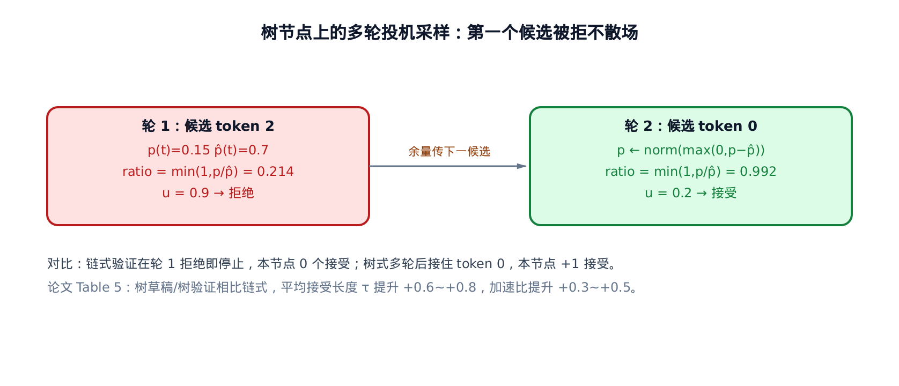

*候选 token 2 接受比 0.214、u=0.9 被拒，余量传下一候选。候选 token 0 接受比 0.992,接受。链式此处停在 0 接受。*

论文 Table 5 量化整体收益：树草稿/树验证相比链式，平均接受长度 τ 提升约 +0.6–0.8、加速比提升约 +0.3–0.5,且不增加前向次数、只增加每次前向处理的 token 数(arXiv:2401.15077 §4.3.1)。

顺带一句现实：多轮投机采样是论文原理，vLLM v1 的草稿路径还没接进来——预热代码里至今留着一行 `# FIXME: when using tree-based specdec, adjust number of forward-passes`，前向次数仍按链长线性数。树是规划，链是现实，这条落差在 §33.8 收束。

### EAGLE-2:用置信度之积决定长哪棵树

树能一次核多分支，但分支不能瞎长——算力有限。往哪长？洞见一行：**往账本增量最大的枝上长——每个节点对 $`\mathbb{E}[\tau]`$ 的贡献就是它的路径前缀积，而校准良好的草稿头能零成本估出这个积**。怎么在**不惊动目标模型**的前提下做到，是 EAGLE-2 的核心贡献。

先看第一手动机：为什么静态树不够用？

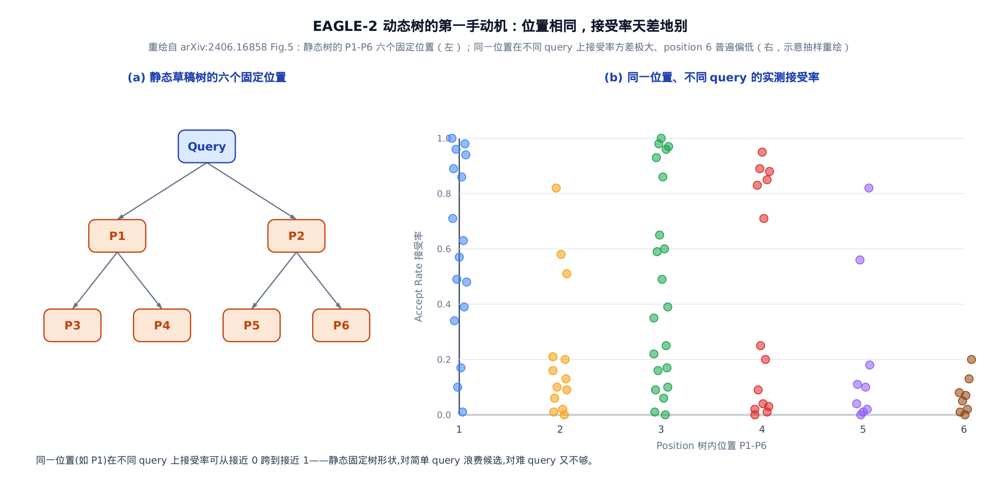

*同一个位置（比如 P1）在不同 query 上，实测接受率可以从接近 0 跳到接近 1——静态固定树形状，对简单 query 浪费候选，对难 query 又给得不够。*

静态树对好预测的位置和难预测的位置分配同样多候选，浪费算力——EAGLE-2 论文实测（上图 Fig.5）显示，同一位置在不同 query 上的接受率方差很大，不只跟位置有关，还跟上下文有关。这才是需要按上下文动态调整树形的动机。一个具体例子最能说明问题：

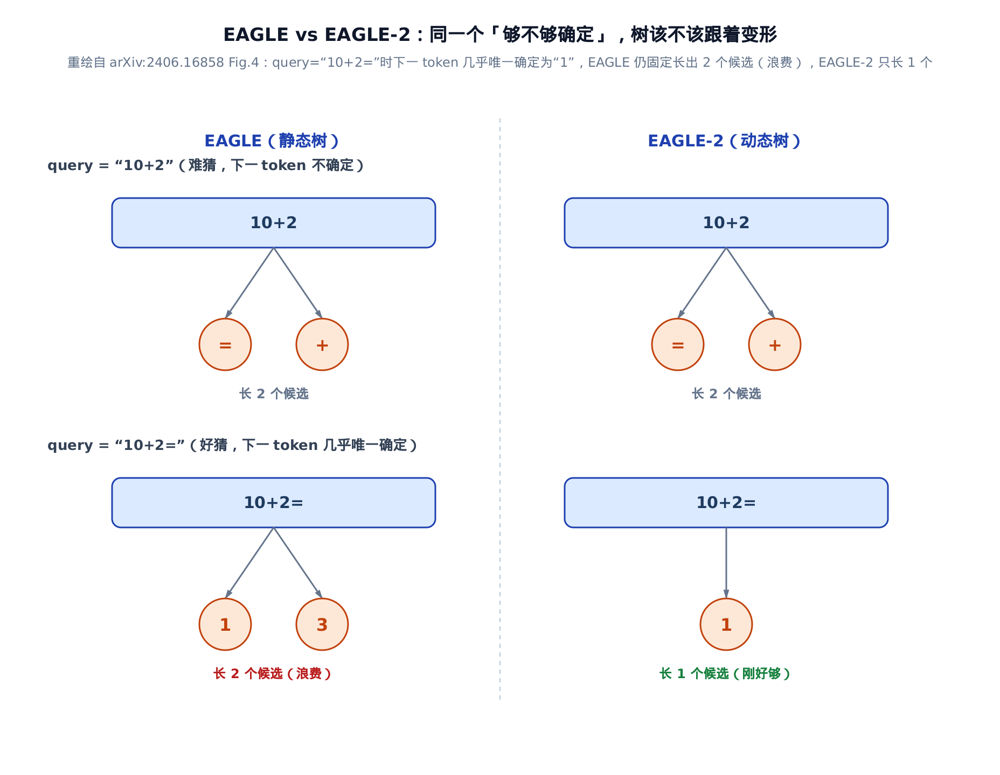

*同一个「够不够确定」，树该不该跟着变形：query="10+2"难猜时两种树都对，长 2 个候选；query="10+2="好猜时下一个 token 几乎唯一确定，EAGLE 的静态树仍固定长 2 个（浪费一个名额），EAGLE-2 的动态树只长 1 个（刚好够）。*

有了这条动机，再看 EAGLE-2 的解法。一条草稿路径能整条被接受，当且仅当路上每一步都被接受。所以它的「全局接受率」= 路径上各步接受率的连乘。麻烦是，真实接受率要目标模型前向才知道。EAGLE-2 的观察是：草稿头**校准得好**——它自己的置信度 c_j 约等于真实接受率 p_j（这里的 $`p_j`$ 是「该节点被接受」这一个标量概率，和 §33.6 $`p_{j+i}(\hat t)`$ 那种「目标分布在某个具体 token 上的取值」含义不同——两者只是字母撞了，不是同一个记号）。于是直接拿置信度连乘当路径价值 $`V_i`$,零成本给节点排序(arXiv:2406.16858 §4.1):

```math
V_i = \prod_{t_j \in \mathrm{Path}(\mathrm{root},\, t_i)} p_j \;\approx\; \prod_{t_j \in \mathrm{Path}(\mathrm{root},\, t_i)} c_j
```

这个 $`V_i`$ 的身份值得点破：它正是开篇账本里那个前缀积 $`\prod_{j\le i}\alpha_j`$ 的零成本估计——树上每个进入草稿的节点，被整条接受时恰好为 $`\mathbb{E}[\tau]`$ 贡献 1，贡献的概率就约等于 $`V_i`$ 。所以按 $`V`$ 取全树最高的 m 个节点，最大化的正是这本账的估计值。

动态树分两阶段(arXiv:2406.16858 §4.1、§4.2):**扩展阶段**每层只展开 value 最高的 top-k 节点向下长；**重排阶段**对全树的 value 取 top-m,摊平成一维草稿，并按树结构改注意力掩码(每个 token 只能看到它的祖先，即树注意力)。

手算一棵深度 2、每节点 2 叉的小树，看 value 怎么排序：

<!-- trace: eagle2-dynamic-draft-tree -->

| node 节点 | depth 深 | token | confidence c_j | value V=∏c | top-m 选中 |
|---|---|---|---|---|---|
| d0_t4 | 0 | 4 | 1.0 | 1.0 | yes |
| d1_t3 | 1 | 3 | 0.354 | 0.354 | yes |
| d1_t5 | 1 | 5 | 0.212 | 0.212 | yes |
| d2_t1a | 2 | 1 | 0.304 | 0.108 | yes |
| d2_t0a | 2 | 0 | 0.291 | 0.103 | no |
| d2_t1b | 2 | 1 | 0.354 | 0.075 | no |
| d2_t0b | 2 | 0 | 0.342 | 0.073 | no |

读表：根节点(已接受的起点)置信度固定 1.0、V=1.0。每个节点 $`V=`$ 从根到它路径上的置信度之积：d1 层 V=c(0.354、0.212),d2 层 V=父 V×c(如 d2_t1a=0.354×0.304=0.108)。重排取全树 top-m=4,选中 V 最高的 {根， d1_t3, d1_t5, d2_t1a}。

有个精妙的对照：**d2_t1b 的局部置信度 c=0.354 比 d2_t1a 的 0.304 更高，却落选**——因为它挂在价值更低的父节点 d1_t5 下，路径价值 V=0.075 反而更低。排序看的是全局 V,不是局部 c。

这背后有个不变量保证「选出来的一定是一棵连通子树」：value 随深度单调不增(arXiv:2406.16858 §4.2)——

```math
V_{\mathrm{child}} = V_{\mathrm{parent}} \cdot c_{\mathrm{child}} \le V_{\mathrm{parent}}
```

因为置信度 c∈[0,1]，所以父节点价值恒不小于子节点价值——这是单调性本身。当两个节点 value 相等时，排序规则「同值优先浅层」优先保留更浅的那个；这条打破平局的规则保证了：对任意被选中的节点，其父节点的排序键 $`(-V, \mathrm{depth})`$ 一定不劣于它自己（父节点 V 更大，或者深度更浅，两者任一都让排序键更优）。父节点排序键不劣，就必然也落在 top-m 之内——也就是说，只要某个节点被选中，它的父节点也一定被选中，选中集合对「取父节点」这个操作封闭。子树里任何被选中的节点都能沿父指针一路走回根、且全程留在选中集合内，这正是「连通」的含义(arXiv:2406.16858 §4.2)。这正是「用 ∏ 置信度近似 ∏ 接受率」能成立的结构前提。

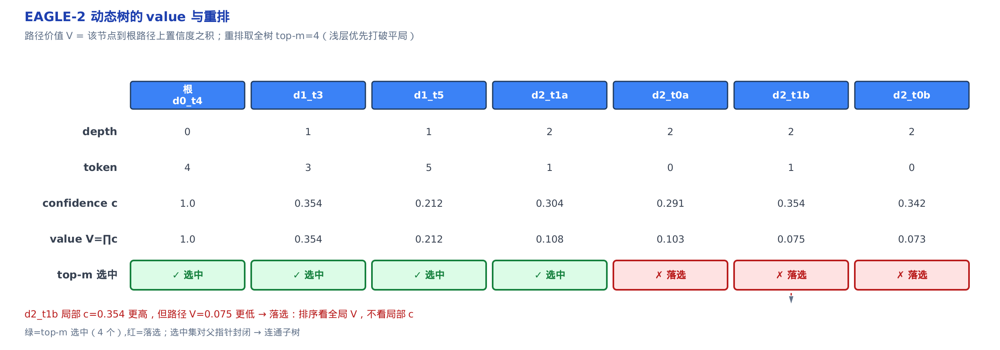

*value V=路径置信度之积，随深度递减。top-m 取全树最高 4 个。d2_t1b 局部 c 更高却因 V 更低落选。*

那「校准得好」这个前提，凭什么信？

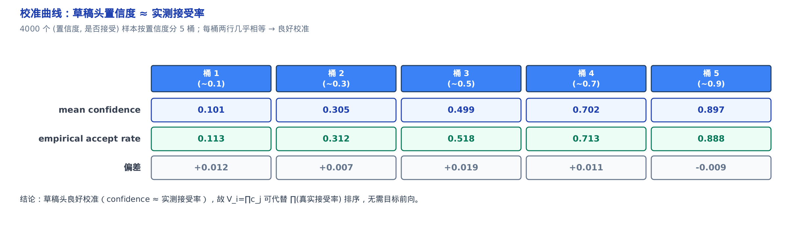

*4000 个样本按置信度分 5 桶。每桶均值几乎相等：0.101↔0.113、0.499↔0.518、0.897↔0.888。草稿头良好校准。*

把 4000 个 (置信度， 是否接受) 样本按置信度分 5 桶，每桶里「平均置信度」和「实测接受率」几乎相等(0.101↔0.113、0.305↔0.312、0.499↔0.518、0.702↔0.713、0.897↔0.888)——草稿头的自信度确实约等于真实接受率(arXiv:2406.16858 §3.2,Fig.6)。这就是 $`V_i=\prod c_j`$ 能代替真实接受率之积来排序、无需目标前向的合法性依据。而草稿头之所以校准得好，回头看正是 §33.5 那个交叉熵分类损失盯着「吐字对不对」训出来的。

---

## 33.8 落地：vLLM v1 的 EAGLE 是一条链

讲完论文那棵漂亮的动态树，落差必须说破：**vLLM v1 默认的 EAGLE 路径是链式，是 §33.7 全部树机制的 k=1 退化特例**。草稿循环（下一章的 `propose()` ）第一遍前向采出第 1 个草稿 token，随后跑 γ−1 步，每步把上一步采出的 token 和上一步产出的特征回喂、只保留 1 个 argmax token——没有兄弟候选、没有树注意力、没有多轮投机采样，正是 §33.2 那条链的字面执行。按架构模型图的站号，这条链从第 1 站发起：解码策略组里新展开的 EagleProposer（EAGLE 的草稿器实现）。§33.7 提到的那行 FIXME 就是这条落差的路标：树是规划，链是现实。在架构模型图里，这条链坐在 EngineCore 的解码策略层——和[第 30 章](../../ch30-sampling/narrative/chapter.md)的采样、[第 31 章](../../ch31-structured-output/narrative/chapter.md)的约束解码并排在同一组，草稿头的前向复用[第 18 章](../../ch18-model-runner/narrative/chapter.md)铺好的 ModelRunner 执行管线。


*首遍输入 [3,2,4](左移+塞 next_token=4)。随后四步回喂，产出 3→1→3→0。每步仅 1 个 argmax,无树。*

这张泳道图正好复现了 §33.2 那条 γ=4 的链：首遍对左移后的序列前向、采出草稿 token 3(c=0.354),随后逐步回喂产 1(0.304)→3(0.592)→0(0.259)——和那张逐步表一模一样，只是换成了「谁调用谁」的视角。按站号走，「猜」的部分（首遍前向＋逐步回喂）落在第 1 站的 EagleProposer 上；「左移＋塞 next_token」的装批，则是本章 6 站里落在第 18 章已讲执行组件上的那一站，由 ModelRunner 接手。

为什么草稿敢一律 greedy argmax，连温度、top-p 这些采样参数都不管？红线兜底：**草稿分布只影响接受率、不影响最终输出分布**。草稿猜得糙，顶多 $`\alpha`$ 低一点、慢一点，最终吐出来的文字分布分毫不差。落到账本上，链式形态就是 $`\mathbb{E}[\tau]=\sum\prod\alpha`$ 的求和只剩一条路径；EAGLE-2 的树是把求和范围扩到整棵连通子树——差距就是 §33.7 那 +0.6~0.8 的 τ。

执行面的其余一切——变长草稿怎么摊平进一批、目标特征与起点 token 怎么备料、验证时怎么逐位接受、被拒后怎么从残差重采——是[下一章](../../ch34-spec-decode/narrative/chapter.md)的主线，那里会把草稿器从入参到返回走通。在那套执行面里，EAGLE 只是一个实现了统一契约的草稿器：本章的全部数学，浓缩成它每步回喂的那一对 (token, 特征)。架构模型图里本章的 6 站，5 站落在解码策略组就地展开的橙色部件上——第 1 站 EagleProposer、第 3–4 与第 6 站 SpecDecodeBaseProposer（草稿契约容器）、第 5 站 EagleLlamaForCausalLM（顶着 LlamaForCausalLM 继承链的模型扩展）——另 1 站在第 18 章已讲的执行组件上。下一章沿着 EngineCore「执行与并行」组的 ModelRunner 更深处走，把这 6 站从入参到返回接完——本章停在草稿契约与算法，下一章接上执行面。

---

## 33.9 这章解决了什么

一条红线，一本账。红线是保分布定理：输出分布被锁死，草稿分布 $`\hat p`$ 只剩性能自由度。账是 $`\mathbb{E}[\tau]=\sum_i\prod_{j\le i}\alpha_j`$ ：一次目标前向能白拿几个 token，全由接受率的前缀积决定。EAGLE 的全部设计是账上的三次抬升：

- **特征级自回归**（§33.2）——草稿头在连续、规整的特征上外推一步，共享 LM Head 翻译回词表，草稿准确率约 0.32→0.63，加速 1.5x→1.9x；原料（目标特征）是验证前向白送的，抬 $`\alpha`$ 几乎不花钱。
- **超前一步 token**（§33.3）——采样注入的随机分岔被剧透的 token 显式吸收，草稿头成为确定函数，准确率约 0.63→0.78、加速 1.9x→2.8x。
- **从链到树**（§33.7）——同一次目标前向核一棵连通子树，把账本的求和范围从一条路径扩到 top-m 个节点；EAGLE-2 用校准良好的置信度之积 $`V_i=\prod c_j`$ 零成本估计每个节点的前缀积，让树往账本增量最大的枝上长（τ +0.6~0.8）。

训练目标与验收准则在账上合流：分类损失的 KL 项经 $`\alpha\ge 1-\sqrt{\mathrm{KL}/2}`$ 直接压住每个位置接受率的下界（§33.6）；残差分布的归一化常数与 $`1-\alpha`$ 是同一个数——重叠即接受，溢出即拒绝。轻，则来自「只训两层」：$`W_{\mathrm{fc}}`$ 加一层 decoder，70B 目标只配 0.99B（§33.4）。

vLLM v1 的落地是这一切的最简退化：一条 argmax 链，k=1、无树注意力，FIXME 是从链到树尚未跨过去的路标（§33.8）。这条链怎么摊平进一批、怎么喂目标模型、逐位接受怎么执行——交给[下一章](../../ch34-spec-decode/narrative/chapter.md)的执行面：那里 EAGLE 只是统一契约下的一个草稿器，而无论它猜得多准多糙，红线保证输出分布分毫不差。
