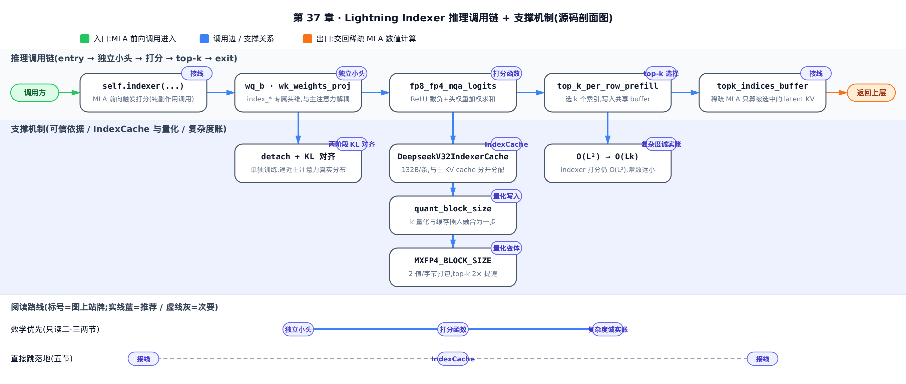
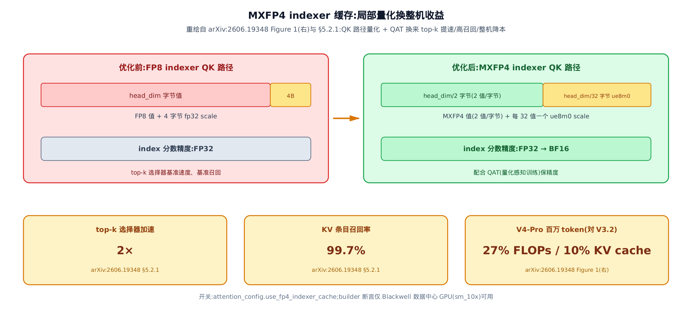

# 第 37 章　【原理篇·论文精读】Lightning Indexer 与 IndexCache：一个便宜到敢扫全历史的打分器

## 你在这里


上一章把注意力后端的元数据抽象讲透了：一份 metadata 喂饱所有 kernel，稠密因果注意力照着 slot mapping 在 KV cache 上取数、算数。再往前，量化数学那一章讲清了 scale/zero-point 与 FP8/FP4 怎么用更少的比特装下同一个张量。这两条线在本章交汇：DeepSeek-V3.2/V4 的稀疏注意力（DeepSeek Sparse Attention，简称 DSA）在主注意力之前塞进一个**独立的小打分器**——lightning indexer（闪电索引器）——它替每个 query 把「该看历史里的谁」先挑出来，主注意力只在被挑中的少数条目上算。

这个打分器有多便宜，便宜到什么代价，它凭什么可信，它自己那份缓存为什么必须和主 KV cache 分开——这四问就是本章要拆的四层。下一站的[模型架构章](../../ch27-model-architecture/narrative/chapter.md)会把这套索引器接回 DeepSeek 的完整前向；本章先把索引器本身从公式到源码钉死。



> **选读指引**：只想拿走「打分公式怎么算、复杂度账怎么记」，读 §二、§三 两节的数学与数值推演即可；想看它在 vLLM 里怎么落地成真实的类与缓存，直接跳 §五。想从头顺着读，按序即可。

### 先修：不懂这三样也能跟上

> **MLA（Multi-head Latent Attention，多头潜在注意力）**：DeepSeek 把每个历史 token 的 KV 压成一个低秩「latent 向量」存起来，主注意力在这些 latent 上算。你只需要接受一件事：主注意力真正消费的 KV 条目是这些压缩过的 latent，而不是原始的 K/V。本章的索引器就是在这些 latent 上打分选块。

> **稀疏注意力谱系（NSA，Native Sparse Attention，arXiv:2502.11089）**：削减 $O(L^2)$ 注意力税的思路最早由 NSA 系统化——用「压缩 + 选择 + 滑窗」三条支路并行打分，训练推理共用一套稀疏模式。你不需要看它的三支路设计，只要接受「先给历史 token 打分、再按分选一小撮」这个套路是成立且可训练的。DSA 是这条谱系在生产模型上的一支落地，只保留「打分 + top-k」这一路。

> **FP8 / MXFP4（低精度定点）**：把一个浮点值用 8 bit（甚至 4 bit）近似存储，配一个共享的缩放因子 scale 还原量级。你只需要接受「精度换吞吐」这个交易存在、且量化会带来有界误差——具体的位模式与 scale 数学见量化数学那一章，本章直接用结论。

### 符号速查表

| 符号 | 含义 | 首现 |
|---|---|---|
| $I_{t,s}$ | 打分器给出的「query $t$ 该不该看历史 token $s$ 」的分数，越大越该看 | §二 Eq.(1) |
| $H^{I}$ | indexer 头数，独立于主注意力头数的一小撮专用头（vLLM 里 `= config.index_n_heads`） | §二 Eq.(1) |
| $w_{t,j}^{I}$ | 第 $j$ 个 indexer 头的标量权重，决定这个头的意见占多少话语权 | §二 Eq.(1) |
| $q_{t,j}^{I}$ | query $t$ 的第 $j$ 个 indexer query 向量（低秩投影出来，可 FP8） | §二 Eq.(1) |
| $k_s^{I}$ | 历史 token $s$ 的 indexer key，跨所有头共享同一份（MQA 式） | §二 Eq.(1) |
| $d^{I}$ | indexer 头维，通常远小于主注意力头维——「小头」的「小」 | §二 Eq.(1) |
| $\mathrm{ReLU}$ | 把负相关点积截为 0、只留正相关证据的激活；论文明说为吞吐才选它而非 softmax | §二 Eq.(1) |
| $u_t$ | query $t$ 的主注意力输出，只在被选中的 KV 条目上算出来 | §二 Eq.(2) |
| $c_s$ | 第 $s$ 个 latent KV 条目（MLA 压缩后的 KV，主注意力真正消费的东西） | §二 Eq.(2) |
| $\operatorname{Top-k}$ | 取分数最大的 $k$ 个历史条目——细粒度 token 选择 | §二 Eq.(2) |
| $p_{t,:}$ | 主注意力各头求和再沿序列 L1 归一得到的目标分布——indexer 要模仿的「标准答案」 | §四 Eq.(3) |
| $\mathcal{L}^{I}$ | 只监督 indexer 的 KL 对齐损失（主模型的语言建模损失不流进 indexer） | §四 Eq.(3) |
| $\mathcal{S}_t$ | query $t$ 被选中的历史 token 集合，即 $\operatorname{Top-k}(I_{t,:})$ | §四 Eq.(4) |
| $K^{IComp}$ | 索引器专属的压缩 key：每 $m$ 个 token 压成 1 个，与主压缩 KV 并行产出、各自缓存 | §五 Eq.(16) |
| $C^{Comp}$ | 主注意力用的压缩 KV 条目（每 $m$ 个原条目压成 1 个） | §五 Eq.(16) |
| $n_h^{I}$ | indexer 头数（V4 记号，与 V3.2 的 $H^{I}$ 等价） | §五 Eq.(16) |
| $c^{I}$ | indexer 压缩 key 的头维——与主注意力头维无关，这是 IndexCache 独立布局的根 | §五 Eq.(16) |
| $m$ | 压缩比：每 $m$ 个 KV 条目压成 1 个压缩块，序列长实际缩到 $1/m$ | §五 |

---

## 二、DSA 的原型：一个小评委会给全历史打分

### 直觉：一个便宜到敢扫全场的评委会

把 lightning indexer 想成一个由几位「快速阅卷官」组成的小评委会。对于当前这个 query token $t$ ，每位阅卷官（一个 indexer 头）拿自己的眼光，给「 $t$ 和历史 token $s$ 有多相关」打一个分——就是一次 $q \cdot k$ 点积。打出负分的（负相关）直接当 0 处理，不倒扣；最后按每位阅卷官的话语权 $w$ 加权汇总成一个总分 $I_{t,s}$ 。

这个评委会关键在于**小**且**粗**：头少、头维小、可以用 FP8 打分、不需要反向传播。正因为它这么便宜，它才敢做一件昂贵机制做不起的事——给每个 query，对**全部**历史 token 都打一遍分。打完分，才轮到真正贵的主注意力上场，而主注意力只在被这个评委会点名的少数条目上算。

### 机制：Eq.(1) 打分函数

索引分数 $I_{t,s}$ 衡量 query token $\mathbf{h}_t$ 与它之前某个 token $\mathbf{h}_s$ 的相关性，定义如下（arXiv:2512.02556 §2.1「Prototype of DSA」Eq.(1)）：

$$
I_{t,s} = \sum_{j=1}^{H^I} w_{t,j}^I \cdot \mathrm{ReLU}\left(\mathbf{q}_{t,j}^I \cdot \mathbf{k}_s^I\right)
$$

逐项拆开这个式子： $H^I$ 是 indexer 头数； $\mathbf{q}_{t,j}^I \in \mathbb{R}^{d^I}$ 是 query $t$ 在第 $j$ 个头上的 indexer query 向量、 $w_{t,j}^I \in \mathbb{R}$ 是这个头的标量权重，两者都从 $\mathbf{h}_t$ 投影而来； $\mathbf{k}_s^I \in \mathbb{R}^{d^I}$ 是历史 token $s$ 的 indexer key，从 $\mathbf{h}_s$ 导出，且**跨所有头共享同一份**（MQA 式）。论文明确写了：选 ReLU 而非 softmax 是「for throughput consideration」——ReLU 只保留正相关证据、把负相关截为 0，比 softmax 省去了指数与归一化。

这三步——逐头点积、ReLU 截负、按头权重加权求和——就是打分器的全部数学。下图把 $t_0$ 这一行的装配过程拆成三列：


### 数值：两头两维，逐格心算一遍

抽象公式不如一组能心算的数字扎实。取一个刻意做小的例子： $T=2$ 个 query token、 $H^I=2$ 个 indexer 头、头维 $d^I=2$ 、 $S=4$ 个历史 token。key 特意设成 `k = [[1,1], [-1,2], [2,-3], [0,0]]`，让某些头对 $s_1$ 、 $s_2$ 的点积为负，好真实触发 ReLU 的截零分支。把 Eq.(1) 逐格算出来：

<!-- trace: index-score-formula -->

| query · head | q·k 点积 (s0,s1,s2,s3) | ReLU 后 | 头权重 w | 对 I 的贡献 (w × ReLU) |
|---|---|---|---|---|
| t0 · head0 | 1, -1, 2, 0 | 1, 0, 2, 0 | 1 | 1, 0, 2, 0 |
| t0 · head1 | 1, 2, -3, 0 | 1, 2, 0, 0 | 2 | 2, 4, 0, 0 |
| t0 · I = 两头加权求和 | — | — | — | 3, 4, 2, 0 |
| t1 · head0 | 2, -2, 4, 0 | 2, 0, 4, 0 | 1 | 2, 0, 4, 0 |
| t1 · head1 | 1, 2, -3, 0 | 1, 2, 0, 0 | 1 | 1, 2, 0, 0 |
| t1 · I = 两头加权求和 | — | — | — | 3, 2, 4, 0 |

顺着 $t_0$ 那三行看：head0 的点积 `1, -1, 2, 0` 里那个 $-1$ （ $s_1$ 负相关）被 ReLU 截成 `1, 0, 2, 0`；head1 的 `1, 2, -3, 0` 里的 $-3$ 被截成 `1, 2, 0, 0`。两头分别乘权重 $1$ 、 $2$ 再相加，得 $I(t_0) = $ `3, 4, 2, 0`。 $s_1$ 本来在 head0 上是负相关（被截零），却靠 head1 的强正相关（ $2 \times 2 = 4$ ）冲到全场最高分 $4$ ——这就是「不同头话语权可学习地加权」的意义。

### 不变量：ReLU 给了总分一个下界

这个例子里所有头权重 $w > 0$ ，于是每个头的贡献项 $w_{t,j} \cdot \mathrm{ReLU}(\cdot)$ 都非负，加权和仍非负—— $I_{t,s}$ 有下界 $0$ 。换句话说，某个历史 token 哪怕在每个头上都负相关，它的总分也只会被截到 $0$ ，**绝不会被拉成负数去倒扣**。而且对固定的 $s$ ，某个头的正相关证据变强时，它对总分的贡献系数就是 $w_{t,j} > 0$ ，所以总分只增不减——打分对「正相关证据」单调。（注意：一般情形 $w$ 可以为负，这条单调性只在本例 $w>0$ 的前提下成立。）

放大到真实 config，这个小评委会有 $H^I = 64$ 个头、每头 $128$ 维，每个 $(t,s)$ 对是 $64$ 次长度-$128$ 的点积再加权。但全程 FP8、无 softmax、无反向——单个分数即便要扫全部历史，也远比一次主 MLA 全头计算便宜。这正是它敢扫全场的底气。

### 机制：Eq.(2) top-k 选择

打完分，`fine-grained token selection` 只保留分数最高的 $k$ 个条目对应的 latent KV，主注意力（ $\mathrm{Attn}$ ，即标准缩放点积注意力）用 query 隐藏向量 $\mathbf{h}_t$ 在这批稀疏子集上算输出 $\mathbf{u}_t$ （arXiv:2512.02556 §2.1 Eq.(2)）：

$$
\mathbf{u}_t = \mathrm{Attn}\left(\mathbf{h}_t, \left\{\mathbf{c}_s \mid I_{t,s} \in \operatorname{Top-k}(I_{t,:})\right\}\right)
$$

这里 $\mathbf{c}_s$ 是第 $s$ 个 latent KV 条目， $\operatorname{Top-k}(I_{t,:})$ 取分数最大的 $k$ 个索引。**直觉**：打完分不是全班都进考场，而是老师按总分从高到低点名，只叫前 $k$ 名进来做主注意力这道大题，其余人连同他们的 KV 当场散会。点名结果写在一张全班共享的名单上，主注意力只照名单取人、不关心分是怎么打的；名单没坐满的位置填 $-1$ ，表示「这里没人，别取」。

### 数值：从上一张表的两行分数挑 top-2

直接复用刚才算出的两行 $I$ ，每行选 top-2，写进一张宽度为 $3$ 的共享 buffer（第 3 位用 $-1$ 填充，演示空槽标记）：

<!-- trace: topk-selection -->

| query token | I_{t,:} | 按分降序的索引（stable） | top-2 索引 | buffer 行（宽 3，-1 填充） |
|---|---|---|---|---|
| t0 | 3, 4, 2, 0 | 1, 0, 2, 3 | 1, 0 | 1, 0, -1 |
| t1 | 3, 2, 4, 0 | 2, 0, 1, 3 | 2, 0 | 2, 0, -1 |

$t_0$ 的分数 `3, 4, 2, 0` 降序索引是 `1, 0, 2, 3`（ $s_1$ 分最高、 $s_3$ 分最低），取前 2 得 `1, 0`，写进 buffer 是 `1, 0, -1`。

### 不变量：选择正确 + 确定性 + 空槽标记

三条一起成立：选出的 top-$k$ 集合里**最小的分数 ≥ 落选集合里最大的分数**（选择的正确性——argsort 给出分数的全序，取前 $k$ 即所有被选者分数不低于所有落选者）；并列分数时**索引小者优先**（这是稳定排序的一般性质——本例两行分数恰好无并列，但一旦出现并列，稳定排序保证同一 logits 恒得同一集合，确定性）；buffer 未写满的位**恒为 $-1$**，下游据此丢弃，绝不会把无效槽当成真索引。

本例每行从 $S=4$ 个里选 $2$ 个，保留 50%。放大到真实场景，`index_topk = 2048`、 $L = 131072$ （128k），只有 $2048/131072 \approx 1.56\%$ 的历史条目进主注意力——其余约 $98\%$ 被 top-k 当场筛掉。这 1.56% 就是主注意力从 $O(L^2)$ 掉到 $O(Lk)$ 的开关。

---

## 三、复杂度诚实账： $O(L^2)$ 没被消灭，只是换了账户

### 直觉：门票没取消，只是先刷便宜的脸

一个诚实的说法很重要：DSA 并没有**消灭**那笔 $O(L^2)$ 的税。打分器仍然要给每个 query 扫全部历史（ $O(L^2)$ 一分没跑掉），只是把这笔开销从贵的账户换到便宜的账户。就像门票没取消，只是把「全场每人都查一遍身份证」换成「先用便宜的人脸快筛，再让通过的少数人走贵的安检」。

论文把这句话写得很直白（arXiv:2512.02556 §2.3「Inference Costs」）：

> DSA reduces the core attention complexity of the main model from $O(L^2)$ to $O(Lk)$, where $k$ ($\ll L$) is the number of selected tokens. Although the lightning indexer still has a complexity of $O(L^2)$, it requires much less computation compared with MLA ... DSA achieves a significant end-to-end speedup in long-context scenarios.

主注意力从 $O(L^2)$ 降到 $O(Lk)$ ，而 indexer 打分自己仍是 $O(L^2)$ ——但常数远小（少头、可 FP8/FP4、无反向）。

### 数值：L=8 逐 token 心算，再代入 128k

先用一个 $L=8$ 、 $k=2$ 的小例子把「核算对数」逐 token 数清楚。稠密因果注意力对第 $t$ 个 query 要核算 $t+1$ 个历史 token；稀疏时每个 query 封顶 $\min(t+1, k)$ 个。indexer 打分仍扫全场，但取一个 $0.25\times$ 的单价代表「少头 / 低精度」：

<!-- trace: complexity-honest-account -->

| 项目 | 复杂度 | 本例算式（L=8, k=2） | 核算对数 |
|---|---|---|---|
| 主注意力 · 稠密因果 | O(L²) | 每 query 扫全部历史，L=8 | 36 |
| 主注意力 · 稀疏 top-k | O(Lk) | 每 query 封顶 k=2 | 15 |
| indexer 打分（单价 0.25×） | 仍 O(L²) | 36 × 0.25 | 9.0 |
| 主注意力加速比 | dense ÷ sparse | 36 ÷ 15 | 2.4 |

稠密项 $36 = 1+2+\dots+8$ ；稀疏项 $15 = 1+2+2+2+2+2+2+2$ （前两个 query 历史不够 $k$ 个、退化为稠密，其余封顶 2）；主注意力加速比 $36 / 15 = 2.4$ 。

### 不变量：收益只在长上下文才积累

对每个 query $t$ ，稀疏核算数 $\min(t+1, k) \le$ 稠密核算数 $t+1$ 逐 $t$ 成立，求和后 sparse ≤ dense、加速比 ≥ 1 **恒成立**。当 $t+1 \le k$ （因果早期、历史还不够 $k$ 个）时两者相等，收益为零。所以 $L \gg k$ 时稠密总量 $\approx L^2/2$ 、稀疏总量 $\approx Lk$ ，比值 $\approx L/(2k)$ 随 $L$ 线性放大——这解释了为何 DSA 是**长上下文**优化，短序列几乎不省。

代入真实长上下文 $L = 131072$ （128k）、 $k = 2048$ ：主注意力核算对数从稠密 $8590000128$ 降到稀疏 $266339328$ ，加速约 $32\times$ （精确 $32.252090566211834$ ）；而 indexer 自身打分仍是 $O(L^2)$ （ $2147500032$ 对，取 $0.25\times$ 单价后仍与 $L^2$ 同阶）。 $O(L^2)$ 项没被消灭，只是换成了便宜账户——这也是 vLLM prefill 侧要按 logits 预算分块直面的那笔 $O(L^2)$ 内存，稍后 §五 会看到。

---

## 四、为什么这个便宜的打分器值得信？

### 直觉：它是被专门教出来的，不是随手写的启发式

一个这么便宜、这么粗（ReLU + FP8）的打分器，凭什么相信它挑的 $k$ 个条目就是主注意力真正想看的？因为它是被**专门训练**过的。训练时冻住主模型、只训 indexer，用一条 KL 损失逼它的打分分布去贴近主注意力真实分配的注意力质量；而且把 indexer 的输入从计算图 detach 掉——indexer 只吃自己这条 KL 梯度，主模型只吃语言建模损失，两条梯度互不串味。所以推理时它是个便宜但**语义对齐**的路由器，而不是随手写的启发式。

### 机制：Eq.(3)(4) 两阶段 KL 对齐

先是 Dense Warm-up 阶段（arXiv:2512.02556 §2.1.1）：保持稠密注意力、冻结除 indexer 外的所有参数。**直觉**：要让 indexer 学会模仿主注意力，先得有一份「主注意力到底把注意力放在了哪里」的标准答案。对第 $t$ 个 query，把主注意力**每个头**分给历史位置 $s$ 的注意力权重（softmax 之后、非负的分配比例）跨全部 $H$ 个头求和得到 $a_{t,s}$ ，再沿序列维做 L1 归一化，得到落在 $t$ 个历史位置上的目标分布 $p_{t,:} \in \mathbb{R}^t$ ：

$$
p_{t,s} = \frac{a_{t,s}}{\sum_{s'=1}^{t} a_{t,s'}}, \qquad a_{t,s} = \sum_{h=1}^{H} A_{t,s}^{(h)}
$$

式中 $A$ 记主注意力权重， $A_{t,s}^{(h)}$ 是它第 $h$ 个头从 query $t$ 分给历史 token $s$ 的那一项， $H$ 是主注意力头数；跨头求和记为 $a$ ，逐项即 $a_{t,s}$ 。因为各头权重非负， $a$ 的 L1 范数就等于行和，所以除以行和后 $p_{t,:}$ 是一个真正的概率分布（各项非负、和为 $1$ ）——这正是下一步能用 KL 散度度量的前提。indexer 的训练目标就是让它打分的 softmax 去逼近这个 $p$ ：

$$
\mathcal{L}^I = \sum_t \mathbb{D}_{KL}\left(p_{t,:} \parallel \mathrm{Softmax}(I_{t,:})\right)
$$

$\mathbb{D}_{KL}$ 是 KL 散度，衡量「indexer 打的分 softmax 后」离「目标分布」有多远。等 indexer 热身完，进入 Sparse Training 阶段——引入 top-k 选择、放开所有参数。这一阶段主注意力真正跑的就是 top-k 之后的稀疏模式：它只会消费被选中的那 $k$ 个条目，所以 indexer 也只需要把这批会真正进场的 token 排对，没必要再为那些注定被丢弃的 token 花对齐信号。于是对齐目标也随之收窄——只在被选中的集合 $\mathcal{S}_t = \operatorname{Top-k}(I_{t,:})$ 上做（arXiv:2512.02556 §2.1.1 Eq.(4)），让训练目标与推理时的稀疏消费方式对齐：

$$
\mathcal{L}^I = \sum_t \mathbb{D}_{KL}\left(p_{t,\mathcal{S}_t} \parallel \mathrm{Softmax}(I_{t,\mathcal{S}_t})\right)
$$

论文特别点出：`we detach the indexer input from the computational graph for separate optimization`——indexer 的训练信号只来自 $\mathcal{L}^I$ ，主模型只按语言建模损失优化。这就是「独立小头」在训练侧的根据。

### 直觉：一套自带的独立小班子

进源码前先把「独立」这件事的直觉单独钉一次——它和上面训练侧的独立是两回事、互为表里。indexer 不是从主注意力那里「借」几个头来用，而是自带一整套完全独立的小班子：自己的 query 上投影、自己融合出 key 与逐头权重的一枪 GEMM、自己的归一化、甚至自己的 RoPE 和自己的缓存。它的头数、头维全部来自 config 里 `index_` 前缀的独立字段，跟主注意力有多少头、每头多宽毫无关系。这份**架构上的独立**——把「决定看哪里」与主注意力的「看完怎么算」彻底解耦——正是它敢做得又小又低精度的前提。下面这段源码就是这份架构独立在推理侧留下的字面实锤。

### 源码：分离参数在推理侧留下的实锤

KL 损失本身是训练期概念（vLLM 不含反向），但「indexer 是一套独立、可单独 detach 优化的参数」这件事，在推理侧的 vLLM 里留下了清清楚楚的实锤——indexer 有自己的一整套投影，还有专门的 FP8 indexer 权重加载路径。看 `Indexer` 的构造（`vllm/model_executor/models/deepseek_v2.py:L621-L659`）：

```python
# vllm/model_executor/models/deepseek_v2.py:L621-L659
        self.topk_tokens = config.index_topk
        self.n_head = config.index_n_heads  # 64
        self.head_dim = config.index_head_dim  # 128
        self.rope_dim = config.qk_rope_head_dim  # 64
        self.q_lora_rank = q_lora_rank  # 1536
        # no tensor parallel, just replicated
        self.wq_b = ReplicatedLinear(
            self.q_lora_rank,
            self.head_dim * self.n_head,
            bias=False,
            quant_config=quant_config,
            prefix=f"{prefix}.wq_b",
        )
        # Fused wk + weights_proj: single GEMM producing [head_dim + n_head].
        # FP8 wk weights are upcasted to BF16 during loading to maintain fusion.
        self.wk_weights_proj = MergedColumnParallelLinear(
            hidden_size,
            [self.head_dim, self.n_head],
            bias=False,
            quant_config=None,
            disable_tp=True,
            prefix=f"{prefix}.wk_weights_proj",
        )
        self.k_norm = LayerNorm(self.head_dim, eps=1e-6)
        self.softmax_scale = self.head_dim**-0.5
        # … 省略：scale_fmt / quant_block_size / 共享 buffer 绑定 …
        self.k_cache = DeepseekV32IndexerCache(
            head_dim=self.head_dim + self.head_dim // self.quant_block_size * 4,
            dtype=torch.uint8,
            prefix=f"{prefix}.k_cache",
            cache_config=cache_config,
        )
```

逐段读它讲了什么。`n_head` / `head_dim` / `rope_dim` 全来自 `config` 的 `index_` 前缀字段（这里 `index_n_heads=64`、`index_head_dim=128`），跟主注意力有多少头、每头多宽**毫无关系**——这是「独立小头」最直白的字面证据。`wq_b` 是它自己的 query 上投影（从 `q_lora_rank=1536` 低秩展开出 $64 \times 128$ 个 indexer query），`wk_weights_proj` 是一枪 GEMM（融合矩阵乘法）同时产出 key 和逐头权重 $w$ ，`k_norm` 是它自己的 LayerNorm（层归一化），`softmax_scale` 是头维的 $-1/2$ 次方。最后它还有 `k_cache = DeepseekV32IndexerCache`——**自己的一份 KV 缓存**（§五 详讲）。注释里那句 `FP8 wk weights are upcasted to BF16 during loading` 正是「indexer 常以独立 FP8 checkpoint 存放、需要专门加载路径」在源码里的回声，坐实了它是被单独优化、单独存放的一套参数。

这句注释旁证还能再往前钉一层——权重加载器里确实存在一个只认 indexer 的专用分支，`_try_load_fp8_indexer_wk`（`vllm/model_executor/models/deepseek_v2.py:L740-777`）：

```python
# vllm/model_executor/models/deepseek_v2.py:L740-777
def _try_load_fp8_indexer_wk(name, tensor, buf, params_dict, loaded_params):
    # … 省略：docstring …
    if "indexer.wk." not in name or "wk_weights" in name:
        return False  # Weight is not an isolated WK weight for the indexer, ignore.
    is_weight = name.endswith(".weight") and tensor.dtype == torch.float8_e4m3fn
    is_scale = "weight_scale_inv" in name
    if not is_weight and not is_scale:
        return False  # WK is not in FP8 format, ignore.
    # … 省略：把 weight/scale 缓冲住，等两者都到齐再往下走 …
    weight_fp8, scale_inv = entry["weight"], entry["scale"]
    block_size = weight_fp8.shape[1] // scale_inv.shape[1]
    weight_bf16 = scaled_dequantize(
        weight_fp8,
        scale_inv,
        group_shape=GroupShape(block_size, block_size),
        out_dtype=torch.bfloat16,
    )
    # … 省略：把反量化结果写回融合后的 wk_weights_proj.weight …
    return True
```

第一行 `if` 就先认前缀——`"indexer.wk." not in name`——只拦截 indexer 自己的 `wk` 权重，跟主注意力的任何权重加载路径都不相干；确认它确实是 FP8 存的（`tensor.dtype == torch.float8_e4m3fn` 且带 `weight_scale_inv`）之后，才单独把它反量化成 BF16（`scaled_dequantize(..., out_dtype=torch.bfloat16)`）塞进融合后的 `wk_weights_proj`。这不再是注释里的一句话旁证，而是一段只为 indexer 单独存在的加载分支——独立参数、独立 checkpoint 精度、独立反量化路径，三样都在这几行里字面可查。

把这套独立结构画在 MLA 的头结构里，就是这张图：


同一份隐藏向量 $\mathbf{h}_t$ 分叉出三条互不共享参数的投影：MLA 主 query 路径、MLA KV 压缩路径、以及最右那条**独立索引器路径**（`index_*` 专属参数）。索引器打完分只把 index scores 喂给 Top-k Selector，主 MQA 只在被选中的共享 latent 上算数值。

### 源码：打分前向如何落地 Eq.(1)

再看 `Indexer.forward`，它把上面这套参数跑成一次真实的打分（`vllm/model_executor/models/deepseek_v2.py:L676-L737`）：

```python
# vllm/model_executor/models/deepseek_v2.py:L676-L737
    def forward(
        self, hidden_states: torch.Tensor, qr: torch.Tensor, positions, rotary_emb
    ) -> torch.Tensor:
        q, _ = self.wq_b(qr)
        q = q.view(-1, self.n_head, self.head_dim)
        # … 省略：ROCm 分支（同逻辑，不拆 pe/nope）…
        q_pe, q_nope = torch.split(
            q, [self.rope_dim, self.head_dim - self.rope_dim], dim=-1
        )
        # Fused wk + weights_proj: one GEMM, then split
        kw, _ = self.wk_weights_proj(hidden_states)
        k = kw[:, : self.head_dim]
        weights = kw[:, self.head_dim :]

        k = self.k_norm(k)
        k_pe, k_nope = torch.split(
            k, [self.rope_dim, self.head_dim - self.rope_dim], dim=-1
        )
        q_pe, k_pe = rotary_emb(positions, q_pe, k_pe.unsqueeze(1))
        q = torch.cat([q_pe, q_nope], dim=-1)
        k = torch.cat([k_pe.squeeze(-2), k_nope], dim=-1)

        # we only quant q here since k quant is fused with cache insertion
        q = q.view(-1, self.head_dim)
        q_fp8, q_scale = per_token_group_quant_fp8(
            q, self.quant_block_size, column_major_scales=False,
            use_ue8m0=self.scale_fmt is not None,
        )
        q_fp8 = q_fp8.view(-1, self.n_head, self.head_dim)
        q_scale = q_scale.view(-1, self.n_head, 1)

        weights = (
            weights.unsqueeze(-1) * q_scale * self.softmax_scale * self.n_head**-0.5
        )
        weights = weights.squeeze(-1)

        return self.indexer_op(hidden_states, q_fp8, k, weights)
```

对照 Eq.(1) 逐段读：`wq_b(qr)` 出 indexer query $q$ ，`wk_weights_proj(hidden_states)` 一枪出 key `k` 与逐头权重 `weights`（对应 $w_{t,j}^I$ ）。经过 `k_norm`、拆分 RoPE 位置编码、量化——注意 `q_fp8` 是把 query 量化成 FP8。最巧的一步在倒数第二段：`weights = weights * q_scale * self.softmax_scale * self.n_head**-0.5`——它把 `softmax_scale`、量化 scale、头数归一化因子**预折进逐头权重 $w$**，这样核里只剩纯粹的 $q \cdot k$ 、ReLU、加权求和。真正的点积与 ReLU 在 `self.indexer_op` 里做，`forward` 返回值其实不被下游消费（§五 讲这个「纯副作用」）。

---

## 五、落地：索引器自己的缓存、量化变体与接线

前面四节把打分数学讲透了。但一个要扫全历史的 $O(L^2)$ 打分器，落到工程上会立刻撞见三个真实问题：它扫历史用的 key 存哪儿、百万 token 下 $O(L^2)$ 打分怎么继续便宜、它挑出的 top-k 怎么交给主注意力。这一节按这三条线走，全部锚到 vLLM 真实源码。

vLLM 里有两代落地并存：V3.2 的 `Indexer` / `DeepseekV32IndexerCache`（`deepseek_v2.py`，无压缩），与 V4 的 `DeepseekV4Indexer` / `DeepseekV4IndexerCache`（`deepseek_v4_attention.py`，多一层 $K^{IComp}$ 压缩、可选 MXFP4）。两代共享同一个 CustomOp（`SparseAttnIndexer`）与同一后端族——打分数学同构（Eq.(1) ↔ Eq.(16)），差异只在 V4 多一层压缩和量化选项。

### 缓存工程：IndexCache 与主 KV cache 的独立性

**直觉**：indexer 有它自己的储物柜（IndexCache），跟主注意力的 KV 储物柜是两排完全分开的柜子。格子大小由 indexer 专属头维决定（每条 132 字节），`num_kv_heads=1`，既不复用主 KV 的空间，也不受主 KV 的精度/维度约束。

**机制**：V4 把这件事讲得最清楚（arXiv:2606.19348 §2.3.1 CSA，Eq.(13)-(17)）。indexer query 与主 query 共享同一个低秩压缩 latent $c_t^Q$ ，但各走各的上投影；打分则在**压缩后的** key 上做：

$$
I_{t,s} = \sum_{h=1}^{n_h^I} w_{t,h}^I \cdot \mathrm{ReLU}\left(\mathbf{q}_{t,h}^I \cdot K^{IComp}_s\right)
$$

和 §二 V3.2 的 Eq.(1) 比，这里只换了一个操作数：打分对象从「单个历史 token 的 key $\mathbf{k}_s^I$ 」换成了「一个压缩块的 key $K^{IComp}_s$ 」。原因在于 V4 里主注意力本身就消费压缩块——每 $m$ 个 token 先压成一个 $C^{Comp}$ 条目，被选中的最小单位于是也是压缩块、而非单个 token。索引器要挑的既然是压缩块，它的 key 就必须活在同样的「每块一行」粒度上，所以 $K^{IComp}$ 用与 $C^{Comp}$ **完全相同的压缩操作**产出。除此之外打分结构与 Eq.(1) 一字不差：仍是逐头 $q \cdot k$ 点积、ReLU 截负、按头权重加权求和，query 也仍从共享 latent $c_t^Q$ 上投影而来——§二那套打分数学原样迁移到压缩空间，不产生新的东西。

这里 $K^{IComp} \in \mathbb{R}^{n/m \times c^I}$ 是索引器专属的压缩 key：每 $m$ 个 token 压成 1 个，和主注意力的压缩 KV $C^{Comp}$ 由**同一套压缩操作并行产出、各自缓存**。这套压缩操作本身本章不展开推导（见 arXiv:2606.19348 §2.3.1「Compressed Key-Value Entries」Eq.(9)-(12)），一句话勾勒即可：每 $m$ 个条目按一组带可学习位置偏置的联合 softmax 权重、对相邻两个窗口共 $2m$ 个候选条目加权求和压出一个块（首块因缺前一个窗口，按论文约定把它那侧的权重填 $-\infty$ 、值填 $0$ ）。要点只有一条—— $K^{IComp}$ 与 $C^{Comp}$ 是同一套操作的两个并排输出，各写各的缓存。 $c^I$ 是 indexer 压缩 key 的头维，与主注意力头维无关，这就是 IndexCache 能独立布局的根。被选中的那批压缩条目才进主注意力（Eq.(17)）：

$$
C_t^{SprsComp} = \left\{ C^{Comp}_s \mid I_{t,s} \in \operatorname{Top-k}(I_{t,:}) \right\}
$$

公式看不出「两份东西是并排的两块缓存」，这张图把它钉死：


**源码**：这份独立缓存的真身是一个专属的 `AttentionLayerBase` 子类，它自己声明 KV cache 的形状：

```python
# vllm/model_executor/models/deepseek_v2.py:L575-L601
class DeepseekV32IndexerCache(torch.nn.Module, AttentionLayerBase):
    def __init__(
        self, head_dim: int, dtype: torch.dtype, prefix: str, cache_config: CacheConfig
    ):
        super().__init__()
        self.kv_cache = torch.tensor([])
        self.head_dim = head_dim
        # … 省略：prefix 去重登记进 static_forward_context …

    def get_kv_cache_spec(self, vllm_config: VllmConfig) -> KVCacheSpec:
        return MLAAttentionSpec(  # Only has one vector instead of K + V
            block_size=self.cache_config.block_size,
            num_kv_heads=1,
            head_size=self.head_dim,
            dtype=self.dtype,
        )

    def get_attn_backend(self) -> AttentionBackend:
        return DeepseekV32IndexerBackend
```

逐段读它讲清了「独立」体现在哪。它返回自己的一份 `MLAAttentionSpec`（潜在注意力的缓存规格），`num_kv_heads=1`——MQA 式跨头共享一份 key；`head_size` 就是 §四 `Indexer.__init__` 里传进来的 `head_dim`。回看那行 `head_dim=self.head_dim + self.head_dim // self.quant_block_size * 4`，代入 `head_dim=128`、`quant_block_size=128`：每条 = 128 + 4 = 132 字节——`128` 字节是 FP8 量化值，`4` 字节是每个 quant block 一个的 FP32 scale。它还挑明自己的后端是 `DeepseekV32IndexerBackend`，**与主 KV cache 分开分配、互不引用**。V4 版本（`DeepseekV4IndexerCache`）布局一样，只是页对齐到 576 字节，以便和 compressor 的状态打包。这份物理独立性，正是「indexer 打分仍要扫全历史（ $O(L^2)$ ）却不拖累主 KV cache」的保证。

### 缓存工程：量化写入与 prefill/decode 收集

**直觉**：indexer 的 key 在写进它自己的缓存那一刻就顺手量化好了——量化和插入融成一步，省掉一次物化。q 则单独量化（就是 §四 `forward` 里那个 `per_token_group_quant_fp8`）。prefill 时逐 chunk 从 paged 缓存把历史 key 收集到 workspace 再打分；decode 时干脆用 paged 版核直接在缓存上打分。

**源码**：打分与选块的真身在 `SparseAttnIndexer` 里（`vllm/model_executor/layers/sparse_attn_indexer.py:L223-L258`）：

```python
# vllm/model_executor/layers/sparse_attn_indexer.py:L223-L258
            logits = fp8_fp4_mqa_logits(
                (q_slice_cast, q_scale_slice),
                (k_quant_cast, k_scale_cast),
                weights[chunk.token_start : chunk.token_end],
                chunk.cu_seqlen_ks,
                chunk.cu_seqlen_ke,
                clean_logits=False,
            )
            num_rows = logits.shape[0]

            topk_indices = topk_indices_buffer[
                chunk.token_start : chunk.token_end, :topk_tokens
            ]
            # … 省略：XPU 分支 …
            torch.ops._C.top_k_per_row_prefill(
                logits,
                chunk.cu_seqlen_ks,
                chunk.cu_seqlen_ke,
                topk_indices,
                num_rows,
                logits.stride(0),
                logits.stride(1),
                topk_tokens,
            )
```

`fp8_fp4_mqa_logits` 就是 Eq.(1) 的核—— $q \cdot k$ 点积、ReLU、逐头加权全在核内（`weights` 已经在 `forward` 里把各种 scale 预折进去了），它算出的 `logits` 就是每个 query 对本 chunk 全部历史 token 的 index score $I_{t,:}$ 。**这里就是那笔 $O(L^2)$**。紧接着 `top_k_per_row_prefill` 是 Eq.(2) 的 top-k 选择，把结果写进 `topk_indices`——它是从全模型共享的 `topk_indices_buffer` 切出来的一段，无效位用 $-1$ 填充（正是 §二那张 buffer 表的真身）。decode 路径同构，换成 `fp8_fp4_paged_mqa_logits` + paged 版 top-k 直接在缓存上打分。也正因为 `logits` 是 $M \times N$ 的 $O(L^2)$ 张量，prefill 侧才要按 `M·N·4 ≤ max_logits_bytes` 的 logits 预算分块（`vllm/v1/attention/backends/mla/indexer.py:L219-L229`）——§三 那笔换不掉的 $O(L^2)$ 内存，就是在这里被直面的。

### 量化变体：MXFP4 把 $O(L^2)$ 打分继续压便宜

**直觉**：百万 token 场景下，即便 indexer 很轻，它那笔 $O(L^2)$ 打分也会重新变贵。MXFP4 变体把 indexer 的 QK 路径压到更狠的精度：每个值只用 4 bit（2 个值挤进 1 字节），每 32 个值共享一个 1 字节的 ue8m0 scale；index 分数也从 FP32 截成 BF16。配合量化感知训练（QAT，Quantization-Aware Training），换来 top-k 选择器 $2\times$ 加速、KV 条目 99.7% 召回——几乎不丢准。

**机制**：论文的原话（arXiv:2606.19348 §5.2.1）是把 CSA indexer 的 QK 路径「cached, loaded, and multiplied entirely in FP4」，再把 index 分数从 FP32 量化到 BF16，`achieves a 2× speedup for the top-k selector, while preserving a 99.7% recall rate of KV entries`。这些局部加速比放到整机是什么量级？下图把局部量化优化换算成整机收益：



左边 FP8 路径每条 = `head_dim` 字节值 + 4 字节 FP32 scale；右边 MXFP4 路径每条 = `head_dim/2` 字节（2 值打包一字节）+ `head_dim/32` 字节 ue8m0 scale。整机上，V4-Pro 在百万 token 只需 V3.2 的 27% FLOPs、10% KV cache——量化技巧在这里不是锦上添花，而是让「indexer 廉价」这个假设在百万 token 继续成立的**必要条件**。

**源码**：这套存储差异的字面落地在 `_gather_workspace_shapes`（`vllm/model_executor/layers/sparse_attn_indexer.py:L39-L81`）：

```python
# vllm/model_executor/layers/sparse_attn_indexer.py:L39-L81
# MXFP4 layout: 2 values packed per byte, ue8m0 (1-byte) scale per block of 32.
MXFP4_BLOCK_SIZE = 32


def _gather_workspace_shapes(
    total_seq_lens, head_dim, fp8_dtype, use_fp4_cache,
):
    if use_fp4_cache:
        return (
            ((total_seq_lens, head_dim // 2), torch.uint8),
            ((total_seq_lens, head_dim // MXFP4_BLOCK_SIZE), torch.uint8),
        )
    return (
        ((total_seq_lens, head_dim), fp8_dtype),
        ((total_seq_lens, 4), torch.uint8),
    )
```

一眼可辨：`use_fp4_cache` 为真时，值张量宽度是 `head_dim // 2`（2 值/字节）、scale 张量宽度是 `head_dim // 32`（每 32 值一个 ue8m0 字节）；否则退回 FP8 路径（`head_dim` 字节值 + 4 字节 scale）。总开关是 config 里的一个布尔（`vllm/config/attention.py:L64-L65`）：

```python
# vllm/config/attention.py:L64-L65
    use_fp4_indexer_cache: bool = False
    """If set, use fp4 indexer cache for dsv32 family model (not support yet)"""
```

V4 版 indexer 从 `attention_config.use_fp4_indexer_cache` 读它、决定建 MXFP4 还是 FP8 缓存，并由 `DeepseekCompressor` 在插入前先把 key 压成 $K^{IComp}$ （所以那边 `skip_k_cache_insert=True`，插入交给 compressor）——见 `vllm/model_executor/layers/deepseek_v4_attention.py:L1113-L1185`。builder 侧还会断言这套核仅 Blackwell 数据中心 GPU（sm_10x，如 B200/GB200）可用。至于 FP8/FP4 的位模式与 scale 数学本身，[量化数学那一章](../../ch26-primer-quantization/narrative/chapter.md)已经讲透，这里直接用结论。

### 接线：一次纯副作用调用

**直觉**：接线的关键是一次「纯副作用」调用——MLA 前向里先调 indexer 给全部历史打分、选 top-k，把结果写进全模型共享的 `topk_indices_buffer`，indexer 本身没有被下游消费的返回值。随后稀疏 MLA 后端从同一个 buffer 读出 top-k 索引，只对选中的 latent KV 做数值计算。

**源码**：这一步在 MLA wrapper 的前向里只有两行（`vllm/model_executor/layers/mla.py:L168-L169`）：

```python
# vllm/model_executor/layers/mla.py:L168-L169
        if self.indexer and self.is_sparse and not self.skip_topk:
            self.indexer(hidden_states, q_c, positions, self.indexer_rope_emb)
```

注意这行调用**没有接收返回值**——`self.indexer(...)` 的全部作用就是把 top-k 写进共享 buffer（这就解释了为什么 §四 的 `Indexer.forward` 返回值不被消费）。随后同一个 MLA 前向里的稀疏后端从 `topk_indices_buffer` 取索引做数值计算。是否建 indexer 由 `is_v32` 检测（`hasattr(config, 'index_topk')`）驱动；`skip_topk` 则支持跨层复用上一层的选块——IndexCache 复用，省掉重复打分。这套「打分选块」和「稀疏数值计算」的解耦，正是 `SparseAttnIndexer` 作为一个独立 CustomOp、能被[注意力后端](../../ch25-attention/narrative/chapter.md)以统一元数据消费的原因。

---

## 小结：一个便宜、可信、独立到底的路由器

回到开篇那四问，现在都有了答案。**多便宜**：ReLU 而非 softmax、FP8/MXFP4、无反向、少头小维——便宜到敢给每个 query 扫全历史。**什么代价**： $O(L^2)$ 一分没消灭，只是换到便宜账户；收益只在长上下文积累（128k 下主注意力省约 $32\times$ ）。**凭什么可信**：它被一条 KL 损失单独训练、detach 优化，去对齐主注意力真实分布，是语义对齐的路由器而非启发式。**为什么缓存要独立**：它扫全历史用的 key 是 indexer 专属头维、132 字节一条、`num_kv_heads=1` 的独立缓存，与主 KV cache 各存各的、并行产出。

一句话收束：lightning indexer 把「决定看哪里」和「看完怎么算」彻底拆开，用一个又小又低精度、却被专门教过的打分器做前者，让昂贵的主注意力只在被点名的 $k$ 个条目上做后者。这套机制怎么接回 DeepSeek 的完整前向、和其余算子拼成一个可跑的模型，是[模型架构那一章](../../ch27-model-architecture/narrative/chapter.md)的事。
